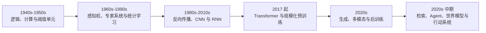

# 第零章 人工智能演进路线

把人工智能史排成一串年份并不难：感知机、反向传播、卷积网络、Transformer 和大语言模型依次写下去，就会得到一条看似必然的上升曲线。真正需要解释的是，每一代方法补上了什么缺口，又把什么困难推给了下一层。

规则系统能显式执行推理，却很难穷举感知世界；统计学习能从样本估计规律，却受制于特征与分布；深度网络把特征也纳入训练，又增加了优化、数据和可解释性问题；基座模型把许多任务统一成条件生成，事实约束、工具权限和长期状态则进一步落到系统层。

本章只给出路线图。后续章节负责模型结构、数学条件和工程机制，产品名称与排行榜不构成这条历史的骨架。

## 0.1 从可计算规则到可学习参数

1943 年，McCulloch 与 Pitts 把简化神经元写成阈值逻辑元件。图灵在 1950 年把“机器能否思考”转化为可观察行为问题。1956 年达特茅斯夏季研究项目则帮助“人工智能”成为一个制度化研究领域。

早期路线大致形成两个重心。符号方法显式表示对象、关系和规则，再通过逻辑或搜索求解；连接主义让大量简单单元通过权重组合，并尝试从数据修正这些权重。二者从来没有完全隔绝，现代系统仍把神经感知、程序执行、搜索和约束求解组合在一起。

Rosenblatt 的感知机使线性阈值可以按误分类样本更新，但单层模型无法表示 XOR 等非线性边界。Minsky 与 Papert 的分析使这项限制广为人知；算力、数据、资金和过高预期也共同造成研究低潮。将 AI 寒冬归结为某一篇论文或一道 XOR 题，会遗漏技术与制度的共同作用。

[第一章](ch01_early_ai_perceptron_connectionism.md)将分别讨论符号结构、感知机、多层非线性、SVM 与树集成。

## 0.2 统计学习与多层网络重新汇合

20 世纪后期，统计学习发展出线性模型、核方法、图模型、决策树、bagging 与 boosting 等路线。它们把泛化、容量、正则化和概率估计变成可分析对象，并在结构化数据与有限样本任务中持续发挥作用。

多层网络的主要障碍不只是表示能力，还包括怎样有效训练。反向传播把输出误差按计算图链式传回各层；随机梯度方法、初始化、正则化和后来出现的归一化技术使更深网络逐步可用。1980 年代的反向传播复兴、1990 年代的 CNN 与 LSTM，都在为后来的规模化训练准备结构与算法。

这段历史提醒我们区分四个问题：

1. 模型族能否表示目标关系；
2. 数据能否识别其中合适的函数；
3. 优化器能否在有限计算内找到它；
4. 训练结果能否迁移到部署分布。

它们在[第二章](ch02_deep_learning_cnn_sequence_models.md)中进入同一套训练框架。

## 0.3 2012 之后：数据、硬件与架构共同扩展

AlexNet 在 2012 年 ImageNet 竞赛中的结果常被视为深度学习转折点。关键并非某个组件独自解决了训练，而是卷积归纳偏置、ReLU、dropout、数据规模与 GPU 计算形成可扩展组合。随后，VGG 展示了规则化深层堆叠，ResNet 用恒等残差路径缓解深层退化，视觉模型由手工特征管线转向端到端表示学习。

序列任务的主干则是 RNN、LSTM、GRU 和 encoder-decoder。递推状态允许处理可变长度输入，却让时间维保持串行，并要求固定维状态压缩不断增长的历史。早期 attention 使解码器按需读取所有编码状态，第一次显著缩短了输入位置到输出位置的信息路径。

这里形成了两种后续反复出现的设计问题：

- 怎样把局部、平移、顺序或稀疏性等结构写入模型；
- 怎样在表达能力、并行效率、状态容量和内存成本之间取舍。

## 0.4 Transformer 与预训练接口

2017 年的 Transformer 用 attention 和逐位置 MLP 取代主干递推。训练时，不同位置可以并行计算；任意两个位置之间也获得更短的计算路径。代价是稠密 attention 的时间与显存随序列长度近似二次增长，并且模型需要额外的位置机制。

[第三章](ch03_attention_transformer_sequence_architectures.md)将拆开 attention、残差流、归一化、位置表示、MoE 与状态空间替代路线。这里先保留历史上的三个结果：

- Transformer 让规模化序列训练更适合现代并行硬件；
- 同一骨干可通过不同 mask 形成 encoder、decoder 或 encoder-decoder；
- 训练目标与可见性共同决定模型的原生接口。

ELMo 先展示动态上下文词表示；BERT 用双向 encoder 恢复被遮蔽 token；GPT 用因果 decoder 预测后续；T5 与 BART 让 encoder 读取受损输入，再由 decoder 条件生成。它们不是简单的品牌世代，而是四种信息流与任务接口。[第四章](ch04_pretrained_language_models.md)将并排比较这些目标。

## 0.5 Scaling 改变了训练制度

随着参数、数据与计算量扩大，语言模型 loss 在一定实验范围内呈近似幂律变化。这使训练预算可以在模型规模、token 数和计算量之间规划，也推动数据去重、质量筛选、并行训练、混合精度和容错系统成为模型设计的一部分。

缩放定律是经验规律，不是无限外推的保证。平均 loss 下降不等于每项能力单调提高，也不能消除数据污染、分布偏移和评测选择。规模化真正改变的是训练制度：单个 checkpoint 的性质越来越依赖数据管线、并行拓扑、数值格式和长时间运行中的工程决策。

因此，本卷不会把“大”当作独立解释。参数量必须与训练 token、激活计算、模型结构、后训练和推理预算一起报告。

## 0.6 从基座模型到助手与推理模型

因果语言模型预训练学习的是“给定前缀，什么后续在语料中更可能”，而不是“用户希望系统做什么”。指令微调把任务示范写进训练；RLHF 用人工比较训练代理奖励，再优化策略；DPO 等方法直接从偏好对构造分类式目标；安全训练和红队评测则处理拒绝、规避与越权行为。

测试时计算形成另一条轴线。模型可以生成更长中间过程、采样多个候选、调用执行器或搜索器，再由验证信号选择。数学、代码和可验证任务尤其适合这种组合。收益来自更多条件计算，不意味着生成的自然语言推理必然忠实反映内部机制。

[第五章](ch05_post_training_alignment.md)讨论行为塑造，[第六章](ch06_inference_efficiency_serving.md)讨论 KV cache、量化、投机解码、批处理和在线服务。把训练方法与服务方法拆开，是因为它们优化的对象分别是模型行为和运行成本。

## 0.7 生成媒体与多模态模型分成两条主线

生成媒体不是语言模型历史的附属支线。GAN 通过生成器与判别器的对抗目标学习样本分布；扩散模型定义逐步加噪过程，再学习逆向去噪；latent diffusion 把主要计算移到压缩空间；Diffusion Transformer 与 flow matching 又改变去噪网络和连续生成路径。

与此同时，多模态模型研究怎样把图像、音频、视频与文字表示对齐。ViT 把图像切成 patch token，CLIP 用对比学习连接图像与文本，视觉语言模型再通过 projector、cross-attention 或统一 token 空间接入语言骨干。理解输入与生成媒体应分开：前者问不同模态怎样进入共同计算，后者问怎样从条件分布产生高维信号。

因此，本卷把它们拆成[第七章“多模态模型”](ch07_multimodal_models.md)和[第八章“生成媒体”](ch08_generative_media_diffusion_flow.md)，不再与 Agent 混写。

## 0.8 世界模型、检索与 Agent 把模型装进系统

模型参数不适合承担全部实时事实和长期状态。长上下文直接加入更多 token，RAG 从外部语料检索证据，应用记忆保存会话或任务状态；三者的信息来源、更新机制和失败模式不同。[第十章](ch10_context_retrieval_memory.md)将明确这些边界。

世界模型则学习环境状态及其随动作变化的规律。视频生成可以提供视觉预测能力，却不自动成为可用于控制的行动模型；具身系统还要连接传感、动作空间、反馈和安全约束。[第九章](ch09_world_models_embodied_ai.md)分别讨论预测表示、潜在动力学与 VLA。

Agent 是模型、运行时、工具、记忆和环境构成的行动系统。模型生成工具提议，运行时解析并校验参数，权限层决定能否执行，工具改变外部状态，结果再返回下一轮上下文。将全部能力归给模型，会看不见真正承担状态、权限和副作用的组件。[第十一章](ch11_agents_tools_systems.md)专门处理这套工程。

## 0.9 贯穿全卷的四条尺度

后续技术内容可以沿四条尺度阅读：

- **表示**：输入怎样变成可计算状态；
- **学习**：什么数据与目标改变参数；
- **执行**：一次请求实际计算哪些中间量；
- **系统**：模型怎样接入检索、工具、权限和部署环境。

这四条尺度不会自然合并成一句“模型更智能了”。卷一先建立模型与系统；卷二再把一次生成按时间展开；卷三追踪概率来源；卷四比较可解释性研究路线；卷五才回到“理解、主体和责任”这些哲学语言。

本章涉及的历史论文、动态技术报告与协议版本见[卷内来源表](SOURCE_NOTES.md)。
