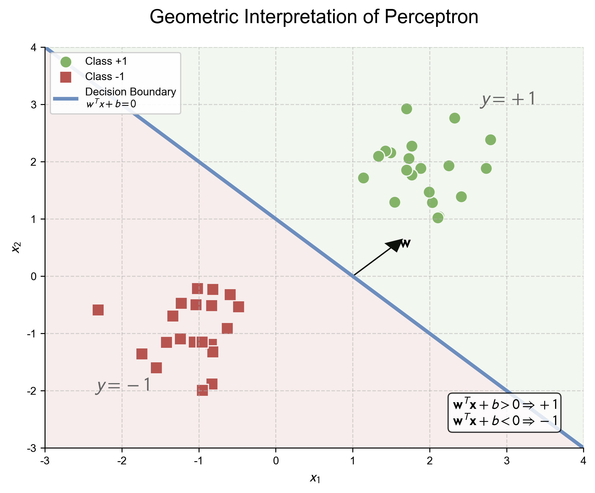
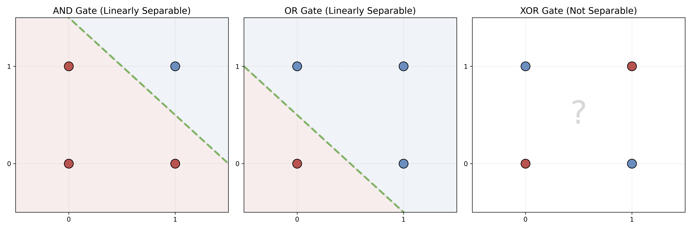
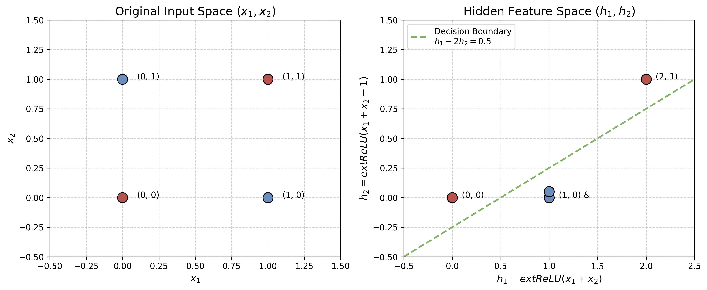
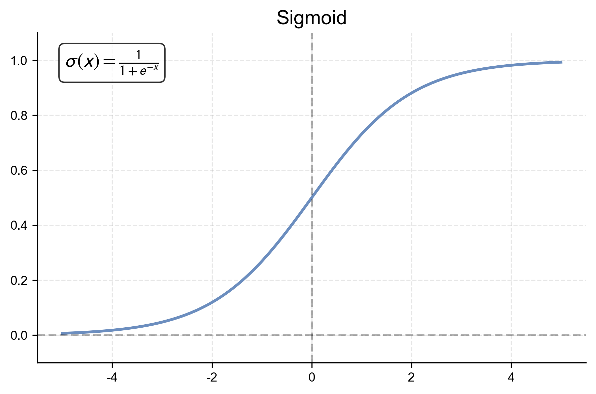
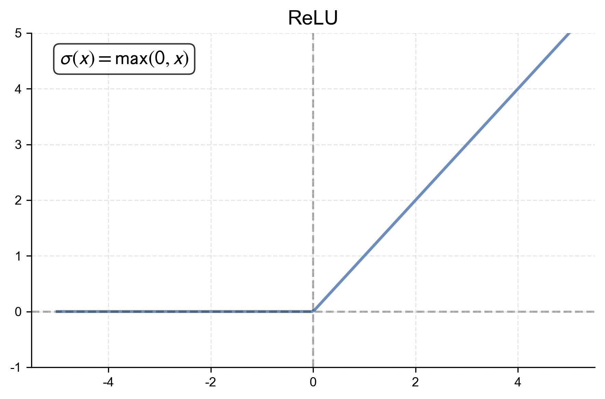
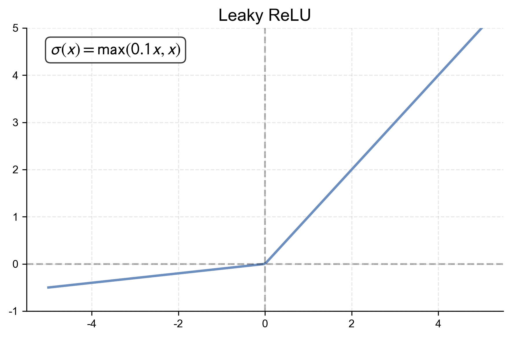
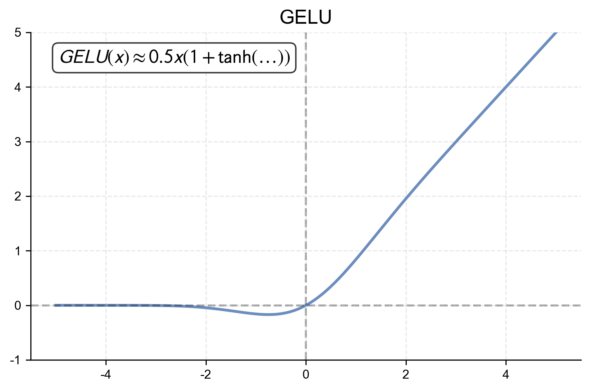
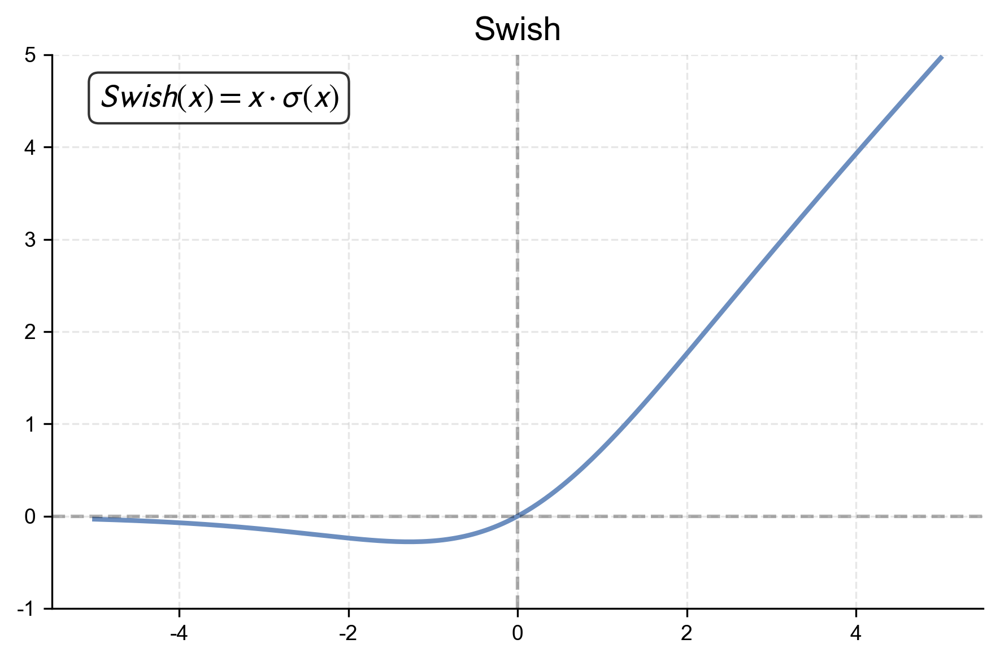
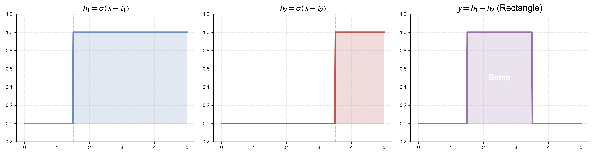
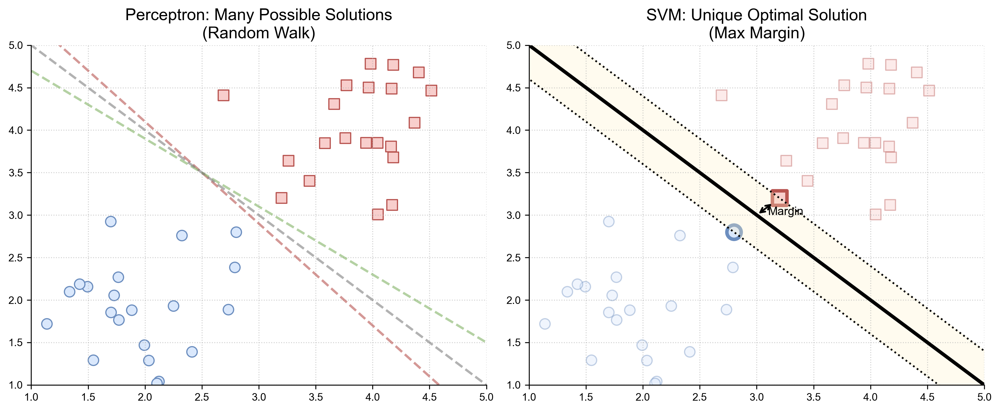

# 第一章 AI 范式、感知机与早期连接主义

人工智能史不是一种方法不断淘汰另一种方法的直线。规则系统把知识写成可执行结构，统计学习从样本估计预测规律，连接主义用多层参数化计算学习表示。现代系统常同时包含三者：神经模型提出候选，搜索或规划程序组合步骤，类型、权限和业务规则限制可执行动作。

本章从这三类对象的差别出发，建立神经网络最小数学模型，再说明单层线性边界为什么受限、多层非线性为什么改变表示能力，以及 SVM 和树集成为何仍构成独立而重要的技术路线。

## 1.1 三种互补的建模方式

### 1.1.1 规则、搜索与符号结构

符号方法显式给出对象、关系和变换规则。若状态空间为 $S$，动作集合为 $A$，转移函数为

$$
T:S\times A\to S,
$$

那么规划问题是在约束下寻找动作序列 $(a_1,\ldots,a_k)$，使状态从初值进入目标集合。逻辑推理、定理证明、约束求解、图搜索和程序执行都属于这条广义路线。

显式结构的优势是可组合、可检查，并能在规则完备时给出确定保证；困难是知识获取、感知输入和开放环境很难全部写成规则。所谓“符号主义”也不是一个单一算法族，逻辑、概率程序、搜索和形式验证支持的结论各不相同。

### 1.1.2 统计学习

统计学习先指定假设族 $\{f_\theta\}$，再用样本

$$
D=\{(x_i,y_i)\}_{i=1}^n
$$

选择参数。最常见的经验风险目标是

$$
\hat R(\theta)
=\frac1n\sum_{i=1}^n
\ell(f_\theta(x_i),y_i).
$$

训练误差只描述有限样本。真正关心的通常是未知数据分布上的风险

$$
R(\theta)=\mathbb E_{(X,Y)\sim P}[\ell(f_\theta(X),Y)].
$$

从 $\hat R$ 推到 $R$ 需要抽样假设、容量控制或稳定性论证，不能仅凭训练集拟合程度完成。第二章将系统讨论这个泛化问题。

### 1.1.3 连接主义与表示学习

连接主义把 $f_\theta$ 写成许多可微变换的组合，并通过数据更新参数。早期网络借用了神经元的阈值和连接意象，但现代人工神经网络首先是计算模型，不是生物神经系统的等比例复制。

当输入使用人工设计特征 $\phi(x)$ 时，学习器主要估计 $g(\phi(x))$；端到端表示学习则同时调整 $\phi_\theta$ 与任务头 $g_\psi$：

$$
f_{\theta,\psi}(x)=g_\psi(\phi_\theta(x)).
$$

这项变化把许多设计工作从人工特征转移到数据、架构、目标函数和优化过程，并没有消除人的建模选择。

### 1.1.4 学习信号的三种常见来源

- **监督学习**使用输入与目标对，最小化预测损失；
- **自监督学习**从数据本身构造目标，例如恢复遮挡片段或预测后续；
- **强化学习**根据状态、动作和回报优化策略，反馈可能延迟且依赖行动轨迹。

三者不是按模型名称划分。Transformer 可以接受监督微调、自监督预训练和强化学习后训练；同一个系统也可以把神经预测嵌入符号约束与搜索。

## 1.2 感知机：可学习的线性阈值

### 1.2.1 从阈值单元到分类边界

对输入 $x\in\mathbb R^d$，二分类感知机写为

$$
f_{w,b}(x)=\operatorname{sign}(w^\top x+b),
$$

其中 $w\in\mathbb R^d$、$b\in\mathbb R$。集合

$$
\{x:w^\top x+b=0\}
$$

是决策超平面，$w$ 给出其法向。感知机能学习边界的位置，却仍只能把空间分为两个半空间。

### 1.2.2 逐样本更新

令标签 $y_i\in\{-1,+1\}$。若

$$
y_i(w^\top x_i+b)\le 0,
$$

当前样本被误分或落在边界上，感知机执行

$$
w\leftarrow w+\eta y_i x_i,
\qquad
b\leftarrow b+\eta y_i,
$$

其中 $\eta>0$。它可视为损失

$$
\ell_i(w,b)=\max\{0,-y_i(w^\top x_i+b)\}
$$

上的逐样本次梯度更新。这个表述解释了更新方向，但不意味着每一步都会降低整个数据集的误分类数。

### 1.2.3 收敛定理说明了什么

把偏置吸收到增广向量后，假设所有输入满足 $\lVert x_i\rVert\le R$，并存在单位向量 $u$ 与间隔 $\gamma>0$，使

$$
y_i u^\top x_i\ge\gamma
\quad\text{对所有 }i.
$$

在单位学习率下，感知机犯错次数至多为

$$
\left(\frac R\gamma\right)^2.
$$

结论依赖线性可分与正间隔。数据不可分时，原始算法可能持续更新；定理也不声称找到最大间隔边界。完整证明见[感知机收敛讲义](../appendices/learning-notes/a.2_perceptron_convergence.md)。

### 1.2.4 XOR 暴露的是表示限制

XOR 在输入相同取值时输出 $0$，不同时输出 $1$。二维四个输入点不能被一条直线正确分开：

这里的困难不是感知机更新“不够聪明”，而是假设族中不存在所需边界。优化算法只能在既定函数族内搜索，不能凭训练把线性阈值变成非线性分类器。

Minsky 与 Papert 对感知机能力边界的分析常被简写成“XOR 导致 AI 寒冬”。实际历史还包含算力、数据、研究资助和其他 AI 路线的预期落差。技术限制是真实的，单因果叙事则过于粗糙。

## 1.3 多层网络与非线性表示

### 1.3.1 隐藏层怎样改变空间

一层隐藏表示可以写成

$$
h=\sigma(W_1x+b_1),
\qquad
f(x)=W_2h+b_2.
$$

若 $\sigma$ 是恒等函数，则

$$
f(x)=W_2W_1x+(W_2b_1+b_2),
$$

仍是单个仿射变换。深度只有与非线性、参数共享、稀疏连接或其他结构共同出现时，才会扩大可表示的函数族。

对 XOR，可以让隐藏单元分别识别若干半空间，再在隐藏表示中线性组合。输入空间中不可线性分割的四个点，由此映射到可分的表示：

### 1.3.2 激活函数不是装饰

常见逐坐标激活包括

$$
\begin{aligned}
\operatorname{sigmoid}(x)&=\frac1{1+e^{-x}},\\
\tanh(x)&=\frac{e^x-e^{-x}}{e^x+e^{-x}},\\
\operatorname{ReLU}(x)&=\max(0,x),\\
\operatorname{LeakyReLU}(x)&=\max(\alpha x,x),\\
\operatorname{GELU}(x)&=x\Phi(x),\\
\operatorname{Swish}_\beta(x)&=x\operatorname{sigmoid}(\beta x).
\end{aligned}
$$

sigmoid 和 $\tanh$ 在大幅值处导数趋近于零；ReLU 的正半轴导数恒为一，但负半轴输出为零；GELU 与 Swish 提供平滑门控。选择激活函数会改变梯度传播和优化几何，却不能脱离初始化、归一化与架构单独判断优劣。

<table>
<tr>
<td> sigmoid</td>
<td> tanh</td>
<td> ReLU</td>
</tr>
<tr>
<td> Leaky ReLU</td>
<td> GELU</td>
<td> Swish</td>
</tr>
</table>

### 1.3.3 通用逼近定理的正确读法

设 $K\subset\mathbb R^d$ 为紧集。对一类满足条件的非多项式激活函数 $\sigma$，形如

$$
g(x)=\sum_{j=1}^m a_j\sigma(w_j^\top x+b_j)
$$

的单隐藏层网络在 $C(K)$ 中稠密：对任意连续函数 $f$ 与 $\varepsilon>0$，存在有限 $m$ 及参数，使

$$
\sup_{x\in K}|f(x)-g(x)|<\varepsilon.
$$

这是存在性与逼近能力结论。它没有给出所需宽度、样本量、训练算法或分布外性能，也不保证梯度下降会找到对应参数。严格版本与证明路线见[通用逼近讲义](../appendices/learning-notes/a.5_universal_approximation.md)。

下面三幅图分别表现阶梯基元、ReLU 分段线性组合和整体逼近；它们是构造直觉，不代替定理条件。

### 1.3.4 输出层与任务目标

隐藏表示不直接规定任务。回归常用线性输出与平方损失；二分类可用一个 logit 与 logistic loss；$K$ 类分类常用 logits $z\in\mathbb R^K$、softmax

$$
p(y=k\mid x)=\frac{e^{z_k}}{\sum_{j=1}^K e^{z_j}}
$$

和交叉熵。softmax 输出是给定模型与输入下的归一化分数，不因归一化就自动获得现实世界校准。推导见 [Softmax 与交叉熵讲义](../appendices/learning-notes/a.7_softmax_crossentropy.md)，概率含义留到卷三。

语言生成也使用词表分类头，但整段输出不是一次多类分类。模型对每个前缀重复产生条件分布，序列概率由这些条件概率相乘。第四章讨论预训练目标，卷二跟随一次实际生成。

### 1.3.5 表示能力与可训练性必须分开

网络能够表示某个函数，不等于已有数据能识别它，也不等于优化器能在有限资源下找到它。至少要区分：

- **表达能力**：假设族中是否存在目标函数的近似；
- **优化**：训练算法是否能到达低经验风险区域；
- **泛化**：低经验风险是否延伸到目标分布；
- **稳健性**：输入或环境变化后结论是否保持。

1980 年代反向传播的广泛应用改善了多层可微网络的训练，但深层网络的大规模成功还依赖数据、硬件、初始化、归一化和架构归纳偏置。第二章将把这些条件放在同一个训练系统中。

## 1.4 统计学习并未被深度学习抹去

### 1.4.1 SVM：最大间隔而非普通感知机

对线性可分数据，硬间隔 SVM 求解

$$
\min_{w,b}\ \frac12\lVert w\rVert^2
\quad\text{s.t.}\quad
y_i(w^\top x_i+b)\ge1.
$$

最小化 $\lVert w\rVert$ 等价于最大化规范化几何间隔。软间隔版本通过松弛变量或 hinge loss 允许部分违约；核方法则把内积替换为核函数，在隐式特征空间中学习线性边界。

感知机定理保证在线误分次数上界，却不选择唯一最大间隔解；SVM 给出凸优化目标，但在超大样本和高维端到端表示学习中未必是最合适的计算路径。

### 1.4.2 树、Bagging 与 Boosting

决策树递归划分特征空间。单棵深树方差可能很高；bagging 在重采样数据上训练多个学习器并聚合，随机森林进一步随机抽取候选特征以降低树之间相关性。boosting 则按阶段添加弱学习器，持续拟合当前损失的残差或负梯度。

这些方法特别适合表格数据、混合尺度特征、有限样本和需要快速基线的场景。它们的归纳偏置与神经网络不同，不能用“参数更多”单向排序。现代工程中常见的合理流程仍是：先建立线性模型或树模型基线，再判断复杂表示学习是否带来可复现增益。

## 1.5 从可学习边界到深层架构

本章建立了四个后续反复出现的区分：规则与学习、表示与优化、训练拟合与泛化、模型能力与系统能力。感知机说明参数可以从错误中更新，XOR 说明假设族会限制可学对象，多层非线性打开表示空间，SVM 与树集成则提醒我们不存在脱离数据形态的统一最佳模型。

下一章进入深度网络的训练机制，并分别考察两类在 Transformer 之前成熟的结构归纳偏置：CNN 的局部与平移结构，以及 RNN/LSTM 的递推状态。
