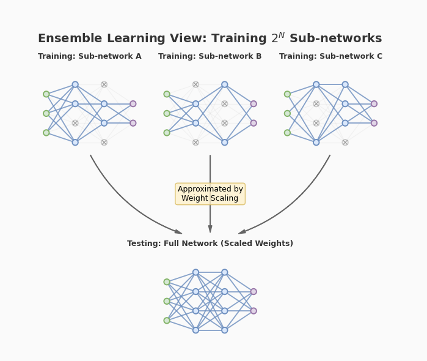
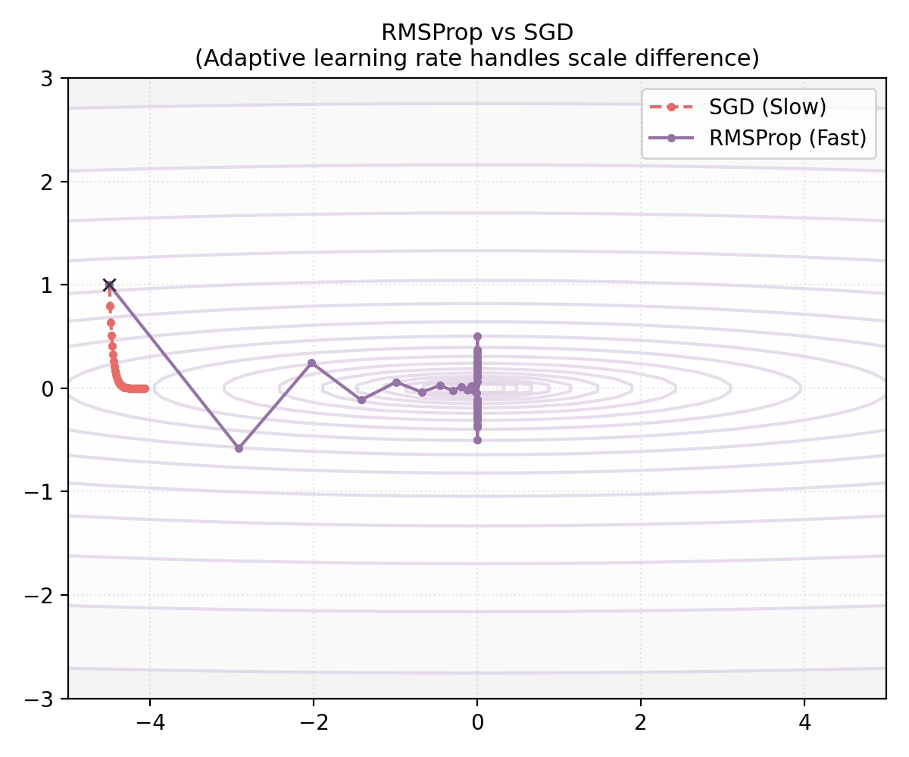
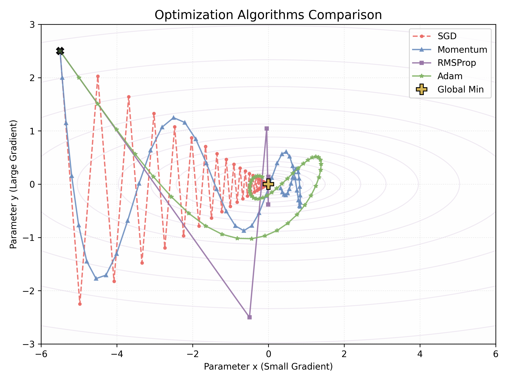
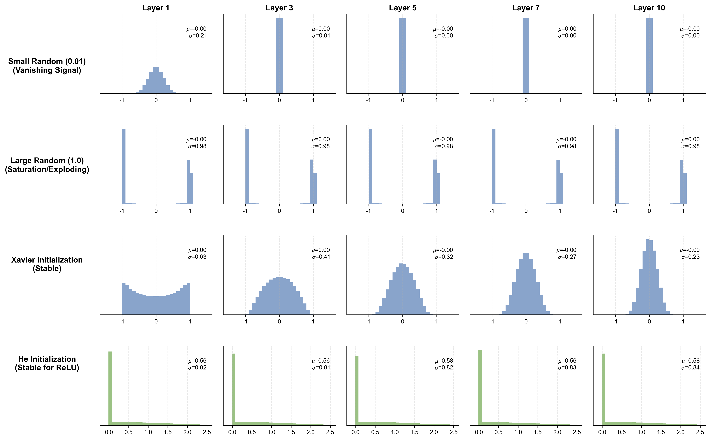
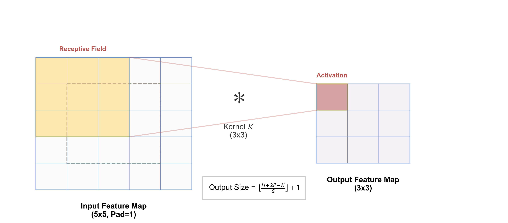
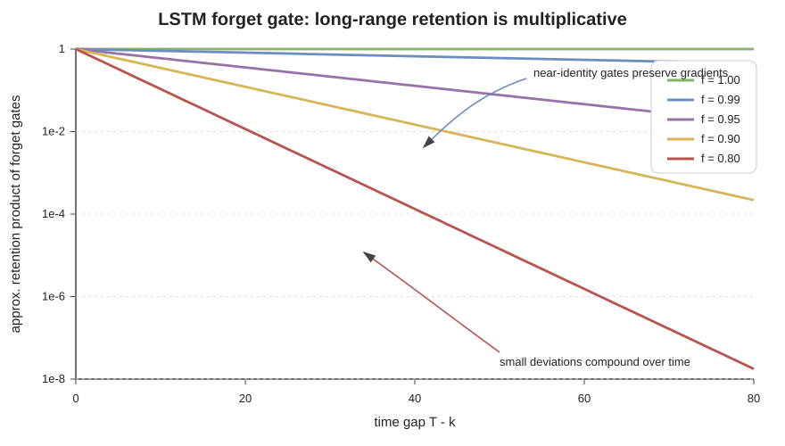

# 第二章 深度学习基础：训练、CNN 与序列模型

第一章说明，多层非线性网络拥有比单个线性边界更大的表示空间。但“能表示”只回答存在性问题。一个可用模型还要从有限样本中学习，沿计算图传播误差，在有限精度和资源下完成优化，并把训练结果迁移到未见数据。

本章先建立这套共同训练机制，再比较两种经典架构。卷积网络把局部性和平移结构写进连接方式；循环网络把历史压入递推状态。Transformer 的设计正是在继承和改写这些问题的过程中形成。

## 2.1 从经验风险到可训练深度网络

### 2.1.1 训练集不是目标分布

设数据来自未知分布 $P(X,Y)$，模型为 $f_\theta$，损失为 $\ell$。总体风险与经验风险分别是

$$
R(\theta)=\mathbb E_{(X,Y)\sim P}
[\ell(f_\theta(X),Y)],
$$

$$
\hat R_D(\theta)=\frac1n\sum_{i=1}^n
\ell(f_\theta(x_i),y_i).
$$

训练直接优化后者，部署关心前者或某个更具体的目标分布。数据独立同分布只是常用近似；时间漂移、用户选择、标注政策和反馈循环都会让训练分布与部署分布不同。

训练集用于更新参数，验证集用于选择超参数和停止点，测试集用于完成选择后的评估。反复查看测试结果并据此改模型，会把测试集也纳入选择过程，此时它不再提供原先意义上的独立估计。

### 2.1.2 偏差、方差与不可约噪声

在平方损失下，若

$$
Y=f^*(X)+\varepsilon,
\qquad
\mathbb E[\varepsilon\mid X]=0,
$$

并把训练数据 $D$ 看作随机变量，则固定输入 $x$ 处有

$$
\mathbb E_{D,Y}
[(Y-\hat f_D(x))^2]
=\sigma^2(x)
+\bigl(\mathbb E_D\hat f_D(x)-f^*(x)\bigr)^2
+\operatorname{Var}_D(\hat f_D(x)).
$$

三项依次是条件噪声、平方偏差与估计方差。这个等式有明确的平方损失与抽样前提，不能原样套到任意分类指标；它提供的是诊断语言，不是“模型越复杂方差必然越大”的普遍定律。

### 2.1.3 正则化与归纳偏置

显式正则化把参数偏好加入目标，例如

$$
\min_\theta
\hat R_D(\theta)+\lambda\lVert\theta\rVert_2^2.
$$

$L_2$ 惩罚倾向于限制权重尺度，$L_1$ 惩罚可诱导稀疏解。优化器中的 weight decay 与目标中的 $L_2$ 项在普通 SGD 下可对应，但在 Adam 等坐标自适应方法中一般不再等价，因此 AdamW 将衰减与梯度更新解耦。

dropout 在训练时随机屏蔽中间单元。采用 inverted dropout 时，保留掩码 $m_j\sim\operatorname{Bernoulli}(q)$，并计算

$$
\tilde h_j=\frac{m_j}{q}h_j,
$$

使 $\mathbb E[\tilde h_j]=h_j$；推理时关闭掩码。它可减少特征之间的脆弱共适应，但不严格等同于对所有子网络做完整 Bayesian 模型平均。

数据增强、早停、参数共享、卷积局部性和架构本身也会产生正则化或归纳偏置。完整推导见[统计学习讲义](../appendices/learning-notes/a.3_statistical_learning_theory.md)与[正则化讲义](../appendices/learning-notes/a.4_regularization.md)。

### 2.1.4 反向传播是链式法则的复用

对第 $l$ 层，写

$$
z^{(l)}=W^{(l)}h^{(l-1)}+b^{(l)},
\qquad
h^{(l)}=\sigma_l(z^{(l)}).
$$

若损失为 $L$，定义列向量误差

$$
\delta^{(l)}=\frac{\partial L}{\partial z^{(l)}}.
$$

则链式法则给出

$$
\delta^{(l)}
=\left(W^{(l+1)}\right)^\top
\delta^{(l+1)}
\odot\sigma_l'(z^{(l)}),
$$

以及

$$
\frac{\partial L}{\partial W^{(l)}}
=\delta^{(l)}\left(h^{(l-1)}\right)^\top,
\qquad
\frac{\partial L}{\partial b^{(l)}}=\delta^{(l)}.
$$

反向传播的关键不是一条新的微积分定律，而是缓存前向中间量，并按计算图反向复用局部导数。自动微分可以机械执行这件事，但形状错误、原地修改、停止梯度和数值不稳定仍需要模型设计者理解图结构。逐分量推导见[反向传播讲义](../appendices/learning-notes/a.6_backpropagation.md)。

### 2.1.5 从 SGD 到 Adam

小批量梯度 $g_t$ 是总体梯度的带噪估计。SGD 更新为

$$
\theta_t=\theta_{t-1}-\eta_t g_t.
$$

Momentum 维护一阶累积量，例如

$$
v_t=\beta v_{t-1}+(1-\beta)g_t,
\qquad
\theta_t=\theta_{t-1}-\eta_t v_t.
$$

它能平滑方向反复变化的梯度，但效果依赖曲率、学习率与具体参数化。

RMSProp 类方法按坐标累计平方梯度；Adam 同时维护

$$
m_t=\beta_1m_{t-1}+(1-\beta_1)g_t,
$$

$$
v_t=\beta_2v_{t-1}+(1-\beta_2)g_t^2,
$$

并用偏差修正量 $\hat m_t=m_t/(1-\beta_1^t)$、$\hat v_t=v_t/(1-\beta_2^t)$ 更新

$$
\theta_t
=\theta_{t-1}
-\eta\frac{\hat m_t}{\sqrt{\hat v_t}+\epsilon}.
$$

平方与除法均逐坐标进行。自适应缩放并不保证在所有任务上优于 SGD，也不能替代学习率日程、梯度裁剪和训练稳定性监测。

更完整的优化器比较见[优化基础](../appendices/learning-notes/a.1_optimization_basics.md)与[进阶优化器讲义](../appendices/learning-notes/a.8_advanced_optimization.md)。

### 2.1.6 初始化与信号尺度

若同层隐藏单元以完全相同的权重开始，并经历确定性更新，它们会得到相同梯度，难以分化。随机初始化先打破这一置换对称性，还要控制前向激活与反向梯度的尺度。

对 fan-in 为 $n_{in}$ 的 ReLU 层，He 初始化常取

$$
\operatorname{Var}(W_{ij})\approx\frac{2}{n_{in}};
$$

对近线性或 $\tanh$ 网络，Xavier 初始化常按 fan-in 与 fan-out 平衡方差。这里的常数来自独立、零均值等近似，残差、归一化、门控与超深网络会改变合适尺度。

## 2.2 CNN：把局部和平移结构写进网络

### 2.2.1 多通道卷积的计算

深度学习库通常实现互相关而非翻转核的数学卷积。对输入 $X\in\mathbb R^{C_{in}\times H\times W}$ 与核

$$
K\in\mathbb R^{C_{out}\times C_{in}\times k_h\times k_w},
$$

步幅为 $s$、padding 为 $p$ 时，一项输出可写为

$$
Y_{o,i,j}=b_o+
\sum_{c=1}^{C_{in}}
\sum_{u=0}^{k_h-1}
\sum_{v=0}^{k_w-1}
K_{o,c,u,v}
X_{c,is+u-p,js+v-p},
$$

越界输入按 padding 规则处理。若 dilation 为 $d$，方形核边长为 $k$，则输出高度为

$$
H_{out}
=\left\lfloor
\frac{H+2p-d(k-1)-1}{s}
\right\rfloor+1,
$$

宽度同理。参数量为 $C_{out}(C_{in}k_hk_w+1)$，与图像空间尺寸无关，这来自位置间权重共享。

### 2.2.2 等变性、池化与感受野

在步幅为一且边界处理一致的理想条件下，输入平移会使特征图相应平移，这称为平移等变性。stride、pooling、padding 和边界裁剪会破坏精确等变；分类头通过聚合才可能获得近似平移不变性。

池化或带步幅卷积降低空间分辨率，扩大后续单元看到的输入范围。若第 $l$ 层核大小为 $k_l$、步幅为 $s_l$，记相邻特征对应的输入跳距为 $j_l$、理论感受野为 $r_l$，则

$$
j_l=j_{l-1}s_l,
\qquad
r_l=r_{l-1}+(k_l-1)j_{l-1}.
$$

理论感受野只说明计算图连通性；实际梯度与激活影响往往集中在其中较小区域，称为有效感受野。

### 2.2.3 特征层级与残差路径

多层卷积逐步组合局部模式：早层常响应边缘或纹理，后层可组合成部件和任务相关模式。这是经验性概括，不意味着每个通道都具有固定的人类语义。

残差块写成

$$
y=x+F(x;\theta).
$$

恒等支路为信号和梯度提供短路径，使网络可以围绕恒等映射学习修正。它改善了深层优化，但不保证任意深度都自动稳定，也不等于网络只学习“残差信息”。

从 LeNet、AlexNet、VGG 到 ResNet，主要变化包括数据与硬件规模、激活与正则化、网络深度、残差结构和训练配方。depthwise convolution、group convolution 与通道注意力进一步改变计算量和通道交互。CNN 仍广泛存在于移动视觉、检测、图像生成组件和混合视觉骨干中，并未因 Vision Transformer 出现而失去独立价值。

卷积层反向传播的索引与矩阵展开见 [CNN 反向传播讲义](../appendices/learning-notes/a.9_cnn_backpropagation.md)。

## 2.3 RNN：用递推状态压缩历史

### 2.3.1 状态更新与参数共享

基本 RNN 对序列 $(x_1,\ldots,x_T)$ 递推计算

$$
h_t=\phi(W_{xh}x_t+W_{hh}h_{t-1}+b_h),
$$

$$
o_t=W_{ho}h_t+b_o.
$$

所有时间步共享参数。$h_t$ 是由当前输入与过去状态共同决定的有限维摘要，不是对完整历史的无损保存。RNN 可以处理可变长度序列，代价是时间步之间存在串行依赖。

### 2.3.2 BPTT 与 Jacobian 连乘

将递推图沿时间展开后，仍可使用反向传播。较早状态对较晚状态的影响包含

$$
\frac{\partial h_t}{\partial h_k}
=\prod_{j=k+1}^{t}
\frac{\partial h_j}{\partial h_{j-1}}.
$$

在线性化近似下，每一项含 $W_{hh}$ 与激活导数。若相关 Jacobian 的奇异值长期小于一，梯度趋于衰减；长期大于一则可能爆炸。实际网络中的方向、非线性饱和与输入依赖会让现象比单个谱半径判断更复杂。

梯度裁剪能限制爆炸更新，却不恢复已经消失的长期信号。截断 BPTT 降低计算与存储成本，同时明确切断了超过窗口的梯度路径。

### 2.3.3 双向与深层 RNN

双向 RNN 同时计算正向状态 $\overrightarrow h_t$ 与反向状态 $\overleftarrow h_t$，再组合两者。它适合整段输入已知的编码任务，却不能直接作为严格因果的在线生成器，因为反向状态读取未来 token。

堆叠 RNN 增加表示深度，时间轴仍然串行。RNN 的这一限制促使研究者寻找更短的信息路径；早期 encoder-decoder attention 让解码器直接读取所有编码状态，随后 Transformer 进一步移除了主干递推。

## 2.4 LSTM、GRU 与门控状态

### 2.4.1 LSTM 的状态方程

LSTM 引入 cell state $c_t$ 与 hidden state $h_t$。一种常见参数化为

$$
\begin{aligned}
i_t&=\sigma(W_ix_t+U_ih_{t-1}+b_i),\\
f_t&=\sigma(W_fx_t+U_fh_{t-1}+b_f),\\
o_t&=\sigma(W_ox_t+U_oh_{t-1}+b_o),\\
g_t&=\tanh(W_gx_t+U_gh_{t-1}+b_g),\\
c_t&=f_t\odot c_{t-1}+i_t\odot g_t,\\
h_t&=o_t\odot\tanh(c_t).
\end{aligned}
$$

沿 $c_{t-1}\to c_t$ 的直接路径，局部导数为 $f_t$。当遗忘门在相关坐标上接近一时，这条加性状态路径能较好保留梯度；其他门和递归依赖仍会影响完整 Jacobian，因此 LSTM 缓解而非消灭长期依赖问题。

### 2.4.2 GRU 的更紧凑门控

GRU 合并了部分状态与门。一种约定是

$$
\begin{aligned}
z_t&=\sigma(W_zx_t+U_zh_{t-1}),\\
r_t&=\sigma(W_rx_t+U_rh_{t-1}),\\
\tilde h_t&=\tanh(W_hx_t+U_h(r_t\odot h_{t-1})),\\
h_t&=(1-z_t)\odot h_{t-1}+z_t\odot\tilde h_t.
\end{aligned}
$$

有些文献交换更新门两项的命名约定，比较实现时应直接核对方程。GRU 参数更少，LSTM 状态分工更显式；两者优劣依任务、规模与训练条件而定。

### 2.4.3 Seq2Seq 的瓶颈与注意力前奏

早期 sequence-to-sequence 模型把整个输入压成单个最终状态，再由解码器生成输出。长序列下，这个固定维瓶颈难以保存全部相关信息。attention 改为在每个解码步对编码状态 $(h_1,\ldots,h_T)$ 计算权重：

$$
\alpha_{t,s}
=\frac{\exp e(q_t,h_s)}
{\sum_{u=1}^{T}\exp e(q_t,h_u)},
\qquad
c_t=\sum_{s=1}^{T}\alpha_{t,s}h_s.
$$

解码器因此可以按当前查询读取不同位置。第三章将从这个接口出发，说明 self-attention 怎样让序列内所有位置直接交换信息，并由此形成 Transformer。

## 2.5 本章边界

深度学习训练由数据分布、目标函数、计算图、优化器和架构归纳偏置共同决定。反向传播只负责求导，优化器只负责按梯度更新；它们都不单独保证泛化。CNN 通过局部连接与权重共享利用空间结构，RNN/LSTM 通过递推与门控维护时间状态。理解这些取舍，比记忆一条“旧架构被新架构淘汰”的时间线更重要。

本章的经典研究入口见[卷内来源表](SOURCE_NOTES.md)。下一章进入注意力与 Transformer，并把结构说明限制在一次前向真正执行的运算上。
