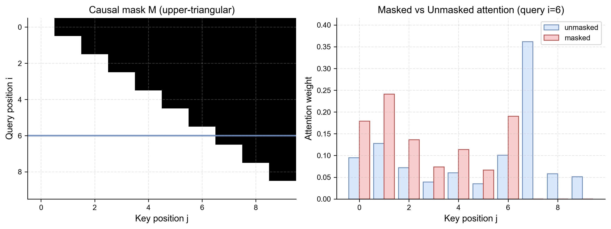

# 第三章 注意力与 Transformer

循环网络按时间步更新状态，长距离信息必须穿过一条连续路径。注意力改用内容相关的读取：当前位置不只继承上一状态，而是直接计算它与其他位置的关系。Transformer 再把这种读取变成主要序列算子，使训练可以在位置维度上并行。

本章回答结构问题：一层 Transformer 实际计算什么，张量形状怎样变化，位置信息和掩码怎样进入。服务优化留给第六章，单次自回归运行留给卷二。

## 3.1 从固定状态到内容寻址

设输入序列表示为

$$
X=(x_1,\ldots,x_n)^\top\in\mathbb R^{n\times d}.
$$

注意力为每个位置构造 query，并把它与所有可见位置的 key 比较，再对对应 value 加权。它近似一个可微的键值读取，而不是数据库中的精确查找。

最初的 encoder-decoder 注意力用于机器翻译：解码器在每一步读取编码器的不同位置。self-attention 则让 query、key 和 value 都来自同一序列。

## 3.2 Scaled Dot-Product Attention

由输入线性投影得到

$$
Q=XW_Q,
\qquad
K=XW_K,
\qquad
V=XW_V,
$$

其中 $Q,K\in\mathbb R^{n\times d_k}$，$V\in\mathbb R^{n\times d_v}$。注意力输出为

$$
\operatorname{Attn}(Q,K,V)
=
\operatorname{softmax}
\left(
\frac{QK^\top}{\sqrt{d_k}}+M
\right)V.
$$

$QK^\top$ 是 $n\times n$ 的位置关系矩阵。除以 $\sqrt{d_k}$ 是为了避免维度增加时点积尺度过大，使 softmax 过早饱和。$M$ 是掩码：可见位置加 $0$，不可见位置加一个数值上近似 $-\infty$ 的值。

注意力权重表示当前前向计算中的加权系数。它可以帮助观察信息汇聚，却不自动等于语义重要性或因果解释；这一区分在卷四展开。


## 3.3 因果掩码

自回归语言模型训练位置 $i$ 预测后续 token 时，只允许读取 $j\le i$ 的位置：

$$
M_{ij}=
\begin{cases}
0,&j\le i,\\
-\infty,&j>i.
\end{cases}
$$

训练可以同时计算所有位置的损失，因为掩码在矩阵内部阻止信息从未来泄漏；生成仍需等上一个 token 确定后再构造下一步输入。训练并行和生成串行并不矛盾。



BERT 一类双向编码器通常没有因果掩码，可以同时利用左右上下文；encoder-decoder 模型则在 encoder 中双向读取，在 decoder 中使用因果 self-attention，并通过 cross-attention 读取 encoder 输出。

## 3.4 Multi-Head Attention

单一注意力把全部关系压进一组投影。多头注意力为每个头使用不同参数：

$$
h_r=\operatorname{Attn}(XW_Q^{(r)},XW_K^{(r)},XW_V^{(r)}),
$$

$$
\operatorname{MHA}(X)
=
\operatorname{Concat}(h_1,\ldots,h_H)W_O.
$$

不同头可以学习不同位置和内容关系，但“一个头对应一个人类概念”不是结构保证。头的功能取决于层、输入分布以及与其他组件的组合。

在常见实现中，query 头数可以大于 KV 头数。Multi-Query Attention 共享一组 key/value，Grouped-Query Attention 让若干 query 头共享一组 KV；它们主要减少推理缓存和读取成本，代价要由具体模型质量验证。

## 3.5 MLP、残差流与归一化

注意力在位置之间混合信息，逐位置 MLP 在特征维度上变换。典型 gated MLP 可写为

$$
\operatorname{MLP}(x)
=
\bigl(\phi(xW_g)\odot xW_u\bigr)W_d.
$$

残差连接把子层更新加回主表示：

$$
X_{\ell+1}
=
X_\ell+F_\ell(\operatorname{Norm}(X_\ell)).
$$

这种 pre-norm 形式让深层梯度更容易传播。所谓 **residual stream** 不是额外模块，而是各层不断读取和写回的主表示通道。卷四中的 patching、probe 和 feature 分析大多直接观察这一通道或其子层输出。

LayerNorm 对单个 token 的特征做中心化和缩放；RMSNorm 省略均值中心化，只按均方根缩放。归一化位置和精确公式会影响训练稳定性，不能把“用了 Transformer”当作完整架构描述。

## 3.6 位置信息

纯 self-attention 在没有位置输入时对位置置换保持对称。模型必须通过额外机制知道顺序。

绝对位置 embedding 直接把位置向量加到 token 表示。正弦位置编码使用不同频率：

$$
\operatorname{PE}(p,2i)=\sin(p/\omega_i),
\qquad
\operatorname{PE}(p,2i+1)=\cos(p/\omega_i).
$$

RoPE 则在 query/key 子空间中按位置旋转，使点积自然包含相对位移。相对位置 bias、ALiBi 和其他方法也在注意力分数或表示中编码距离。

上下文外推取决于训练长度、位置机制、缩放方法和任务；修改位置参数能让模型接受更长序列，不保证它在长序列上仍能可靠检索和组合信息。


## 3.7 一层到整个模型

decoder-only 模型可以概括为：

```text
token ids
-> token/position representation
-> [norm -> causal attention -> residual
    -> norm -> MLP -> residual] x L
-> final norm
-> vocabulary projection
-> logits
```

若词表大小为 $|V|$，最后隐藏状态 $h_i\in\mathbb R^d$ 通过输出矩阵得到

$$
\ell_i=h_iW_U+b,
\qquad
\ell_i\in\mathbb R^{|V|}.
$$

logit 仍不是概率；softmax、温度和解码由卷三系统解释，卷二则跟踪它们在一次生成中的实际调用。

## 3.8 Encoder、Decoder 与 Encoder-Decoder

三种主干对应不同信息流：

| 结构 | 可见上下文 | 典型目标 |
| --- | --- | --- |
| encoder-only | 双向 | 掩码恢复、分类、表示学习 |
| decoder-only | 左侧或声明前缀 | 下一 token 预测、开放生成 |
| encoder-decoder | encoder 双向，decoder 因果 | 条件生成、翻译、摘要 |

架构不等于用途。encoder 可用于检索，decoder 隐状态也可用于表示；具体能力还取决于数据和训练目标。

## 3.9 MoE 与条件计算

Mixture-of-Experts 通常把部分 MLP 替换为多个专家。路由器对 token 表示 $x$ 产生分数，选择少数专家：

$$
y=\sum_{e\in\operatorname{TopK}(g(x))}
\alpha_e(x)E_e(x).
$$

MoE 扩大总参数容量，同时控制每个 token 激活的参数量。训练还需负载均衡目标，服务还需处理跨设备 token 路由。参数更多不表示每个 token 做了同比例更多计算。

## 3.10 注意力之外的序列模型

状态空间模型维护递推状态，例如

$$
h_t=A_t h_{t-1}+B_t x_t,
\qquad
y_t=C_t h_t.
$$

若参数或门控依赖输入，模型可以选择性保留和遗忘信息。训练时可使用并行 scan，推理时递推更新固定大小状态。它与注意力具有不同记忆和并行特征，混合架构也可以在不同层使用两者。

没有一种序列算子在全部长度、硬件和任务上占优。比较应同时考虑训练稳定性、上下文质量、推理状态、吞吐和可扩展实现。


## 3.11 结构图不能代替训练解释

Transformer 规定一次前向怎样计算，却没有说明参数为何形成某种能力。预训练目标、数据和优化把结构变成模型；后训练再改变它如何响应用户。第四章进入预训练模型谱系，第五章讨论后训练。

主要来源包括 Transformer、BERT、GPT 与状态空间模型条目，统一登记在[卷内来源表](SOURCE_NOTES.md)。需要逐步核对 attention、位置编码和整层张量推导时，参见[Transformer 数学附录](../appendices/learning-notes/a.10_transformer_math.md)。
