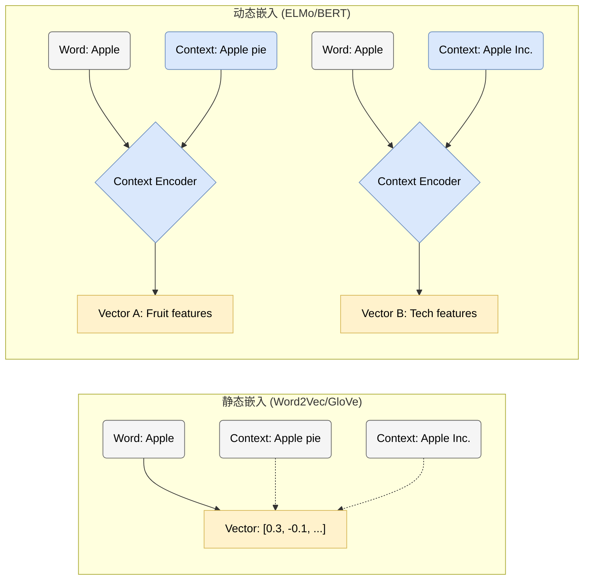
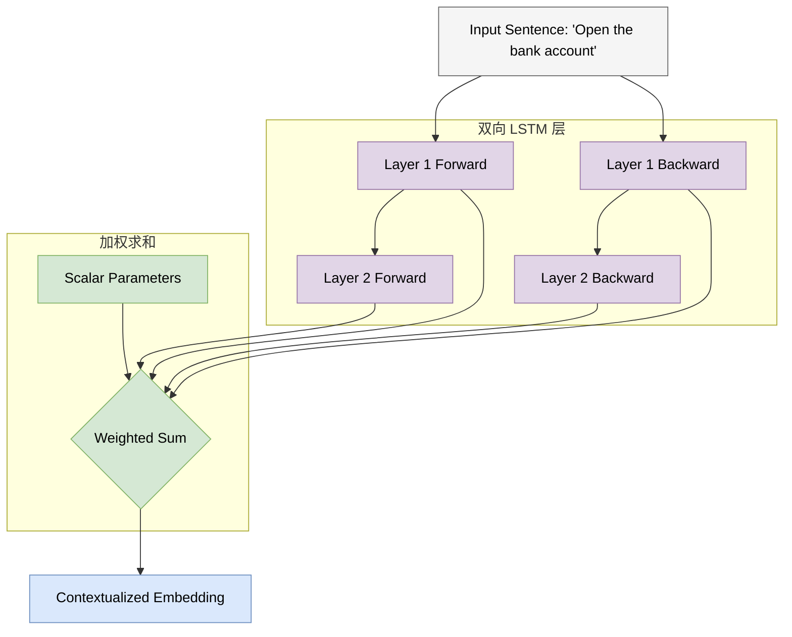
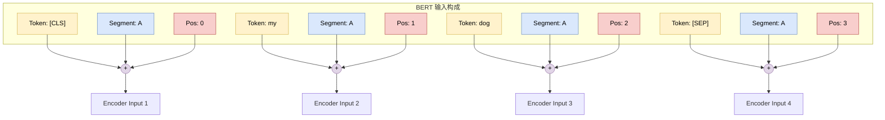
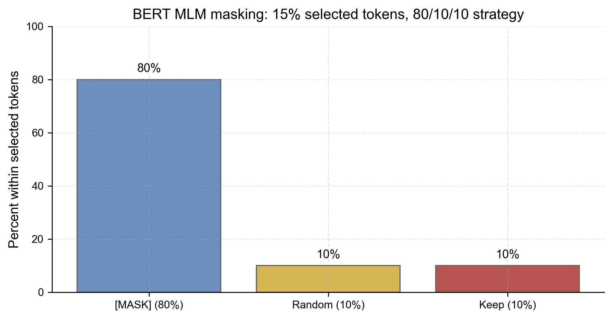
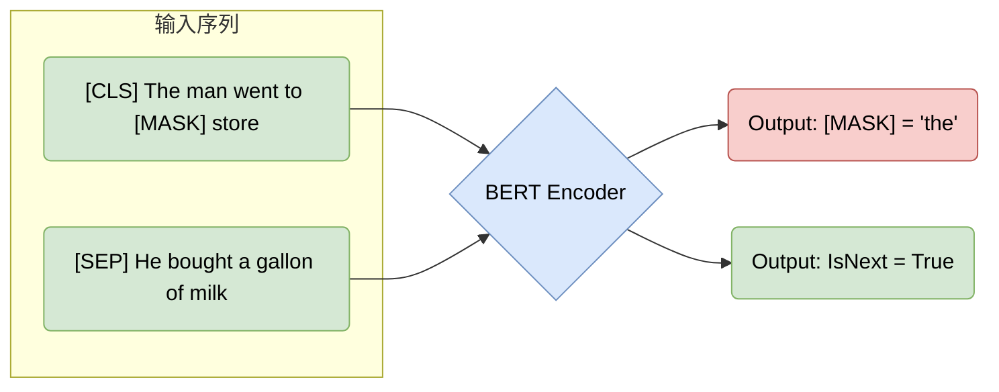
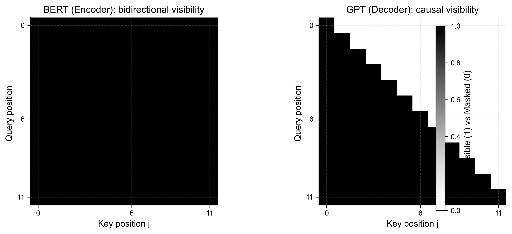
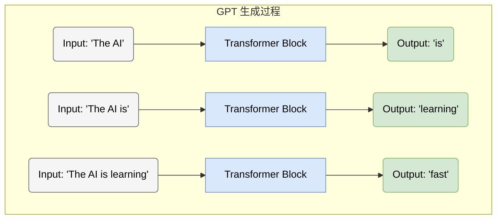
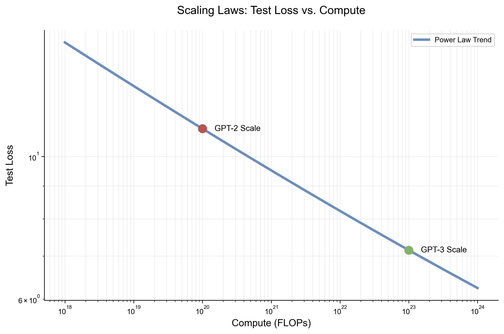
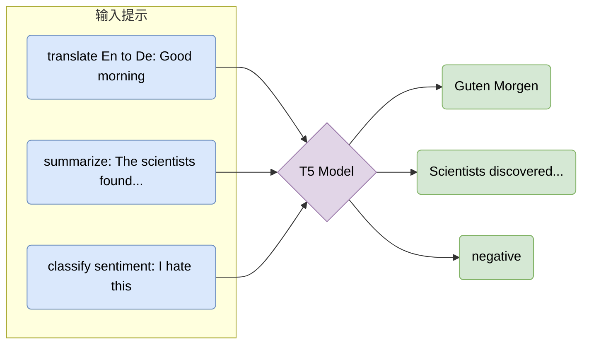

# 第四章 预训练语言模型：ELMo、BERT、GPT 与 T5

在 “open a bank account” 和 “sit on the river bank” 中，`bank` 的字典条目没有变化，句中需要的表示却应当不同。静态词向量只能给它一个固定坐标；上下文模型则把“这个词在这句话里怎样使用”变成一次计算。ELMo、BERT、GPT、T5 与 BART 的分歧，正是从这个具体问题逐渐扩展出来的：上下文可以向哪一侧读取，预训练时恢复什么信息，下游任务又通过怎样的接口使用表示。

这些模型共享大规模无标注文本预训练，却不共享同一个目标。ELMo 把双向语言模型当作特征提取器，BERT 在双向编码器中恢复被遮住的 token，GPT 用因果分解逐 token 生成，T5 与 BART 则让编码器读取受损输入、由解码器重建目标。比较它们时，架构名称只是入口；真正决定行为的是信息可见性、损失函数和推理接口怎样配合。
<a id="section-4-1"></a>

## 4.1 预训练时代与 ELMo (The Pre-training Era & ELMo)

### 1. 从静态到动态：词嵌入的演进 (Evolution of Word Embeddings)

在第 2 章中，我们介绍了 RNN 如何处理序列数据；在第 3 章中，我们深入探讨了 Transformer 架构及其强大的注意力机制。然而，在 Transformer 统治 NLP 之前，领域内面临着一个关键痛点：**如何有效地表示词义的复杂性（Polysemy）？**

早期的词向量模型（如 Word2Vec, GloVe）是 **静态的 (Static)**。一旦训练完成，单词 "bank" 的向量就是固定的，无论它出现在 "bank account"（银行账户）还是 "river bank"（河岸）中，其表示完全相同。这显然无法捕捉人类语言的丰富语境。

<span style="background-color: #DAE8FC; color: black; padding: 2px 4px; border-radius: 4px;">核心问题</span>：我们需要一种能够根据上下文动态调整的词表示方法。

#### 1.1 静态与动态嵌入对比 (Static vs. Dynamic Embeddings)



### 2. ELMo: 语言模型嵌入 (Embeddings from Language Models)

**ELMo (Embeddings from Language Models)** 是连接主义向预训练大模型过渡的重要桥梁。它并没有使用 Transformer，而是基于 **双向 LSTM (Bi-LSTM)** 构建。原论文把上下文化表示定义为深层双向语言模型内部状态的任务相关组合，并在六类 NLP 任务上检验了迁移效果（[Peters et al., 2018](SOURCE_NOTES.md#ref-peters-2018)）。

#### 2.1 核心思想 (Core Idea)

ELMo 的核心洞察是：**词向量不应该是一个查表操作（Lookup Table），而应该是一个函数（Function）。** 这个函数的输入是整个句子，输出是针对该语境下每个词的向量表示。

<span style="background-color: #FFF2CC; color: black; padding: 2px 4px; border-radius: 4px;">公式定义</span>
给定一个序列 \( t_1, t_2, \dots, t_N \)，ELMo 通过最大化双向对数似然来训练：

\[
\sum_{k=1}^{N} \left( \log P(t_k | t_1, \dots, t_{k-1}) + \log P(t_k | t_{k+1}, \dots, t_N) \right)
\]

前向 LSTM 只利用左侧上下文预测下一个词，后向 LSTM 则从右向左预测前一个词。两条链在各自方向独立建模，输出表示再被组合；这种双向性与 BERT 在每一层同时混合左右上下文并不相同。

#### 2.2 ELMo 架构可视化 (ELMo Architecture)

ELMo 先用字符 CNN 构造 token 表示，从而缓解固定词表带来的 OOV 问题；随后两层 BiLSTM 逐步形成上下文表示。下游任务并不只取最后一层，而是学习怎样混合字符层与各 LSTM 层。原论文的权重分析显示，较低层往往更有利于句法任务、较高层往往更有利于语义任务；这是训练后观察到的经验趋势，不是架构预先给每层写好的职责。



#### 2.3 特征融合 (Feature Fusion)

ELMo 的最终表示 \( \mathbf{ELMo}_k \) 是各层表示的线性组合：

\[
\mathbf{ELMo}_k^{task} = \gamma^{task} \sum_{j=0}^{L} s_j^{task} \mathbf{h}_{k,j}^{LM}
\]

其中 $\mathbf h_{k,j}^{LM}$ 是第 $j$ 层在位置 $k$ 的隐藏状态，$s_j^{task}$ 是经 softmax 归一化的任务相关层权重，$\gamma^{task}$ 则调整整个 ELMo 向量的尺度。阅读理解和词性标注可以因此从同一预训练模型中取用不同的层组合。

### 3. 预训练-微调范式的雏形 (Prototype of Pre-training & Fine-tuning)

ELMo 建立的是**基于特征的迁移 (Feature-based Transfer)**：先在大规模无标注文本上训练 Bi-LSTM 语言模型，再把它产生的上下文向量交给阅读理解、分类或序列标注模型。下游训练主要学习怎样使用这些特征以及怎样混合各层，而不是为每个任务重新从头学习语言表示。

ELMo 仍受循环计算和长距离依赖限制，但其实验系统展示了 **利用大规模无标注文本预训练上下文表示** 对多类下游任务的迁移价值，并影响了后续 BERT、GPT 等预训练路线。

<span style="background-color: #F8CECC; color: black; padding: 2px 4px; border-radius: 4px;">双向口径</span>：ELMo 的前向与后向语言模型在各自堆栈中独立计算，再在表示层组合，因此常被称为“shallow bidirectional”。BERT 则让每层 self-attention 都可同时使用左右上下文；这是一种不同的深层融合方式，不意味着只有 Transformer 才能组合双向信息。
<a id="section-4-2"></a>

## 4.2 BERT：双向编码器表示 (BERT: Bidirectional Encoder Representations)

### 1. 从 Feature-based 到 Fine-tuning (From Feature-based to Fine-tuning)

在 4.1 节中，我们看到 ELMo 的典型用法是冻结预训练双向语言模型、学习层权重，并把表示加入下游模型。OpenAI GPT (基于 Decoder) 和 Google BERT (基于 Encoder) 则系统展示了端到端 **微调 (Fine-tuning)** 预训练 Transformer 的路线。

<span style="background-color: #DAE8FC; color: black; padding: 2px 4px; border-radius: 4px;">微调范式</span>：不仅是输出层，**整个预训练模型** 的参数都会在下游任务中进行更新。这意味着模型可以针对特定任务进行端到端的适配。

BERT (**B**idirectional **E**ncoder **R**epresentations from **T**ransformers) 系统展示了 **深度双向架构** 配合大规模预训练在多类语言理解基准上的强迁移能力；原论文用同一预训练模型加很少的任务特定结构完成了问答、自然语言推断等任务（[Devlin et al., 2018](SOURCE_NOTES.md#ref-devlin-2018)）。“ImageNet 时刻”可以描述其领域影响，但不是技术机制；机制仍是信息可见性、预训练目标与端到端微调的组合。

### 2. BERT 架构概览 (BERT Architecture Overview)

BERT 仅使用了 Transformer 的 **Encoder** 部分（详见 3.2 节）。与 GPT 的单向（从左到右）不同，BERT 的 Encoder 允许每个 token 同时“看到”其左边和右边的所有 token。

#### 2.1 输入表示 (Input Representations)

BERT 的输入表示由三部分相加：
1.  **Token Embeddings**: WordPiece 词向量。
2.  **Segment Embeddings**: 区分句子对（句子 A vs 句子 B）。
3.  **Position Embeddings**: 学习到的位置编码（非正弦）。



### 3. 预训练任务 (Pre-training Tasks)

BERT 原论文联合使用两个自监督任务：**掩码语言模型 (Masked Language Model, MLM)** 和 **下一句预测 (Next Sentence Prediction, NSP)**。后续消融表明 NSP 并非普遍必要，因此不能把 BERT 的迁移效果简单归因于两个目标缺一不可。

#### 3.1 掩码语言模型 (Masked Language Model, MLM)

因果语言模型预测下一个词时不能读取右侧 token；BERT 改为从输入中选取 15% 的位置，再让编码器利用双向上下文恢复原 token。损失只落在这些被选位置上，未被选位置则提供上下文。

<span style="background-color: #F5F5F5; color: black; padding: 2px 4px; border-radius: 4px; border: 1px solid #999;">掩码策略细节</span>
在被选中的位置里，80% 替换为 `[MASK]`，10% 换成随机 token，另有 10% 保持原样；三类位置都计入预测损失。混合破坏方式让模型不能只在看见 `[MASK]` 时工作，也减少预训练输入与下游自然文本之间的单一标记差异。



**训练目标（最小数学形式）**：令 $\mathcal{M}$ 为被选中 mask 的位置集合，MLM 的损失可以写为：

$$ \mathcal{L}_{\text{MLM}} = - \sum_{i \in \mathcal{M}} \log P_\theta(x_i \mid \tilde{x}) $$

其中 $x_i$ 是原 token，$\tilde{x}$ 是按 80/10/10 规则破坏后的输入序列；保持原词的 10% 位置也仍计入预测损失。

#### 3.2 下一句预测 (Next Sentence Prediction, NSP)

BERT 设计 NSP 的原意，是给句对任务提供跨句训练信号：一半样本使用真实相邻的句子 B，另一半从语料库随机取句子 B，模型判断二者是否为 `IsNext`。它并不直接监督一般“逻辑关系”，随机负例也可能让任务依赖主题差异等捷径。RoBERTa 在改变数据规模、训练时长和其他配方的同时移除了 NSP，并获得更强结果，这说明 NSP 不是迁移学习的必要条件（[Liu et al., 2019](SOURCE_NOTES.md#ref-liu-roberta-2019)）。

**训练目标（最小数学形式）**：令标签 $y\in\{0,1\}$ 表示 IsNext（1 为真），模型给出 $P_\theta(y=1\mid A,B)$，则二分类交叉熵为

$$ \mathcal{L}_{\text{NSP}} = -\left[y\log P_\theta + (1-y)\log(1-P_\theta)\right] $$



### 4. 目标决定接口

BERT 用纯编码器读取左右上下文，在 BooksCorpus 与 Wikipedia 上预训练，再通过端到端微调适配任务。这个组合把许多 NLP 系统从“每个任务单独设计表示”推向“共享预训练表示、按任务调整参数”的工作流。

然而，BERT 的双向 MLM 目标并未训练“只看左侧前缀逐 token 生成”的条件分解，因此原始 BERT 不可直接当作自回归生成器。通过增加解码器或采用其他掩码/去噪目标仍可构造生成系统；这里的差别是训练目标与推理接口，而不是编码器在数学上“不能生成”。
<a id="section-4-3"></a>

## 4.3 GPT 系列：生成式预训练变换器 (GPT Series: Generative Pre-trained Transformers)

### 1. 另一条道路：生成式模型 (The Generative Path)

在 BERT 专注于“完形填空”以此理解语言结构的同时，GPT 系列选择了一条更接近自然语言顺序生成的道路：**自回归生成 (Autoregressive Generation)**。

**GPT (Generative Pre-trained Transformer)** 用下一 token 预测作为统一训练目标。大规模实验表明，该目标可以学到可迁移的语法、语义、知识模式和上下文适配能力；能否可靠完成某类推理或事实任务仍需独立评测。

**训练目标（最小数学形式）**：GPT 采用 **自回归语言建模 (Causal Language Modeling, CLM)**。给定序列 $x_{1:T}$，最大化似然等价于最小化负对数似然：

$$ \mathcal{L}_{\text{CLM}} = -\sum_{t=1}^{T} \log P(x_t \mid x_{<t}) $$

它之所以能被并行训练，是因为训练时我们一次性喂入整段文本，并用 **因果掩码 (Causal Mask)** 在注意力层里严格禁止“偷看未来”。

#### 1.1 架构对比：Decoder-only (Architecture Comparison)

GPT 采用了 Transformer 的 **Decoder** 部分（去掉了 Encoder-Decoder Attention 层）。

关键区别是**因果掩码 (Causal Mask)**。BERT 编码位置可以读取左右两侧 token，适合为给定输入形成双向表示；GPT 的每个位置只能读取当前及更早 token，因此同一网络可以按从左到右的条件分解继续生成。下图把两种可见性画成矩阵；“判别”与“生成”的适用倾向来自训练目标和接口，不是对两类架构能力的绝对禁令。

为了把“能看见哪些 token”变成可视化对象，下图对比了两者的注意力可见性矩阵：





### 2. GPT 的演进之路 (Evolution of GPT)

GPT 系列的发展可以理解为模型规模（Scale）、数据分布、训练工程与能力（Capability）共同演进的历史。一些评测曲线看起来有 **涌现 (Emergence)** 或跃迁，但这种形态会受到指标离散化、任务选择和采样方法影响，不等同于存在已知的普适能力临界点。

#### 2.1 GPT-1: 预训练 + 微调 (Pre-training + Fine-tuning)
GPT-1 约有 1.17 亿参数，展示了先在无标注文本上预训练 decoder-only Transformer、再对下游任务做有监督微调的可行性（[Radford et al., 2018](SOURCE_NOTES.md#ref-radford-2018)）。它与 BERT 都使用预训练后迁移，差别主要在因果信息流和具体目标。

#### 2.2 GPT-2: 零样本学习者 (Zero-shot Learner)
GPT-2 把规模扩展到约 15 亿参数，并在不做任务梯度更新的设置下，把翻译、摘要等任务写进文本前缀进行零样本评估（[Radford et al., 2019](SOURCE_NOTES.md#ref-radford-2019)）。例如前缀 `English: Hello. French:` 把续写条件组织成翻译格式，模型可能接出 `Bonjour`。这种行为展示了迁移潜力，也明显依赖任务表达与评测格式。

#### 2.3 GPT-3: 上下文学习 (In-context Learning)
GPT-3 进一步扩展到 1750 亿参数，并系统研究了上下文学习：参数在推理时保持不变，少量示例直接放入输入，后续生成依照这些示例适配任务（[Brown et al., 2020](SOURCE_NOTES.md#ref-brown-2020)）。这不是一次新的梯度训练，而是同一条件生成模型对当前 token 上下文的响应。

<span style="background-color: #FFF2CC; color: black; padding: 2px 4px; border-radius: 4px;">In-context Learning 示例</span>

```text
Input to GPT-3:
Task: Translate English to Spanish.
apple -> manzana
car -> coche
book -> ???

GPT-3 Output:
libro
```

### 3. 缩放定律 (Scaling Laws)

Kaplan 等人系统刻画了语言模型的经验 **Scaling Laws**（[Kaplan et al., 2020](SOURCE_NOTES.md#ref-kaplan-2020)）：
模型性能（Loss）与计算量（Compute）、数据集大小（Data Size）、参数量（Parameters）之间存在 **幂律关系 (Power Law)**。

这意味着：在相似数据分布和训练设定下，**增加算力、数据和参数通常会带来可预测的损失下降**。但缩放不是免费午餐：高质量数据会枯竭，训练与推理成本会上升，评测也会受到数据污染和任务选择影响。2024 年之后的近期系统越来越依赖后训练、工具使用和测试时计算，而不只是扩大预训练规模。



### 4. 基座模型还不是助手

GPT 系列通过下一 token 预测目标，并在数据、模型规模和训练工程上持续扩展，获得了广泛的上下文学习与生成能力。它推动 NLP 从“每个任务单独微调”扩展到“通过上下文描述任务”，也为后续指令微调、工具调用和推理后训练提供了统一的自回归接口。

然而，早期 GPT 基座模型主要优化文本似然，并不保证稳定遵循用户指令或满足安全策略。InstructGPT 等后续工作因此把示范、偏好比较与强化学习接到预训练之后（[Ouyang et al., 2022](SOURCE_NOTES.md#ref-ouyang-2022)）。从“会按前缀继续”到“把前缀当作用户请求执行”，正是下一章后训练问题的入口。
<a id="section-4-4"></a>

## 4.4 统一框架：T5 与 BART (Unified Frameworks: T5 & BART)

### 1. 编码器与解码器的再融合 (Reuniting Encoder & Decoder)

BERT（仅编码器）擅长理解，GPT（仅解码器）擅长生成。那么，是否存在一种架构能够统一处理这两类任务？
答案是回归本源：使用完整的 **编码器-解码器 (Encoder-Decoder)** 架构（即原始 Transformer 架构）。

这一领域的代表作是 Google 的 **T5**（[Raffel et al., 2020](SOURCE_NOTES.md#ref-raffel-2020)）和 Facebook (Meta) 的 **BART**（[Lewis et al., 2019](SOURCE_NOTES.md#ref-lewis-bart-2019)）。

### 2. T5: 文本到文本转换器 (Text-to-Text Transfer Transformer)

T5 提出了一个极具统一性的视角：**许多常见 NLP 任务都可以被改写为“文本到文本” (Text-to-Text) 的转换问题。**

#### 2.1 统一接口 (Unified Interface)

传统任务常为分类、回归与生成配置不同输出头。T5 改为让任务名称和输入一起进入文本接口，再让解码器统一输出字符串：翻译任务输出德语句子，CoLA 可接受性分类输出 `acceptable` 或 `not acceptable`，STS-B 回归分数则输出形如 `3.8` 的文本。统一接口并没有消除任务差异，而是把差异从网络头转移到任务前缀、目标字符串和评价函数中。



#### 2.2 预训练目标：Span Corruption

T5 使用了一种类似 BERT MLM 但更适合生成任务的目标：**Span Corruption (片段破坏)**。
它不是 Mask 单个词，而是 Mask 掉一段连续的文本，并用唯一的哨兵符（Sentinel Token, 如 `<X>`, `<Y>`）代替。模型需要生成被 Mask 掉的内容。

例如原句 `The cute dog runs in the park.` 被破坏为输入 `The <X> runs in the <Y>.`，解码目标则是 `<X> cute dog <Y> park <Z>`。哨兵符同时标出被删片段的位置与生成顺序。


**训练目标（最小数学形式）**：把被破坏后的输入记为 $\tilde{x}$，目标序列（需要模型生成出来的 spans）记为 $y_{1:T}$，则 T5 的生成式去噪目标就是标准序列到序列的负对数似然：

$$ \mathcal{L}_{\text{span}} = -\sum_{t=1}^{T} \log P(y_t \mid y_{<t}, \tilde{x}) $$

它与 BERT-MLM 的差别在于：BERT 在被选位置独立产生 token 分类损失；T5 的解码器自回归生成由哨兵符分隔的一个或多个被删 span，因此目标之间也存在序列条件依赖，更直接对应 seq2seq 生成接口。

### 3. BART: 去噪自编码器 (Denoising Autoencoder)

BART (Bidirectional and Auto-Regressive Transformers) 同样采用 Encoder-Decoder 架构，但把预训练统一写成“破坏文档，再恢复原文”。破坏函数可以遮住或删除 token、把连续片段替换为单一 mask、打乱句序，甚至旋转文档起点。双向编码器先理解受损输入，自回归解码器再重建完整目标；这种接口与摘要等条件生成任务自然衔接。

### 4. 架构选择就是信息流选择

本章比较了三类常见 Transformer 架构：

|流派 (Paradigm)|代表模型 (Model)|架构 (Arch)|优势 (Pros)|劣势 (Cons)|
|:---|:---|:---|:---|:---|
|**Encoder-only**|BERT, RoBERTa|Bidirectional|高效形成整段输入表示，适合分类/抽取|原始 MLM 接口不能直接左到右生成|
|**Decoder-only**|GPT-2, GPT-3|Autoregressive|统一条件生成与上下文学习接口|每个位置只能读取左侧前缀；长输出需串行解码|
|**Encoder-Decoder**|T5, BART|Full Transformer|输入可双向编码，输出自回归，适合 seq2seq|同时维护编码器与解码器，成本取决于输入/输出长度和规模|

表中的三类架构并不是互斥的时代标签，而是三种信息流设计。编码器适合整段表示，因果解码器提供统一的逐 token 生成接口，编码器-解码器则把输入理解与输出生成分开。

> **本章收束**：
> 本章说明预训练如何把 Transformer 变成可迁移的语言基座，但它尚未回答“用户希望模型怎样行动”。下一章转向指令微调、RLHF、DPO、推理后训练与效率工程，讨论基座模型如何被改造成可用助手。
