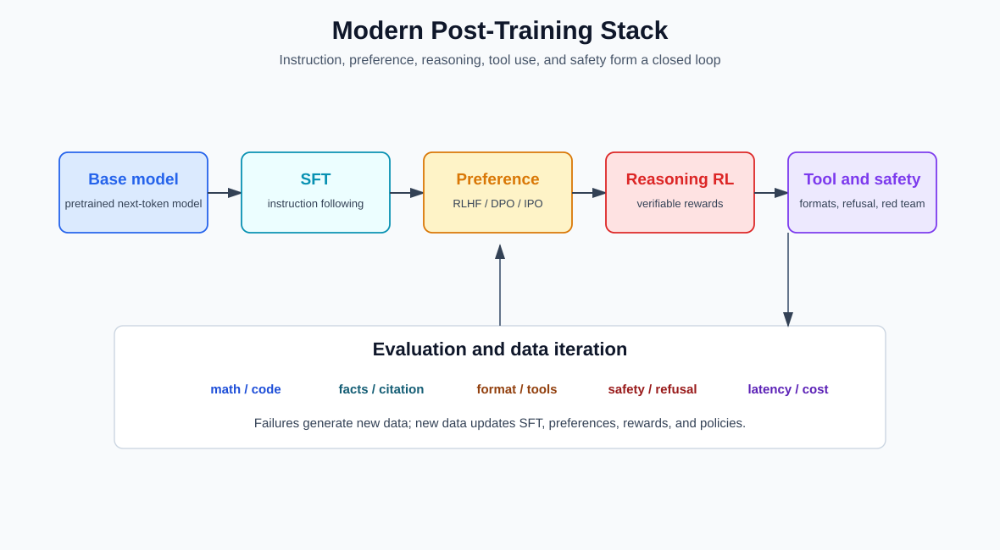
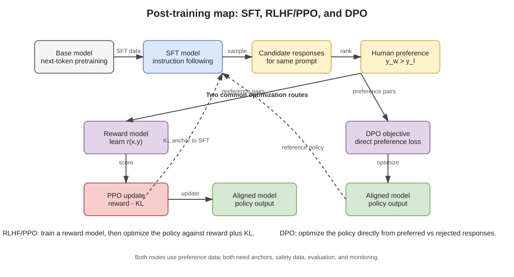
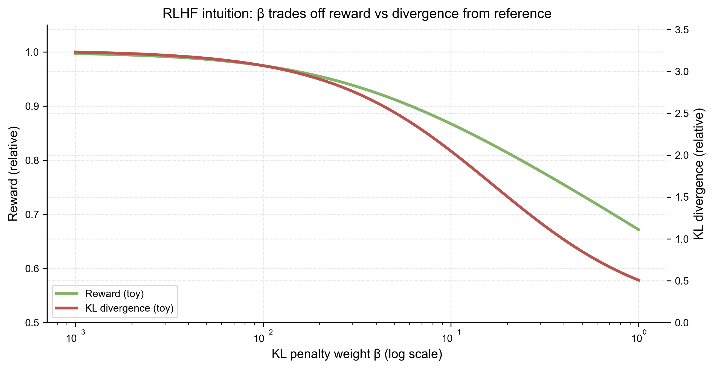
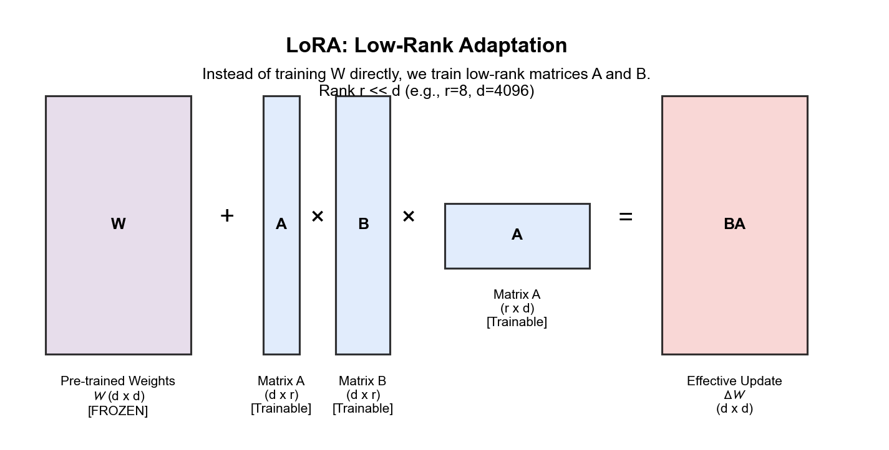
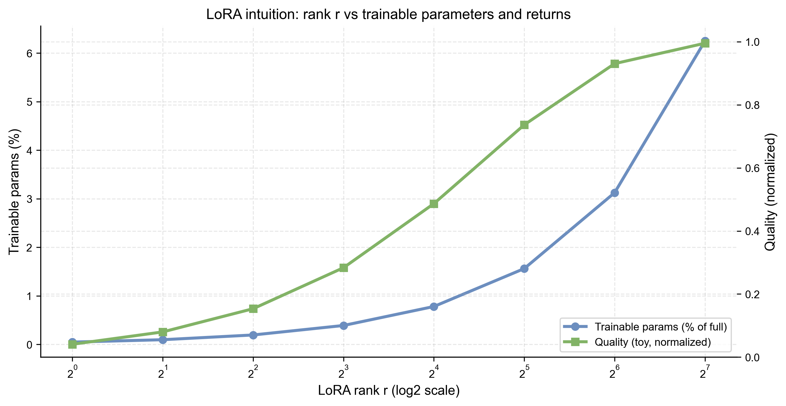

# 第五章 后训练、对齐与模型适配

预训练让模型学习条件分布，却不直接规定它怎样响应指令、何时拒答、怎样使用工具或怎样在多个可接受回答中取舍。后训练使用规模较小但目标更明确的数据和反馈，改变模型的交互行为。

后训练不是给模型外接一套道德规则，也不是一次算法就能完成的步骤。它通常由监督微调、偏好学习、强化学习、安全数据、蒸馏和持续评测组成。

## 5.1 Supervised Fine-Tuning

SFT 数据把指令和期望回答组织为序列。训练仍可使用下一 token 交叉熵，但通常只在回答区域计算或提高权重：

$$
\mathcal L_{\mathrm{SFT}}
=
-\sum_{t\in\mathcal R}
\log p_\theta(y_t\mid x,y_{<t}),
$$

其中 $x$ 是指令和上下文，$\mathcal R$ 是需要学习的回答位置。

SFT 教给模型的不只是事实，还包括任务格式、角色、语气、停止方式和工具调用语法。数据模板与多轮边界因此属于训练配方，而不是无关排版。

## 5.2 偏好数据

许多任务没有唯一参考答案。偏好数据给出同一条件下的候选 $y^+$ 与 $y^-$，表示前者按某个 rubric 更可取。偏好可能来自人工比较、规则、模型裁判、可执行测试或它们的组合。

“更受偏好”不等于“更真实”。若标注者奖励自信、长度或固定格式，模型会学习这些代理。数据收集必须声明比较标准、标注者、候选生成方式和分歧处理。

## 5.3 Reward Model 与 RLHF

经典 RLHF 先训练 reward model $r_\phi(x,y)$，使偏好对满足较高得分。一个常见 pairwise 损失为

$$
\mathcal L_{\mathrm{RM}}
=
-\log\sigma
\bigl(r_\phi(x,y^+)-r_\phi(x,y^-)\bigr).
$$

随后策略模型在提高奖励的同时，受到与参考策略偏离的约束。PPO 是常见优化方法之一，但 RLHF 不是 PPO 的同义词；reward 建模、采样、优势估计、KL 控制和策略更新分别承担不同作用。

奖励模型只在训练比较分布附近经过验证。策略主动寻找高分输出时，可能进入 reward model 未被充分约束的区域，产生 reward hacking。

PPO 的目标、优势估计和裁剪机制可在[强化学习与 PPO 附录](../appendices/learning-notes/a.11_rl_and_ppo.md)中逐步核对。

## 5.4 Direct Preference Optimization

DPO 不单独训练显式 reward model，而是直接比较策略相对参考模型对两个回答的 log-ratio。典型目标为

$$
\mathcal L_{\mathrm{DPO}}
=
-\log\sigma\!\left(
\beta
\left[
\log\frac{\pi_\theta(y^+\mid x)}{\pi_{\mathrm{ref}}(y^+\mid x)}
-
\log\frac{\pi_\theta(y^-\mid x)}{\pi_{\mathrm{ref}}(y^-\mid x)}
\right]
\right).
$$

$\beta$ 控制相对参考策略的偏好强度。DPO 简化了训练管线，却没有消除偏好数据偏差、长度效应、分布外候选和参考策略选择问题。

## 5.5 可验证奖励与推理强化

数学、代码和形式任务可以用最终答案、单元测试或证明检查器提供较客观反馈。策略在多步生成中探索不同解题轨迹，并按可验证结果更新。

这种训练可以提高测试时计算的利用，却不证明可见推理文本等同于模型内部因果过程。奖励可能只检查结论，模型也可能学会利用验证器漏洞。过程监督、步骤检查和隐藏确认集分别缓解不同问题。

## 5.6 拒答与安全后训练

安全训练常包含危险请求、边界案例、良性近邻和替代帮助。只增加拒答样本容易造成过度拒答；只奖励任务完成又可能让模型忽略风险。

需要分开评价：

- 明确危险任务的拒绝；
- 良性任务的能力保持；
- 含糊请求的澄清；
- 多轮诱导和上下文污染；
- 工具环境中的实际权限遵守。

模型侧训练只是系统安全的一层。真实工具权限仍由第十一章的运行时控制。

## 5.7 数据工程

后训练数据通常远少于预训练数据，单条样本的模板和质量影响更大。管线包括任务覆盖、难度分层、候选生成、去重、人工审核、rubric 版本、污染检查和失败样本回流。

模型生成合成数据可以扩大规模，但教师错误、格式习惯和同质化也会被复制。合格记录要区分人工原始样本、模型候选、验证器接受和人工修订，而不是统称“高质量数据”。

## 5.8 蒸馏

蒸馏让学生模型拟合教师的概率、回答或中间表示。以温度 $T$ 下的分布为例：

$$
p_T(i\mid x)=
\frac{\exp(z_i/T)}{\sum_j\exp(z_j/T)}.
$$

较高温度暴露非最大类别之间的相对结构。实际语言模型蒸馏也常直接使用教师生成的指令回答或推理轨迹。

学生获得的是数据中可学习的教师行为，不是教师权重或完整内部机制。能力受学生架构、容量、tokenizer 和蒸馏分布限制。

## 5.9 Continued Pretraining 与领域适配

继续预训练使用领域语料延续语言建模目标，适合注入术语、文体和领域分布；SFT 更直接地改变交互任务。两者可以组合，但作用不同。

领域适配可能降低通用能力或改变校准。数据混合、学习率、训练步数和保留集决定模型在“学会新领域”和“忘掉旧能力”之间的取舍。

## 5.10 LoRA 与参数高效适配

LoRA 把权重更新限制为低秩形式：

$$
W'=W+\Delta W,
\qquad
\Delta W=BA,
$$

其中 $A\in\mathbb R^{r\times d_{\mathrm{in}}}$，$B\in\mathbb R^{d_{\mathrm{out}}\times r}$，且秩 $r$ 远小于原维度。底模可以冻结，只训练少量参数。

低秩限制降低存储和训练成本，不保证更新只学习“风格”。adapter 与底模、tokenizer、量化方式和目标模块必须兼容；多个 adapter 合并也可能相互干扰。

## 5.11 模型合并

若多个微调模型来自同一底模，参数插值或 task-vector 组合有时可以合并能力。最简单形式为

$$
W_{\mathrm{merge}}=
W_0+\sum_k\alpha_k(W_k-W_0).
$$

有效性依赖微调轨迹是否处于兼容区域。权重形状相同只是可执行条件，不是功能兼容保证。合并后必须重新评价，而不能把各子模型分数直接相加。

## 5.12 后训练怎样评价

评价不能只有平均胜率。至少检查：

| 方面 | 例子 |
| --- | --- |
| 指令跟随 | 格式、约束、多轮一致性 |
| 任务能力 | 知识、代码、数学、领域任务 |
| 偏好 | 盲化人评与学习型裁判校准 |
| 安全 | 危险、良性近邻、越狱和工具场景 |
| 校准 | 不知道时的表达、选择性回答 |
| 回归 | 预训练能力、语言与关键子群 |

后训练把一个基座模型变成某种助手或策略，但部署成本和延迟由另一套机制决定。下一章因此从行为塑造转向推理效率与服务系统。

主要来源包括 InstructGPT、DPO、PPO、Constitutional AI、蒸馏和 LoRA，统一登记在[卷内来源表](SOURCE_NOTES.md)。
