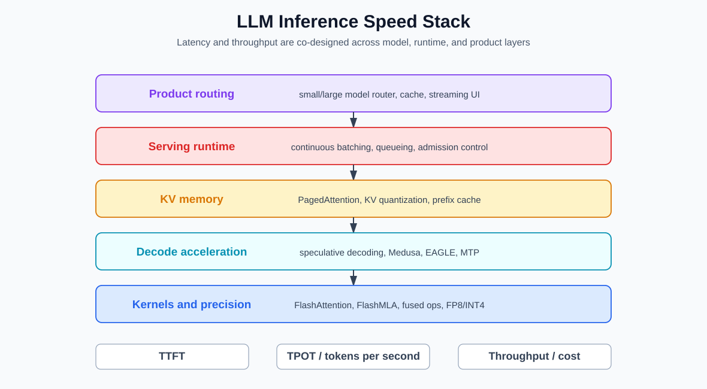
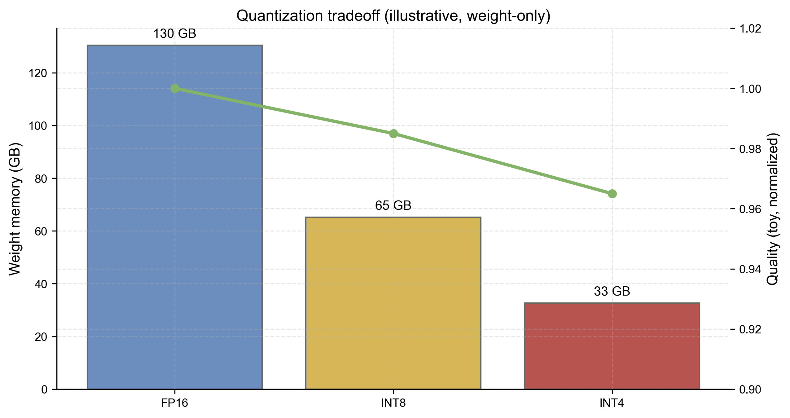

# 第六章 推理效率与模型服务

训练回答“参数怎样得到”，服务回答“同一组参数怎样在现实机器上持续产生输出”。两者共享模型结构，却面对不同约束：训练关心总计算量和收敛，在线推理还关心首 token 延迟、逐 token 延迟、并发、显存、尾延迟与失败恢复。

本章只讨论模型服务的基本机制。一次调用怎样从 token 走到输出留给卷二；采样分布的统计含义留给卷三。



## 6.1 Prefill 与 Decode 是两种工作负载

对长度为 $T$ 的输入，decoder-only Transformer 先并行处理全部输入 token，建立每层的 key/value 缓存；这一步称为 **prefill**。随后模型每次追加一个 token，并利用已有缓存计算下一个 token；这一步称为 **decode**。

| 阶段 | 单次迭代处理的 token | 常见资源特征 | 主要用户指标 |
| --- | ---: | --- | --- |
| prefill | 一段或整段输入 | 较大矩阵、长序列 attention | time to first token，TTFT |
| decode | 通常每请求一个新 token | 反复读取权重与 KV、迭代调度 | inter-token latency / TPOT |

设请求到达、首 token 返回和结束时刻分别为 $t_a,t_f,t_e$，输出 token 数为 $N_o$。一种明确口径是

$$
\operatorname{TTFT}=t_f-t_a,
\qquad
\operatorname{E2E}=t_e-t_a,
$$

$$
\operatorname{TPOT}=\frac{t_e-t_f}{N_o-1}
\quad(N_o>1).
$$

有些系统把分母写成 $N_o$，或报告每两个 streaming token 的延迟分布；名称相同不保证口径相同。吞吐是观察窗口内完成的 token 数除以墙钟时间，**goodput** 则只计满足延迟或质量 SLO 的请求。合格报告至少给出输入/输出长度分布、并发、TTFT、TPOT、端到端延迟、吞吐、P95/P99 和失败率。

## 6.2 每层计算量：为什么两阶段瓶颈不同

考虑宽度 $d$、MLP 中间宽度 $d_{ff}$ 的 dense decoder，令 $H_qd_h=d$，先假设标准 MHA 和 SwiGLU。以一次乘加为一个 MAC，忽略 bias、norm 和低阶项。

### 6.2.1 Prefill

长度 $T$ 的 Q/K/V/output 投影约需 $4Td^2$ MAC，SwiGLU 三个矩阵约需 $3Tdd_{ff}$ MAC。若 attention 计算完整 $T\times T$ 分数与 value 汇聚，两部分合计约为 $2T^2d$ MAC。因此单层粗略上界为

$$
C_{\mathrm{prefill}}^{(\ell)}
\approx4Td^2+3Tdd_{ff}+2T^2d.
$$

因果 attention 只有下三角有效，能利用该结构的 kernel 会降低二次项常数，但阶仍为 $\Theta(T^2d)$。当 $d$ 和 $d_{ff}$ 很大、$T$ 尚未超过宽度量级时，线性投影仍可占主要计算；所以“attention 是二次的”不表示任何实际长度下它都支配运行时间。

### 6.2.2 Decode

已有 KV cache 时，在当前上下文长度 $T$ 处生成一个新 token，单层约需

$$
C_{\mathrm{decode}}^{(\ell)}
\approx4d^2+3dd_{ff}+2Td.
$$

前两项只处理一个新 token；attention 的 query 仍需与全部历史 key 点积并汇聚 value，所以随 $T$ 线性增长。若使用 GQA/MQA，Q 与 output 投影仍约为 $2d^2$，K/V 投影则从 $2d^2$ 降为

$$
2dH_{kv}d_h.
$$

decode 低 batch 时，每一步只用少量新 token，却要再次读取大量模型权重。算术强度

$$
I=\frac{\text{运算次数}}{\text{从高带宽内存搬运的字节数}}
$$

因而偏低，常受内存带宽而非峰值 FLOPs 限制。提高 batch 能让同一份权重读取服务更多 token，提高 $I$，代价是排队和尾延迟。

以上是容量模型，不是延迟预测器。实际时间还取决于 kernel 融合、设备带宽、张量并行通信、量化格式、序列长度分布和调度空洞。

## 6.3 KV Cache 的显存账本

自回归解码若每一步重新计算全部前缀，会重复生成历史 key/value。KV cache 保存各层已有状态，使新 token 只计算自己的 K/V，再查询旧缓存。忽略块元数据、对齐和临时 workspace 时，字节量近似为

$$
M_{\mathrm{KV}}
\approx2LBTH_{kv}d_hb,
$$

其中 $L$ 是层数，$B$ 是并发序列数，$T$ 是每条序列已缓存长度，$H_{kv}$ 是 KV 头数，$d_h$ 是每头维数，$b$ 是每个元素的字节数，前面的 $2$ 对应 key 与 value。

例如 $L=32,B=1,T=8192,H_{kv}=8,d_h=128,b=2$ 时，

$$
M_{\mathrm{KV}}
=2\times32\times8192\times8\times128\times2
=2^{30}\ \text{bytes}=1\ \text{GiB}.
$$

若其他量不变而使用 $H_{kv}=32$ 的 MHA，则是 $4$ GiB；并发 $B=16$ 时分别约为 $16$ GiB 与 $64$ GiB。这还没有计模型权重、激活、allocator 保留和通信缓冲。

公式直接说明：上下文、并发、层数和 KV 头数都线性影响缓存。低精度 KV 改变 $b$，GQA/MQA 改变 $H_{kv}$，截断或滑动窗口改变有效 $T$。缓存不是模型长期记忆；它只是特定模型工件和一次请求前缀的中间张量。


## 6.4 分页式 KV 管理

若为每条请求预留一块“最大可能长度”的连续显存，大量空间会因输出提前结束而空置；若只按当前长度连续扩容，又会产生外部碎片和搬迁。分页式管理把逻辑 token 位置分成固定大小 block，并通过每请求的 block table 映射到非连续物理块。

一个请求增长时只需再分配物理块；最后一个块最多产生一个块以内的内部碎片。多个具有相同前缀的分支还可以让逻辑页指向同一只读物理块，发生分叉写入时再分配新块。PagedAttention 的“page”是 KV 内存管理抽象，不表示模型 attention 只看局部页面。

调度器必须处理以下状态：

```text
waiting -> prefill -> decode -> finished
             |          |
             +-> preempted / swapped / recompute <-+
```

当物理块不足时，可拒绝新请求、暂停并换出 KV、回收后重算前缀，或抢占低优先级请求。每种策略在吞吐、延迟与额外计算之间取舍。PagedAttention 与 vLLM 的研究入口见 [Kwon et al., 2023](SOURCE_NOTES.md#ref-kwon-pagedattention-2023)。

## 6.5 连续批处理与调度

GPU 喜欢较大的矩阵运算，请求却在不同时间到达、输入和输出长度未知。静态批处理等待整批完成，短请求会被长请求拖住。**连续批处理**在每次 decode 迭代重新组成活动 batch：完成请求离开，等待请求在资源允许时进入。

调度器每轮通常同时约束 token budget 与 KV block budget，并考虑：

- 请求优先级、等待时间和服务等级；
- 输入长度、当前上下文和最大输出限制；
- prefill 与 decode 对计算资源的竞争；
- adapter、量化工件和并行拓扑是否兼容批处理；
- 取消、超时、客户端断开和 streaming 背压；
- 抢占后保留、换出还是重算 KV。

长 prefill 若一次占满设备，会阻塞正在 decode 的交互请求。**chunked prefill** 把长输入拆成若干 token 块，与 decode token 共同装入迭代预算；它改善迭代公平性，却可能增加中间调度和 kernel 启动次数。

提高总吞吐的策略可能恶化某个长请求、低优先级请求或 P99。调度结论必须绑定到达过程和长度分布，不能只报告单一 batch size 的峰值。

## 6.6 量化与低精度

### 6.6.1 仿射量化

对 $b$ bit 整数区间 $[q_{min},q_{max}]$ 和非常值校准范围 $x_{min}<x_{max}$，可取

$$
s=\frac{x_{max}-x_{min}}{q_{max}-q_{min}},
\qquad
z=\operatorname{clip}\left(
\operatorname{round}\left(q_{min}-\frac{x_{min}}s\right),
q_{min},q_{max}\right),
$$

$$
q=\operatorname{clip}
\left(\operatorname{round}(x/s)+z,q_{min},q_{max}\right),
\qquad
\widehat x=s(q-z).
$$

这里 $z$ 也被约束为整数区间中的可表示码。若 $x$ 未被 clipping 且落在均匀量化网格覆盖范围内，舍入误差通常满足 $|x-\widehat x|\le s/2$。超出校准范围时误差可远大于该界。

当 $x_{max}=x_{min}=x_c$ 时，上述尺度公式除以零，必须走常值张量分支。可选择区间内两个码 $q_c,z$：若 $x_c>0$ 取 $q_c>z$，若 $x_c<0$ 取 $q_c<z$，并令 $s=x_c/(q_c-z)>0$；所有元素映射到 $q_c$ 即可精确重构。若 $x_c=0$，取 $q_c=z$ 和任意正尺度。实现也可直接把常值作为元数据存储，但不能令 $s=0$ 后继续套用通式。对称量化固定零点并用最大绝对值定尺度；非对称量化可更充分利用偏移分布的整数范围。

### 6.6.2 粒度与量化对象

尺度可以按整张量、输出通道或若干权重组成的 group 计算。更细粒度通常降低局部误差，却增加 scale 元数据、寻址和 kernel 复杂度。需要区分：

| 方案 | 低精度对象 | 主要收益与风险 |
| --- | --- | --- |
| weight-only | 模型权重 | 降低容量与权重带宽；激活仍较高精度 |
| weight + activation | 权重和矩阵输入 | 可能使用整数/低精度 tensor core；离群激活更难处理 |
| KV quantization | cache 中的 K/V | 直接降低长上下文与并发显存；误差随层和位置进入后续 attention |
| quantization-aware training | 训练中模拟量化 | 可适应误差；需要额外训练与工件管理 |

“模型是 4 bit”若不说明对象、group size、校准数据、累加精度和 kernel，信息不足。文件变小也不保证更快：设备若缺少对应内核，解包和反量化会抵消带宽收益。

验证至少比较任务质量、长上下文稳定性、极端 logit、吞吐、TTFT、TPOT 和实际峰值显存。GPTQ、SmoothQuant 与 AWQ 分别代表不同的 post-training 权重或权重-激活量化路线，来源见[卷内来源表](SOURCE_NOTES.md)。



## 6.7 保持目标分布的投机解码

设目标模型在当前前缀上的下一 token 分布为 $p$，较便宜的 draft 分布为 $q$。draft 先采样候选 $x\sim q$。精确校正的一步规则是：

1. 以概率

   $$
   a(x)=\min\left(1,\frac{p(x)}{q(x)}\right)
   $$

   接受 $x$；
2. 若拒绝，则从残差分布

   $$
p_{res}(v)
=\frac{[p(v)-q(v)]_+}
{\sum_u[p(u)-q(u)]_+}
$$

   重新采样，其中 $[z]_+=\max(z,0)$。若分母为零，则 $p=q$，拒绝事件的概率也为零，残差分布无需定义。

为什么它保持 $p$？候选 $v$ 通过接受路径出现的概率是

$$
q(v)\min(1,p(v)/q(v))=\min(q(v),p(v)).
$$

拒绝的总概率等于 $\sum_u[p(u)-q(u)]_+$，乘以 $p_{res}(v)$ 后补上 $[p(v)-q(v)]_+$。两条路径之和正好是 $p(v)$。

实际算法让 draft 一次提出 $\gamma$ 个 token，目标模型用一次并行前向给出每个对应前缀上的 $p_i$，再从左到右应用上述接受规则；首个拒绝处从残差分布采样并停止本轮。若全部接受，再从目标模型对下一位置的分布采一个额外 token。逐位置条件分布都被校正，因此完整序列仍服从目标模型。

如果为了速度改用“分数足够高就接受”等启发式规则，上述等分布保证不再成立。收益取决于 draft 成本、接受长度、验证 batch 和硬件利用率；候选常被拒绝时，额外 draft 计算可能得不偿失。来源见 [Leviathan et al., 2023](SOURCE_NOTES.md#ref-leviathan-speculative-2023)。Medusa、EAGLE 和多 token 预测头改变候选产生方式，也必须单独说明其验证规则是否精确保持目标分布。

## 6.8 多设备并行与通信边界

大模型可能无法放入单个加速器。并行方式切分的是不同对象：

| 方式 | 切分对象 | 典型通信与限制 |
| --- | --- | --- |
| data parallel | 请求与模型副本 | 路由请求；每副本保留权重 |
| tensor parallel | 单层矩阵的行或列 | 每层 all-reduce / all-gather，受互连延迟影响 |
| pipeline parallel | 连续层段 | 阶段间传激活；小 batch 易出现 pipeline bubble |
| expert parallel | MoE 专家 | token dispatch/combine 的 all-to-all，易有热点 |
| context/sequence parallel | 长序列或 KV | attention 所需的环形或集合通信 |

推理时 data parallel 不需同步梯度，但不同副本的 KV、adapter 和请求队列仍需放置。tensor parallel 降低每设备权重，却让每个 token 的多层前向反复通信；网络带宽不足时，多卡可能比单卡更慢。

MoE 的总参数量大于每 token 激活参数量，但被路由 token 必须到达专家所在设备。专家负载不均和 all-to-all 尾部决定实际迭代时长，因此不能从激活 FLOPs 单独推出吞吐。

## 6.9 Prefill/Decode 分离与前缀复用

prefill 往往有较高算术强度，decode 常偏内存带宽和调度密集，服务系统可以把两者放到不同资源池。分离部署必须传输每层 KV；传输时间若接近节省的排队时间，收益会消失。两侧还必须匹配模型版本、adapter、KV 精度、位置编码和 cache layout。

共享 system prompt、长文档前缀或多分支生成可以复用前缀缓存。一个可靠 cache key 至少包含：

$$
K_{cache}=H(
\text{model},\text{tokenizer},\text{adapter},
\text{quantization},\text{position config},
\text{token ids},\text{attention semantics}).
$$

可见文本相同不足以复用，因为 chat template、特殊 token、位置 ID 或 adapter 可能不同。跨租户共享还必须满足数据隔离策略；不能为了命中率让一个租户确认或读取另一租户的私有前缀。


## 6.10 在线系统的正确性与恢复

推理服务的“同一个模型”应由版本元组确定，而不只是展示名称：

```text
model weights hash
+ tokenizer and chat-template version
+ adapter set
+ quantization and kernel configuration
+ context/position configuration
+ decoding and stop rules
```

rolling update 期间，同一会话的后续请求若被路由到不兼容版本，旧 KV cache 不能继续使用。streaming 请求中途失败后直接重试，还可能重复已发送 token；要么由客户端按 request/sequence ID 去重，要么恢复 RNG 与 KV 状态，要么明确从头生成的新结果可能不同。

可观测性应区分排队、tokenization、prefill、每轮 decode、采样、工具和网络传输时间，并记录：

- 活动、等待与抢占请求数；
- KV block 使用率、碎片、换出与重算；
- 每种模型/adapter 的 batch 组成；
- TTFT、inter-token latency、P95/P99 与 SLO miss；
- OOM、kernel 错误、超时、取消和重试；
- 输入/输出长度与截断原因，但敏感正文按隐私策略处理。

## 6.11 服务层改变了用户实际接触的系统

服务层通常不改变模型权重，却会改变可观察行为：

- 截断策略决定哪些输入进入模型；
- 动态 batch、kernel 和低精度可能带来数值差异；
- 超时和长度上限改变可完成任务；
- 路由决定调用哪个模型或 adapter；
- 缓存决定哪些中间结果被复用；
- 内容策略和工具运行时决定哪些候选输出可以离开系统。

因此要区分模型能力、某个推理配置下的能力和在线服务能力。卷二将把其中一次请求展开为逐步执行；卷三再说明哪些变化应使用概率语言描述。

## 6.12 最小部署核对表

部署或比较服务前，至少固定：

1. 模型、tokenizer、template、adapter 与量化工件；
2. 上下文、输入截断和输出长度范围；
3. prefill/decode 调度、batch token budget 与并行拓扑；
4. KV 精度、block 大小、抢占和前缀缓存策略；
5. 采样、随机种子、停止、超时和重试规则；
6. 输入/输出长度与并发分布；
7. TTFT、TPOT、吞吐、goodput、P95/P99 和成本口径；
8. 质量回归集、故障注入与版本回滚方式。

这些字段让“模型运行得怎样”成为可复查、可比较的工程陈述，而不只是一个峰值 tokens/s 数字。

主要来源包括 FlashAttention、PagedAttention/vLLM、GPTQ、SmoothQuant、AWQ 与精确投机解码研究，统一登记在[卷内来源表](SOURCE_NOTES.md)。
