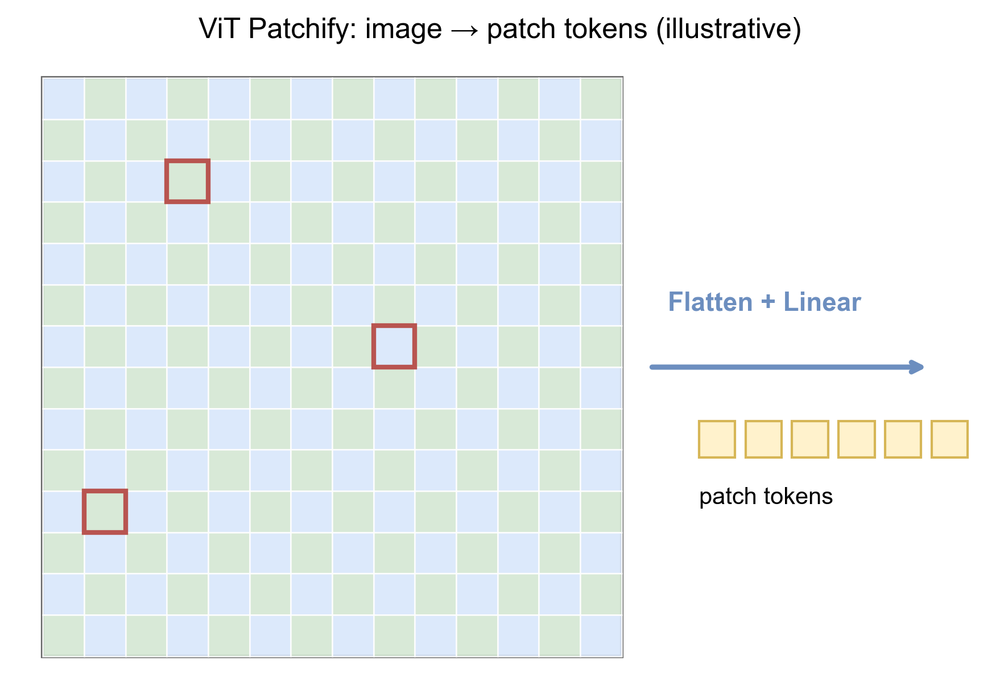

# 第七章 多模态模型

语言模型处理 token 序列；图像、音频和视频首先是带采样约定的连续信号。所谓多模态模型，不是简单地把图片文件和一句话同时交给同一个接口，而是要解决四个可以分别检验的问题：信号怎样离散或编码，表示怎样对齐，跨模态信息怎样进入预测，以及输出究竟依赖了哪一种模态。

本章讨论模型设计。多模态输入在一次运行中怎样展开，由卷二处理；内部视觉特征怎样解释，由卷四处理。

## 7.1 三种基本架构

现代多模态系统常落在三类结构上。为避免只按产品名称分类，先把一个系统写成四个映射：模态编码器 $E_m$、连接器 $C_m$、共享骨干 $F$ 与任务头或解码器 $D$。输入 $x^{(m)}$ 的基本路径是

$$
x^{(m)}\xrightarrow{E_m}V^{(m)}
\xrightarrow{C_m}Z^{(m)}
\xrightarrow{F}H
\xrightarrow{D}y.
$$

分类时要问哪些映射共享参数、哪些映射预训练、哪些映射在当前任务中更新。

**双编码器。** 图像和文本分别编码为向量，在共同空间中比较。CLIP 一类模型适合检索、分类和表示迁移，但它本身不是开放式语言生成器。它学习的是成对样本的相对兼容度，而不是从图像到句子的归一化生成分布。

**编码器—连接器—语言模型。** 视觉或音频编码器产生特征，projector、resampler 或 cross-attention 模块把它们变成语言模型可消费的表示，再由语言模型生成文本。这种结构便于复用已有组件，但模态接口可能成为信息瓶颈。LLaVA、Flamingo 与 BLIP-2 分别展示了较轻投影、门控交叉注意力和查询变换器等不同接口选择；不能把它们都简化成“给语言模型加图片”。

**统一序列模型。** 不同模态被离散化或映射为统一序列，模型在共享骨干中处理文本、图像、音频甚至动作 token。统一接口减少人工边界，却不表示所有模态已经获得同等精度或相同内部表示。

这三类不是严格互斥。现实系统常以统一骨干为主，同时保留专用编码器、解码器和工具。架构名称也不决定训练目标：一个统一序列模型仍可同时使用对比损失、生成损失和匹配损失。

## 7.2 图像怎样变成序列

令批量图像张量为 $X\in\mathbb R^{B\times H\times W\times C}$。Vision Transformer 把每幅图像切成 $P_h\times P_w$ 的 patch。若边长可整除，则

$$
N_h=\frac{H}{P_h},\qquad
N_w=\frac{W}{P_w},\qquad
N=N_hN_w.
$$

第 $i$ 个 patch 展平为 $u_i\in\mathbb R^{P_hP_wC}$，经共享投影

$$
z_i=u_iE+b+p_i,
\qquad
E\in\mathbb R^{P_hP_wC\times d}
$$

得到视觉 token；$p_i$ 编码二维位置。有些编码器另加 `[CLS]` token，但生成式多模态接口常保留整组空间 token。若提高输入分辨率而保持 patch 大小不变，$N$ 按像素面积增长；单层稠密自注意力的分数张量有 $hN^2$ 个元素，乘加量主项为 $O(N^2d)$。因此把边长放大两倍会使 token 数约增四倍、注意力主项约增十六倍，而不是只增加两倍成本。

实际系统常采用三种折中：先缩放到固定画布；把高分辨率图像切成若干 tile 并保留全局缩略图；或在视觉编码器内用层次化下采样、窗口注意力和 token pooling。tile 方案保留局部文字，却会引入跨块坐标和重叠区域的拼接问题。若连接器没有可靠的全局坐标，两个相同局部块可能在语义上不可区分。

patch token 不是“图像中的物体”。它只是由一块像素线性变换得到的输入单元。物体、文字和空间关系要在后续层中由多个 token 的交互形成；把某个 patch 的高激活直接命名为“物体检测”属于需要额外验证的解释性主张。

## 7.3 对比学习与共同表示

给定一批配对图像和文本，双编码器产生单位向量 $v_i,t_i\in\mathbb R^d$。定义 logit

$$
s_{ij}=\frac{v_i^\top t_j}{\tau},
\qquad \tau>0.
$$

常见对比目标把正确配对的相似度拉高，把批内其他配对当作负样本。图像到文本方向为

$$
\mathcal L_{I\to T}
=
-\frac1B\sum_{i=1}^B
\log
\frac{\exp(v_i^\top t_i/\tau)}
{\sum_{j=1}^B\exp(v_i^\top t_j/\tau)}.
$$

$\tau$ 控制相似度分布的尖锐程度。文本到图像方向把每一列归一化，CLIP 型对称目标取

$$
\mathcal L_{\mathrm{sym}}
=\frac12(\mathcal L_{I\to T}+\mathcal L_{T\to I}).
$$

以 $I\to T$ 为例，对分数的导数为

$$
\frac{\partial \ell_i}{\partial s_{ij}}
=\pi_{ij}-\mathbf 1\{i=j\},
\qquad
\pi_{ij}=\frac{e^{s_{ij}}}{\sum_k e^{s_{ik}}}.
$$

所以正对被拉近，批内其他对按当前 softmax 概率被推远。这个结论也暴露了两个边界。第一，批量越大通常提供越多负样本，但也提高语义等价文本被误当成负例的概率。第二，若一幅图像有多个正确描述而数据只标出一个，对角线标签不是“全部真值”。该目标学习的是采样与标注制度下的配对判别结构，不是像素级事实数据库；高相似度表示在训练目标下匹配，不等于陈述为真。

对比目标的批内负样本、温度和梯度推导见[对比学习与 InfoNCE 附录](../appendices/learning-notes/a.12_contrastive_learning.md)。

## 7.4 把视觉特征接入语言模型

设视觉编码器输出 $V\in\mathbb R^{N\times d_v}$，语言模型隐藏宽度为 $d$。连接器至少有三种不同的信息接口。

**逐 token 投影。** 最简单的连接器是

$$
Z=VW+b,
\qquad W\in\mathbb R^{d_v\times d},
$$

然后把 $Z$ 作为一段视觉 token 插入语言上下文。它保持 token 数 $N$，但只在每个位置上做相同的仿射变换；投影本身不汇总跨 patch 信息。

**查询压缩器。** 令 $M$ 个可学习查询为 $Q\in\mathbb R^{M\times d}$，通常 $M\ll N$。一次交叉注意力可写为

$$
R
=\operatorname{softmax}
\left(\frac{(QW_Q)(VW_K)^\top}{\sqrt{d_h}}\right)
(VW_V),
\qquad R\in\mathbb R^{M\times d_h}.
$$

多头、多层和自注意力可以进一步处理 $R$。固定 $M$ 使语言上下文成本可控，但也把任意长视觉序列压到固定 token 预算；保留什么由训练目标决定。

**按层读取。** cross-attention 可插入语言模型若干层，让文本隐藏状态作为查询、视觉特征作为键和值。这样不必把所有视觉 token 混入自回归前缀，但每个插入层都增加读取成本，并改变冻结语言模型的内部计算路径。

连接器决定有多少视觉细节能够进入语言模型，却不能单独决定模型是否使用这些细节。若文字太小、目标太密或视频过长，问题可能发生在媒体解码、视觉编码、token 压缩、语言推理或输出解码中的任意一层。笼统地说“模型没看见”不能定位故障。

## 7.5 训练通常分几个阶段

一种常见训练路线是：

1. 分别获得视觉编码器和语言模型；
2. 冻结大部分参数，只训练连接器，使两侧表示可以通信；
3. 在图文问答、描述、OCR、图表和多轮数据上进行联合指令微调；
4. 用偏好数据、验证器或强化学习改善帮助性、拒答和视觉依赖；
5. 对高分辨率、视频、工具或领域数据继续适配。

不同路线也可以从头联合训练，或让图像和文本共享离散词表。比较模型时必须说明哪些组件预训练、哪些组件冻结、训练数据是否真正要求使用目标模态。

多目标训练常写成

$$
\mathcal L
=\lambda_{\mathrm{con}}\mathcal L_{\mathrm{contrast}}
+\lambda_{\mathrm{match}}\mathcal L_{\mathrm{match}}
+\lambda_{\mathrm{gen}}\mathcal L_{\mathrm{token}}
+\lambda_{\mathrm{aux}}\mathcal L_{\mathrm{aux}}.
$$

各项权重不是无关紧要的实现细节。若生成数据可以由文本先验猜出，$\mathcal L_{\mathrm{token}}$ 很低也不证明模型学习了视觉依赖。可靠的训练与评测数据要包含“语言上自然、视觉上互相冲突”的例子，并用图像替换或遮挡测试条件依赖。

## 7.6 音频与语音

设离散波形为 $x[n]$。短时傅里叶变换在帧 $m$ 与频率格点 $k$ 上计算

$$
X(m,k)=\sum_n x[n]w[n-mR]e^{-2\pi i kn/N_f},
$$

其中 $w$ 是窗函数，$R$ 是 hop size，$N_f$ 是变换长度。语音识别模型常进一步取功率谱、Mel 滤波组与对数，得到帧序列；Whisper 是编码器—解码器式语音识别与翻译路线的代表。另一条路线用神经音频 codec 把波形量化为离散 code，再让序列模型预测 code。前者的 token 是声学特征帧，后者的 token 是学习到的量化索引，二者不能混称。

采样率决定可表示的最高频率，窗长影响时间—频率分辨率，hop size 决定帧率。输入预处理一旦丢掉信息，后续语言模型不能从参数中恢复当前录音里已经消失的细节。

级联系统便于定位错误：识别文本错了，后续语言模型再正确也无法恢复原声信息。端到端系统可能保留语调、说话人和环境声，却更难把错误归到明确模块。低延迟语音对话还要处理打断、回声、语音活动检测和边听边说，这些属于模型与实时系统的共同设计。

## 7.7 视频增加了时间轴

令视频张量为 $X\in\mathbb R^{T\times H\times W\times C}$。若以 $P_t\times P_h\times P_w$ 的 tubelet 切分，则 token 数为

$$
N
=\frac{T}{P_t}\frac{H}{P_h}\frac{W}{P_w}.
$$

全时空注意力仍有 $O(N^2d)$ 主项。因子化注意力先在每个时刻做空间注意力、再沿固定空间位置做时间注意力，可把分数计算量近似改为

$$
O\!\left(T_sN_s^2d+N_sT_s^2d\right),
$$

其中 $T_s=T/P_t$、$N_s=HW/(P_hP_w)$；它节省成本，也加入了“先空间后时间”的结构偏置。稀疏采样会产生时间混叠：两个采样帧之间发生再恢复的状态变化可能完全不可见。因此视频不是图片列表，模型还要决定采样率、关键帧、运动表示、音画同步和长时间依赖。

评价视频理解不能只问静态物体。事件顺序、状态变化、遮挡后持续存在、镜头切换和因果方向都需要时间信息。一个模型正确描述某帧，不证明它理解了整个事件；在原视频、倒放视频和帧乱序视频上给出同样答案，反而说明任务没有检测到时间依赖。

## 7.8 多模态幻觉从哪里来

多模态错误至少有四种不同来源：

- 感知失败：视觉或音频编码器没有保留相关信号；
- 对齐失败：相关特征存在，但没有正确连接到语言表示；
- 语言先验压过输入：模型给出训练语料中常见、却与当前图像不符的答案；
- 任务或评分失败：问题本身含糊，参考答案遗漏多个合理解释。

因此评测应包含模态消融：遮掉图像、打乱图像、替换问题或只给文本，观察回答是否真正依赖视觉条件。更强的反事实测试只改变一个视觉属性，例如交换对象颜色、计数或左右位置，同时保持问题文本不变。只比较最终答案无法区分模型是在看图，还是仅凭语言先验猜中。

一个研究级评测至少分四层：

1. **感知。** OCR、对象、属性、声音事件和时序是否被编码；
2. **指代与定位。** 文本短语是否对应到正确区域、时间段或声源；
3. **组合推理。** 回答是否需要联合多个模态证据，而不是单模态捷径；
4. **置信与拒答。** 在分辨率不足、遮挡或证据冲突时，系统是否降低置信或说明不可判定。

准确率、生成质量和模态依赖是不同变量。一个模型可以提高答案准确率，却更少依赖图像；也可以定位正确区域，却在语言生成阶段给出错误结论。

## 7.9 模型工件与系统边界

多模态系统还可能调用 OCR、检测器、搜索、代码执行器或媒体解码库。最终回答的能力来自整个装配，而不只来自一个参数文件。报告至少固定输入预处理、分辨率、帧采样、音频编码、模型工件、连接器版本、工具和输出后处理。

本章的基本架构与训练路线可从 [ViT](SOURCE_NOTES.md#ref-dosovitskiy-2020)、[CLIP](SOURCE_NOTES.md#ref-radford-clip-2021)、[LLaVA](SOURCE_NOTES.md#ref-liu-llava-2023)、[Flamingo](SOURCE_NOTES.md#ref-alayrac-flamingo-2022)、[BLIP-2](SOURCE_NOTES.md#ref-li-blip2-2023)与 [Whisper](SOURCE_NOTES.md#ref-radford-whisper-2022)追溯。它们支持的是具体架构和实验结果，不证明所有后续多模态系统具有相同行为。

下一章转向另一类模型家族：它们不是把输入模态接入语言模型，而是直接学习怎样从噪声或受损状态生成图像、音频和视频。
