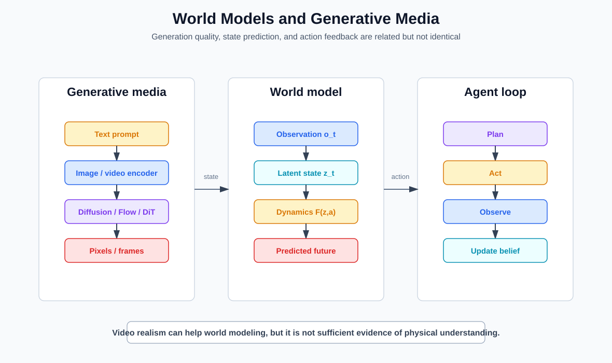

# 第九章 世界模型、具身智能与 VLA

生成视频、预测未来和为行动规划都涉及“接下来会发生什么”，但它们不因此成为同一个问题。世界模型的关键不是输出看起来像世界，而是内部状态能否支持与行动有关的预测、比较和控制。

## 9.1 最小世界模型接口

设环境状态为 $s_t\in\mathcal S$，智能体采取动作 $a_t\in\mathcal A$，收到观察 $o_t\in\mathcal O$ 与回报或任务信号 $r_t$。一个部分可观测 Markov 决策过程还包含初始分布、转移核 $P$、观察核 $O$、奖励分布和折扣因子。其一步生成关系可写成

$$
s_{t+1}\sim P(\cdot\mid s_t,a_t),
\qquad
o_{t+1}\sim O(\cdot\mid s_{t+1}),
\qquad
r_t\sim R(\cdot\mid s_t,a_t).
$$

智能体通常看不到 $s_t$。令可见历史为

$$
h_t=(o_0,a_0,r_0,\ldots,a_{t-1},r_{t-1},o_t).
$$

理论上的信念状态 $b_t(s)=\Pr(s_t=s\mid h_t)$ 是历史的一个充分统计量；给定新动作和观察，它通过预测与 Bayes 更新递推。在模型未知、高维连续状态下，系统通常以递归编码器从历史构造近似潜状态 $z_t=f_\phi(h_t)$。理想的控制充分性要求：对任意未来动作序列，其未来观察与回报条件分布只依赖 $z_t$，不再依赖完整 $h_t$。实际模型只在选定数据分布和预测目标上近似这一要求。

一个用于控制的世界模型至少要近似：

$$
z_{t+1}\sim p_\theta(\cdot\mid z_t,a_t),
\qquad
\widehat o_t\sim p_\theta(\cdot\mid z_t),
\qquad
\widehat r_t\sim p_\theta(\cdot\mid z_t,a_t).
$$

不是每个系统都显式重建观察或预测回报，但必须有某种可供策略比较行动后果的接口。只有“可以预测下一个潜向量”仍不充分：若潜向量删除了奖励、终止或约束所需信息，它就不是当前控制任务的充分状态。

## 9.2 潜状态怎样学习

许多模型同时维护确定性递归状态 $h_t^{\mathrm{det}}$ 与随机潜变量 $z_t$。一个通用的训练接口包括

$$
\begin{aligned}
h_t^{\mathrm{det}}&=f_\theta(h_{t-1}^{\mathrm{det}},z_{t-1},a_{t-1}),\\
p_\theta(z_t\mid h_t^{\mathrm{det}})&\quad\text{(动力学先验)},\\
q_\phi(z_t\mid h_t^{\mathrm{det}},o_t)&\quad\text{(观察后验)}.
\end{aligned}
$$

一种代表性的序列变分目标为

$$
\mathcal L_{\mathrm{WM}}
=\sum_t\mathbb E_{q_\phi}
\left[
-\log p_\theta(o_t\mid h_t^{\mathrm{det}},z_t)
-\log p_\theta(r_t\mid h_t^{\mathrm{det}},z_t,a_t)
+\beta D_{\mathrm{KL}}\!\left(
q_\phi(z_t\mid h_t^{\mathrm{det}},o_t)
\,\|\,
p_\theta(z_t\mid h_t^{\mathrm{det}})
\right)
\right],
$$

并可加入继续概率、终止、约束或表征预测项。观察后验训练时读取真实 $o_t$；想象 rollout 时只能从动力学先验采样。这一差异会暴露 posterior 使用真实观察纠错、prior 却在长轨迹中漂移的问题。

KL 权重和重建目标决定潜状态保留什么。像素似然偏好还原可见细节，奖励预测偏好任务相关变量；二者都不保证恢复环境的唯一“真实状态”。

## 9.3 从像素预测到任务状态

逐像素预测会花费大量容量描述纹理、光照和不可预测细节。控制任务更关心哪些状态差异会改变行动选择。因此世界模型常在潜空间预测，或只预测与任务相关的表示。

这带来一个取舍：压缩太弱，模型浪费容量复制画面；压缩太强，可能删除接触、速度或对象身份等控制所需信息。潜状态是否“有意义”不能只靠可视化判断，而要看它能否支持未见状态下的预测和行动。更严格的比较要固定下游策略容量：若一个高容量探针能从表示中解码某变量，不等于实际规划器在闭环中使用了它。

## 9.4 在想象轨迹中规划

给定候选动作序列 $a_{t:t+H-1}$，模型可以 rollout 潜在未来，并估计累计目标：

$$
J(a_{t:t+H-1})
=
\mathbb E_\theta
\left[
\sum_{k=0}^{H-1}\gamma^k r_{t+k}
+\gamma^H V(z_{t+H})
\right].
$$

规划器比较多个候选后只执行前一小段，再用新观察更新状态并重新规划，这就是模型预测控制的基本思想。至少要区分三类算法：

**随机 shooting。** 从提议分布采样动作序列，按 $J$ 排序后执行最佳候选的首个动作。

**Cross-Entropy Method。** 用参数化分布 $q_{\eta_k}(a_{t:t+H-1})$ 采样，保留分数最高的 elite 集合 $\mathcal E_k$，再以 elite 的矩更新 $\eta_{k+1}$。它是对动作序列的迭代搜索，不是策略梯度。

**潜空间 actor--critic。** 在学习模型中 rollout 策略 $\pi_\psi(a\mid z)$，用预测奖励和价值估计更新 actor 与 critic；Dreamer 系列属于此路线。训练时的想象轨迹不等于部署时必须显式枚举候选动作。

规划器、策略和世界模型是三个对象。论文若只报告最终回报，应通过真实动力学或消融实验区分收益来自更好的模型、更强的搜索还是更长计算预算。

## 9.5 模型误差为什么随视野增长

可用一个有限时域界说明误差累积。考虑固定 Markov 策略 $\pi(a\mid s)$，并令 $r(s,a)$、$\widehat r(s,a)$ 分别为真实模型与学习模型的一步期望奖励。为得到定义域闭合的命题，先假设下列界对所有 $(s,a)\in\mathcal S\times\mathcal A$ 成立：

$$
|r(s,a)-\widehat r(s,a)|\le\varepsilon_r,
\qquad
|r(s,a)|\vee|\widehat r(s,a)|\le R_{\max}.
$$

可以把这一全局假设削弱到一个同时在 $P$、$\widehat P$ 和策略 $\pi$ 下闭合的状态集合，但它至少必须包含两个模型在固定策略下可达状态集合的并；只在真实动力学可达集合上给界并不充分。逐个状态—动作定义转移核差异的对偶范数

$$
\|P(\cdot\mid s,a)-\widehat P(\cdot\mid s,a)\|_*
=\sup_{\|f\|_\infty\le1}
\left|
\mathbb E_{P(\cdot\mid s,a)}f
-\mathbb E_{\widehat P(\cdot\mid s,a)}f
\right|
\le\varepsilon_p,
$$

取 $0\le\gamma\le1$，并把这里的 $h$ 步价值明确定义为**无终端价值的折扣回报**：

$$
V_0^P=V_0^{\widehat P}=0,
$$

$$
V_h^P(s)
=\mathbb E_{a\sim\pi(\cdot\mid s)}
\left[r(s,a)+\gamma
\mathbb E_{s'\sim P(\cdot\mid s,a)}V_{h-1}^P(s')\right],
$$

并以 $\widehat r,\widehat P$ 同样定义 $V_h^{\widehat P}$。令

$$
\Delta_h=\sup_s|V_h^P(s)-V_h^{\widehat P}(s)|.
$$

由奖励界，$\|V_{h-1}^P\|_\infty\le R_{\max}\sum_{j=0}^{h-2}\gamma^j$。在 Bellman 递推中加减 $\mathbb E_{\widehat P}V_{h-1}^P$，分别用核误差和 $\Delta_{h-1}$ 控制两项，得到

$$
\Delta_H
\le \varepsilon_r+\gamma\Delta_{H-1}
+\gamma R_{\max}\varepsilon_p
\sum_{j=0}^{H-2}\gamma^j,
$$

从而

$$
\Delta_H
\le \varepsilon_r\sum_{j=0}^{H-1}\gamma^j
+R_{\max}\varepsilon_p
\sum_{j=1}^{H-1}j\gamma^j.
$$

当 $\gamma=1$ 时，这约化为

$$
\Delta_H
\le H\varepsilon_r
+\frac{H(H-1)}2R_{\max}\varepsilon_p.
$$

若像 9.4 节那样加入终端价值近似，还要另加相应的 $\gamma^H$ 加权终端误差；不能把两种定义共用同一个界。该界很粗，但给出两个重要事实：即使一步误差均匀受控，无折扣转移误差项也可随视野二次增长；而真实学习系统通常只在行为数据覆盖区域内有误差保证。规划器会主动寻找预测高回报区域，可能利用恰好位于数据外的模型错误。因此实践中使用短视野重规划、价值终端项、模型 ensemble、不确定性惩罚与真实环境校正。

ensemble 分歧主要反映模型与训练随机性下的认识不确定性代理，不等于完整后验；环境本身的随机性属于偶然不确定性。把两者压成一个方差会让“需要更多数据”和“未来本来就不可唯一预测”无法区分。

## 9.6 视频生成模型不是自动的世界模型

一个视频模型可以产生视觉上连贯的片段，却仍缺少：

- 对可执行动作的明确条件；
- 对对象身份和隐藏状态的稳定表示；
- 对低概率但高损失事件的可靠预测；
- 足够快的闭环推理；
- 与控制器所需坐标、力和约束的接口。

反过来，一个用于控制的潜在动力学模型可以非常有用，却无法生成漂亮视频。更根本地说，只含观察视频的数据往往不能识别动作因果效应：两个环境可以在行为策略诱导的观察分布上相同，却在未尝试动作后的转移上不同。没有动作、干预或额外结构假设，拟合 $p(o_{t+1}\mid o_{\le t})$ 不足以识别 $P(s_{t+1}\mid s_t,a_t)$。应把视觉生成质量、状态预测质量和控制价值分别评价。

## 9.7 表示预测与 JEPA 路线

并非所有预测模型都重建像素。Joint-Embedding Predictive Architecture 一类路线在表示空间预测目标区域或未来表示，试图忽略不可预测的低层细节。它可能学到更抽象的状态结构，但“抽象”仍是由训练掩码、预测目标和数据决定的，不保证自动对应人类概念或物理变量。

## 9.8 从语言条件到机器人动作

Vision-Language-Action 模型接收视觉观察和语言目标，输出离散动作 token、末端执行器增量或连续控制表示。可以把高层策略写成

$$
a_t\sim\pi_\theta(\cdot\mid o_{\le t},g,e),
$$

其中 $g$ 是语言目标，$e$ 描述机器人形态、可用工具和环境上下文。相同语言命令在不同机械臂、相机标定和动作词表上对应不同控制问题。

若训练数据是轨迹 $\tau=(o_0,g,a_0,\ldots)$，最直接的行为克隆目标为

$$
\mathcal L_{\mathrm{BC}}
=-\mathbb E_{\tau}\sum_t\log\pi_\theta(a_t\mid o_{\le t},g).
$$

连续动作可由高斯或 mixture density 建模，也可逐维离散成 token。离散化便于复用语言模型交叉熵，却引入量化误差和人为维度顺序。动作 chunking 一次预测 $K$ 个控制步，降低模型调用频率并改善短期连贯性，但开环执行越长，对新观察的反应越慢。Diffusion Policy 等方法把一段连续动作当成条件去噪对象，可表达多峰动作分布；它仍需要确定执行多少步、何时重规划。

行为克隆只在示范状态分布上监督。部署时一次小误差会把系统带到训练中少见的状态，之后误差继续累积，这就是 covariate shift。在线数据聚合、恢复演示、扰动训练和保守约束分别从数据覆盖与执行边界缓解问题，但不能由离线损失推出闭环安全。

VLA 把互联网尺度视觉—语言知识和机器人轨迹接到同一模型中，但它不会消除运动规划、碰撞检查、低层控制和急停。模型产生的是动作建议或动作表示，真实电机命令仍由系统层转换和约束。

## 9.9 分层控制

实用机器人通常具有多层时间尺度：

| 层 | 典型输出 | 时间尺度 |
| --- | --- | --- |
| 任务层 | “把杯子放到托盘” | 秒到分钟 |
| 技能/策略层 | 抓取、移动、放置 | 百毫秒到秒 |
| 轨迹层 | 关节或末端路径 | 毫秒到百毫秒 |
| 控制层 | 力矩、速度或位置命令 | 毫秒 |

语言模型适合提出任务分解，并不因此适合直接闭环控制高速执行器。越靠近物理层，延迟、稳定性和硬安全约束越重要。上层输出应被下层可验证约束过滤；自然语言中的“慢一点”不是最大速度或接触力的形式化边界。

## 9.10 数据从哪里来

具身模型的数据可以来自遥操作、机器人自主收集、仿真、视频、人工标注和合成轨迹。不同机器人具有不同关节、相机和动作空间，因此数据混合需要形态适配或共享抽象动作。

互联网视频提供广泛视觉语义，却通常没有精确动作、相机标定和力反馈；机器人轨迹有动作，却规模较小、环境受限。VLA 的训练设计很大程度上是在两类数据之间建立接口。动作空间统一若只靠文本标签，会掩盖形态差异；共享末端位姿也仍依赖坐标系、控制频率和可达域约定。

## 9.11 Sim-to-Real 与模型外事件

仿真可以低成本产生碰撞、恢复和稀有场景，但现实中的摩擦、材料、传感器噪声和人类行为难以完整建模。domain randomization、系统辨识和现实微调可以缩小差距，不能证明差距消失。

现实部署应特别报告近失、人工接管、停止距离、最大接触力和失败后稳定状态。平均任务成功率无法表达物理风险。仿真中的随机化分布也必须记录：只在随机化支持集内成功，不能证明面对其外事件具有鲁棒性。

## 9.12 怎样判断模型学到了世界结构

评价可以分成五层：

1. **预测**：给定状态和动作，短期未来是否准确；
2. **反事实**：改变动作后，预测是否按机制改变；
3. **规划**：基于模型选出的行动是否优于无模型基线；
4. **转移**：新对象、新布局和新机器人上是否保持；
5. **闭环**：误差发生后是否能通过新观察恢复。

只在训练分布附近生成连贯视频支持第一层的一部分，不足以支持后四层。研究报告还应分开 open-loop prediction 与 closed-loop return：前者可在固定数据集离线测量，后者会改变后续状态分布。

本章的研究入口见 [World Models](SOURCE_NOTES.md#ref-ha-schmidhuber-2018)、[Dreamer](SOURCE_NOTES.md#ref-hafner-2019)、[DreamerV3](SOURCE_NOTES.md#ref-hafner-dreamerv3-2023)、[TD-MPC2](SOURCE_NOTES.md#ref-hansen-tdmpc2-2024)、[I-JEPA](SOURCE_NOTES.md#ref-assran-ijepa-2023)、[Genie](SOURCE_NOTES.md#ref-bruce-genie-2024)、[RT-2](SOURCE_NOTES.md#ref-rt2-2023)、[OpenVLA](SOURCE_NOTES.md#ref-kim-openvla-2024)与 [Diffusion Policy](SOURCE_NOTES.md#ref-chi-diffusion-policy-2023)。这些实验支持特定任务和数据协议，不把“世界模型”或“VLA”名称本身当成能力证明。下一章回到数字系统，讨论模型在有限上下文之外怎样检索和保存状态。
