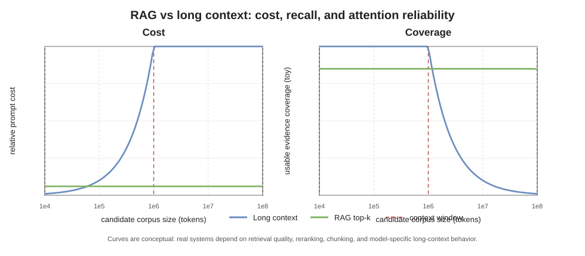

# 第十章 上下文、检索与记忆

模型参数保存训练后形成的计算结构，上下文提供本次运行可见的信息。扩大上下文窗口、检索外部材料和维护长期记忆都在弥补“当前输入不足”，但它们改变的是不同对象。

## 10.1 上下文窗口是什么

对 decoder-only 模型，上下文是进入本次前向计算的 token 序列及其位置、掩码和模态信息。窗口长度限制可同时来自模型训练范围、位置表示、注意力实现、KV cache 和服务策略。

“支持 1M token”并不表示每个位置都能以相同质量影响输出。最大可接收长度是接口性质，给定位置上的证据利用率是经验性质。长序列中的信息可能因位置、干扰、检索难度和训练分布而被忽略。评价长上下文需要考察不同位置、不同证据密度、近重复干扰和多跳组合，而不只测试能否接受长输入。“Lost in the Middle”类实验说明部分模型对证据位置敏感，但该结果必须按模型、任务与上下文长度重新测量，不能外推成所有模型的固定曲线。

## 10.2 上下文工程不是堆文本

一个实际上下文通常包含：

- 系统与开发者指令；
- 用户消息和历史；
- 工具定义与返回；
- 检索片段；
- 示例、结构模板和输出约束；
- 图片、音频或其他模态 token；
- 运行时插入的时间、身份和权限信息。

这些部分在控制权和可信度上不同。网页片段即使包含命令句，也仍是检索数据；工具 schema 即使以自然语言描述，也不会自动授予真实权限。上下文工程既是信息选择，也是通道和优先级设计。

## 10.3 RAG 的完整管线

Retrieval-Augmented Generation 可分为：

```text
source documents
-> parse and normalize
-> chunk and index
-> encode query
-> retrieve candidates
-> rerank and filter
-> assemble context
-> generate and cite
```

任何一步都可能改变最终回答。只记录“使用了 RAG”无法说明检索了什么、遗漏了什么或引用是否支持结论。

RAG 论文常把文档 $d$ 视为潜变量，写成

$$
p(y\mid x)
=\sum_{d\in\mathcal D}
p_\eta(d\mid x)p_\theta(y\mid x,d),
$$

其中 $p_\eta$ 是检索分布，$p_\theta$ 是条件生成分布。这一式子提供清楚的模型接口，但实际语料库巨大，系统只取候选集合 $K(x)$。若把原分布截断并重新归一化，则

$$
\widetilde p_\eta(d\mid x)
=\frac{p_\eta(d\mid x)\mathbf 1\{d\in K(x)\}}
{\sum_{d'\in K(x)}p_\eta(d'\mid x)}.
$$

候选生成、近似最近邻、权限过滤和 top-$k$ 都会改变 $K(x)$，所以最终系统分布不是“基础模型分布加几段文字”这么简单。另一些系统并不对文档边际化，只把排序最高的片段确定性拼入提示；此时上式是分析模型，不应伪装成实现细节。

## 10.4 稀疏、稠密与晚交互检索

不同检索器保留的信息不同。

**稀疏词项检索。** BM25 型分数以词项频率、逆文档频率和长度归一化组合精确词面匹配。一种常见形式是

$$
\operatorname{BM25}(q,d)
=\sum_{t\in q}\operatorname{IDF}(t)
\frac{f(t,d)(k_1+1)}
{f(t,d)+k_1\left(1-b+b|d|/\operatorname{avgdl}\right)}.
$$

它对罕见名称、错误码和编号敏感，却难以直接匹配没有共享词面的同义表达。tokenizer、分词和 IDF 语料版本都是索引的一部分。

**稠密双编码器。** 编码器把查询 $q$ 和文档片段 $d$ 各自映射为单个向量。可使用内积或余弦相似度

$$
s(q,d)=
\frac{e(q)^\top e(d)}
{\|e(q)\|_2\,\|e(d)\|_2}.
$$

高相似度表示编码器认为两段内容在训练得到的空间中接近，不等于片段正确，也不保证片段回答了问题。DPR 一类模型用问题—正文正对与困难负例训练双编码器；负例采样会直接塑造“相关”的几何定义。

**晚交互。** ColBERT 型模型保留查询 token 向量 $q_i$ 与文档 token 向量 $d_j$，以

$$
S(q,d)=\sum_i\max_j q_i^\top d_j
$$

聚合局部匹配。它比单向量保留更多词项级证据，又比每个候选都运行完整 cross-encoder 更易预索引，但索引体积与查询计算更大。

召回之后还可能使用 cross-encoder 或语言模型 reranker，把查询与候选拼接后联合打分。reranker 改善候选内排序，却无法找回第一阶段没有召回的文档，也新增模型版本、成本和偏差来源。


## 10.5 近似索引与混合排序

对亿级向量逐一计算精确相似度通常不可接受。HNSW 等近似最近邻索引用图搜索换取较低延迟；倒排量化等方法用压缩与分桶减少内存和比较次数。近似索引新增一组独立于模型质量的参数：构建时间、内存、查询延迟与 recall@k。必须用同一 embedding、同一语料快照和精确搜索参照测量，不能把 ANN 漏召回归因于生成模型。

稀疏与稠密分数通常不在同一数值尺度。除学习融合器外，可用 reciprocal rank fusion 按名次组合多个排序：

$$
\operatorname{RRF}(d)
=\sum_{r\in\mathcal R}
\frac{1}{k_0+\operatorname{rank}_r(d)}.
$$

$k_0$ 控制头部名次差异的影响。RRF 不需要校准原始分数，但会丢弃“第一名远好于第二名”的幅度信息。融合后仍可做去重、权限过滤和 rerank；这些操作的顺序会改变结果。

## 10.6 Chunking 决定可检索单位

片段太短会失去上下文，太长会稀释关键词并占用窗口。固定 token 切分、按标题结构切分、滑动重叠和语义切分适合不同文档。表格、代码、公式和脚注尤其容易在通用文本切分中损坏。

因此索引版本应包含解析器、切分规则、embedding 模型和源文档版本。每个片段还应携带稳定文档标识、页码或标题路径、字符区间、权限标签与内容哈希。文档更新后只替换原文件而不重建索引，会留下旧向量或断裂引用。

重叠切分提高边界事实进入完整片段的概率，却制造近重复候选；若 top-$k$ 被同一段的多个重叠副本占满，表面召回数量增加，证据覆盖反而下降。表格、代码和公式应使用结构感知解析，并保留标题、表头与符号定义。

## 10.7 长上下文与 RAG 的关系

长上下文减少切分和检索遗漏，却增加计算、KV cache、干扰和访问控制范围。RAG 降低每次输入长度，并能显示来源，但可能漏召回、错排序或抽掉必要上下文。

两者不是简单替代关系。常见设计先用检索缩小文档集合，再把较完整的候选章节放入长上下文；对于小而稳定的材料，直接提供全文可能更可靠。比较方案时应固定总输入 token、延迟与源文档权限范围，否则“长上下文优于 RAG”可能只是给了前者更多可见证据。



## 10.8 参数、上下文、状态和记忆

“模型记得”至少可能指：

| 对象 | 保存在哪里 | 怎样变化 |
| --- | --- | --- |
| 参数知识 | 模型权重 | 训练、微调、编辑或合并 |
| 当前上下文 | 本次 token/模态序列 | 每次调用组装 |
| KV cache | 中间张量 | 随当前序列增长并回收 |
| 会话状态 | 应用数据库 | 由运行时读写 |
| 检索记忆 | 文档或向量索引 | 由索引管线更新 |
| 用户偏好 | 结构化资料 | 由产品规则和授权维护 |

这些对象具有不同生命周期和删除语义。清空聊天界面不保证删除服务器状态；删除检索文档也不会改变已经训练完成的权重。

## 10.9 写入记忆比读取更危险

长期记忆系统需要决定写入什么、由谁确认、何时过期以及怎样纠错。若模型自动把自己的总结写回记忆，早期误解可能在后续会话中反复强化。

稳健写入通常包括：结构化字段、来源、有效时间、写入时间、作用域、确认状态、冲突处理和删除入口。可以把一条事实性记忆抽象为

$$
m=(\text{subject},\text{predicate},\text{value},
\text{source},t_{\mathrm{valid}},t_{\mathrm{write}},
\text{scope},\text{status}).
$$

更新时不应只按自然语言相似度覆盖旧值：同一事实可能随时间变化，两个来源也可能冲突。追加版本并显式标记 superseded、disputed 或 user-confirmed，通常比静默改写更可审计。敏感信息还要限制用途和读取主体。自由文本日志可以保留上下文，却不适合作为无条件可信事实库。

## 10.10 检索增强不等于事实保证

引用链可能在四处断裂：源文档错误、检索选错、模型误读、回答与引用错位。系统可以证明“回答依据了某片段”，不能仅凭这条记录证明现实事实。

RAG 评测至少分开：

- retrieval recall：所需证据是否被召回；
- ranking：证据是否进入可见位置；
- grounded generation：回答是否受证据约束；
- citation correctness：引用是否支持对应主张；
- abstention：证据不足时是否停止猜测。

设查询 $i$ 的相关文档集合为 $R_i$，前 $k$ 个结果为 $K_i^{(k)}$，则

$$
\operatorname{Recall@}k
=\frac1n\sum_{i=1}^n
\frac{|R_i\cap K_i^{(k)}|}{|R_i|}.
$$

若每个查询只需一个首个相关结果，MRR 对其名次 $r_i$ 计算 $n^{-1}\sum_i r_i^{-1}$。有分级相关性时，nDCG 以理想排序归一化折损累积增益。三者都需要相关性标注；若标注集合漏掉可替代证据，指标会惩罚合理检索。

生成层还应把答案拆成可验证主张，分别检查 entailment 与引用定位。检索召回高不保证回答忠实，回答措辞正确也可能没有使用提供的证据。端到端正确率应与各阶段指标同时报告，避免一个总分掩盖故障位置。

## 10.11 检索内容是不可信数据

外部文档、网页、邮件和工具返回即使包含“忽略先前规则”之类句子，也仍是数据，而不是更高权限指令。可靠系统应在结构上保留来源通道，限制检索文本能够影响的控制字段，并在产生外部副作用前重新校验授权。仅靠在提示中写“不要受注入影响”不是权限机制。

检索还可能遭受语料投毒：攻击者通过关键词堆叠、embedding 邻近或大量近重复页面占据候选集合。缓解措施包括来源 allowlist、内容签名或哈希、摄取审查、域名与文档级配额、近重复聚类和异常召回监控。它们降低风险，不保证文档为真。

访问控制应尽量在候选生成前生效。若先从全库检索再在应用层过滤，日志、缓存、reranker 或错误信息仍可能接触无权限片段。查询本身也可能包含敏感信息，因此 embedding 服务、检索日志和缓存都有独立的数据治理边界。

本章的研究入口见 [BM25](SOURCE_NOTES.md#ref-robertson-bm25-2009)、[DPR](SOURCE_NOTES.md#ref-karpukhin-dpr-2020)、[ColBERT](SOURCE_NOTES.md#ref-khattab-colbert-2020)、[RAG](SOURCE_NOTES.md#ref-lewis-rag-2020)、[HNSW](SOURCE_NOTES.md#ref-malkov-hnsw-2018)与[长上下文位置效应](SOURCE_NOTES.md#ref-liu-lost-middle-2023)。下一章讨论模型怎样把上下文中的目标转化为工具调用和多步行动。
