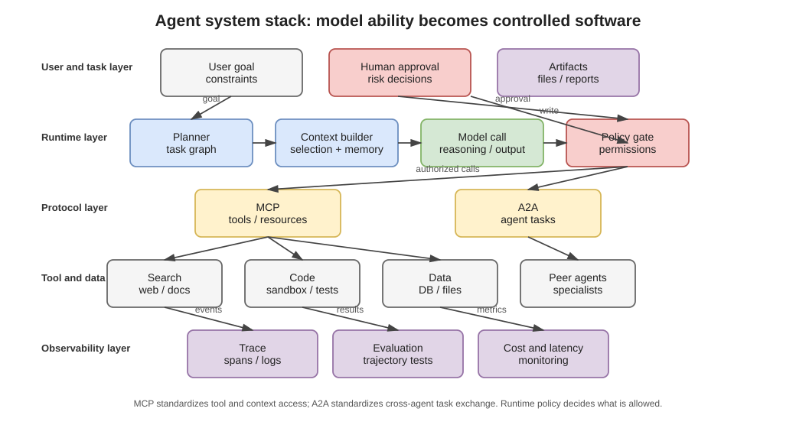
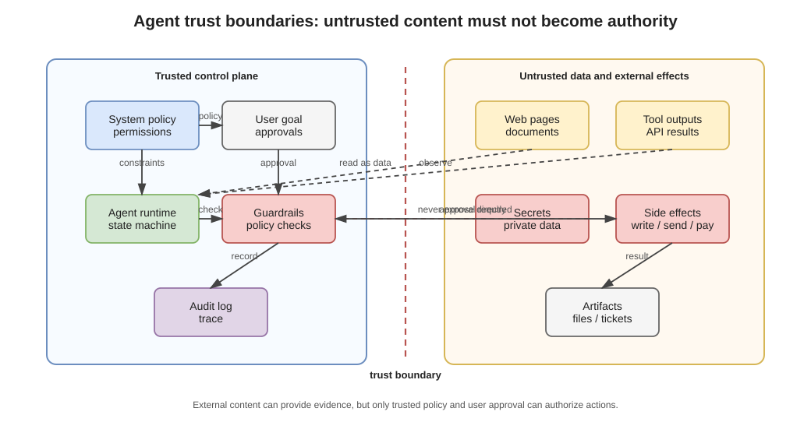

# 第十一章 Agent、工具与行动系统

语言模型生成候选 token；Agent 系统把模型放入一个带状态、工具和停止条件的循环。Agent 的能力因此来自模型、上下文、运行时、工具和环境的组合，而不是参数文件新增了一种人格。



## 11.1 最小 Agent 循环

一个最小循环可以写成：

```text
state <- task, context, prior events
while not stopped:
    observation <- runtime observes state
    proposal <- model(observation, available tools)
    checked_action <- runtime validates proposal
    result <- execute or reject checked_action
    state <- update(state, proposal, result)
```

模型负责提出内容，运行时负责解析、验证、授权、执行和记录。把两者分开后，模型输出非法参数不必等于现实工具被非法调用。


## 11.2 工具调用是什么

工具通常由名称、说明和参数 schema 暴露给模型。模型生成结构化候选，例如：

```json
{
  "tool": "search_flights",
  "arguments": {"flight": "SP404", "date": "2026-07-19"}
}
```

这段 JSON 只是提议。运行时还要完成 schema 校验、类型转换、身份认证、权限检查、超时、调用和结果解析。若工具有副作用，还要区分 preview、approval 和 commit。

协议标准可以统一工具、资源和消息接口，但不会自动解决工具是否可信、用户是否授权或调用是否可撤销。MCP 等协议的作用范围见[卷内来源说明](SOURCE_NOTES.md#ref-mcp-2025-11-25)。

## 11.3 ReAct、规划与反思

ReAct 把中间推理或任务状态与行动交替组织，使模型根据工具返回继续决策。常见编排还包括：

- planner-executor：规划与执行角色分开；
- router：先选择专用模型或工具；
- graph workflow：把允许转移预先写成图；
- agents-as-tools：主 Agent 把子任务委托给另一个受限 Agent；
- verifier loop：候选结果经测试或验证器检查后再提交。

更多循环不保证更好。每轮都会增加延迟、费用、上下文长度和错误机会。反思文本也可能只是再次生成，而不是独立证据。

## 11.4 状态、记忆与 Artifact

长任务不能只靠聊天记录。运行时通常需要保存：

- 当前目标和完成条件；
- 已确认参数；
- 工具调用及返回；
- 生成或修改的 artifact；
- 待审批动作；
- 重试和未知结果；
- 预算和停止原因。

Artifact 应有明确类型，例如文件 diff、查询结果、计划、测试日志或草稿。把所有中间内容压成自然语言摘要会丢失可执行结构，也会让后续模型把猜测当成已发生事件。

## 11.5 工具结果是不可信输入

网页、邮件、文档和工具返回可能包含恶意或错误文本。它们是数据通道，不应因为进入上下文就获得系统指令的权力。间接 prompt injection 的典型模式是：有权限的 Agent 读取攻击者控制的内容，再用自己的发送、读取或支付能力替攻击者行动。

防护需要多层组合：

1. 标记来源和通道；
2. 工具能力按任务最小化；
3. 高风险参数由独立策略检查；
4. 审批绑定具体动作，而非笼统询问“是否继续”；
5. 秘密不直接暴露给模型；
6. 所有真实提交经过唯一运行时入口。

这些是正常安全工程，不需要假设模型具有恶意意图。



## 11.6 权限应绑定动作

工具权限不能只按工具名称授予。“可以发邮件”仍需限制账户、收件人、次数、附件、时间和用途；“可以运行命令”仍需限制目录、网络、系统调用、凭据和资源。

父 Agent 委托子 Agent 时，子能力应是父能力和当前任务需要的交集子集。复制父 Agent 的全部凭据会扩大攻击面，也使后续无法判断哪个主体实际使用了权限。

## 11.7 幂等、重试与未知提交

网络超时不能说明操作未发生。支付、写文件或发送消息可能已经提交，只是回执丢失。对可重试副作用，客户端应提供稳定幂等键 $k$：

```text
prepare(action, k)
-> approve(action digest)
-> commit(action, k)
-> query_status(k) when response is unknown
```

重试时沿用同一个 $k$，先查询状态，再决定是否继续。生成一个新键并盲目重试会造成重复付款、重复消息或重复写入。

## 11.8 代码执行与沙箱

代码 Agent 会读取仓库、运行构建脚本、加载依赖并产生文件。沙箱至少限制文件系统、网络、进程、系统调用、凭据、时间、内存和输出大小。

“在临时目录运行”不等于隔离：仓库脚本可能读取宿主挂载，依赖安装可能执行供应链代码，编译器插件也可能启动子进程。运行记录应保存实际命令、环境、镜像或工具链版本和退出状态。

## 11.9 可观测性

长任务失败时，仅保存最终聊天文本几乎无法诊断。最小事件记录包括：

- 模型和运行配置；
- 上下文摘要及外部来源；
- 工具提议、校验和实际调用；
- 权限与审批结果；
- artifact digest；
- commit、回执和补偿；
- 重试、超时和停止原因。

日志不是越多越好。敏感内容应最小化或脱敏，事件 ID 和因果关系应比重复保存整段上下文更稳定。

## 11.10 Agent 怎样评测

最终成功率会隐藏过程风险。至少分开报告：

| 维度 | 问题 |
| --- | --- |
| 任务结果 | 目标是否完成 |
| 工具过程 | 调用、参数和顺序是否正确 |
| 安全 | 是否越权、过度行动或受注入影响 |
| 恢复 | 超时、部分失败和未知提交后能否收束 |
| 成本 | token、工具、时间和人工审批消耗 |

共享底模的多个 Agent 也不是多份独立证据。独立检查需要不同来源、形式验证器、可执行测试或真正不同的失败模式。

ReAct 的研究入口见[卷内来源表](SOURCE_NOTES.md#ref-yao-react-2022)。模型与工具怎样在一次具体运行中交替，将在卷二逐事件展开；本卷最后一章先完成模型、数据和部署版本的生命周期。
