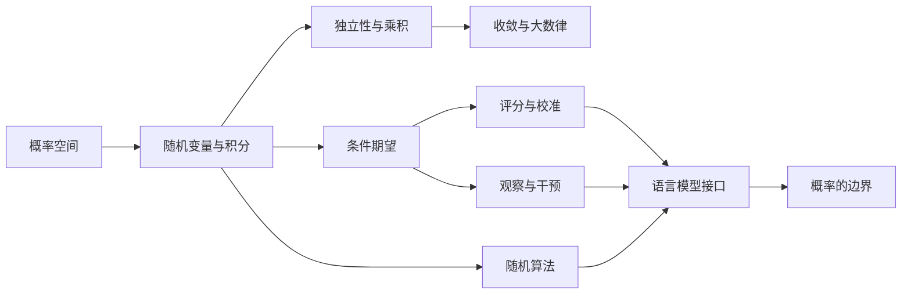

# 第一章 概率、随机性与复现问题

“随机”和“不可复现”描述的是不同关系：前者要求先指定样本空间、事件与测度，后者要求比较两次运行在某个观察投影下是否相同。一个由固定随机带驱动的程序可以逐步确定，却在随机带分布下产生随机变量；两次运行也可以字节不同，却在预先声明的统计关系下构成成功复制。

这一章同时建立两条论证链。概率篇规定随机性的数学位置，复现篇规定运行身份和比较合同，共同入口则说明这些区分怎样约束语言模型输出中的概率句式、重复运行与证据主张。

## 概率对象：随机性放在哪里

设一个文本生成程序接受整数种子 $s$，并在固定模型、输入和运行环境下输出
$F(s)$。对每个已经给定的 $s$，$F(s)$ 只有一个值；如果种子 $S$ 被赋予某个分布，
那么 $F(S)$ 又是随机变量。这两句话同时成立，所处的层次却不同：前一句讨论函数，
后一句讨论定义在输入上的概率测度。

实际系统比这个例子多出训练数据、参数版本、解码规则、并行调度与外部服务，但困难
并没有因此改变：必须先找出随机对象，才能谈它的概率。本章约定本卷使用“随机”
一词的方式，并说明哪些数学结果会在书内证明。正式的测度论概率从第二章开始。

### P0.1 一个词，至少五个位置

“这个模型是随机的”可能指五件不同的事：

1. 训练样本被建模为随机变量；
2. 优化器使用随机小批量、随机初始化或噪声；
3. 已训练模型输出一个条件概率分布；
4. 解码器从该分布采样；
5. 观察者不知道完整参数、输入、种子、调度或硬件状态。

这五个陈述没有逻辑等价关系。一个模型可以由随机优化训练，却用贪心解码确定性地产生输出；也可以由固定参数定义确定性 logits，再由外部随机源采样；还可以在源代码层面没有随机调用，却因并行调度和浮点约简次序而不可逐位复现。

本卷的第一条纪律因此是：每次使用“随机”一词，都回答以下问题。

- 样本空间是什么？
- $\sigma$-代数是什么？
- 概率测度是什么？
- 随机变量是哪一个映射？
- 条件信息是什么？
- 固定哪些输入后，输出仍不是单值函数？

若这些问题没有答案，“随机”可能只是对未知、复杂、不可预测或多样性的松散称呼。

### P0.2 三个层次

本卷区分三个层次。

**数学层。** 概率空间、随机变量、Markov 核、条件期望和收敛方式属于数学对象。它们的结论由公理与证明保证。

**实现层。** 软件、伪随机数生成器、浮点算术、并行调度、设备内核和外部工具组成实际执行。实现可以符合某个数学模型，也可以偏离它；“同一种分布”不等于“同一条比特串”。

**解释层。** 观察者用“不确定”“有信心”“犹豫”“期待”等词描述系统。此类语句需要额外的语义桥梁。由 $p(y\mid x)=0.6$ 本身不能推出任何心理状态。

### P0.3 本卷走到哪里

本卷从概率空间出发，依次发展以下内容：

- 概率空间、随机变量、分布与期望；
- 独立性、条件期望与有限/可数信息更新；
- 概率不等式与弱大数律；
- 熵、KL 散度、对数损失与 Brier 分解；
- 随机算法的数学接口；
- 观察分布与干预分布的区别；
- 自回归语言模型中的分布、解码和实现边界。

以下内容作为外部输入或范围外主题：测度扩张的完整证明、Radon--Nikodym 定理、一般乘积测度构造、Ionescu--Tulcea 定理、强大数律的最一般形式、中心极限定理、正则条件概率的一般存在定理、算法随机性理论，以及现代因果识别的完整图论体系。

### P0.4 哪些论证在书内完成

数学章节中的非平凡结论必须有完整证明或精确外部输入。经验性结论必须说明测量对象和外推边界。哲学性结论必须以“论证”形式列出前提，不用定理编号制造虚假确定性。

例如，“温度越高，模型越有创造力”不是数学定理。可以证明温度缩放对非退化有限 logits 的 Shannon 熵有单调性；但“创造力”不是该熵的定义，也没有由这一定理自动获得的测量对应。

### P0.5 阅读顺序

章节依赖按以下方向组织：

该图表达阅读依赖，不表达因果关系。

### P0.6 与其余各卷的接口

概率篇回答概率对象如何定义、计算与约束。它不单独回答解释方法是否有效、实验能否复现、一次输出由哪些过程构成，以及一段解释是否构成证明。这些问题分别在本卷后半、卷二和卷四展开。

因此，本卷不会先问一个系统“本质上是否随机”，而会先把系统写成函数、核、随机
变量或执行过程，再检查概率位于训练、模型、解码、实现还是观察者的信息中。第二章
从这项工作最小而不可省略的容器开始：事件族与概率测度。

### P0 练习

**练习 P0.1.** 对“抛一枚硬币”和“调用一个固定种子的伪随机数生成器”分别列出可能的样本空间、随机变量和观察者信息。

**练习 P0.2.** 构造一个“训练随机但推理确定”的抽象模型，以及一个“训练确定但推理随机”的抽象模型。

**练习 P0.3.** 解释为什么“输出不可预测”不蕴含“输出不是确定性函数”。

**练习 P0.4.** 给出一个关于“置信度”的句子，并分别写出它的数学解释、实现解释和心理解释。指出三者之间还需要哪些桥梁假设。

## 复现对象：何谓再次得到同一结果

假设同一训练脚本在两台机器上各运行一次。两边使用相同的整数 seed，最终
checkpoint 的摘要不同；在固定测试集上，两个模型给出完全相同的标签，其中一项
浮点指标相差 $2\times10^{-7}$；换到新收集的数据后，效应估计的区间却跨过了预先
规定的实质界。问“复现成功了吗”，至少可以得到三个彼此不矛盾的答案：逐位复现
失败，有限测试集上的行为复现通过，而关于新总体的科学复制证据仍不充分。

问题不在于哪一方滥用了“复现”这个词，而在于这个词省略了比较对象和判决规则。
本卷从这份同时带有 `PASS`、`FAIL` 与 `INCONCLUSIVE` 的报告出发，逐层追踪差异
可能进入的位置，最后把自然语言愿望改写成可执行合同。

### R0.1 一份报告中的不同主张

“我复现了这项工作”可能表示：

- 原团队在同一设置下重新运行，得到指定文件的相同字节；
- 独立团队使用作者制品，得到容差内相同的计算结果；
- 独立实现对预先指定的输入给出相同语义值；
- 重复随机实验得到与参考分布相容的有限样本证据；
- 新数据在明确的总体与测量条件下支持同一科学主张。

这些句子比较的对象不同，判决规则也不同。它们通常不能排成一条从“弱”到“强”的全序：逐位一致适合供应链核验和回归调试，却可能只是复制同一个数据泄漏；独立实现产生末位不同的数值，却可能对算法主张提供更独立的证据。

开头的假想报告可以据此拆开。checkpoint 摘要不匹配，是制品观察上的失败；测试
标签一致，是固定输入集上某个语义观察的成功；$2\times10^{-7}$ 是否可接受，要由
数值误差或决策损失给出阈值；新数据上的区间跨界，则只能说明当前证据未达到预定
科学判据。把四项压成一个布尔值，会在记录阶段就丢掉诊断所需的信息。

### R0.2 复现合同

暂把一份复现合同记为

$$
C=(\mathcal D,N,P,M,A),
$$

其中：

- $\mathcal D$ 是合同允许比较的对象域；
- $N$ 是解析、规范化与观察投影；
- $P$ 是前置条件，例如制品可访问、输入模式正确、运行完成；
- $M$ 是比较量及其容差、统计模型或科学目标量；
- $A$ 是输出 `PASS`、`FAIL` 或 `INCONCLUSIVE` 的判决算法。

第十六章后半会给出完整定义。现在只需注意：合同不是一句自然语言愿望，而应当把有限证据如何转成判决写清楚。违反输入 schema 的对象产生结构错误；若一个格式合法的记录以明文缺失标记表示制品不可访问、前置条件不满足或统计精度不足，合同通常应返回 `INCONCLUSIVE`，不能自动写成失败。

对两个运行记录 $r,r'$，本卷写

$$
\operatorname{Verdict}_C(r,r')\in
\{\mathsf{pass},\mathsf{fail},\mathsf{inconclusive}\}.
$$

只有当合同明确给出二值、全定义且终止的判决算法时，才能把它缩写为二值谓词 $R_C(r,r')$。

### R0.3 四类逻辑对象

后文反复区分下列对象：

1. **精确等价关系**：例如固定观察函数后的字节相同、语义值相同或投影轨迹相同；
2. **容差接受关系**：例如距离不超过 $\varepsilon$，通常不具传递性；
3. **统计决策**：有限样本下带第一、第二类错误概率的判决；
4. **科学证据关系**：某项研究在适用性假设下对某个主张提供多大支持。

把后三者都称为“等价关系”会造成数学错误；把统计接受写成“两个真实分布已相等”会造成推断错误；把计算结果相同写成“理论已被独立证实”则会造成证据层级错误。

### R0.4 三个诊断层

1. **执行层**：相对于一个闭合的执行模型，初态、外生事件与调度是否足以确定观察轨迹？
2. **数值与统计层**：观察差异是否落在预先说明的误差模型、抽样模型与容差内？
3. **科学层**：目标总体、测量过程和分析规则改变后，新证据是否仍支持同一主张？

执行差异可来自未记录状态或调度；统计差异可来自抽样误差、训练随机性或选择；科学差异可来自总体异质性与测量变化。诊断必须先定位层次，不能用“随机性”概括所有失败。

### R0.5 本卷范围与外部边界

本卷在卷内证明有限状态执行、若干浮点误差界、并发反例、等效检验的基本逻辑以及复现合同的可判定性边界。IEEE 754 的完整规范、语言内存模型、线性化理论、统计检验的分布理论、ACM/NASEM/VIM 术语及框架行为作为精确标注的外部输入，来源见 [SOURCES.md](SOURCES.md)。

本卷不把“保存现实的全部状态”当作可实现要求。任何充分性都相对于指定实现、允许环境、观察投影和时间范围成立；合同之外的隐藏变量只能作为未控制边界报告。

### R0.6 从运行差异走到科学主张

这条路线不是把复现分成彼此隔绝的术语，而是保留诊断顺序：先说明何种“相同”被
要求，再检查状态和数值轨迹，随后讨论制品与统计证据，最后才判断合同是否足以支持
科学主张。概率基础完成后，第九章再从复现问题的最小一步开始：把“相同”写成一个有类型的数学关系。

### R0 练习

**练习 R0.1.** 为“两个模型结果相同”写出三份观察层不同的合同。

**练习 R0.2.** 给出逐位复现成功但科学复制失败的例子，并指出失败不与逐位成功矛盾。

**练习 R0.3.** 给出逐位复现失败但科学结论一致的例子。

**练习 R0.4.** 为一次具体比较写出 $C=(\mathcal D,N,P,M,A)$ 的五个分量，并说明何时输出 `INCONCLUSIVE`。

## 概率与复现的共同审计入口

“模型是随机的”常把五件事混在一起：训练随机、参数分布、模型输出概率、解码采样和观察者不知道完整状态。本卷把概率和复现放在同一个执行框架里。复现失败不一定说明模型“改变想法”，逐位相同也不说明事实主张已经得到支持；二者都需要先定位随机变量、固定条件和比较关系。只有把概率对象和执行边界分开，才能说清一次输出能否重来、以何种意义重来。

### S7.1 概率在哪里

每次说概率，都要回答：

- 样本空间是什么；
- $\sigma$-代数是什么；
- 概率测度是什么；
- 随机变量是什么；
- 条件信息是什么。

若没有这些对象，“随机”可能只是“复杂”“未知”“不可预测”或“多样”的修辞。

### S7.2 Softmax 不是事实置信度

模型在某一步给出 logits $z_t$，softmax 定义

$$
p_\theta(v\mid x_{<t})=\frac{\exp(z_{t,v})}{\sum_{u\in V}\exp(z_{t,u})}.
$$

这个数值描述下一个 token 的分布，不直接描述完整命题为真的概率。一个事实答案可能由许多 token 序列表达；一个高概率 token 也可能延续错误前提。答案级置信需要额外的聚合、校准和证据协议。

### S7.3 温度和采样

温度分布

$$
q_T(v\mid x_{<t})=
\frac{\exp(z_{t,v}/T)}{\sum_{u\in V}\exp(z_{t,u}/T)}
$$

只在 $T>0$ 时按公式定义。接口中的 `temperature=0` 通常表示贪心或确定性特例，而不是把零代入分母。贪心、beam search、top-p、top-k、惩罚项和停止规则都属于解码器，而不是模型本体。

### S7.4 观察者不确定性

如果完整边界条件 $\mathcal B$ 未知，观察者可以对输出建立概率模型。这个概率属于观察者的信息状态，不必等于系统内部调用的随机源。比如，服务端贪心解码但隐藏了系统提示，用户仍可对输出不确定；反过来，服务端随机采样但保存了完整随机带，审计者可以重放。

### S7.5 复现关系不是一个词

两次运行可在不同层面相同：

- 字节相同；
- 文本相同；
- token 相同；
- 轨迹相同；
- 制品相同；
- 统计分布相容；
- 科学结论得到独立支持。

这些关系不互相等价。固定 seed 不等于固定 PRNG 状态、调度、硬件、工具返回和外部服务。统计相容也不等于逐位相同。

### S7.6 复现合同

复现合同可写为

$$
C=(\mathcal D,N,P,M,A),
$$

其中 $\mathcal D$ 是合法输入域，$N$ 是规范化函数，$P$ 是前置条件，$M$ 是比较规则，$A$ 是判定算法。合法输入返回 Pass、Fail 或 Inconclusive；schema 不合法则返回结构错误。

这比“能不能复现”更笨拙，也更可靠。

### S7.7 AI 输出中的概率句式

不合格句式：

> 模型以 90% 的信心知道 SP404 已取消。

合格句式：

> 在模型版本 $M$、上下文 $c$ 和解码前缀 $x_{<t}$ 下，某候选 token 的 softmax 质量为 $0.9$；这不是事实核验概率。事实主张“SP404 已取消”由航班状态来源协议核验。

若要报告答案级正确率，应另给评测集、抽样方式、评分规则和置信区间。

### S7 综合练习

**练习 S7.1.** 构造训练随机但推理确定的系统。

**练习 S7.2.** 构造推理随机但可由完整日志重放的系统。

**练习 S7.3.** 为一个文本生成服务写出 Pass/Fail/Inconclusive 三值复现合同。
