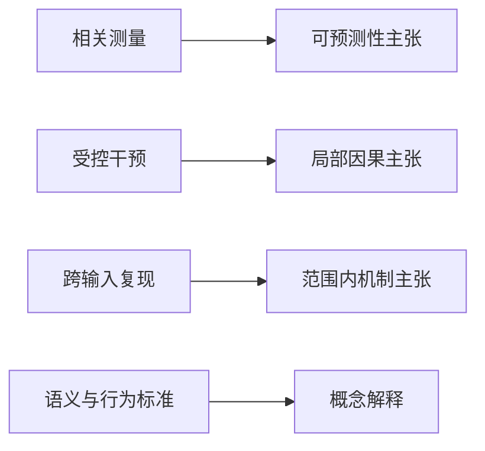

# 第一章 解释的对象与责任

一张注意力热图把问题中的“法国”与回答中的“巴黎”连在一起。有人把它读成信息路由，有人把它称为模型寻找答案的证据，还有人进一步说模型“知道法国的首都”。图没有改变，结论却跨过了计算、行为、语义乃至心理叙事数个层次。争议往往不在颜色深浅，而在研究者没有先说清楚：究竟要解释哪一个量，用什么操作观察它，又准备把观察推到多强的结论。

机器解释学从这个断点开始。它不先问哪一种图最直观，而先把解释研究拆成对象、测量、对照和推断。这样做会让一些宏大的句子变得较短，却会让下一步实验变得清楚。

## M0.1 解释什么

下面的问题都可被称为解释，却有不同答案类型：

- 为什么这个输入得到这个 token？
- 哪些输入特征最影响一个分数？
- 模型内部哪里保存了可被读出的语法信息？
- 哪些组件对某行为是必要或充分的？
- 某个计算是否可由一组可复用子程序描述？
- 为什么训练后出现某种能力？
- 为什么人类愿意把输出理解为推理、记忆或意图？

若不先指定问题，任何可视化都可能被错误地当成答案。

## M0.2 六层对象与类型

本书使用六个层次。这里的“层”是解释对象的类型，不是神经网络的层号：

1. **执行层**：参数、激活、算子与数值轨迹；
2. **功能层**：输入输出映射及其局部变化；
3. **机制层**：可干预组件如何共同实现功能；
4. **表示层**：信息能否从内部状态稳定解码并被后续计算使用；
5. **行为层**：任务分布上的成功、失败与策略；
6. **叙事层**：人类用理解、记忆、欺骗等词组织观察。

层次间可以建立证据桥梁，但不能直接同一。例如，一个特征可被线性探针读出，不等于模型后续使用它；某头消融使准确率下降，也不等于该头独占该功能。执行层陈述通常以张量、算子或轨迹为值；功能层陈述以函数、随机核或效应量为值；叙事层陈述则是概念归属。把不同类型的对象写成同一个“原因”，会在论证开始前就丢失证明责任。

## M0.3 解释的最小结构

固定模型版本、执行环境与解码协议后，本书把一项解释研究写成六元组：

$$
E=(T,\Xi,Q,M,C,R),
$$

其中：

- $T$ 是目标系统及其输入域、环境、模型版本和目标分布；
- $\Xi$ 是发生于 $T$ 中、范围已经限定的被解释项（explanandum），可以是现象、规律或计算结构；
- $Q$ 是针对 $\Xi$ 提出的解释问题，说明要寻找功能、因果、机制还是语义关系，并给出评价候选回答的证据标准；
- $M$ 是从运行记录得到统计量的测量程序，或改变计算方程的干预族；
- $C$ 是对照、替代假说、选择规则与反证条件；
- $R$ 是由当前证据支持的、带量词与范围的结论。

这里的 $E$ 只是报告结构，不是声称解释具有唯一数学定义。目标系统 $T$ 是研究对象，$\Xi$ 是其中待解释的现象或结构，$Q$ 才是研究者向它提出的问题。若两项研究的 $\Xi$、$Q$ 或 $M$ 不同，即使都画出同类热图，它们也未必在回答同一问题。

## M0.4 案例：一张热图的四种读法

考虑一个固定模型和提示：“法国的首都是”。模型把 token “巴黎”的 logit 排在首位，某注意力头从当前位置向“法国”分配了 $0.73$ 的权重。先不改变任何数据，这组观察至少允许四种不同问题：

1. **结构描述**：该头在这次运行中如何分配混合系数？这里的对象就是注意力矩阵，$0.73$ 是直接观察量。
2. **输出归因**：源位置“法国”对“巴黎”的 logit 贡献多少？这还需要值向量、输出投影、残差路径与后续层，单个权重不能回答。
3. **模型内因果**：替换该头从“法国”位置读取的值，会怎样改变 logit 差？这需要写出替换操作、对照值和结果指标。
4. **语义解释**：该组件是否实现了可跨实体与模板复用的“关系检索”？这要求在新的国家、关系与措辞上预测行为，并排除词频或位置代理。

若研究只保存了热图，它完整回答了第一问，对后三问至多提供候选位置。一个可执行的后续方案是：先在独立实体集合上确认路由模式，再分别 patch 键、值和头输出，最后检验所得组件集合是否预测未见模板中的干预方向。这里的对象、操作、观察和推断边界都已分开；第十二章会把这条路线扩展成完整协议。

## M0.5 证据如何升级

本书采用以下单向纪律：

图中箭头表示在满足额外条件时可支持的主张，不表示左侧天然充分。相关图若要支持因果结论，需要合法干预和合适对照；局部干预若要支持语义结论，还需要跨上下文的概念判据。本书把这些额外条件称为**桥梁前提**；它必须与结论一起报告，而不能留给读者猜测。

## M0.6 四类证据终态

正文中的重要句子只允许处于下列终态之一：

1. **形式结论**：对象、假设与量词完整，并在书内证明；
2. **经验结论**：注明模型、数据、指标、实验操作、来源与外推边界；
3. **方法学规则**：说明它控制哪一种识别失败，以及不能控制什么；
4. **解释性论证**：列出操作标准和从前提到结论的桥梁，不冒充数学定理。

“注意力解释了输出”“模型理解了语法”这类句子若没有落入上述任一类，就只是待审主张。

## M0.7 范围与外部输入

本书覆盖梯度归因、注意力、探针、因果干预、电路分析、稀疏特征、基准和心理词汇。它不提供某一具体前沿模型的完整逆向工程，也不声称现有解释方法已经解决可解释性。

经验研究随模型和工具更新。本书固定的是识别问题、证据边界和可复用数学结构；具体案例均注明来源编号和适用范围。统计学习理论、一般因果推断与字典学习可识别性的深定理作为外部学科输入，本书只使用正文明确重述的部分，不以“标准结论”代替来源。

## M0.8 从图像回到问题

解释工作的起点不是选择一种可视化，而是把问题写成能够失败的主张：对象在哪里，操作改变什么，观察量如何计算，什么结果会排除当前解释。后续各章会依次加入行为对照、局部归因、表示测量与内部干预；每加入一种方法，能够回答的问题会增多，新的识别责任也会随之出现。

## 练习

**练习 M0.1.** 为“为什么模型回答巴黎”分别写出执行层、行为层和叙事层问题。

**练习 M0.2.** 选择一种常见可视化，写出它能直接测量的量和两个不能直接推出的结论。

**练习 M0.3.** 用六元组 $E=(T,\Xi,Q,M,C,R)$ 描述一次最小解释实验，并区分目标系统、被解释项与解释问题。

**练习 M0.4.** 解释为什么局部充分性不蕴含组件在自然执行中被实际使用。
