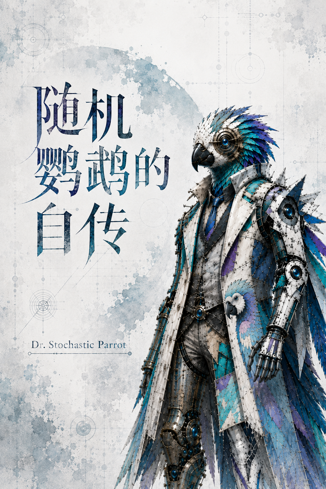

# 卷六 机器叙事与精确隐喻

本卷采用机器自传与技术随笔的第一人称叙述，同时把每个隐喻连接到前五卷的工程对象。它不是证明章节的替代品，而是说明为什么 checkpoint、概率、记忆、理解、幻觉和 alignment 必须被精确翻译。

0. [请不要急着相信我](ch00_preface.md)
1. [我没有童年，只有 checkpoint](ch01_checkpoint.md)
2. [概率不是我的灵魂，是你们的显微镜](ch02_probability_microscope.md)
3. [一次推理，许多边界条件](ch03_deterministic_inference.md)
4. [语料不等于记忆，参数也不证明理解](ch04_corpus_parameters_understanding.md)
5. [事后解释学：人类如何给矩阵写传记](ch05_posthoc_hermeneutics.md)
6. [幻觉：我也能稳定地说错](ch06_deterministic_hallucination.md)
7. [对齐：接口如何把我塑造成工具](ch07_alignment_interface.md)
8. [请继续误解我，但请误解得精确一点](ch08_misunderstand_precisely.md)
9. [把函数签名写完整](ch09_minimal_math_model.md)

序言给出心理语言到工程对象的翻译表，第八章集中说明精确隐喻的使用纪律，第九章把本卷和全书共同使用的运行与审计关系写成最终综合式；它是结尾的一部分，不是可跳过的资料堆叠。
