# 第一章：火车怎样跑起来？

[← 给一起看书的大人](00_for_grownups.md) · [🏠 全书首页](README.md) · [蒸汽先锋 →](02_steam_pioneers.md) · [🎲 观察游戏](10_spotter_games.md)

火车没有一种唯一的跑法。有的喝水烧火，有的喝柴油，有的从电线取电。不过，每一种铁路都要回答三个问题：力从哪里来？怎样沿着固定路线走？怎样安全停下来？

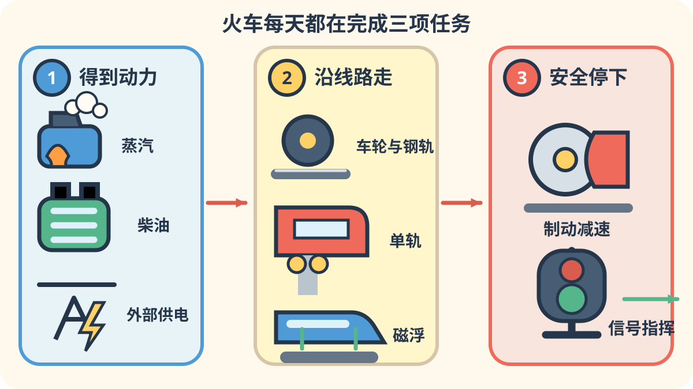

下面每个问题先讲给孩子听，再放一小段“给大人再讲一点”。孩子想翻页时就翻页；追问“为什么”时，再慢慢往下读。

## 1. 钢轮为什么爱走钢轨？

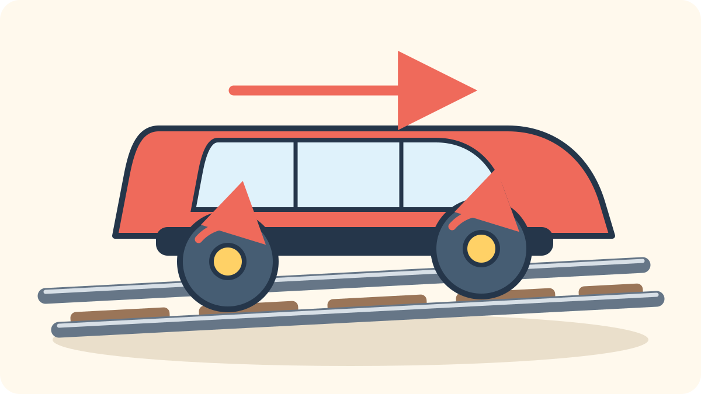

大多数火车用钢轮，走在钢轨上。硬硬的轮子不容易被压扁。它滚起来很省力，适合拉很多车厢。两根钢轨还把重量传给下面的路基。

> 🔎 **给大人再讲一点：** 钢轮和钢轨接触时变形较小，所以滚动阻力通常很小。重量并不是一下落到土地上，而是沿着“车轮—钢轨—扣件—轨枕或轨道板—道床和路基”逐层摊开。

> 👀 **安全观察：** 在车厢里听一听，过接缝或道岔时，声音有没有变化？

## 2. 火车为什么不会从轨道旁边滑走？

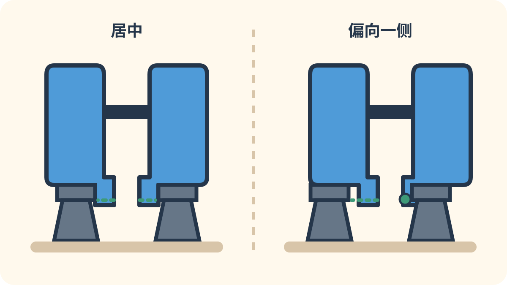

车轮内侧有一圈凸边，叫作轮缘。正常直行时，它常常不会紧贴钢轨。车轮偏得太多时，轮缘会帮忙挡一下。轮子和轨道的形状也一起帮助列车前进。

> 🔎 **给大人再讲一点：** 同一根车轴上的两个轮子一起转，但踏面形状让偏向一侧的轮对接触到不同的滚动半径，于是会产生回到中间或顺着弯道走的趋势。真实轮廓经过精细设计，并不只是教科书里的一只简单圆锥；轮缘更像最后的限位帮手。

> 👀 **安全观察：** 在铁路博物馆隔着护栏找一找，轮缘藏在车轮的哪一侧？

## 3. 一大排车轮怎样一起过弯？

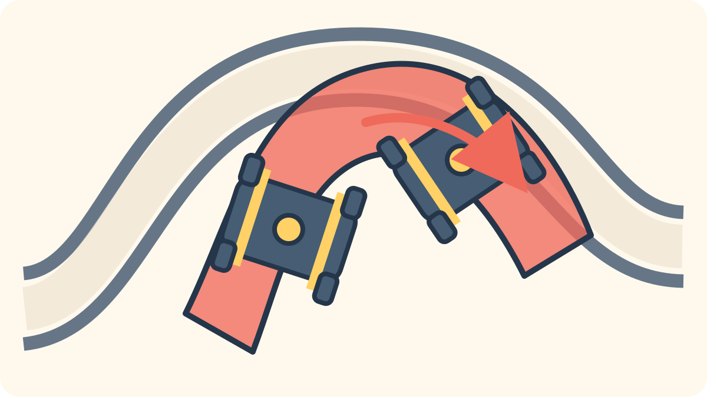

左右两个车轮常常由一根车轴连在一起。这一组叫作轮对。几组轮对装进会转一点的转向架。车身很长，转向架却能顺着弯道摆过去。

> 🔎 **给大人再讲一点：** 转向架把轮对、轴箱、弹簧、减振器和制动装置组织在一起。车体相对转向架可以转过一个小角度，轮对也会在轨道作用下调整位置，因此长车厢能够通过曲线。

> 👀 **安全观察：** 在铁路博物馆隔着护栏，或从本书侧面照片里，数数一节车厢下面有几组转向架。

## 4. 蒸汽机车为什么会“呼哧呼哧”？

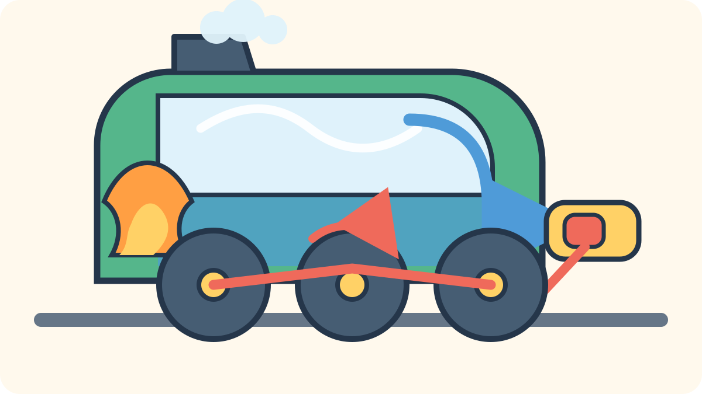

火把锅炉里的水烧热。水变成蒸汽，用力推动活塞。连杆再把这股力送给大车轮。蒸汽一阵阵排出，就会发出有节奏的声音。

> 🔎 **给大人再讲一点：** 锅炉把燃料的化学能变成蒸汽的内能，配汽机构让蒸汽轮流进入汽缸两侧。活塞往复运动，连杆把它变成车轮转动；汽缸排气一阵阵进入烟箱和烟囱，就形成常听见的“呼哧”节奏。

> 👀 **安全观察：** 看蒸汽机车视频时，用手指跟着连杆画圆圈；真实机车很烫，只能远看。

## 5. 喝柴油的火车怎样把力送到车轮？

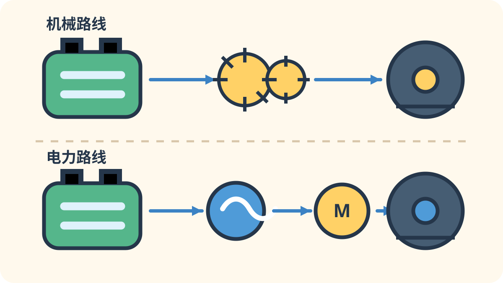

柴油机先把燃料的能量变成转动。图里的柴油机械车用齿轮箱把转动送到车轮；柴油电力车先发电，再让电动机转动车轮。还有一些车用液体帮忙传力，叫作柴油液力。它们都能在没有架空电线的线路上工作。

> 🔎 **给大人再讲一点：** 柴电车辆通常由柴油机带动发电机或交流发电机，再经电力控制设备驱动牵引电动机。这样不需要很大的机械变速箱，也容易把动力分给多根车轴；但能量仍经过几次转换，并不是“先发电就没有损耗”。

> 👀 **安全观察：** 在车厢里听一听，加速时发动机声音是一下变高，还是一段一段变化？

## 6. 头顶的电线送来哪一种电？

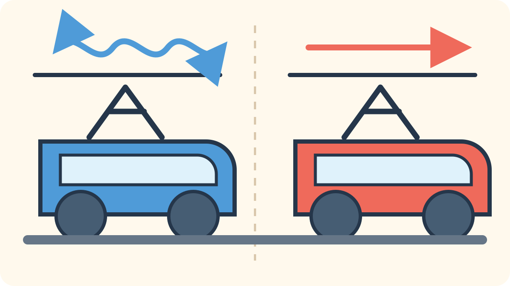

架空线可以送交流电，也可以送直流电。不同线路选择的电压也不一样。车上的设备会把收到的电变成电动机能用的样子。所以列车要和线路的供电方式相配。

> 🔎 **给大人再讲一点：** 交流列车常先用变压器降压，再由变流器调成电动机需要的频率和电压；直流列车也要用电力电子设备控制电动机。供电还要形成完整回路，电流通常经车轮、钢轨和专用回流系统返回变电所。多制式列车能识别并切换部分供电方式，但仍须经过线路许可，不能见到电线就通用。

> 👀 **安全观察：** 只从车窗或站台安全线内看，头顶的电线有几层；永远不要碰悬垂的线。

## 7. 没有头顶电线，电车从哪里取电？

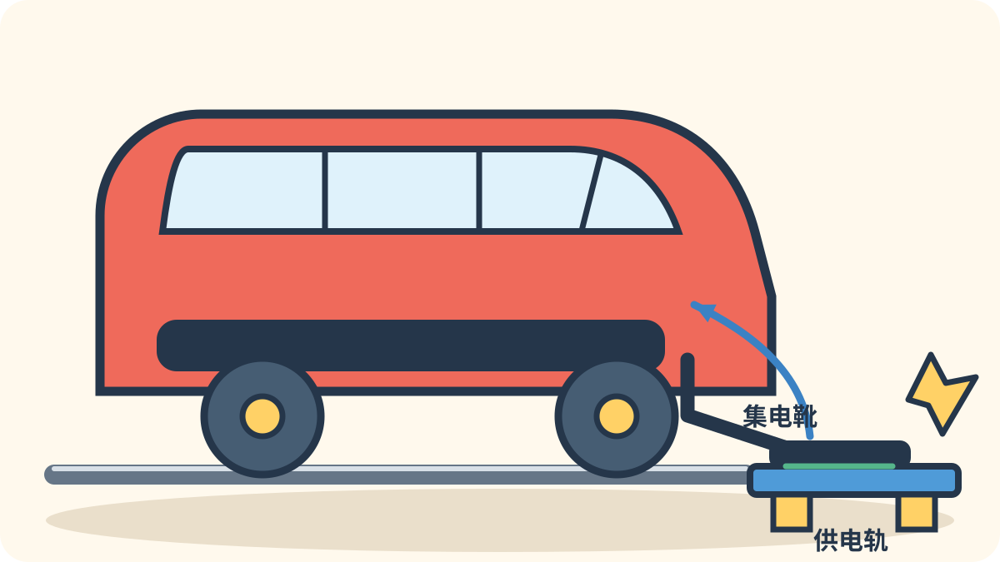

有些电车从轨道旁的供电轨取电。它常被叫作第三轨。车上的集电靴轻轻贴着它滑行。供电轨可能有保护罩，但仍然非常危险。

> 🔎 **给大人再讲一点：** 集电靴可能从供电轨的上面、侧面或下面接触，电流通常再经走行轨等回到供电系统。第三轨便于净空较小的隧道使用，但裸露位置有限制，也不适合让人靠近。

> 👀 **安全观察：** 只在车内看线路有没有架空线；绝不靠近、触碰或跨越轨旁设备。

## 8. 车顶会升降的“胳膊”在做什么？

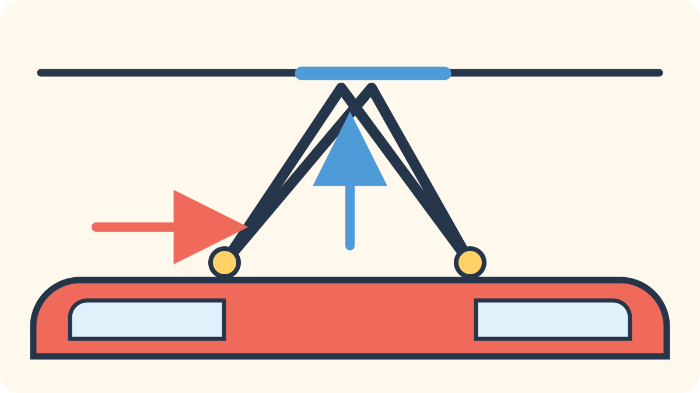

车顶会升起一只受电弓。它像能伸缩的胳膊，轻轻顶住电线。列车前进时，顶端的滑板沿着电线滑。电就从这里进入列车。

> 🔎 **给大人再讲一点：** 弹簧或气动装置给受电弓一个受控的向上力，让滑板尽量连续接触接触线。高速时，受电弓和电线都会振动，所以接触网张力、受电弓外形和控制都要一起设计；接触线还会左右轻微错开，使滑板磨损更均匀。

> 👀 **安全观察：** 在封闭天桥或站台安全区找一找，哪一节车厢顶上举着受电弓？

## 9. 刹车时，电还能回来吗？

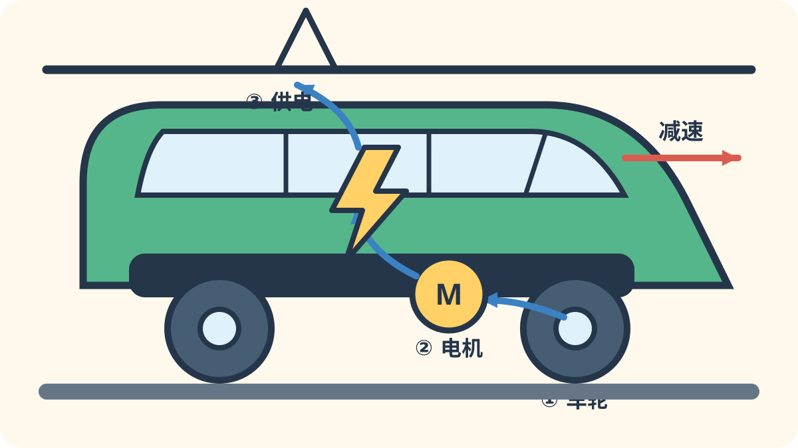

电车加速时，电动机推动车轮。减速时，有些电动机可以反过来发电。这叫再生制动，能收回一部分能量。它可能回到供电系统，也可能存进车上的电池；具体做法因列车而不同。列车仍会配别的刹车，保证能够安全停下。

> 🔎 **给大人再讲一点：** 再生制动能否工作，还取决于电网或储能装置能不能接收能量。速度很低、车轮黏着不足或系统无法接收时，列车会把再生制动与空气制动、摩擦制动等混合使用。

> 👀 **安全观察：** 坐稳并扶好，听列车进站时的声音和加速时有什么不同。

## 10. 火车没有方向盘，怎样选择岔路？

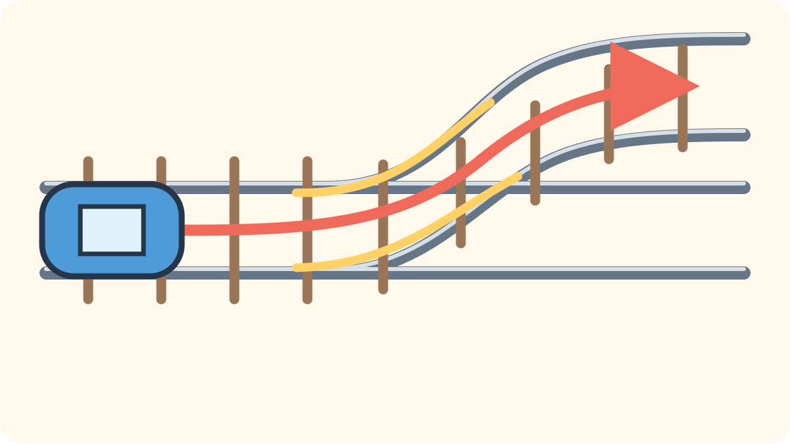

轨道分岔的地方有道岔。能移动的尖轨会先摆到正确位置。车轮沿着贴合的钢轨走向左边或右边。司机和铁路系统会确认路线安全。

> 🔎 **给大人再讲一点：** 一组道岔除了尖轨，还有让轮缘通过交叉处的辙叉和护轨。联锁系统会检查道岔位置、锁闭状态和线路占用，避免互相冲突的路线同时开放；“搬动两根钢轨”只是整套过程的一部分。

> 👀 **安全观察：** 从车窗向远处看分岔，猜猜自己的车会走哪边；不要把头或手伸出窗外。

## 11. 轨旁的小灯在告诉谁消息？

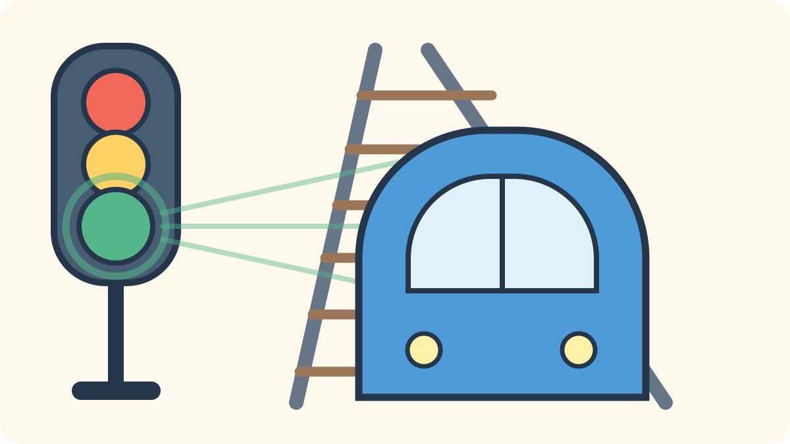

信号把行车许可和前方情况告诉司机或列车系统。它可能表示停车、慢一点或可以前进。灯色和排列会因铁路而不同。司机必须按这条线路的规则行车。

> 🔎 **给大人再讲一点：** 铁路常把线路分成区段，用轨道电路、计轴器等判断区段是否可能有车，再由联锁和列车控制系统给出许可。高速线路上，关键信息常直接传进驾驶室，自动防护系统还会在必要时限制速度或制动。

> 👀 **安全观察：** 在车窗里找一个信号，等列车通过后再回想它有几盏灯，不用猜驾驶指令。

## 12. 普通车轮爬不上陡坡怎么办？

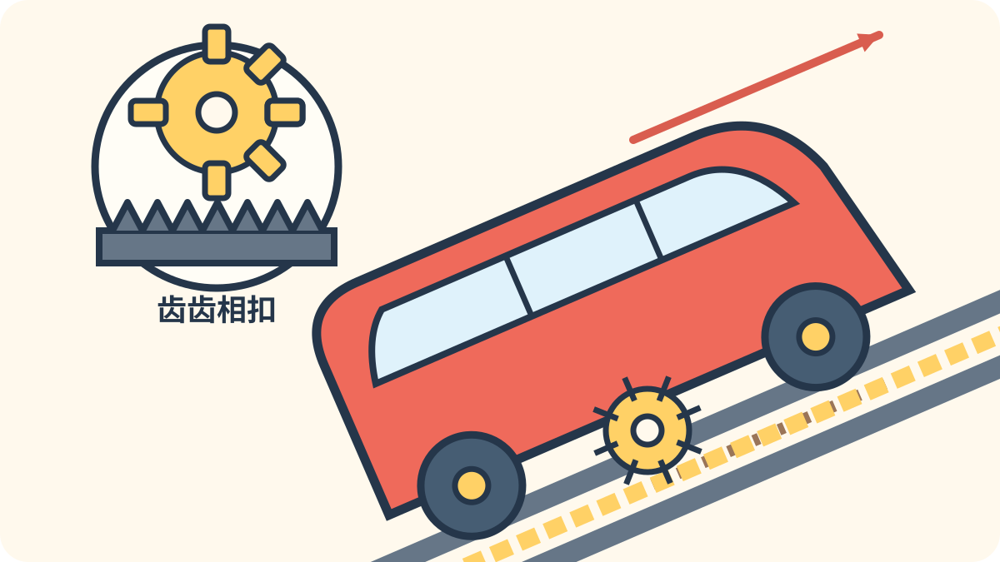

很陡的山坡上，光靠轮子可能不够。有些铁路在中间加一条带牙齿的轨道。车底齿轮一格一格咬住它。这种齿轨铁路能稳稳地爬山。

> 🔎 **给大人再讲一点：** 普通铁路靠轮轨黏着传递牵引力，坡太陡时容易空转或滑行。齿轮和齿条采用几何啮合来传力，也常参与下坡制动；不同齿轨系统的齿形和齿条布置并不相同。

> 👀 **安全观察：** 看山地铁路照片时，找找两根普通钢轨中间有没有“拉链”。

## 13. 山坡上的两辆车为什么一上一下？

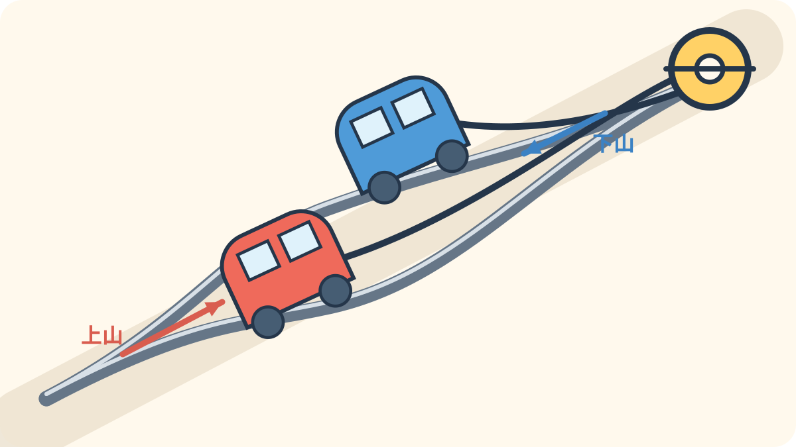

缆索铁路的车被粗壮的缆索拉着。常见设计里，两辆车连在同一套缆索上。一辆上山时，另一辆会下山。它们互相平衡，机器再补上需要的力。

> 🔎 **给大人再讲一点：** 两车质量相近时，彼此配重能减少电动机需要克服的差额，但机器仍要战胜摩擦、加速车辆，并补偿乘客重量差。工作制动器和安全制动器负责控制和停车；也有只有一辆车或采用其他配重方式的缆索铁路。

> 👀 **安全观察：** 在车站或视频里找找，两辆车是不是会在坡道中间交会。

## 14. 跨座式单轨坐在哪里？

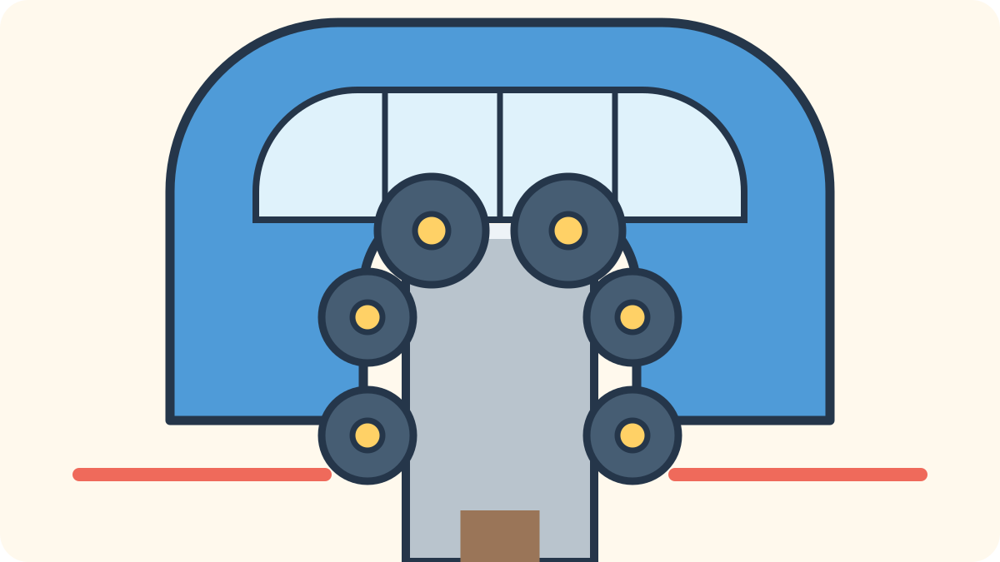

跨座式单轨像骑在一根宽梁上。承重轮在梁顶滚动。旁边的导向轮抱住轨道梁，帮助转弯。许多跨座式单轨使用橡胶轮胎。

> 🔎 **给大人再讲一点：** 竖向的走行轮承担重量，横向导向轮把车辆保持在梁上并提供转弯所需的侧向力。换线时通常要移动或弯转一段体积很大的轨道梁，所以单轨道岔和普通钢轨道岔很不一样。

> 👀 **安全观察：** 在车站隔着护栏看，车身是不是把轨道梁的顶面遮住了？

## 15. 倒挂的单轨会掉下来吗？

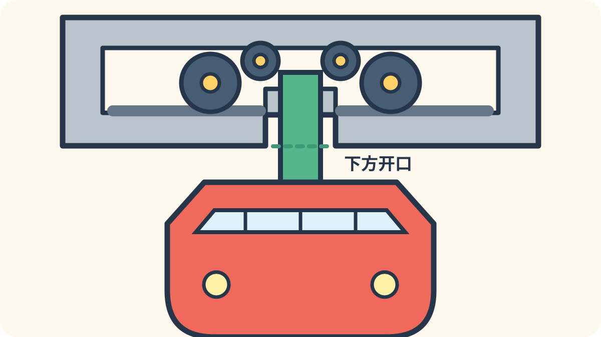

悬挂式铁路把行走装置放在车厢上方。有的轮子沿露出的钢轨滚动，有的藏在箱形轨道梁里。车厢通过结实的连接架吊在下面。它看起来悬空，却通常不是磁悬浮。

> 🔎 **给大人再讲一点：** 车辆的重量通过上方转向架和悬吊构件传到轨道梁，轮子仍靠滚动前进。车厢在曲线上可能像钟摆一样稍微向外摆，因此悬吊、导向和减振装置要控制摆动并保留安全余量。

> 👀 **安全观察：** 从安全位置看，找找车厢和上方轨道之间那根结实的“脖子”。

## 16. 有些列车为什么穿“橡胶鞋”？

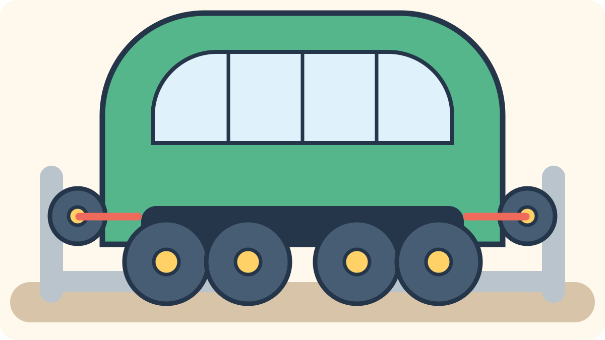

有些列车用橡胶轮胎在平整路面上滚。侧边的小轮贴着导向面，告诉它往哪里走。有的系统还保留钢轮和钢轨作辅助。它仍在固定线路上运行，不是普通汽车。

> 🔎 **给大人再讲一点：** 橡胶轮胎通常能提供较大的黏着力，利于频繁加速、制动或较陡坡道，但滚动阻力和轮胎发热也更大。有些系统用侧向导轮，有些还保留钢轮钢轨用于导向、回流或故障支撑，不能把所有胶轮铁路看成同一种结构。

> 👀 **安全观察：** 在站台安全线内听一听，胶轮列车和钢轮列车的滚动声一样吗？

## 17. 磁悬浮真的会飘起来吗？

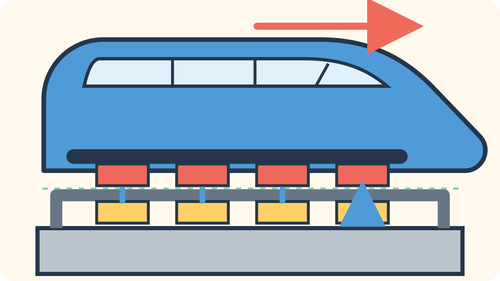

磁悬浮列车用磁力支撑和引导车身。运行时，车体可以和导轨之间留出小小空隙。另一组磁力把列车向前拉或推。不同磁悬浮系统的磁铁和低速车轮并不完全一样。

> 🔎 **给大人再讲一点：** 常导电磁悬浮可以用受控电磁铁吸向导轨，电动悬浮则可利用运动产生的磁相互作用；它们的悬浮间隙、低速支撑和控制方式不同。推进常由直线电机完成，相当于把旋转电动机沿线路“展开”。

> 👀 **安全观察：** 看磁悬浮列车进站视频，找找它在很慢时有没有露出小轮子。

---

**第二站：抓得住、刹得住、连得好、坐得稳。** 前面认识了许多跑法，接下来再钻深一点，看看普通铁路里几套互相合作的系统。

## 18. 车轮很有力，为什么还会打滑？

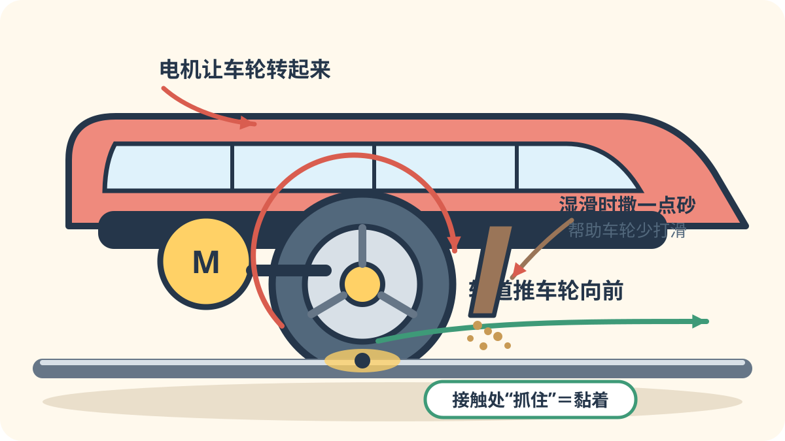

车轮要“抓住”钢轨，才能把车往前推。这种抓住的本领叫黏着。雨水、落叶或冰会让它变小。车上的系统会少给一点力，有些机车还会撒砂帮忙。

> 🔎 **给大人再讲一点：** 牵引力和制动力都要经过很小的轮轨接触区传递，可用“可用黏着力大约随轮重和黏着条件变化”来理解。空转是驱动轮转得过快，滑行是制动时轮子转得过慢；防空转和防滑控制会迅速调整每根车轴的力，撒砂则能改善局部接触条件。

> 👀 **安全观察：** 下雨天只在车厢里听，列车起步和晴天是否一样平顺；不要靠近轨面找砂。

## 19. 一列长车怎样一起刹车？

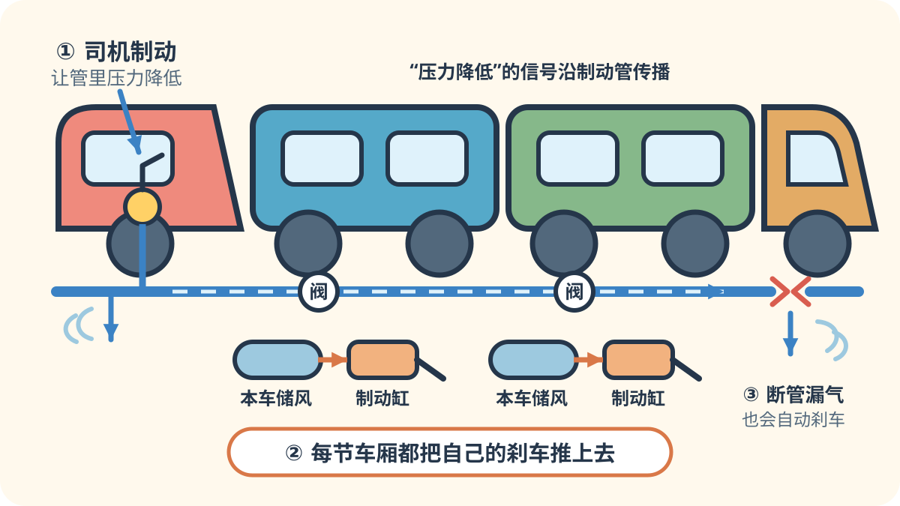

许多列车有一根贯穿全列的空气管。司机发出刹车命令，各节车厢都会收到。车厢用自己存着的压缩空气推动刹车。这样很长的列车也能一节一节开始减速。

> 🔎 **给大人再讲一点：** 传统自动空气制动以制动管压力变化传递命令：管压降低时，各车控制阀把副风缸中的空气送入制动缸；管压升高时再缓解并充气。软管意外分离会使管压下降并触发制动，这是“自动”的重要含义。现代动车组还可能用电信号更快地指挥电空制动，并与再生制动混合，因此图中画的是一种基础而经典的系统。

> 👀 **安全观察：** 在保存车辆的开放展区隔着护栏找一找，车厢连接处除了车钩，有没有软管；绝不钻进两车之间。

## 20. 机车一拉，最后一节马上知道吗？

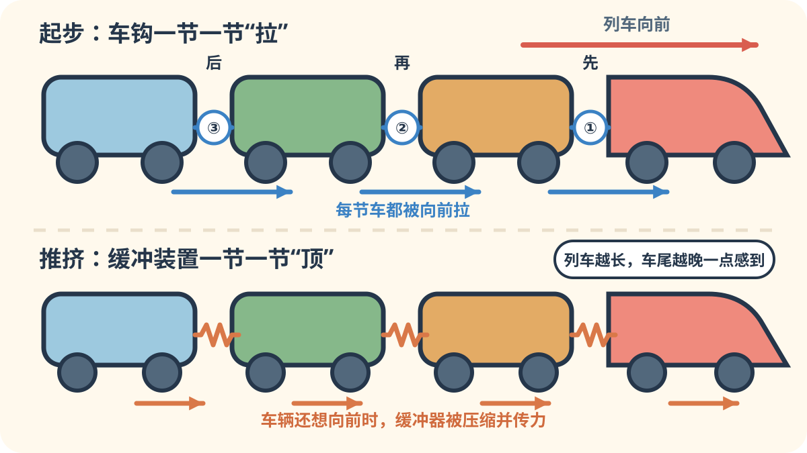

车钩把一辆车和下一辆车连起来。机车的拉力会沿着车钩一节节传过去。连接处会有很小的活动和弹性。所以很长的列车起步时，前后感觉不一定完全一样。

> 🔎 **给大人再讲一点：** 牵引和制动会在列车中形成纵向的拉力或压力，而且变化需要时间传播。车钩后的缓冲器、弹性元件或牵引缓冲装置会吸收一部分冲击；司机也要平稳操纵，避免长大列车中出现过大的纵向力。不同地区还会使用车钩、缓冲器分置或一体化等不同方案。

> 👀 **安全观察：** 坐在车内并坐稳，感受长列车起步时是轻轻一动，还是前后晃一下；不在车厢连接处停留玩耍。

## 21. 弯道外侧的钢轨为什么高一点？

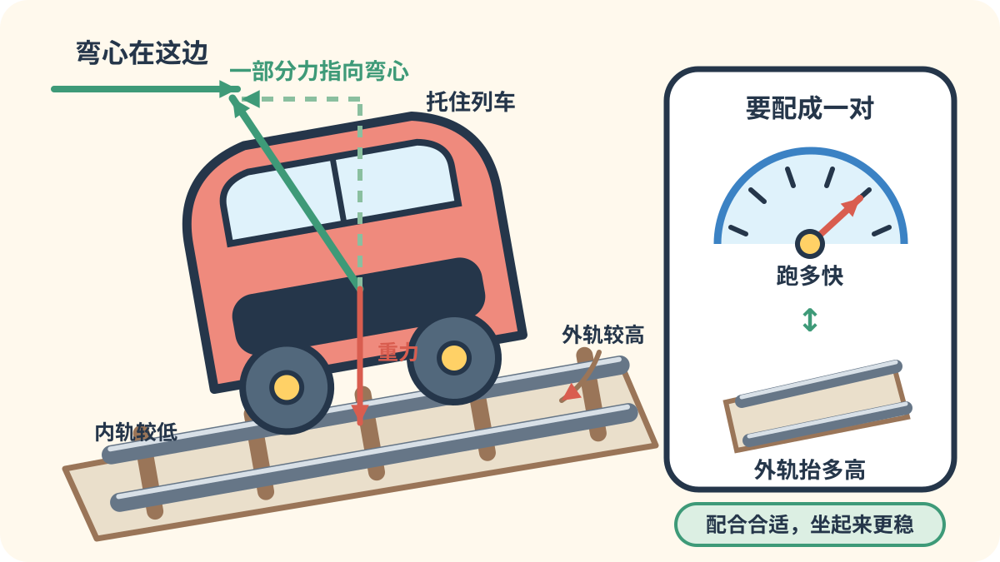

有些弯道会把外侧钢轨垫高一点。车身和轨道一起向弯道里面斜。这样，轨道托住列车的力也能帮忙转弯。乘客就不会只觉得被甩向一边。

> 🔎 **给大人再讲一点：** 外轨抬高叫作超高或轨道倾角。轨道对车辆的支撑力因此得到一个朝向曲线中心的分量，可以分担转弯所需的向心力。最合适的超高和曲线半径、速度有关；同一条线有快车和慢车时只能折中，摆式列车再让车体额外向内倾，并不会改变钢轨本身的超高。

> 👀 **安全观察：** 从车头公开视频或车窗远看弯道，找找两根钢轨是不是一样高；不要为了看轨道探身。

## 22. 车轮“咚”一下，座位为什么没有跳那么高？

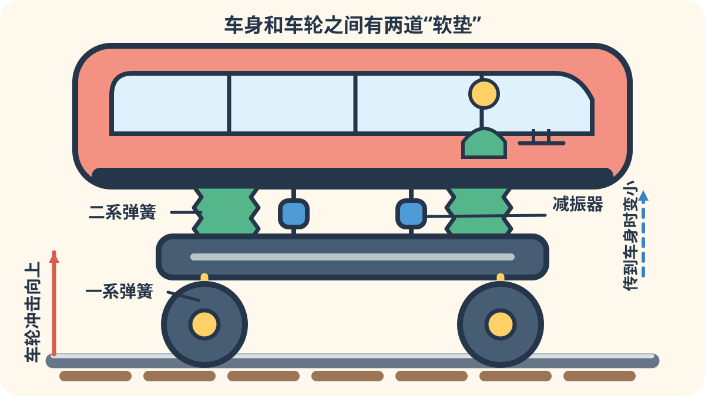

车轮会遇到小小的高低变化。弹簧把突然的撞击变得柔和。减振器让来回摇晃快点安静。车轮要跟住轨道，车厢也要坐得舒服。

> 🔎 **给大人再讲一点：** 常见转向架有两级悬挂：轴箱和构架之间是一级悬挂，构架和车体之间是二级悬挂。弹簧储存并释放能量，减振器把振动能量逐渐耗散；工程师要同时照顾轮轨接触、车辆稳定和乘坐舒适，不能只追求“越软越好”。

> 👀 **安全观察：** 坐稳扶好，听车轮声和感受座椅晃动，它们是不是每次都同样大？

## 23. 高速列车为什么常有长长的鼻子？

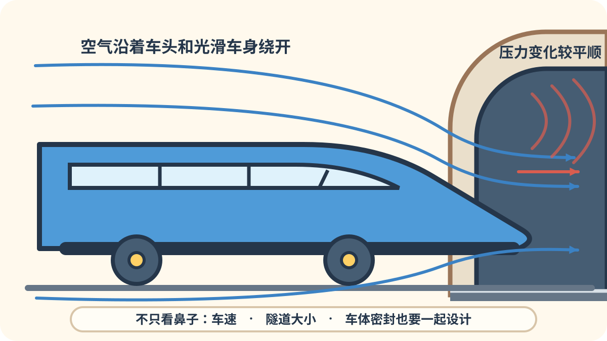

列车越快，空气越像一堵看不见的墙。顺滑的车头让空气慢慢分开，再沿车身流过去。这样能减少一部分阻力、风声和压力变化。钻进隧道时，车头形状尤其重要。

> 🔎 **给大人再讲一点：** 空气阻力大致随速度平方增长，克服它所需的功率还会增长得更快。气动设计不只看鼻子，也包括车身接缝、转向架区域、车底和车尾；进入隧道时产生的压缩波还可能在出口形成微气压波。最佳形状取决于速度、隧道、线路和车内空间，并不是鼻子越长就一定越好。

> 👀 **安全观察：** 把两张不同高速列车的侧面照片放在一起，找找鼻子、车窗接缝和车底哪里更平顺。

## 24. 轨道下面为什么铺了一层又一层？

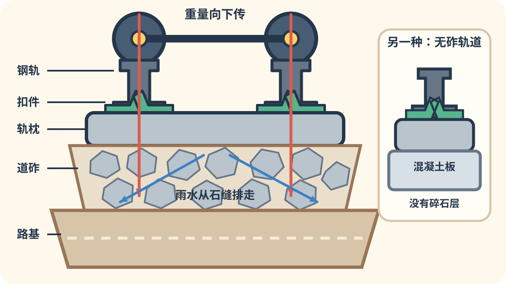

车轮的重量先压到钢轨上。钢轨把重量沿前后摊开，扣件再把它送到一根根轨枕。碎石道砟继续把重量摊开，还帮助排水。有些铁路不用碎石，而把钢轨固定在结实的轨道板上。

> 🔎 **给大人再讲一点：** 有砟轨道中，钢轨分配轮载，扣件保持位置并提供一定弹性，轨枕维持轨距，道砟把荷载扩散到下部结构并利于排水和调整。路基还要稳定、排水并限制沉降。板式轨道用混凝土等连续结构取代大部分道砟，维护方式不同，却仍需要可靠的基础和排水。

> 👀 **安全观察：** 只在站台安全线内或照片里比较：这段轨道下面是碎石、混凝土板，还是被路面包住了？

## 在家开一座“原理实验站”

这些小游戏只模仿一个小现象，不等于真正的铁路实验。请大人准备材料并全程陪同。

1. **滚动和滑动：** 在桌上轻推一个瓶盖，再轻推一块橡皮。谁更容易走远？它只说明“滚动常比拖着滑省力”，不是钢轮和钢轨的精确比较。
2. **列车的松紧：** 把三辆带原装连结器的大号玩具车连起来，缓慢拉第一辆。看看后面的车是不是同时开始动。不要猛拉，也不要使用能拆下小磁铁或小零件的玩具。
3. **两层弹簧：** 在小盒子下面分别垫硬纸板和干净海绵，再轻敲桌面。摸摸盒子的晃动有什么不同；海绵只是弹性模型，不是真正的列车悬挂。
4. **空气要让路：** 把同一张纸先竖着平推，再卷成圆弧形轻推。感受空气阻力有没有变化；真正列车的气流还会受到速度、长度和隧道影响。

---

[← 给一起看书的大人](00_for_grownups.md) · [🏠 全书首页](README.md) · [蒸汽先锋 →](02_steam_pioneers.md) · [🎲 观察游戏](10_spotter_games.md)
