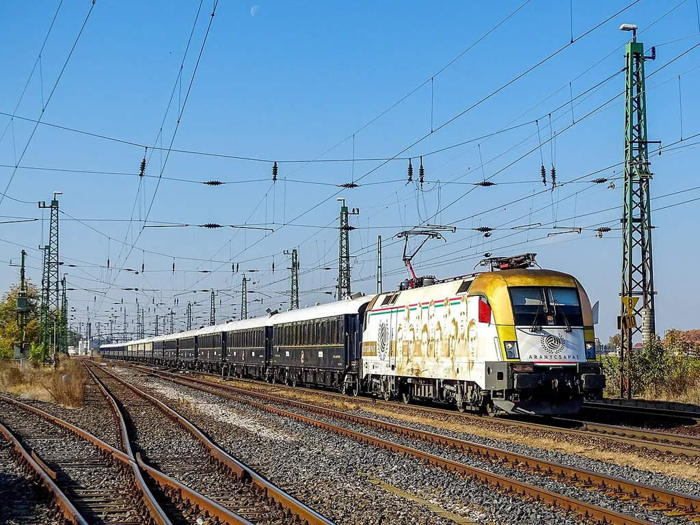
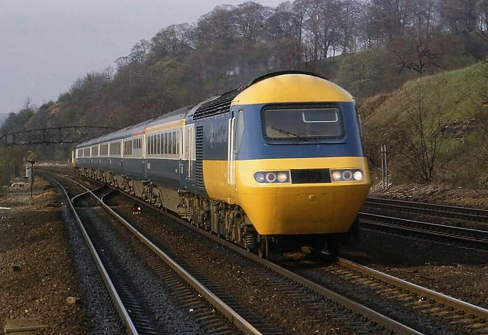
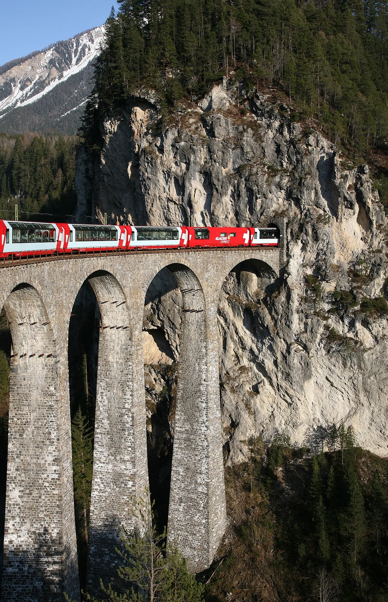
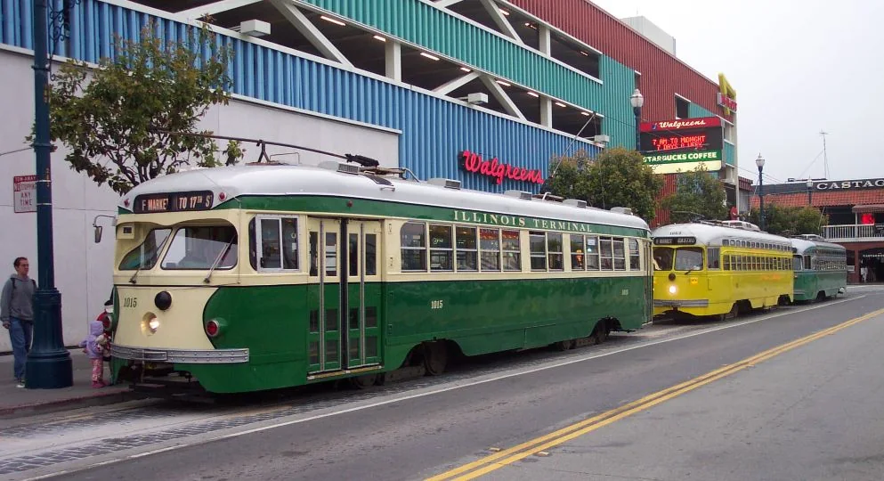

# 第三章：电来了，柴油也来了

[← 蒸汽先锋](02_steam_pioneers.md) · [🏠 全书首页](README.md) · [世界高速列车 →](04_world_high_speed.md) · [🎲 观察游戏](10_spotter_games.md)

烟囱不再是火车唯一的标志。电动机、柴油机和光滑车身带来许多新模样；还有些名字属于一整趟旅程，而不只是一辆车。

**本章小目录：**

- 015 西门子-哈尔斯克 · 016 东方快车 · 017 城市与南伦敦铁路 · 018 瑞士鳄鱼
- 019 飞行的汉堡人 · 020 先锋西风号 · 021 GG1 · 022 伦敦地铁 1938 Stock
- 023 EMD F7 · 024 VL80 · 025 InterCity 125 · 026 WAP-7 · 027 冰川快车 · 028 PCC

## 015｜西门子-哈尔斯克电气铁路车 Siemens-Halske

**出生卡：** 1879｜德国｜早期电力

这台小车没有大锅炉和烟囱。电流从轨道送来，让电动机转动。它拉着开放式小座车绕圈。参观展览的人可以亲自坐一小段。

**找找看：** 小小的电气机车在长木凳的哪一边？

> 给大人：维尔纳·冯·西门子在 1879 年柏林工业博览会上展示这条约 300 米长的电气铁路，它是早期载客电气铁路的重要示范。

*图 015 · [作者与许可](IMAGE_CREDITS.md#img-t015-siemens-electric-1879)*

---

## 016｜东方快车 Orient Express

**出生卡：** 1883起｜欧洲｜国际豪华列车

“东方快车”是一个从 1883 年开始旅行欧洲的老名字。照片里的列车穿着深蓝和金色外衣。车上有卧铺、餐车和精美装饰。不同年代的路线和车辆并不完全一样。

**找找看：** 机车后面，能数到几节深蓝色车厢？

> 给大人：国际卧铺车公司于 1883 年开行东方快车；这个名称指不断演变的国际列车服务，并非一组从未更换的固定车辆。主图为后来继承其旅行传统的威尼斯—辛普伦东方快车。

*图 016 · [作者与许可](IMAGE_CREDITS.md#img-t016-orient-express)*

---

## 017｜城市与南伦敦铁路电车 City & South London Railway

**出生卡：** 1890｜英国｜早期电力地铁

棕色小机车个头不大，却能拉着客车钻过伦敦的深隧道。它用电动机带动车轮。这样就不用在地下不断烧煤、喷烟。照片里的机车和木壳客车现在住在博物馆里。

**找找看：** 小机车后面，连着一节什么颜色的客车？

> 给大人：城市与南伦敦铁路 1890 年开通，是世界上第一条电力牵引深层地下铁路；其早期小机车最初采用把电枢直接装在车轴上的无齿轮方案。

*图 017 · [作者与许可](IMAGE_CREDITS.md#img-t017-city-south-london)*

---

## 018｜瑞士鳄鱼 Ce 6/8 II

**出生卡：** 1919｜瑞士｜电力机车

它的两头都有长长的“鼻子”，难怪大家叫它“鳄鱼”。中间车身和两端能稍微转动。车轮旁边的长连杆会一起动。受电弓从头顶电线取电。

**找找看：** 两端车轮旁边的连杆像不像一排尺子？

> 给大人：Ce 6/8 II 为电气化的圣哥达山线而造，铰接式三段车体和连杆传动使它得到“鳄鱼”昵称；主图为保存至今的实车。

*图 018 · [作者与许可](IMAGE_CREDITS.md#img-t018-sbb-crocodile)*

---

## 019｜飞行的汉堡人 Flying Hamburger

**出生卡：** 1933｜德国｜柴油流线动车组

两节车厢组成一列轻快的火车。圆圆的车头比老机车更光滑。柴油机先发电，再让电动机推动车轮。它曾快速往返柏林和汉堡。

**找找看：** 圆圆的车头上有几扇大窗、几盏圆灯？

> 给大人：德国国营铁路 SVT 877 于 1933 年投入柏林—汉堡定期服务，是早期高速柴油电力流线动车组的代表。

*图 019 · [作者与许可](IMAGE_CREDITS.md#img-t019-flying-hamburger)*

---

## 020｜先锋西风号 Pioneer Zephyr

**出生卡：** 1934｜美国｜柴油流线动车组

银亮车身用不锈钢做成。车头很圆，外皮还有一条条波纹。三节车厢轻巧地连在一起。1934 年，它用一次长途快跑吸引了全美国的目光。

**找找看：** 阳光在波纹车身上变成了几种亮色？

> 给大人：伯灵顿铁路的先锋西风号采用柴油电力、铰接车体和焊接不锈钢结构；1934 年“黎明到黄昏”展示运行从丹佛抵达芝加哥。

*图 020 · [作者与许可](IMAGE_CREDITS.md#img-t020-pioneer-zephyr)*

---

## 021｜GG1 GG1

**出生卡：** 1934｜美国｜电力机车

GG1 两头都能当车头。圆润外壳上画着细细的长条纹。车顶受电弓从电线取电。它既拉过快客车，也拉过重货车。

**找找看：** 车顶有几只可以折叠的受电弓？

> 给大人：宾夕法尼亚铁路于 1934—1943 年间购入 139 台 GG1；生产型的焊接流线车壳和条纹方案经工业设计师雷蒙德·洛伊改进。

*图 021 · [作者与许可](IMAGE_CREDITS.md#img-t021-gg1)*

---

## 022｜伦敦地铁 1938 Stock London Underground 1938 Stock

**出生卡：** 1938｜英国｜地铁

红色车身有一个圆圆的前脸。许多电气设备搬到了车厢地板下面。乘客空间因此更整齐。它在伦敦地下工作了大约半个世纪。

**找找看：** 圆头上的车窗和车灯怎样左右排队？

> 给大人：1938 Stock 把大部分牵引设备布置在地板下，是伦敦地铁经典一体化动车组；该型在伦敦的常规服务持续至 1988 年。

*图 022 · [作者与许可](IMAGE_CREDITS.md#img-t022-london-underground-1938)*

---

## 023｜EMD F7 EMD F7

**出生卡：** 1949｜美国｜柴油电力机车

圆圆的高车头看起来很结实。柴油机带动发电机，电动机再转动车轮。几台 F7 可以一前一后连起来工作。它拉过货车，也穿过客运列车的亮丽外衣。

**找找看：** 车头正面有几扇窗、几盏灯？

> 给大人：F7 是通用汽车电气动力分部最畅销的 F 系列“驾驶室单元”，1949 年投产，每个动力单元额定约 1,500 马力。

*图 023 · [作者与许可](IMAGE_CREDITS.md#img-t023-emd-f7)*

---

## 024｜VL80 VL80

**出生卡：** 1961｜苏联/俄罗斯｜电力货运

VL80 常常由两大节机车连在一起。每一节下面都有许多车轮。它从架空线取得交流电。它常用来牵引长长的重货列车。

**找找看：** 两节机车中间的连接门在哪里？

> 给大人：VL80 是为 25 kV、50 Hz 交流电气化铁路制造的双节八轴货运机车家族，自 1961 年起发展出多个数量庞大的型号。

*图 024 · [作者与许可](IMAGE_CREDITS.md#img-t024-vl80)*

---

## 025｜InterCity 125 InterCity 125

**出生卡：** 1976｜英国｜高速柴油列车

列车两头各有一辆柴油动力车。到终点后，不用把机车调到另一头。黄色尖鼻在远处也很醒目。它让没有电线的英国干线也能跑高速列车。

**找找看：** 黄色车头下方的车灯排成了几组？

> 给大人：InterCity 125 又称高速列车 HST，由两台 Class 43 动力车夹着客车，常规最高速度 125 mph（约 201 km/h）。

*图 025 · [作者与许可](IMAGE_CREDITS.md#img-t025-intercity-125)*

---

## 026｜WAP-7 WAP-7

**出生卡：** 2000｜印度｜电力客运

WAP-7 常在印度干线上牵引客车。它举起受电弓，从头顶电线取电。两个转向架各有三根车轴。大功率电动机能拉很长的快速客车。

**找找看：** 白色车身上的红色带子绕到车头了吗？

> 给大人：WAP-7 由印度奇塔兰詹机车厂自 2000 年起制造，是基于 WAG-9 平台发展的六轴交流客运电力机车。

*图 026 · [作者与许可](IMAGE_CREDITS.md#img-t026-wap-7)*

---

## 027｜冰川快车 Glacier Express

**出生卡：** 1930起/全景车2006｜瑞士｜观光列车

这趟列车穿过瑞士阿尔卑斯山。大窗户一直弯到车顶，方便抬头看山。它跑得不算快，却把很多风景串在一起。途中会经过桥梁、隧道和很深的山谷。

**找找看：** 全景窗的玻璃从车身一直伸到哪里？

> 给大人：冰川快车的贯通服务始于 1930 年，由马特洪—圣哥达铁路与雷蒂亚铁路共同运营；如今熟悉的全景客车是后来的更新，并非 1930 年原车。

*图 027 · [作者与许可](IMAGE_CREDITS.md#img-t027-glacier-express)*

---

## 028｜PCC 有轨电车 PCC Streetcar

**出生卡：** 1936起｜美国/世界｜路面电车

PCC 电车在城市街道的轨道上跑。圆角车身比许多老电车更流畅。新的控制设备让加速和刹车更平顺。后来，许多国家都制造了相似的车辆。

**找找看：** 车头的挡风玻璃和圆角怎样接在一起？

> 给大人：PCC 是美国多家公共交通企业组成的“电车总裁会议委员会”推动的标准化设计家族，1936 年起投入使用，并非单一厂商的一款车型。

*图 028 · [作者与许可](IMAGE_CREDITS.md#img-t028-pcc-streetcar)*

---

[← 蒸汽先锋](02_steam_pioneers.md) · [🏠 全书首页](README.md) · [世界高速列车 →](04_world_high_speed.md) · [🎲 观察游戏](10_spotter_games.md)
