# 第四章：高速列车怎样长大

[← 电力、柴油和新能量](03_power_revolution.md) · [🏠 全书首页](README.md) · [高速列车各有绝招 →](05_high_speed_specialists.md) · [🎲 观察游戏](13_spotter_games.md)

1964 年，圆鼻子的 0 系把高速铁路故事推到新一页。后来，英国、法国、德国、西班牙、中国等地也接力前进。本章挑出各地发展路上的关键一站，按出生年代看看高速列车怎样长大。

**本章路线图：** 今天挑一个小站就好，不用一次看完。

- 🚉 第1站：高速时代的第一棒（5 辆车）
- 🚉 第2站：更多国家加入接力（4 辆车）
- 🚉 第3站：跨进新世纪（5 辆车）
- 🚉 第4站：中国与台湾的新伙伴（5 辆车）

> 🚉 **第1站｜高速时代的第一棒**

## 042｜0系 Shinkansen 0 Series

**出生卡：** 1964｜日本｜东海道新干线

它有一张圆圆的“子弹脸”。1964年，它第一次载客飞跑。它把东京和大阪拉得更近。从这一天起，新干线成了速度明星。

**找找看：** 圆鼻子两边，各藏着几盏灯？

> 给大人：0系随东海道新干线在1964年10月1日投入营业，初期营业最高速度为210千米/时，后来提高到220千米/时。

*图 042 · [作者与许可](IMAGE_CREDITS.md#img-t042-shinkansen-0)*

---

## 025｜InterCity 125 InterCity 125

**出生卡：** 1976｜英国｜高速柴油列车

列车两头各有一辆柴油动力车。到终点后，不用把机车调到另一头。黄色尖鼻在远处也很醒目。它让没有电线的英国干线也能跑高速列车。

**找找看：** 黄色车头下方的车灯排成了几组？

> 给大人：InterCity 125 又称高速列车 HST，由两台 Class 43 动力车夹着客车，常规最高速度 125 mph（约 201 km/h）。

*图 025 · [作者与许可](IMAGE_CREDITS.md#img-t025-intercity-125)*

---

## 029｜TGV Sud-Est TGV Sud-Est

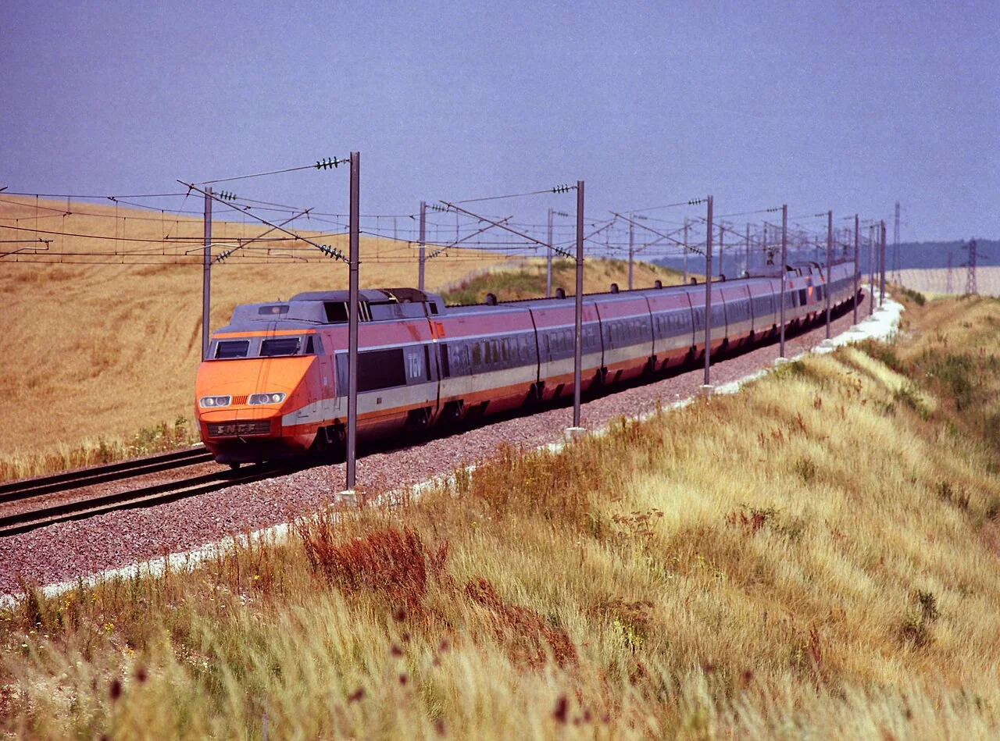

**出生卡：** 1981｜法国｜高速

第一代 TGV 穿着亮橙色外衣。两头的动力车推拉中间客车。相邻客车常常共用一组转向架。它让巴黎到里昂的火车旅程快了许多。

**找找看：** 橙色尖鼻的挡风玻璃有多窄？

> 给大人：TGV Sud-Est 于 1981 年随法国首条高速新线投入商业服务，是法国 TGV 高速铁路体系的第一代主力列车。

*图 029 · [作者与许可](IMAGE_CREDITS.md#img-t029-tgv-sud-est)*

---

## 043｜200系 Shinkansen 200 Series

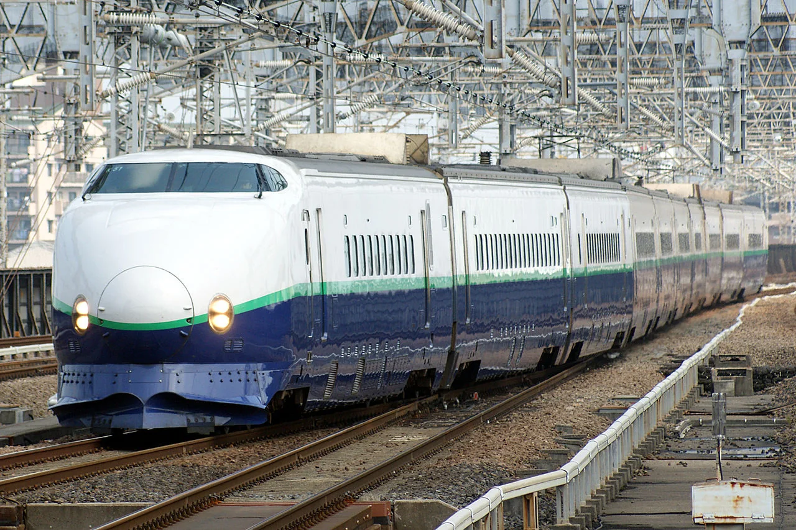

**出生卡：** 1982｜日本｜东北/上越新干线

北国的冬天会送来厚厚的雪。200系把许多车底设备包得严严实实。车头下方还能帮忙拨开积雪。它用绿色腰带和0系打招呼。

**找找看：** 它和0系都很圆，腰带颜色哪里不同？

> 给大人：200系在1982年随东北、上越新干线投入营业；设备罩、耐雪制动和车头排雪装置等设计用于应对寒冷多雪环境。

*图 043 · [作者与许可](IMAGE_CREDITS.md#img-t043-shinkansen-200)*

---

## 044｜100系 Shinkansen 100 Series

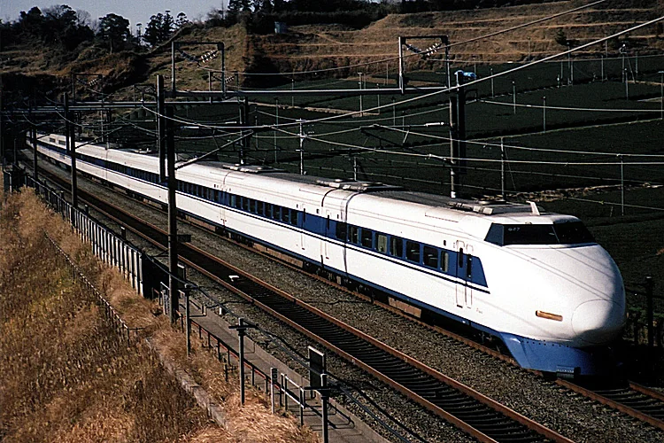

**出生卡：** 1985｜日本｜新干线（部分双层）

它的鼻子从圆球变成了斜坡。有些编组把双层车厢放在中间。楼上看得远，楼下更靠近轨道。不过，它并不是全列都有两层。

**找找看：** 车头的斜鼻子，像不像一支削过的铅笔？

> 给大人：100系在1985年投入营业；依编组不同，中部曾设双层餐车或绿色车厢，这是它区别于0系的重要特征。

*图 044 · [作者与许可](IMAGE_CREDITS.md#img-t044-shinkansen-100)*

---

> 🚉 **第2站｜更多国家加入接力**

## 030｜ICE 1 ICE 1

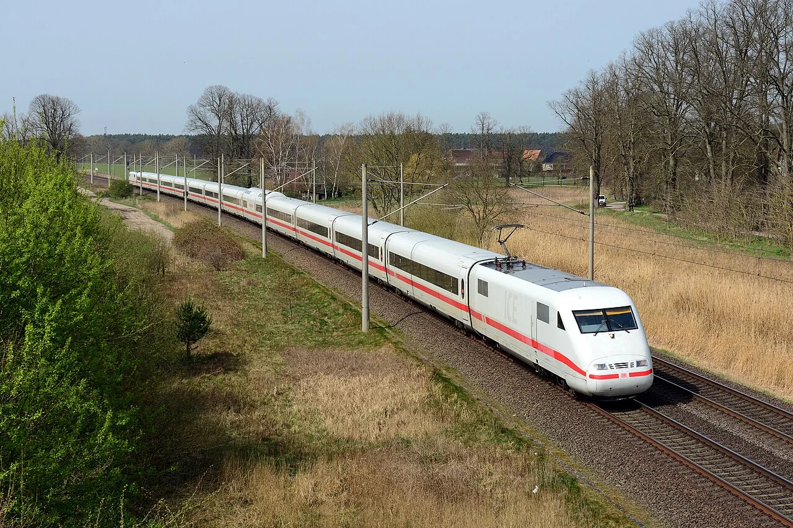

**出生卡：** 1991｜德国｜高速

白色车身上有一条细红线。长长的列车两头各有动力车。中间有许多安静宽敞的客车。它是德国最早投入定期服务的 ICE 车型。

**找找看：** 红线从圆鼻一直延伸到多远？

> 给大人：ICE 1 即德国铁路 401 型，1991 年投入定期服务；它采用两端集中动力车，而不是每节车厢都装牵引电动机。

*图 030 · [作者与许可](IMAGE_CREDITS.md#img-t030-ice-1)*

---

## 031｜AVE S-100 AVE S-100

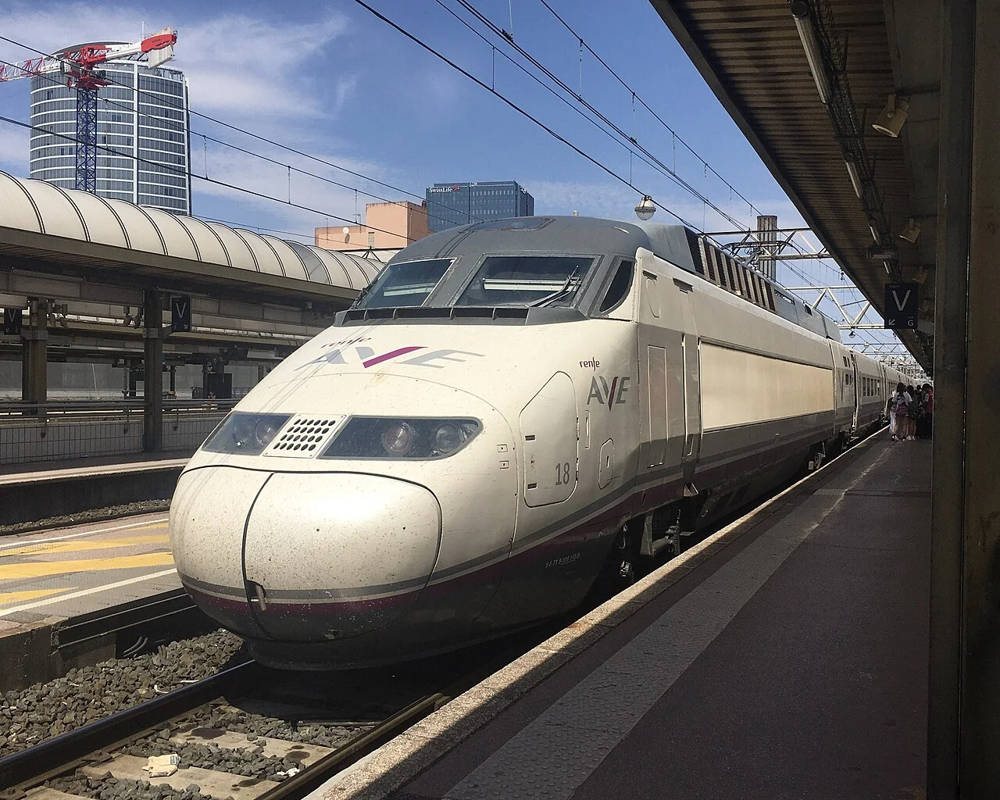

**出生卡：** 1992｜西班牙｜高速

它是西班牙第一代 AVE 高速列车。照片里的白色车身配着紫色小标志。1992 年，它在马德里和塞维利亚之间开跑。车轮走的是欧洲高速铁路常见的标准轨距。

**找找看：** 紫色小标志画在车鼻的哪一边？

> 给大人：S-100 由法国 TGV Atlantique 技术发展而来；马德里—塞维利亚高速线采用 1,435 毫米标准轨，而西班牙传统干线多为更宽的伊比利亚轨距。

*图 031 · [作者与许可](IMAGE_CREDITS.md#img-t031-ave-s100)*

---

## 045｜300系 Shinkansen 300 Series

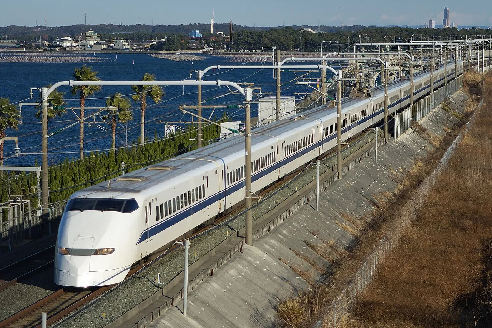

**出生卡：** 1992｜日本｜新干线

300系把车头压得又低又扁。它带着最早的“希望号”上路。轻轻的铝合金车身帮助它加速。它能以270千米时速载客奔跑。

**找找看：** 它的车灯在鼻尖上，还是在车窗旁？

> 给大人：300系于1992年担当首批“希望号”；它采用铝合金车体、VVVF逆变控制和三相感应电动机，营业最高速度为270千米/时。

*图 045 · [作者与许可](IMAGE_CREDITS.md#img-t045-shinkansen-300)*

---

## 032｜Eurostar e300/Class 373 Eurostar e300/Class 373

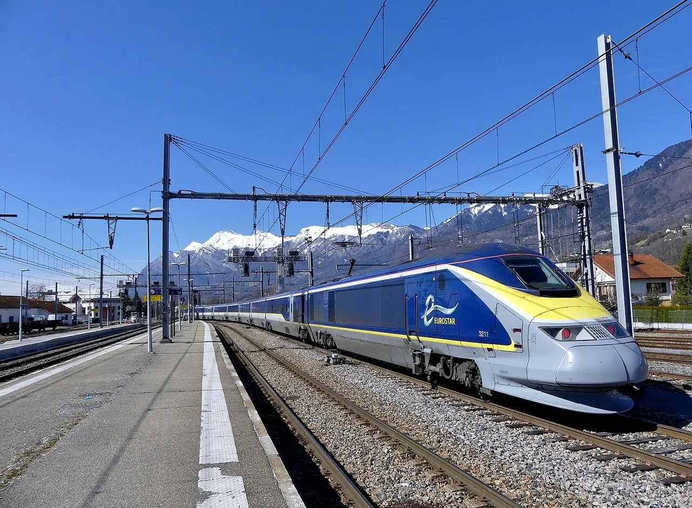

**出生卡：** 1994｜英法比｜高速

它把英国、法国和比利时连在一起。途中要穿过英吉利海峡下面的长隧道。列车能适应不同国家的铁路设备。长长的车身两端都有动力车。

**找找看：** 黄色线条怎样围住蓝色车头？

> 给大人：e300 在英国编号 Class 373，由 TGV 技术发展而来；列车为海峡隧道跨境运行配置多套供电与信号系统。

*图 032 · [作者与许可](IMAGE_CREDITS.md#img-t032-eurostar-e300)*

---

> 🚉 **第3站｜跨进新世纪**

## 048｜500系 Shinkansen 500 Series

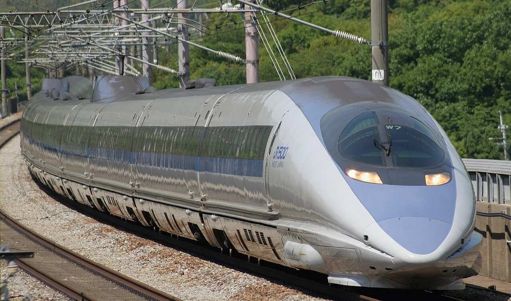

**出生卡：** 1997｜日本｜新干线

细长鼻子像翠鸟的嘴。圆筒车身能把迎面的风轻轻分开。它最早用16节长队跑“希望号”。后来，8节短队改跑“回声号”，计划在2027年告别营业运行。

**找找看：** 车身横切面更像方盒子，还是圆筒？

> 给大人：500系于1997年投入营业，是日本首款以300千米/时进行商业运营的新干线列车；后来部分车辆改为8辆编组担当山阳新干线“回声号”。JR西日本计划于2027年1月13日结束其定期列车运用，并在同年7月结束营业运行；计划仍可能因车辆运用等情况调整。

*图 048 · [作者与许可](IMAGE_CREDITS.md#img-t048-shinkansen-500)*

---

## 052｜700系 Shinkansen 700 Series

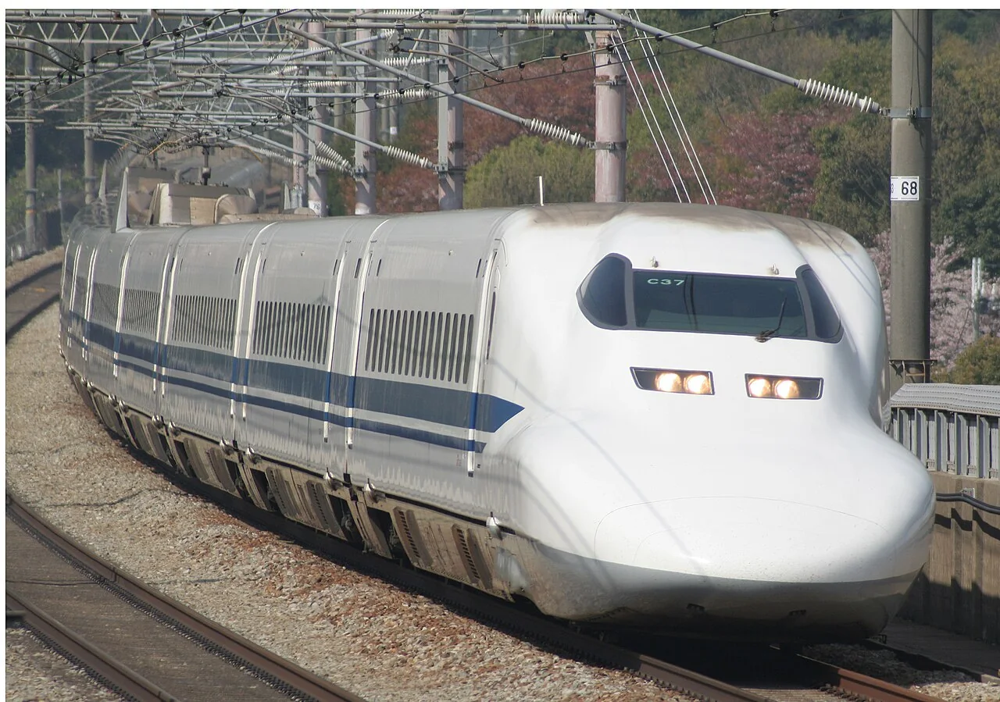

**出生卡：** 1999｜日本｜新干线

车头扁扁宽宽，常被叫作“鸭嘴”。这个形状能减轻进出隧道时的压力波。它不像500系那样圆，也没有双层车厢。后来的N700又沿着它继续进化。

**找找看：** “鸭嘴”最宽的地方靠近鼻尖还是车窗？

> 给大人：700系于1999年投入营业，由JR东海与JR西日本共同开发；营业最高速度在东海道新干线为270千米/时，在山阳新干线为285千米/时。

*图 052 · [作者与许可](IMAGE_CREDITS.md#img-t052-shinkansen-700)*

---

## 033｜初代 Acela Express First-generation Acela Express

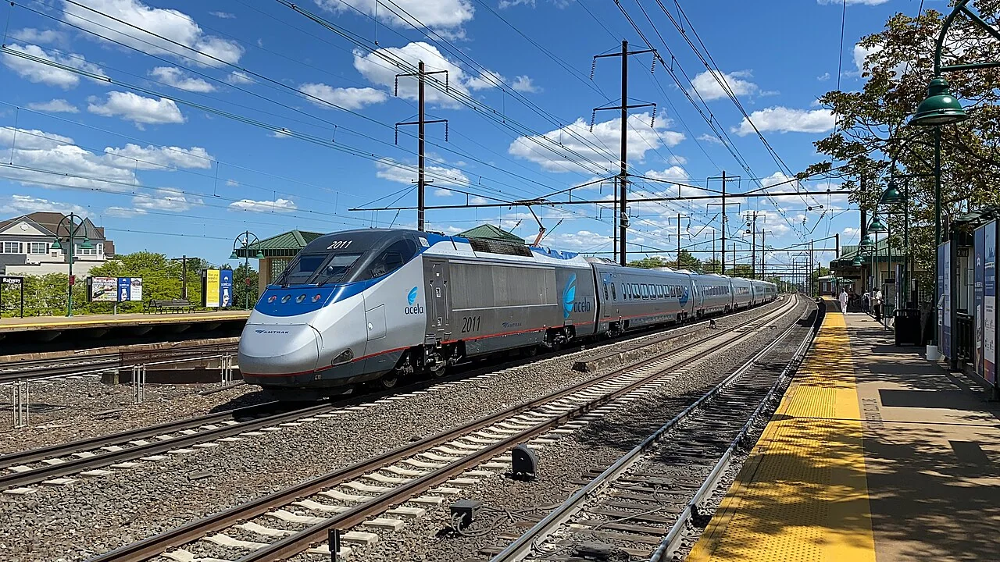

**出生卡：** 2000｜美国｜高速

它从 2000 年起在美国东北部的大城市之间奔跑。弯道里，车厢可以轻轻向内倾斜。列车两头各有一辆电力动力车。银色外壳配着蓝色和红色线条。

**找找看：** 车头侧面的蓝色块像什么形状？

> 给大人：初代 Acela 由庞巴迪与阿尔斯通联合制造，共 20 组；部分路段最高商业速度为 150 mph（约 241 km/h）。NextGen Acela 已于 2025 年 8 月开始载客，Amtrak 计划到 2027 年陆续让 28 组新车加入，换代期间两代车辆并行。

*图 033 · [作者与许可](IMAGE_CREDITS.md#img-t033-acela)*

---

## 034｜KTX-I KTX-I

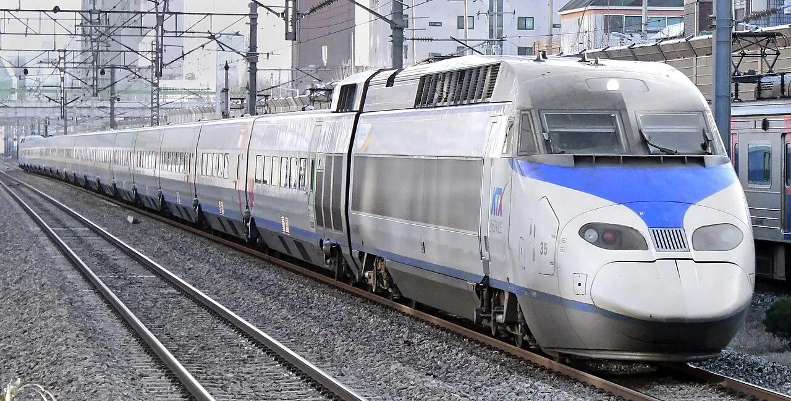

**出生卡：** 2004｜韩国｜高速

KTX-I 是韩国第一代高速列车。它的技术和法国 TGV 有亲缘关系。首尔到釜山的旅行因此大大缩短。两端动力车之间排着一长串客车。

**找找看：** 蓝色从车头向后画出了一条怎样的曲线？

> 给大人：KTX-I 于 2004 年随韩国高速铁路开通，技术基础来自 TGV Réseau；20 辆编组包含两端动力车、动力端客车与铰接客车。

*图 034 · [作者与许可](IMAGE_CREDITS.md#img-t034-ktx-i)*

---

## 054｜800系 Shinkansen 800 Series

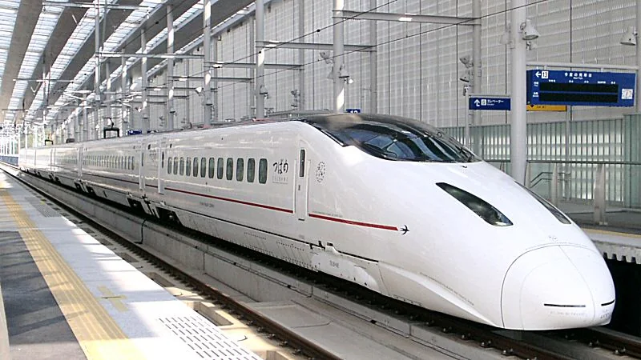

**出生卡：** 2004｜日本｜九州新干线

红色细线绕过白色车身。它在九州的山海之间奔跑。车里用上木头、织物和金色装饰。高速列车也能像一间温暖的家。

**找找看：** 红色腰带到了车头，画出什么弯弯形状？

> 给大人：800系随九州新干线部分开业于2004年投入营业，采用6辆编组；车内大量运用木材、织物与九州传统工艺元素。

*图 054 · [作者与许可](IMAGE_CREDITS.md#img-t054-shinkansen-800)*

---

> 🚉 **第4站｜中国与台湾的新伙伴**

## 036｜台湾高铁 700T THSR 700T

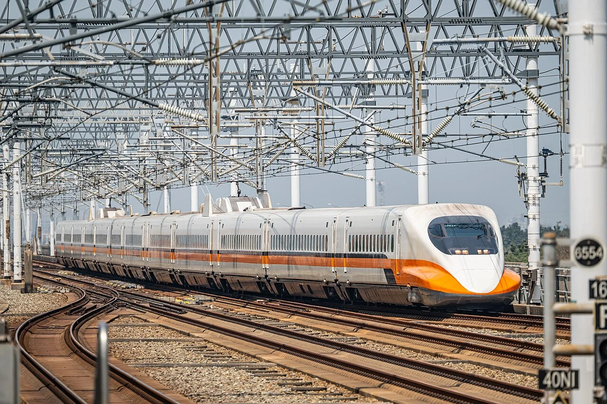

**出生卡：** 2007｜中国台湾｜高速

白色车身画着橙色线条。长鼻车头来自日本新干线的设计家族。电动机分散在列车的多节车厢下面。它沿台湾西部走廊连接许多城市。

**找找看：** 橙色线条在长鼻子的哪一段开始？

> 给大人：700T 以日本 700 系新干线为基础，并按台湾气候、线路和运营需求调整；12 辆编组商业最高速度为 300 km/h。

*图 036 · [作者与许可](IMAGE_CREDITS.md#img-t036-thsr-700t)*

---

## 037｜CRH2 CRH2

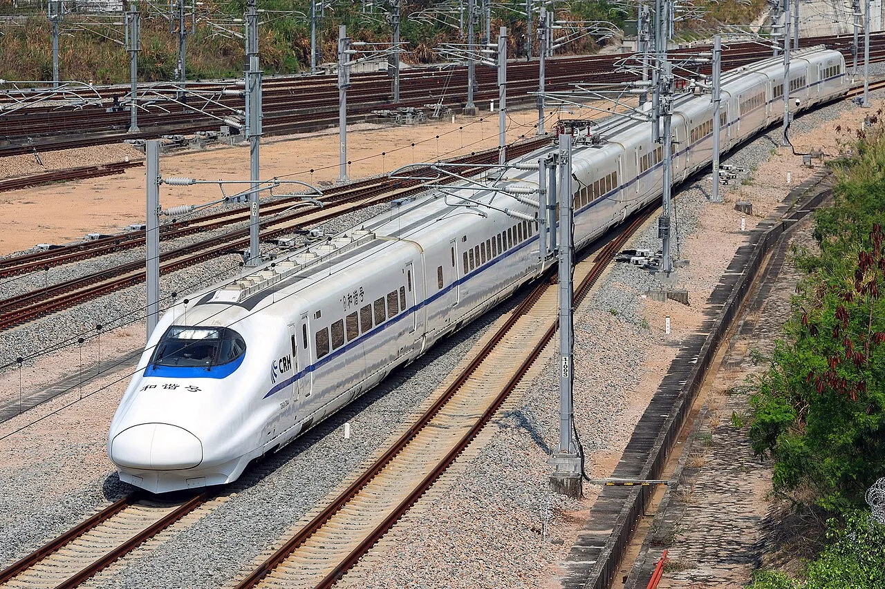

**出生卡：** 2007｜中国｜高速

CRH2 的白色车身围着蓝色腰线。动力分散在多节车厢下面。乘客不用坐在大机车后面，整列车会一起出力。这个家族后来又有许多不同成员。

**找找看：** 蓝色腰线经过了车门的上面还是下面？

> 给大人：早期 CRH2A 在日本 E2-1000 系技术转让基础上制造，属于 200—250 km/h 等级；后来冠以 CRH2 名称的各变型性能并不完全相同。

*图 037 · [作者与许可](IMAGE_CREDITS.md#img-t037-crh2)*

---

## 151｜CRH5A：会过严寒关

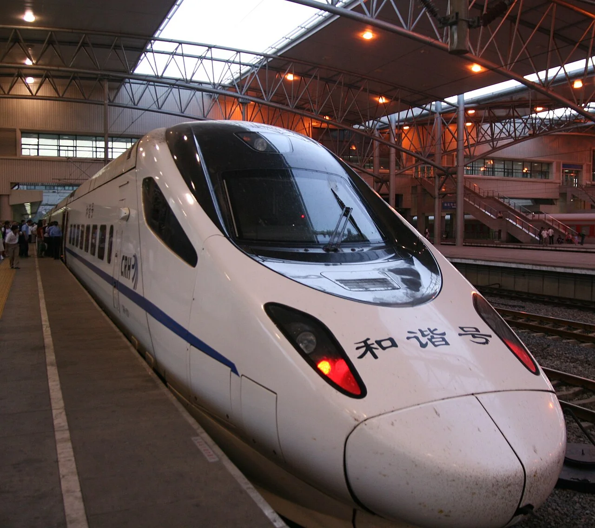

**出生卡：** 2007年｜中国｜高速动车组

圆圆的白色车头像一颗大胶囊。它从头顶电线取电，车厢下面的电动机一起出力。经过防寒改进的列车还能在冰雪和严寒里工作。

**找找看：** 蓝色线条在车头画出了一道什么弧线？

> 给大人：CRH5A自2007年起运营，常见八辆编组为五动三拖；哈齐高铁使用的改进型可在零下40摄氏度的高寒条件下运营，不能把这一能力概括为所有版本完全相同。

*图 151 · [作者与许可](IMAGE_CREDITS.md#img-t151-crh5a)*

---

## 150｜CRH3C：京津城际的长鼻先锋

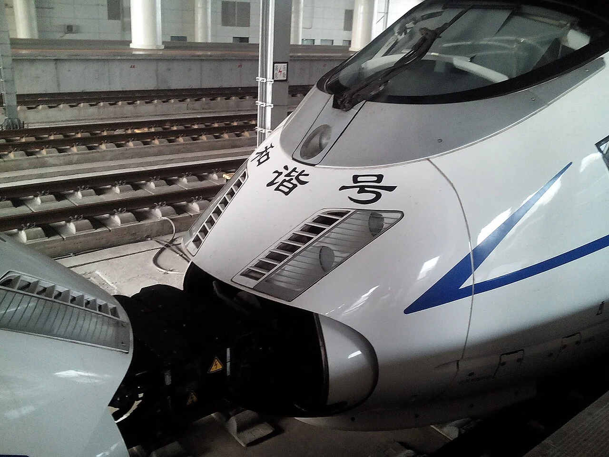

**出生卡：** 2008年｜中国｜高速动车组

白色长鼻上方有一块深色前窗。多节车厢下面的电动机一起出力。2008年，它在京津城际接送乘客。

**找找看：** 蓝色线条从鼻尖一直跑到了哪里？

> 给大人：CRH3C是CRH3家族的早期八辆编组车型，采用四动四拖；2008年8月随京津城际投入运营，属于350公里速度等级。速度等级不等于每一趟车的实际速度。

*图 150 · [作者与许可](IMAGE_CREDITS.md#img-t150-crh3c)*

---

## 038｜CRH380A CRH380A

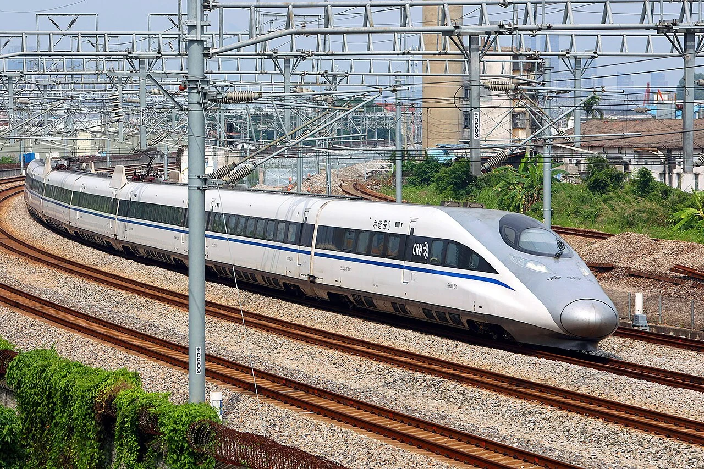

**出生卡：** 2010｜中国｜高速

它有一只扁扁长长的车鼻。蓝色波浪线从车头滑向车尾。多节车厢里的电动机一起工作。它是中国 380 速度等级动车组的重要成员。

**找找看：** 车灯藏在长鼻子的上方还是两侧？

> 给大人：CRH380A 由 CRH2 技术谱系继续发展并进行本土化重新设计，2010 年投入使用；型号中的“380”是设计速度等级，不代表每次运行速度。

*图 038 · [作者与许可](IMAGE_CREDITS.md#img-t038-crh380a)*

---

[← 电力、柴油和新能量](03_power_revolution.md) · [🏠 全书首页](README.md) · [高速列车各有绝招 →](05_high_speed_specialists.md) · [🎲 观察游戏](13_spotter_games.md)
