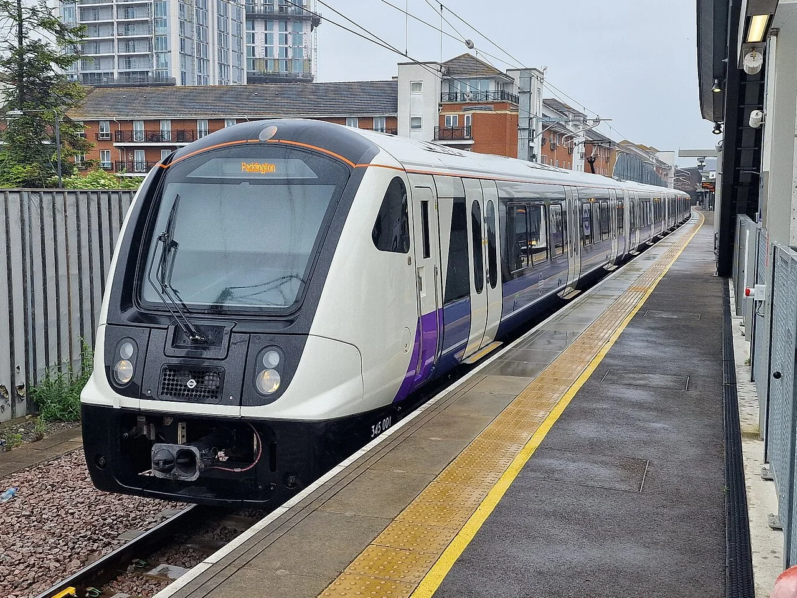
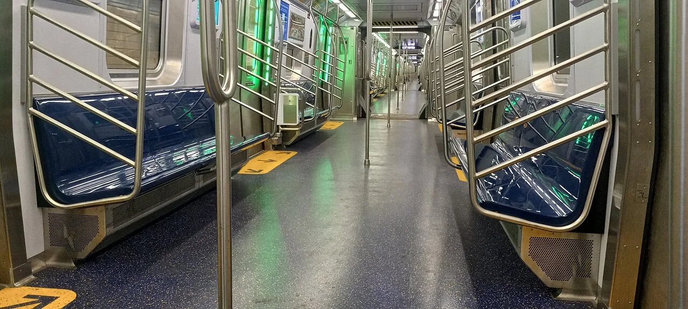
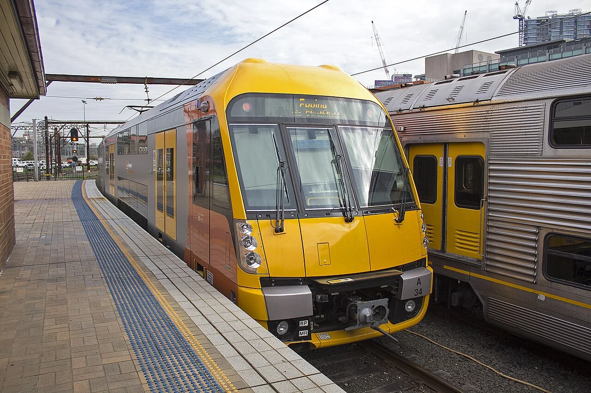
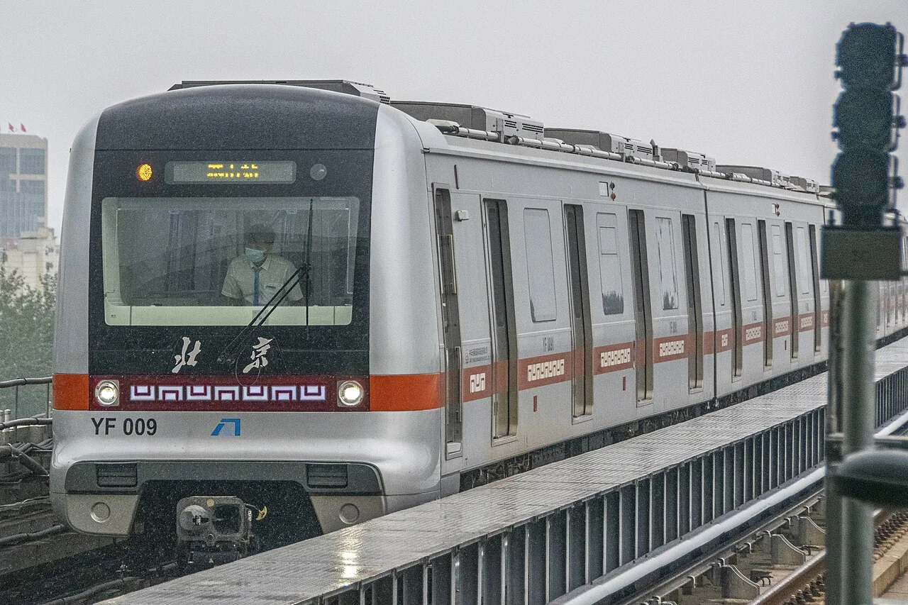
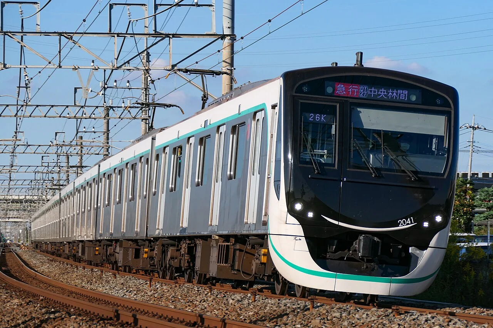
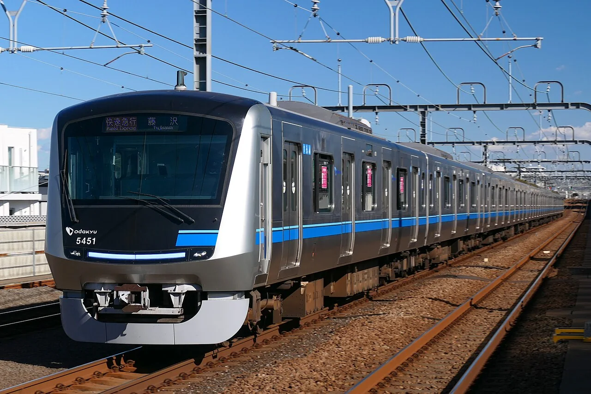
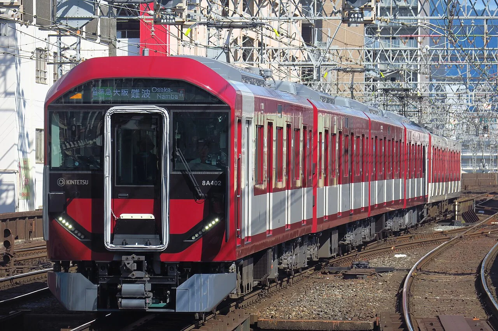

# 第六章：城市里的站站停

[← 高速列车各有绝招](05_high_speed_specialists.md) · [🏠 全书首页](README.md) · [地方与区域列车 →](07_regional_trains.md) · [🎲 观察游戏](13_spotter_games.md)

城市列车常常开门、关门，再开向下一站。地铁钻进地底，有轨电车穿过街道，通勤电车一次接走许多人。它们的脸和车门不一样，工作却都很忙。

**本章路线图：** 今天挑一个小站就好，不用一次看完。

- 🚉 第1站：日本通勤长队（5 辆车）
- 🚉 第2站：世界大城市伙伴（4 辆车）
- 🚉 第3站：地铁钻进地下（4 辆车）
- 🚉 第4站：电车穿过街道（2 辆车）
- 🚉 第5站：私铁的新朋友（3 辆车）

> 🚉 **第1站｜日本通勤长队**

## 063｜国铁103系 JNR 103 Series

**出生卡：** 1963｜日本｜通勤电车

它长着一张方方的大脸。车身穿过橙、绿、黄等许多颜色。每边四扇门，让大家快快上下车。它曾在东京、大阪和许多城市忙碌。

**找找看：** 三辆车各穿什么颜色？它们的方脸哪里一样？

> 给大人：103系自1963年起大量制造，是为城市频繁起停设计的直流通勤电车；不同线区用醒目的车身颜色帮助识别。

*图 063 · [作者与许可](IMAGE_CREDITS.md#img-t063-jnr-103)*

---

## 064｜JR东日本E231系 JR East E231 Series

**出生卡：** 2000｜日本｜通勤/近郊电车

银色车身配着路线彩带。有的站站停，有的会跑得很远。宽门和长椅让上下车更方便。车上电脑一起照看许多设备。

**找找看：** 腰带是什么颜色？它可能在哪条线跑？

> 给大人：E231系于2000年投入营业，同时发展通勤型和近郊型版本；TIMS列车信息管理系统集中传送与监控车辆数据。

*图 064 · [作者与许可](IMAGE_CREDITS.md#img-t064-jr-e231)*

---

## 065｜E233系 JR East E233 Series

**出生卡：** 2006｜日本｜通勤电车

它像E231的认真弟弟。重要设备常准备两套，坏一套还有帮手。车身会换上不同颜色的腰带。橙、蓝、绿，一眼就能认路线。

**找找看：** 车头和车侧的路线颜色连在一起吗？

> 给大人：E233系于2006年投入营业；控制、供电等关键系统采用冗余设计，并针对中央、京滨东北等不同线路形成多个番台。

*图 065 · [作者与许可](IMAGE_CREDITS.md#img-t065-jr-e233)*

---

## 066｜E235系 JR East E235 Series

**出生卡：** 2015｜日本｜通勤电车

黑色大窗框像一块会跑的屏幕。绿色E235先在山手线绕圈。车门上方的大屏幕会告诉你下一站。后来还有蓝黄相间的近郊版本。

**找找看：** 绿色是横着绕车身，还是竖着爬上车头？

> 给大人：E235系于2015年首先在山手线投入营业；用于横须贺、总武快速线的E235系1000番台自2020年起投入运营。

*图 066 · [作者与许可](IMAGE_CREDITS.md#img-t066-jr-e235)*

---

## 067｜JR西日本323系 JR West 323 Series

**出生卡：** 2016｜日本｜大阪环状线通勤

橙色腰带说：“大阪环状线到了！”每边三扇门，和这一带的列车更合拍。车内屏幕会报站和显示消息。它围着大阪的热闹街区转圈。

**找找看：** 一节车厢的一侧，是三扇门还是四扇门？

> 给大人：323系于2016年投入大阪环状线和樱岛线，取代103系、201系；三门布局也方便与直通该区域的其他三门车辆统一乘车位置。

*图 067 · [作者与许可](IMAGE_CREDITS.md#img-t067-jr-west-323)*

---

> 🚉 **第2站｜世界大城市伙伴**

## 137｜伦敦Class 345：紫色贯通长廊

**出生卡：** 2017年｜英国伦敦｜城市通勤电车

紫色门框像伊丽莎白线的彩带。长长的车内可以一节节走过去。每节车厢的宽门忙着让乘客上下车。

**找找看：** 一节车厢的一侧能看到几组双开门？

> 给大人：Class 345于2017年开始载客，如今伊丽莎白线使用的九辆编组采用贯通式车内通道，并在多数车厢每侧设置三组双开门。

*图 137 · [作者与许可](IMAGE_CREDITS.md#img-t137-london-class-345)*

---

## 139｜纽约R211T：车厢之间打开了

**出生卡：** 2024年｜美国纽约｜贯通式地铁试验车

R211T 把两节车厢之间打开了。乘客可以从宽宽的连接处走过去。它先用小批列车试一试这种新布局。

**找找看：** 两节车厢之间还能看到普通的窄门吗？

> 给大人：R211T开放贯通试验编组于2024年在C线载客，纽约大都会运输署借此评估贯通式车厢的实际使用效果。

*图 139 · [作者与许可](IMAGE_CREDITS.md#img-t139-nyc-r211t)*

---

## 141｜悉尼Waratah A set：上下两层坐人

**出生卡：** 2011年｜澳大利亚悉尼｜双层通勤电车

Waratah 是一列双层电车。楼上和楼下都能坐人。八节车厢每天在悉尼接送乘客。

**找找看：** 上层和下层各有几排窗户？

> 给大人：Waratah A set自2011年起投入悉尼郊区铁路服务，采用固定八辆编组和双层客室来容纳日常客流。

*图 141 · [作者与许可](IMAGE_CREDITS.md#img-t141-sydney-waratah-a)*

---

## 159｜北京燕房线 DKZ76：全自动地铁

**出生卡：** 2017年｜中国北京｜全自动地铁列车

它会照着信号系统给的指令出发。列车能自动行驶、停车，还会自己开关车门。控制中心和工作人员一直照看整条线路。

**找找看：** 黑色车头的大窗像不像一张方方的脸？

> 给大人：燕房线于2017年12月开通，DKZ76为四辆编组B型列车；线路后来全面实现GoA4级驾驶室无人值守运行。全自动不等于无人负责，控制中心、系统验证和巡检人员仍是安全体系的一部分。

*图 159 · [作者与许可](IMAGE_CREDITS.md#img-t159-beijing-dkz76)*

---

> 🚉 **第3站｜地铁钻进地下**

## 069｜东京地铁1000系 Tokyo Metro 1000 Series

**出生卡：** 2012｜日本｜银座线地铁

柠檬黄车身像从老照片里开出来。它在银座线的小隧道里奔跑。轨旁第三轨把电送给车底。会转向的车轴帮它安静地过弯。

**找找看：** 圆灯和黄色车身，哪里最像老电车？

> 给大人：1000系于2012年投入营业，外观致敬1927年的旧1000型；它采用永久磁铁同步电动机和能让轮轴顺应曲线的操舵转向架。

*图 069 · [作者与许可](IMAGE_CREDITS.md#img-t069-tokyo-metro-1000)*

---

## 070｜都营大江户线12-000型 Toei 12-000 Series

**出生卡：** 1991｜日本｜直线电机地铁

它个子小，能钻进较小的隧道。轨道中间铺着长长的反应板。车底直线电机隔着空隙推它前进。它绕过东京许多深深的车站。

**找找看：** 紫红色腰带从黑色车窗下面绕到了哪里？

> 给大人：12-000型于1991年投入营业，是日本较早采用铁轮式直线电机的小断面地铁车辆；小断面有助于缩小隧道开挖尺寸。

*图 070 · [作者与许可](IMAGE_CREDITS.md#img-t070-toei-12-000)*

---

## 114｜大阪地铁 80 系

**出生卡：** 2006｜日本大阪｜直线电机地铁

它的电动机像被摊开成长长一条。车底和轨道一起产生向前的力量。设备能做得较扁，隧道也可以较小。它仍用钢轮走在钢轨上。

**找找看：** 车身是不是比许多大火车更矮、更窄？

> 给大人：80 系是大阪地铁今里筋线车辆；“直线电机”是牵引方式，不代表磁悬浮。

*图 114 · [作者与许可](IMAGE_CREDITS.md#img-t114-osaka-metro-80)*

---

## 071｜大阪地铁400系 Osaka Metro 400 Series

**出生卡：** 2023｜日本｜中央线地铁

八角形大脸像一艘宇宙飞船。它在大阪中央线上奔跑。座椅、扶手和行李区照顾不同乘客。它用第三轨取电，车顶没有受电弓。

**找找看：** 大前窗的外框一共有几个角？

> 给大人：400系于2023年6月25日投入营业，面向中央线及梦洲方向服务；该线采用750伏直流第三轨供电。

*图 071 · [作者与许可](IMAGE_CREDITS.md#img-t071-osaka-metro-400)*

---

> 🚉 **第4站｜电车穿过街道**

## 028｜PCC 有轨电车 PCC Streetcar

**出生卡：** 1936起｜美国/世界｜路面电车

PCC 电车在城市街道的轨道上跑。圆角车身比许多老电车更流畅。新的控制设备让加速和刹车更平顺。后来，许多国家都制造了相似的车辆。

**找找看：** 车头的挡风玻璃和圆角怎样接在一起？

> 给大人：PCC 是美国多家公共交通企业组成的“电车总裁会议委员会”推动的标准化设计家族，1936 年起投入使用，并非单一厂商的一款车型。

*图 028 · [作者与许可](IMAGE_CREDITS.md#img-t028-pcc-streetcar)*

---

## 075｜广岛电铁5100型 Green Mover Max / Hiroshima Electric Railway 5100 Series

**出生卡：** 2005｜日本｜低地板有轨电车

五小节车身像会弯腰的毛毛虫。地板很低，上车不用爬高台阶。它在广岛街道上和汽车一起等灯。转弯时，短短车身一节节跟过去。

**找找看：** 数一数，整列车有几个能弯动的连接处？

> 给大人：5100型于2005年投入营业，是五节铰接、100%低地板的有轨电车；“Green Mover Max”由日本企业联合开发制造。

*图 075 · [作者与许可](IMAGE_CREDITS.md#img-t075-hiroden-5100)*

---

> 🚉 **第5站｜私铁的新朋友**

## 130｜东急2020系：绿色圆环

**出生卡：** 2018年｜日本东京、神奈川｜通勤电车

绿色圆环围着黑色大前窗。十节车厢在田园都市线上排成长队。车里有许多屏幕告诉大家消息。

**找找看：** 绿色圆环在哪些地方断开了？

> 给大人：东急2020系于2018年在田园都市线投入服务，十辆编组内设置多处信息屏，并在每节车厢安排自由空间。

*图 130 · [作者与许可](IMAGE_CREDITS.md#img-t130-tokyu-2020)*

---

## 131｜小田急5000形（第二代）：蓝色宽敞号

**出生卡：** 2020年｜日本东京、神奈川｜通勤电车

蓝色带子绕过银亮车身。宽宽的车内给乘客留出活动空间。它每天在小田急线上忙着接人。

**找找看：** 蓝色带子经过了多少扇门？

> 给大人：第二代小田急5000形于2020年投入服务，每节车厢都设有方便轮椅或婴儿车使用的空间。

*图 131 · [作者与许可](IMAGE_CREDITS.md#img-t131-odakyu-5000-ii)*

---

## 134｜近铁8A系：带着“やさしば”的新朋友

**出生卡：** 2024年｜日本关西｜通勤、近郊电车

红白车头有一双大眼睛。车里有一块叫“やさしば”的宽敞地方。婴儿车和大行李可以在那里歇一歇。

**找找看：** 红色从车顶画到了车头的哪里？

> 给大人：近铁8A系于2024年首先在奈良线、京都线等线路投入服务，“やさしば”是为婴儿车、大件行李等留出的多用途空间。

*图 134 · [作者与许可](IMAGE_CREDITS.md#img-t134-kintetsu-8a)*

---

[← 高速列车各有绝招](05_high_speed_specialists.md) · [🏠 全书首页](README.md) · [地方与区域列车 →](07_regional_trains.md) · [🎲 观察游戏](13_spotter_games.md)
