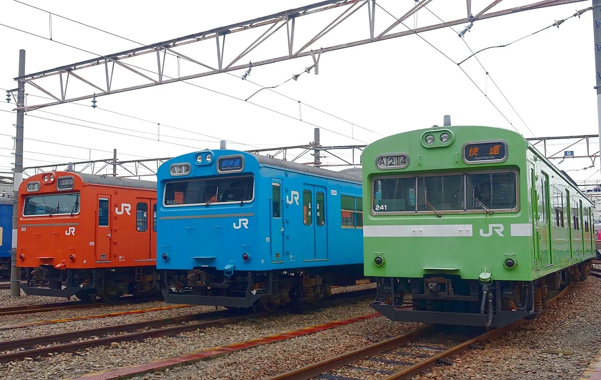
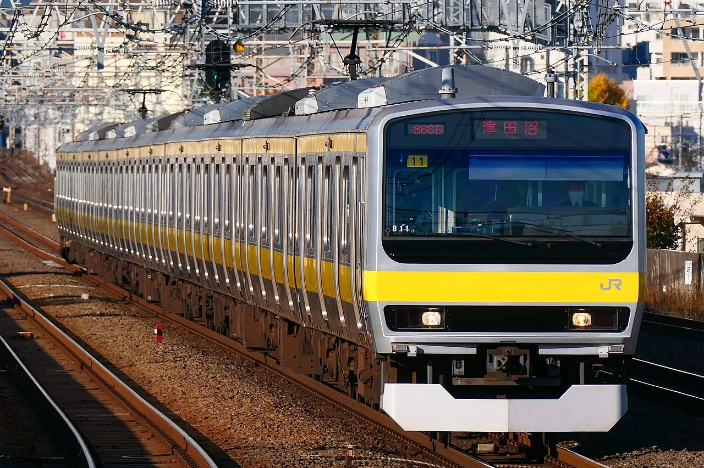
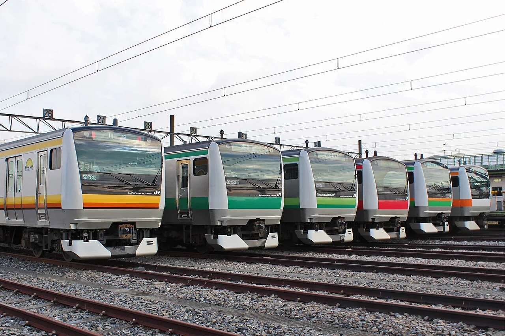
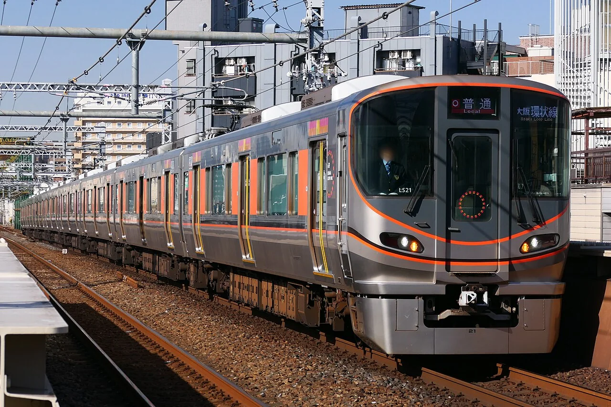
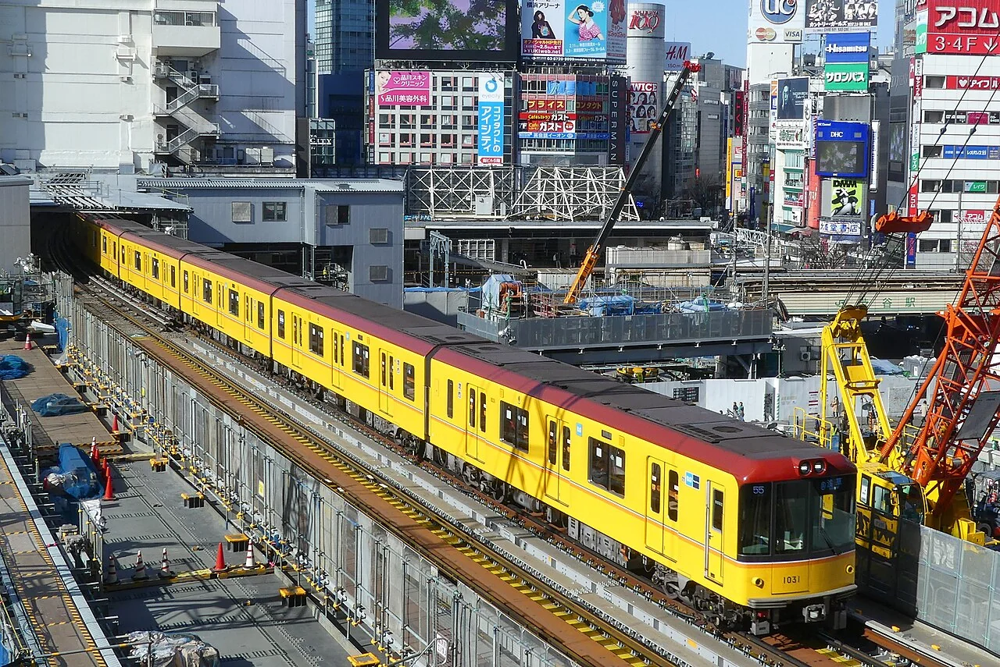
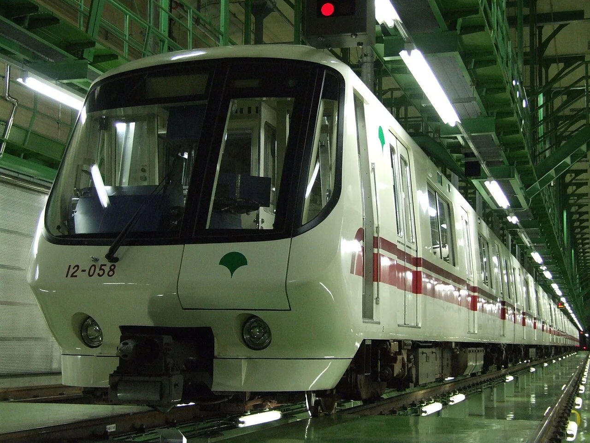
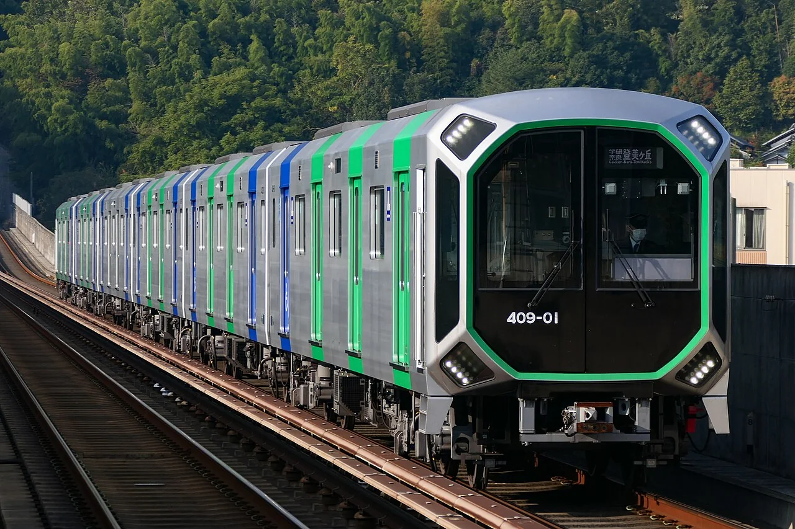
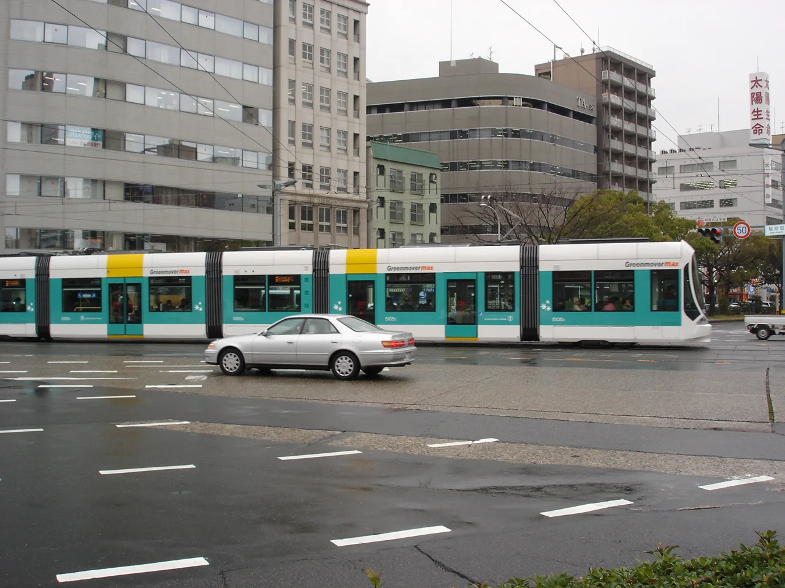

# 第六章：每天见面的日本电车

[← 新干线大家族](05_shinkansen_family.md) · [🏠 全书首页](README.md) · [日本特别列车 →](07_japan_special_trains.md) · [🎲 观察游戏](10_spotter_games.md)

最快的车不一定最忙。每天早晨，通勤电车要张开许多车门；地铁要钻进小隧道；私铁快车还会把座椅变个方向。下一站，是日本城市的日常生活。

**本章小地图**

- 063—068：JR的城市通勤车
- 069—071：黄色地铁、小隧道与宇宙飞船
- 072—074：红色快车、栗色特急和变形座椅
- 075：在广岛街道上转弯的低地板电车

🚉 **还想继续逛日本车站？** [第十一章](11_more_trains.md) 还有北海道的雪国通勤车、九州的电池电车和地方小火车；[第十二章](12_nankai_trains.md) 会沿着南海电铁去机场、海边和高野山。

## 063｜国铁103系 JNR 103 Series

**出生卡：** 1963｜日本｜通勤电车

它长着一张方方的大脸。车身穿过橙、绿、黄等许多颜色。每边四扇门，让大家快快上下车。它曾在东京、大阪和许多城市忙碌。

**找找看：** 三辆车各穿什么颜色？它们的方脸哪里一样？

> 给大人：103系自1963年起大量制造，是为城市频繁起停设计的直流通勤电车；不同线区用醒目的车身颜色帮助识别。

*图 063 · [作者与许可](IMAGE_CREDITS.md#img-t063-jnr-103)*

---

## 064｜JR东日本E231系 JR East E231 Series

**出生卡：** 2000｜日本｜通勤/近郊电车

银色车身配着路线彩带。有的站站停，有的会跑得很远。宽门和长椅让上下车更方便。车上电脑一起照看许多设备。

**找找看：** 腰带是什么颜色？它可能在哪条线跑？

> 给大人：E231系于2000年投入营业，同时发展通勤型和近郊型版本；TIMS列车信息管理系统集中传送与监控车辆数据。

*图 064 · [作者与许可](IMAGE_CREDITS.md#img-t064-jr-e231)*

---

## 065｜E233系 JR East E233 Series

**出生卡：** 2006｜日本｜通勤电车

它像E231的认真弟弟。重要设备常准备两套，坏一套还有帮手。车身会换上不同颜色的腰带。橙、蓝、绿，一眼就能认路线。

**找找看：** 车头和车侧的路线颜色连在一起吗？

> 给大人：E233系于2006年投入营业；控制、供电等关键系统采用冗余设计，并针对中央、京滨东北等不同线路形成多个番台。

*图 065 · [作者与许可](IMAGE_CREDITS.md#img-t065-jr-e233)*

---

## 066｜E235系 JR East E235 Series

**出生卡：** 2015｜日本｜通勤电车

黑色大窗框像一块会跑的屏幕。绿色E235先在山手线绕圈。车门上方的大屏幕会告诉你下一站。后来还有蓝黄相间的近郊版本。

**找找看：** 绿色是横着绕车身，还是竖着爬上车头？

> 给大人：E235系于2015年首先在山手线投入营业；用于横须贺、总武快速线的E235系1000番台自2020年起投入运营。

*图 066 · [作者与许可](IMAGE_CREDITS.md#img-t066-jr-e235)*

---

## 067｜JR西日本323系 JR West 323 Series

**出生卡：** 2016｜日本｜大阪环状线通勤

橙色腰带说：“大阪环状线到了！”每边三扇门，和这一带的列车更合拍。车内屏幕会报站和显示消息。它围着大阪的热闹街区转圈。

**找找看：** 一节车厢的一侧，是三扇门还是四扇门？

> 给大人：323系于2016年投入大阪环状线和樱岛线，取代103系、201系；三门布局也方便与直通该区域的其他三门车辆统一乘车位置。

*图 067 · [作者与许可](IMAGE_CREDITS.md#img-t067-jr-west-323)*

---

## 068｜JR东海315系 JR Central 315 Series

**出生卡：** 2022｜日本｜通勤电车

脸上画着橙色和白色粗线。长长的座椅方便大家在车内移动。它带着摄像头和清楚的显示屏。紧急断电时，电池还能帮它走一小段。

**找找看：** 车头的橙色线条拐了几个直角？

> 给大人：315系于2022年投入营业，配备车内防犯摄像头、应急走行用蓄电池，并在电力转换装置中采用高效率功率器件。

*图 068 · [作者与许可](IMAGE_CREDITS.md#img-t068-jr-central-315)*

---

## 069｜东京地铁1000系 Tokyo Metro 1000 Series

**出生卡：** 2012｜日本｜银座线地铁

柠檬黄车身像从老照片里开出来。它在银座线的小隧道里奔跑。轨旁第三轨把电送给车底。会转向的车轴帮它安静地过弯。

**找找看：** 圆灯和黄色车身，哪里最像老电车？

> 给大人：1000系于2012年投入营业，外观致敬1927年的旧1000型；它采用永久磁铁同步电动机和能让轮轴顺应曲线的操舵转向架。

*图 069 · [作者与许可](IMAGE_CREDITS.md#img-t069-tokyo-metro-1000)*

---

## 070｜都营大江户线12-000型 Toei 12-000 Series

**出生卡：** 1991｜日本｜直线电机地铁

它个子小，能钻进较小的隧道。轨道中间铺着长长的反应板。车底直线电机隔着空隙推它前进。它绕过东京许多深深的车站。

**找找看：** 紫红色腰带从黑色车窗下面绕到了哪里？

> 给大人：12-000型于1991年投入营业，是日本较早采用铁轮式直线电机的小断面地铁车辆；小断面有助于缩小隧道开挖尺寸。

*图 070 · [作者与许可](IMAGE_CREDITS.md#img-t070-toei-12-000)*

---

## 071｜大阪地铁400系 Osaka Metro 400 Series

**出生卡：** 2023｜日本｜中央线地铁

八角形大脸像一艘宇宙飞船。它在大阪中央线上奔跑。座椅、扶手和行李区照顾不同乘客。它用第三轨取电，车顶没有受电弓。

**找找看：** 大前窗的外框一共有几个角？

> 给大人：400系于2023年6月25日投入营业，面向中央线及梦洲方向服务；该线采用750伏直流第三轨供电。

*图 071 · [作者与许可](IMAGE_CREDITS.md#img-t071-osaka-metro-400)*

---

## 072｜京急2100型 Keikyu 2100 Series

**出生卡：** 1998｜日本｜私铁快特

鲜红车身像一支长箭。每节两扇侧门，车窗显得又大又整齐。座椅朝着前后，适合看沿途风景。它常奔向横滨和三浦半岛。

**找找看：** 两扇车门之间排着几扇大窗？

> 给大人：2100型于1998年投入营业，采用两门、全横向座席布局，主要担当不另收特急费的“快特”和部分座席指定列车。

*图 072 · [作者与许可](IMAGE_CREDITS.md#img-t072-keikyu-2100)*

---

## 073｜阪急9300系 Hankyu 9300 Series

**出生卡：** 2003｜日本｜私铁特急/通勤

深栗色是阪急电车的老招牌。车里有许多朝前或朝后的座椅。它在京都线上当过特急主角。亮亮木纹让车厢像一间小客厅。

**找找看：** 栗色车身会不会像镜子一样反光？

> 给大人：9300系于2003年投入京都线，采用8辆、每侧三门编组；门间以横向座席为主，兼顾特急乘坐与通勤上下车需求。

*图 073 · [作者与许可](IMAGE_CREDITS.md#img-t073-hankyu-9300)*

---

## 074｜西武40000系 Seibu 40000 Series

**出生卡：** 2017｜日本｜座席转换通勤车

一排座椅会变魔术。忙时沿墙排开，留出更多站立空间。跑远路时，它们转成面朝前后。列车还能穿过几家公司的铁路。

**找找看：** 蓝色和绿色在车头上，是怎样慢慢变到一起的？

> 给大人：40000系于2017年投入营业；0番台使用可在纵向、横向之间转换的L/C座席，并用于跨越西武、东京地铁、东急等线路的S-TRAIN。

*图 074 · [作者与许可](IMAGE_CREDITS.md#img-t074-seibu-40000)*

---

## 075｜广岛电铁5100型 Green Mover Max / Hiroshima Electric Railway 5100 Series

**出生卡：** 2005｜日本｜低地板有轨电车

五小节车身像会弯腰的毛毛虫。地板很低，上车不用爬高台阶。它在广岛街道上和汽车一起等灯。转弯时，短短车身一节节跟过去。

**找找看：** 数一数，整列车有几个能弯动的连接处？

> 给大人：5100型于2005年投入营业，是五节铰接、100%低地板的有轨电车；“Green Mover Max”由日本企业联合开发制造。

*图 075 · [作者与许可](IMAGE_CREDITS.md#img-t075-hiroden-5100)*

---

[← 新干线大家族](05_shinkansen_family.md) · [🏠 全书首页](README.md) · [日本特别列车 →](07_japan_special_trains.md) · [🎲 观察游戏](10_spotter_games.md)
