# 第八章：去机场和远方的特急

[← 地方与区域列车](07_regional_trains.md) · [🏠 全书首页](README.md) · [卧铺、观光与角色列车 →](09_sleeper_scenic.md) · [🎲 观察游戏](13_spotter_games.md)

有些列车少停几站，带大家去机场、另一座城市或很远的目的地。它们有的会倾斜过弯，有的能和普通车厢牵手，还有的把行李和座位安排得特别舒服。

**本章路线图：** 今天挑一个小站就好，不用一次看完。

- 🚉 第1站：特急老前辈（4 辆车）
- 🚉 第2站：往机场冲的快车（2 辆车）
- 🚉 第3站：会倾斜过弯（3 辆车）
- 🚉 第4站：南海小伙伴（4 辆车）
- 🚉 第5站：看窗和坐得舒服（5 辆车）
- 🚉 第6站：世界城际车（2 辆车）

> 🚉 **第1站｜特急老前辈**

## 076｜国铁20系（后改称151系）回声号 JNR 20/151 series Kodama

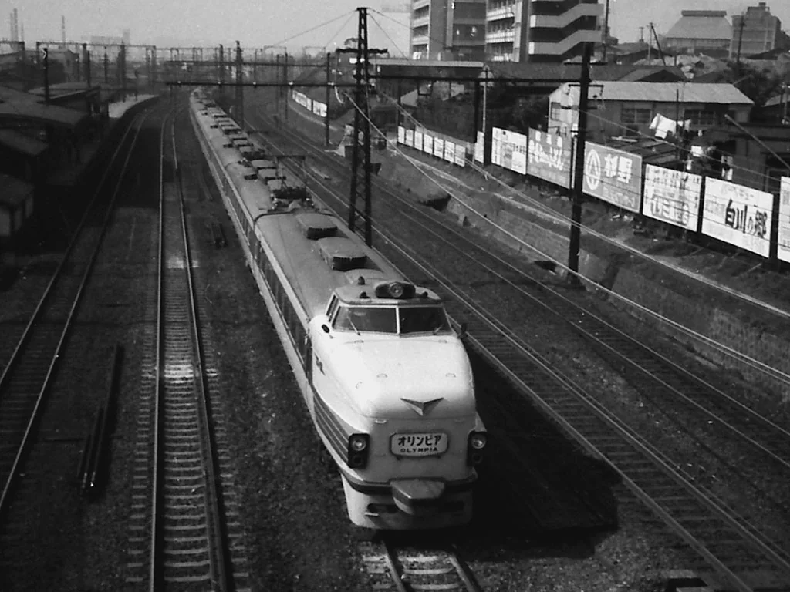

**出生卡：** 1958｜日本｜特急电车（1959年改称151系）

它穿着奶油色和红色的外衣。电从头顶的电线送进来，许多车厢一起出力。“回声”号在东京和大阪之间飞快往返。那时，它让长途电车特急变成了大明星。

**找找看：** 圆圆的长鼻子上，车灯藏在哪里？

> 给大人：这批车 1958 年以国铁 20 系之名投入“回声”号，1959 年改称 151 系，是日本长距离电车特急发展史上的重要车型。主图拍摄的是同型车在 1964 年担当“奥林匹亚”临时特急，并非 181 系“朱鹭”号。

*图 076 · [作者与许可](IMAGE_CREDITS.md#img-t076-jnr-151)*

---

## 077｜KiHa 82系 KiHa 82 series

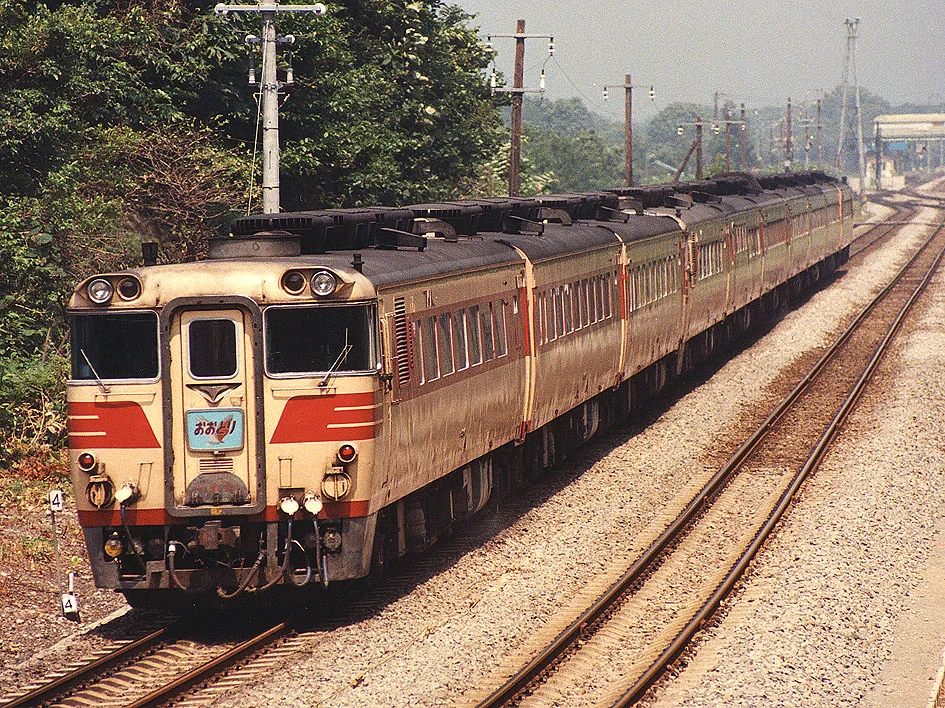

**出生卡：** 1961｜日本｜柴油特急

有些铁路没有架空电线，它也能远行。车底的柴油机轰隆隆工作，再把车轮带动起来。圆圆的车头上有一块列车名牌。它把特急列车送到了日本许多地方。

**找找看：** 车头最高处的列车名牌像什么形状？

> 给大人：KiHa 82 是 KiHa 80 系的改进型头车，装有两台柴油机；它让无需电气化线路的长距离柴油特急在日本各地普及。

*图 077 · [作者与许可](IMAGE_CREDITS.md#img-t077-kiha-82)*

---

## 079｜国铁485系 JNR 485 series

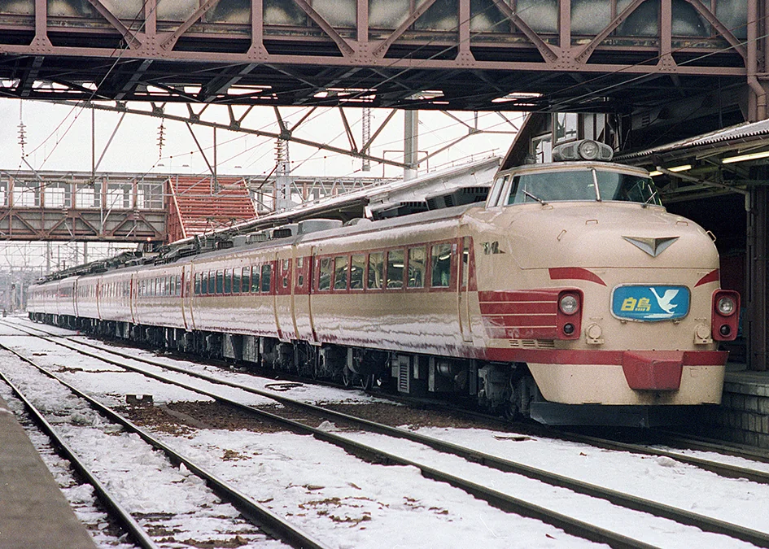

**出生卡：** 1968｜日本｜交直流特急

不同地方的电气铁路，供电办法不一定相同。485 系会适应几种常见的电流。跑到供电交界处，它不用换一台机车。于是，这张红白面孔出现在许多长途特急上。

**找找看：** 车顶上负责“接电”的受电弓在哪里？

> 给大人：485 系可使用 1,500 伏直流，以及 20 千伏、50 或 60 赫兹交流电，是国铁跨供电区长距离特急的代表车型。

*图 079 · [作者与许可](IMAGE_CREDITS.md#img-t079-jnr-485)*

---

## 080｜国铁381系 JNR 381 series

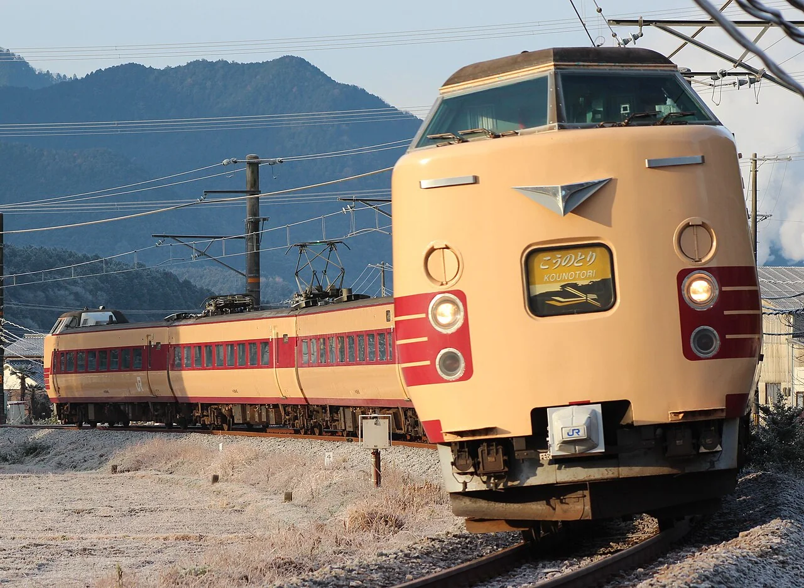

**出生卡：** 1973｜日本｜摆式特急

山里的铁路有很多弯道。381 系过弯时，车身会向弯道里面倾一点。乘客就不容易被甩向外侧。它像滑雪的人一样，侧着身子转弯。

**找找看：** 车身和铁轨是不是朝着同一方向倾斜？

> 给大人：381 系是日本首款投入营业的自然摆式特急电车；轻量铝合金车体配合摆式机构，曾广泛用于“信浓”“八云”等列车。

*图 080 · [作者与许可](IMAGE_CREDITS.md#img-t080-jnr-381)*

---

> 🚉 **第2站｜往机场冲的快车**

## 072｜京急2100型 Keikyu 2100 Series

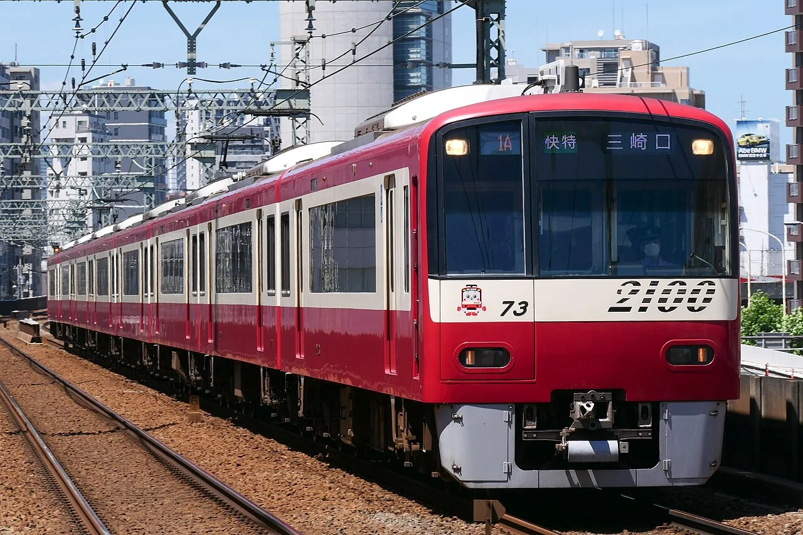

**出生卡：** 1998｜日本｜私铁快特

鲜红车身像一支长箭。每节两扇侧门，车窗显得又大又整齐。座椅朝着前后，适合看沿途风景。它常奔向横滨和三浦半岛。

**找找看：** 两扇车门之间排着几扇大窗？

> 给大人：2100型于1998年投入营业，采用两门、全横向座席布局，主要担当不另收特急费的“快特”和部分座席指定列车。

*图 072 · [作者与许可](IMAGE_CREDITS.md#img-t072-keikyu-2100)*

---

## 132｜京成AE形（第二代）Skyliner：去机场的蓝箭

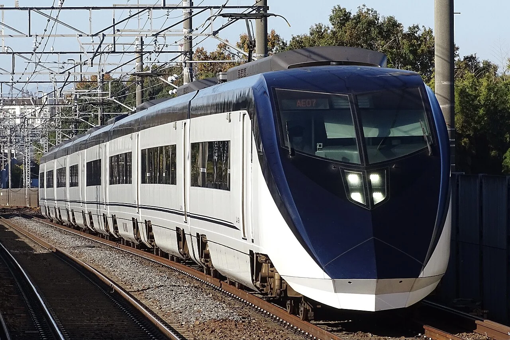

**出生卡：** 2010年｜日本东京、千叶｜机场特急电车

蓝色尖鼻子像一支快箭。它带着行李和乘客去成田机场。大窗外，城市会慢慢变成田野。

**找找看：** 尖尖的蓝色车头像哪一种鸟？

> 给大人：第二代AE形于2010年随成田Sky Access开业投入服务，Skyliner在部分区间的最高运营速度可达每小时160公里。

*图 132 · [作者与许可](IMAGE_CREDITS.md#img-t132-keisei-ae-skyliner)*

---

> 🚉 **第3站｜会倾斜过弯**

## 082｜JR九州883系 Sonic JR Kyushu 883 series

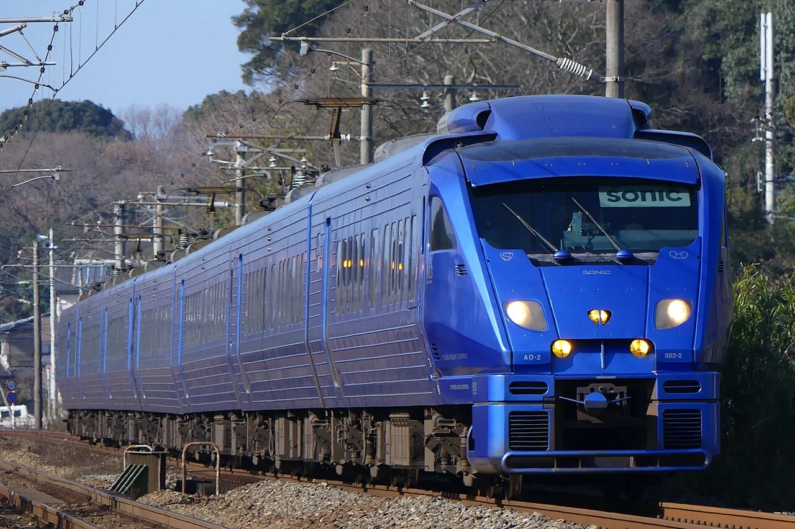

**出生卡：** 1995｜日本｜摆式特急

蓝色的 Sonic 像一台来自未来的机器。它会在弯道上轻轻倾斜。车轮继续贴着铁轨，车厢却把乘客稳稳托住。它在博多和大分方向的弯曲线路上奔跑。

**找找看：** 车头上有多少块不同形状的窗？

> 给大人：883 系采用可控制的自然摆式系统，1995 年投入日丰本线特急，后来成为“音速”号的代表车辆。

*图 082 · [作者与许可](IMAGE_CREDITS.md#img-t082-jr-kyushu-883)*

---

## 084｜JR九州885系 JR Kyushu 885 series

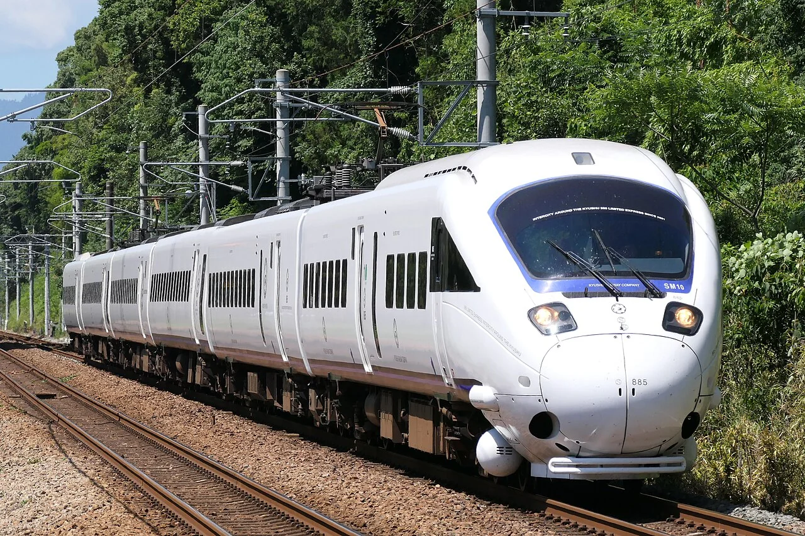

**出生卡：** 2000｜日本｜摆式特急

白色车身像一块光滑的贝壳。它也会在弯道上把身体稍稍倾斜。轻巧的车身帮助它在曲线多的线路上快跑。车里明亮的空间，让普通旅程也像一次小度假。

**找找看：** 黑色大前窗和白色车头拼成了什么表情？

> 给大人：885 系采用铝合金车体和可控制自然摆式系统，2000 年先用于“白色海鸥”，后来也广泛服务于“音速”等特急。

*图 084 · [作者与许可](IMAGE_CREDITS.md#img-t084-jr-kyushu-885)*

---

## 091｜E353系梓号 E353 series Azusa

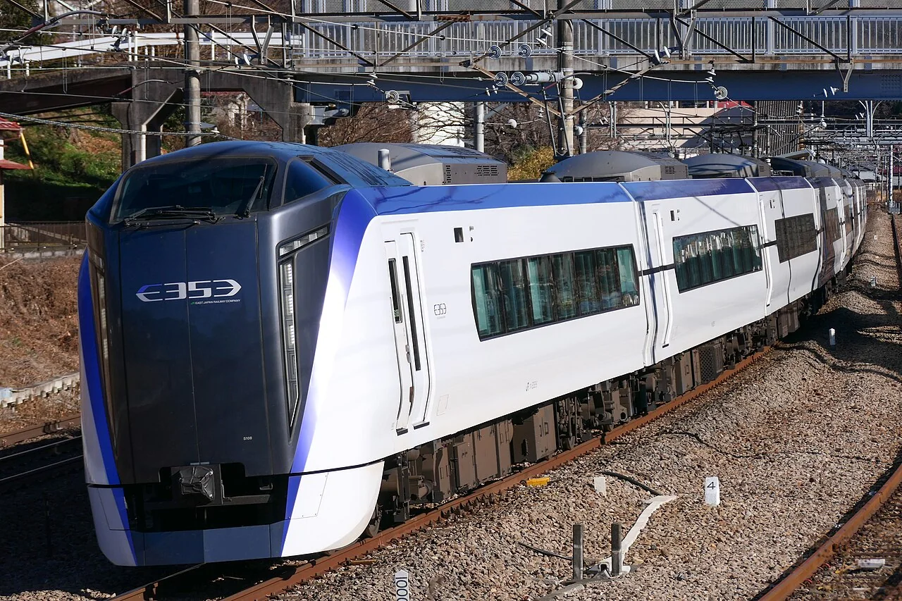

**出生卡：** 2017｜日本｜车体倾斜特急

“梓”号要穿过弯弯的中央本线。它用空气弹簧把车身一侧稍稍抬高。这样过弯时，乘客会坐得更舒服。银色车头的黑色前脸，像戴着一顶头盔。

**找找看：** 紫色线条在银色车身上拐了几个弯？

> 给大人：E353 系使用空气弹簧式车体倾斜装置，而不是传统摆锤机构；2017 年起投入“梓”号等中央本线特急。

*图 091 · [作者与许可](IMAGE_CREDITS.md#img-t091-jr-e353)*

---

> 🚉 **第4站｜南海小伙伴**

## 133｜南海50000系 Rapi:t：蓝色骑士

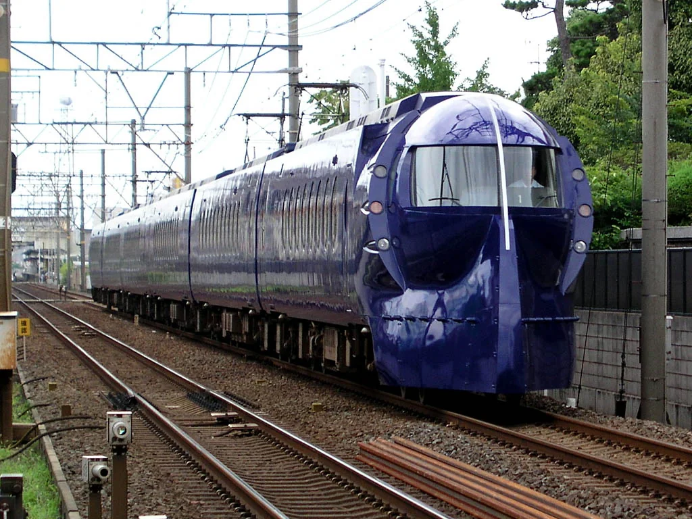

**出生卡：** 1994年｜日本大阪｜机场特急电车

深蓝车头像戴着骑士头盔。圆圆的窗户一扇接一扇。它从大阪出发，把旅客送往关西机场。

**找找看：** 一节车厢能看到几扇椭圆窗？

> 给大人：南海50000系自1994年起担当机场特急Rapi:t，深蓝车身、流线形车头和椭圆窗共同组成了鲜明外观。

*图 133 · [作者与许可](IMAGE_CREDITS.md#img-t133-nankai-50000-rapit)*

---

## 143｜南海12000系 Southern Premium：海浪牵手号

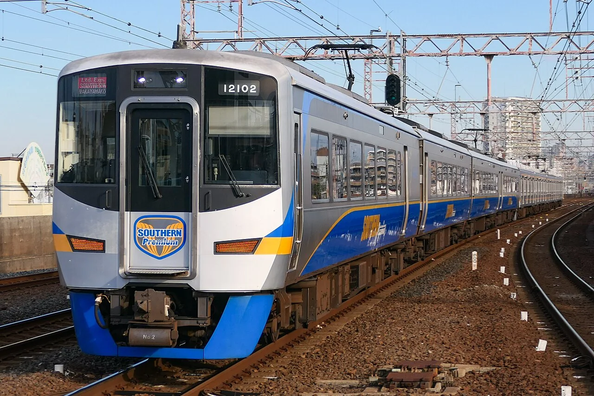

**出生卡：** 2011年｜日本大阪、和歌山｜座席指定特急电车

蓝色和橙色线条像海浪。四节 12000 系是指定席车厢，常和四节自由席车厢牵手。八节伙伴一起从难波跑向和歌山。

**找找看：** 蓝色和橙色的“海浪”从车头游到了哪里？

> 给大人：南海12000系于2011年投入服务，主要担当特急Southern的四辆指定席部分，并与四辆一般自由席车组成八辆列车。

*图 143 · [作者与许可](IMAGE_CREDITS.md#img-t143-nankai-12000-southern-premium)*

---

## 144｜南海10000系 Southern：会换衣服的老前辈

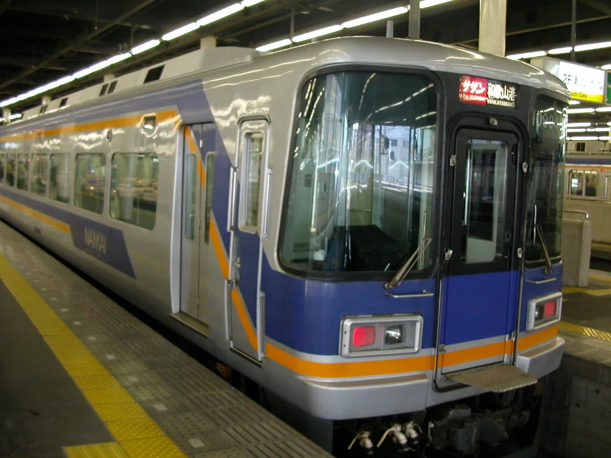

**出生卡：** 1985年｜日本大阪、和歌山｜座席指定特急电车

它是 Southern 的老前辈。四节指定席车厢也常和四节自由席车厢牵手。有一列还换回了从前的两种绿色外衣。

**找找看：** 车头的列车名牌写着 “Southern” 吗？

> 给大人：南海10000系自1985年起用于Southern，2025年其中一个四辆编组换上早期的深浅绿色纪念涂装，因此不同照片里的颜色可能不同。

*图 144 · [作者与许可](IMAGE_CREDITS.md#img-t144-nankai-10000-southern)*

---

## 148｜金色12000系 Semboku Liner：闪亮奖牌号

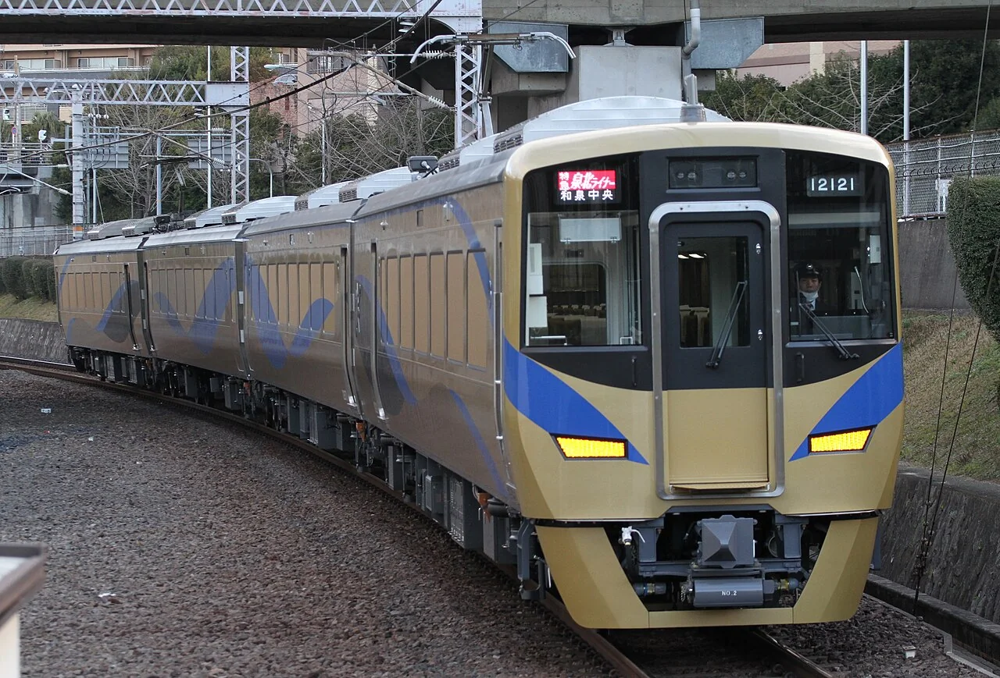

**出生卡：** 2017年｜日本大阪｜座席指定特急电车

金色车身像一块会跑的奖牌。它从难波去和泉中央，四节车厢都有指定座位。车门旁的彩色圆点代表沿线的几个地方。

**找找看：** 星星标志周围围着几个彩色圆点？

> 给大人：金色12000系于2017年开始担当Semboku Liner，但这项服务也会使用11000系，因此服务名不能只等同于一种车型。

*图 148 · [作者与许可](IMAGE_CREDITS.md#img-t148-nankai-12000-semboku-liner)*

---

> 🚉 **第5站｜看窗和坐得舒服**

## 073｜阪急9300系 Hankyu 9300 Series

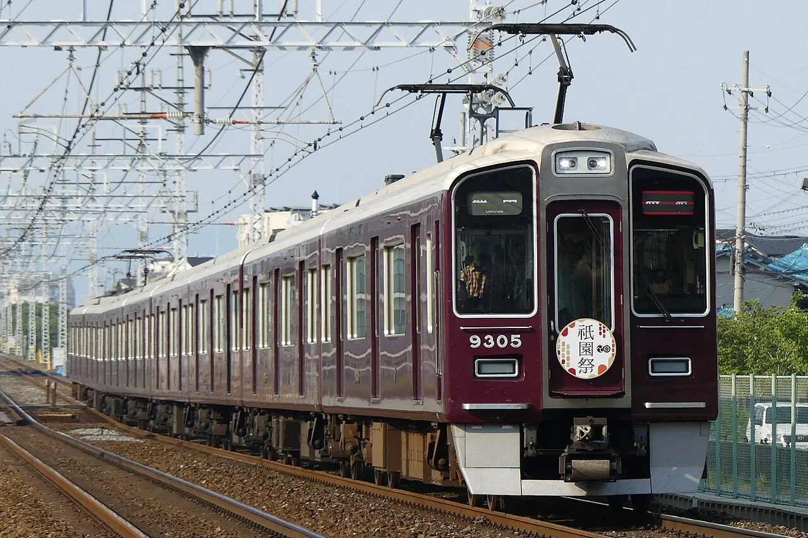

**出生卡：** 2003｜日本｜私铁特急/通勤

深栗色是阪急电车的老招牌。车里有许多朝前或朝后的座椅。它在京都线上当过特急主角。亮亮木纹让车厢像一间小客厅。

**找找看：** 栗色车身会不会像镜子一样反光？

> 给大人：9300系于2003年投入京都线，采用8辆、每侧三门编组；门间以横向座席为主，兼顾特急乘坐与通勤上下车需求。

*图 073 · [作者与许可](IMAGE_CREDITS.md#img-t073-hankyu-9300)*

---

## 093｜西武001系 Laview Seibu 001 series

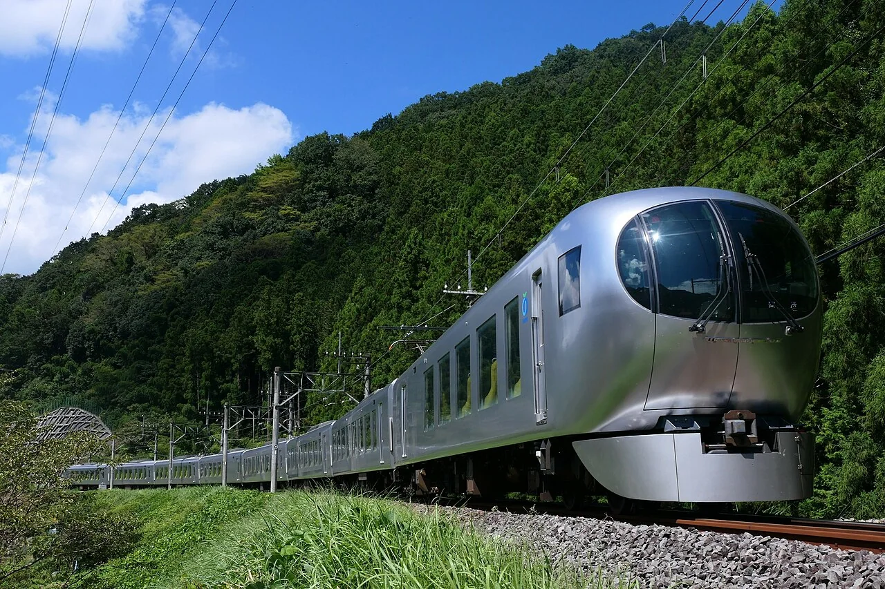

**出生卡：** 2019｜日本｜特急

Laview 像一颗闪亮的银色胶囊。车头没有尖角，窗户却大得像一面墙。窗外的山和城市，几乎从地板一直看到头顶。柔软的黄色座椅让车厢像一间客厅。

**找找看：** 侧面的大窗，最高处快碰到车顶了吗？

> 给大人：001 系由建筑师妹岛和世参与设计，采用 8 节铝合金车体，2019 年投入池袋线和西武秩父线特急服务。

*图 093 · [作者与许可](IMAGE_CREDITS.md#img-t093-seibu-laview)*

---

## 094｜近铁火之鸟80000系 Kintetsu 80000 series Hinotori

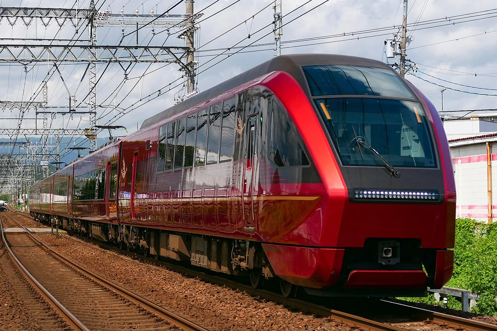

**出生卡：** 2020｜日本｜特急

亮红色的“火之鸟”往返大阪和名古屋。两端车厢的地板更高，前方景色看得更远。座椅后背很特别，躺下时不容易挤到后排。长途旅行也能舒舒服服。

**找找看：** 车头两侧的金色标志像不像翅膀？

> 给大人：近铁 80000 系于 2020 年投入名阪特急，设 6 节和 8 节编组；两端为高地板 Premium 车厢，中间为 Regular 车厢。

*图 094 · [作者与许可](IMAGE_CREDITS.md#img-t094-kintetsu-hinotori)*

---

## 097｜东武N100系 SPACIA X Tobu N100 series

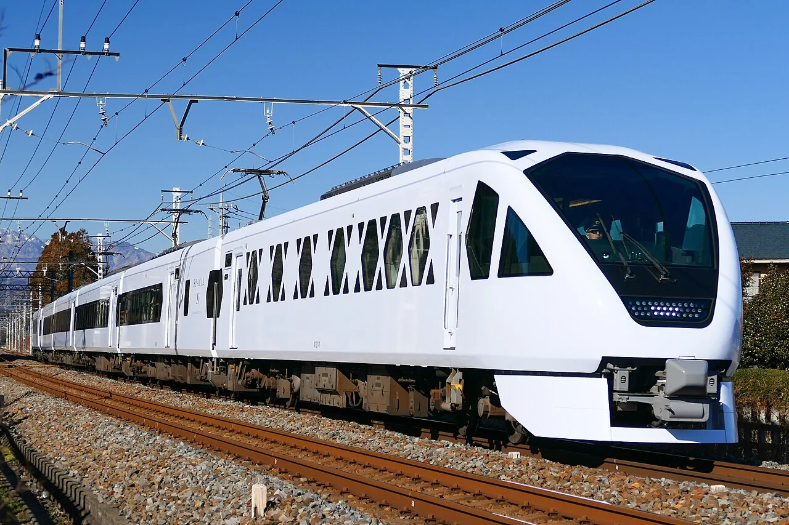

**出生卡：** 2023｜日本｜特急

SPACIA X 穿着像白瓷一样的外衣。黑色大前窗和方格小窗，拼成很醒目的脸。车内有面向前方的休息区，也有不同模样的座席。它从东京浅草方向驶向日光和鬼怒川。

**找找看：** 车头的黑色大窗有几个角？

> 给大人：东武 N100 系采用 6 节编组，2023 年投入浅草至东武日光、鬼怒川温泉方向，作为 100 系 SPACIA 的新一代特急车辆。

*图 097 · [作者与许可](IMAGE_CREDITS.md#img-t097-spacia-x)*

---

## 135｜阪急2300系（第二代）：栗色京都特急

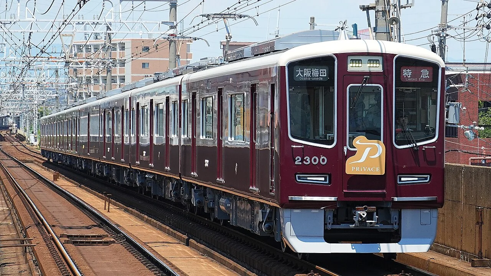

**出生卡：** 2024年｜日本大阪、京都｜特急电车

亮亮的栗色是阪急的招牌。它在大阪和京都之间跑特急。列车里还有一节能先订好座位的车厢。

**找找看：** 栗色车身在哪些地方像一面镜子？

> 给大人：第二代阪急2300系于2024年在京都线投入服务，编组中设有一辆名为PRiVACE的座席指定车厢。

*图 135 · [作者与许可](IMAGE_CREDITS.md#img-t135-hankyu-2300-ii)*

---

> 🚉 **第6站｜世界城际车**

## 140｜Vande Bharat：许多车厢一起出力

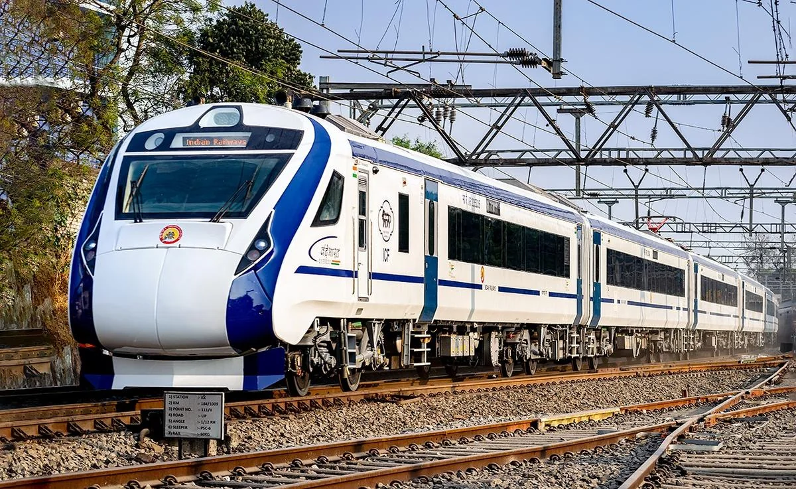

**出生卡：** 2019年｜印度｜城际电动车组

白色车身画着蓝色或橙色线条。它不用另挂一台机车，许多车厢一起出力。自动门会等列车停好再打开。

**找找看：** 流线形车头像不像一顶白色头盔？

> 给大人：首列Vande Bharat于2019年投入德里至瓦拉纳西服务，是把动力设备分散在编组中的印度制造城际电动车组家族。

*图 140 · [作者与许可](IMAGE_CREDITS.md#img-t140-vande-bharat)*

---

## 153｜CR200J：“绿巨人”长长队

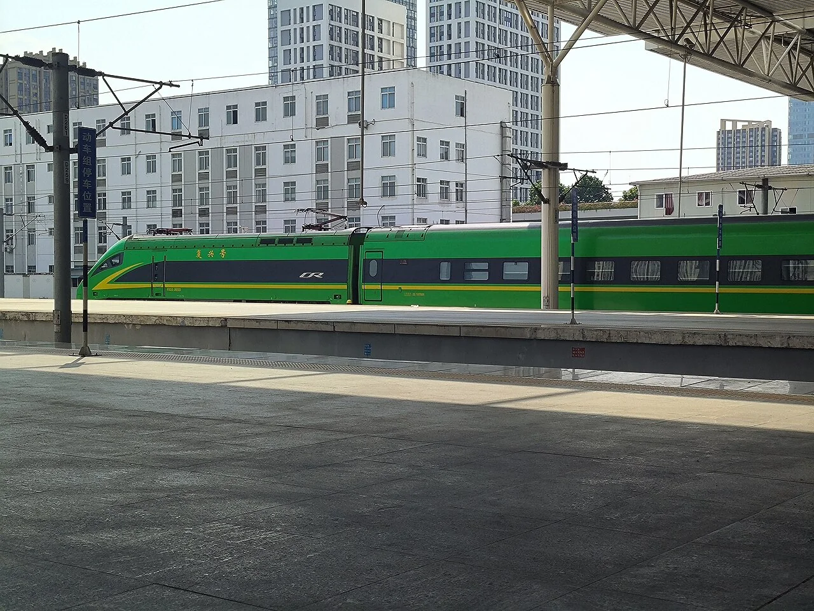

**出生卡：** 2019年｜中国｜动力集中式动车组

绿色长列车两端看起来都像有车头。大力气主要集中在一端或两端的动力车里。中间的许多车厢用来装乘客。

**找找看：** 绿色车身上的黑色车窗排成了多长一队？

> 给大人：CR200J于2019年1月开始载客，是160公里速度等级的动力集中式复兴号动车组；不同批次有长短编组及高原等版本，动力车和控制车的安排并不完全一样。“绿巨人”是常用昵称。

*图 153 · [作者与许可](IMAGE_CREDITS.md#img-t153-cr200j)*

---

[← 地方与区域列车](07_regional_trains.md) · [🏠 全书首页](README.md) · [卧铺、观光与角色列车 →](09_sleeper_scenic.md) · [🎲 观察游戏](13_spotter_games.md)
