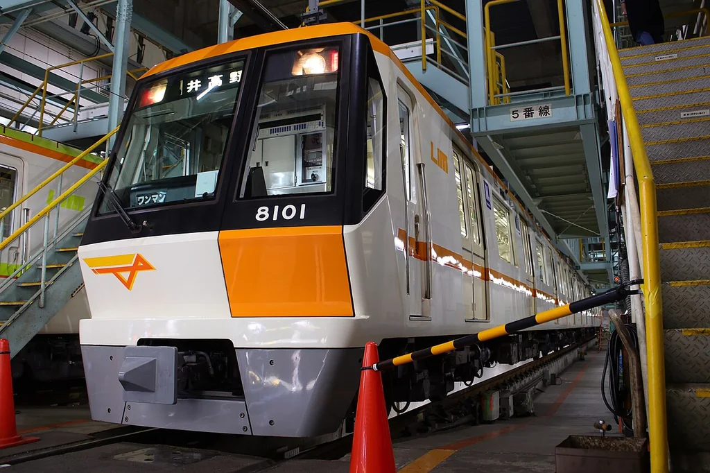
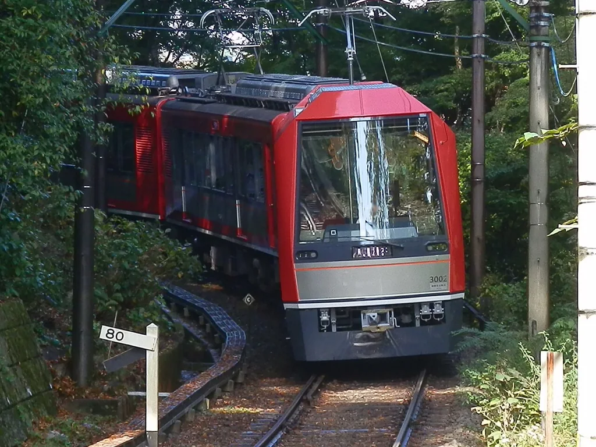
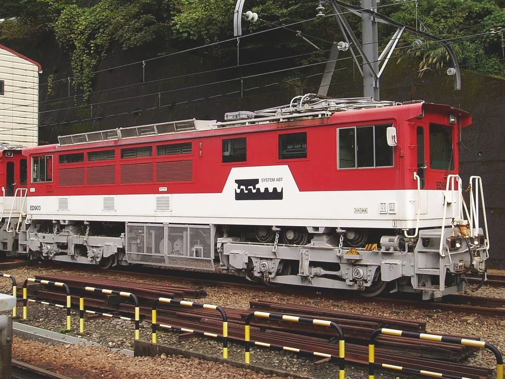
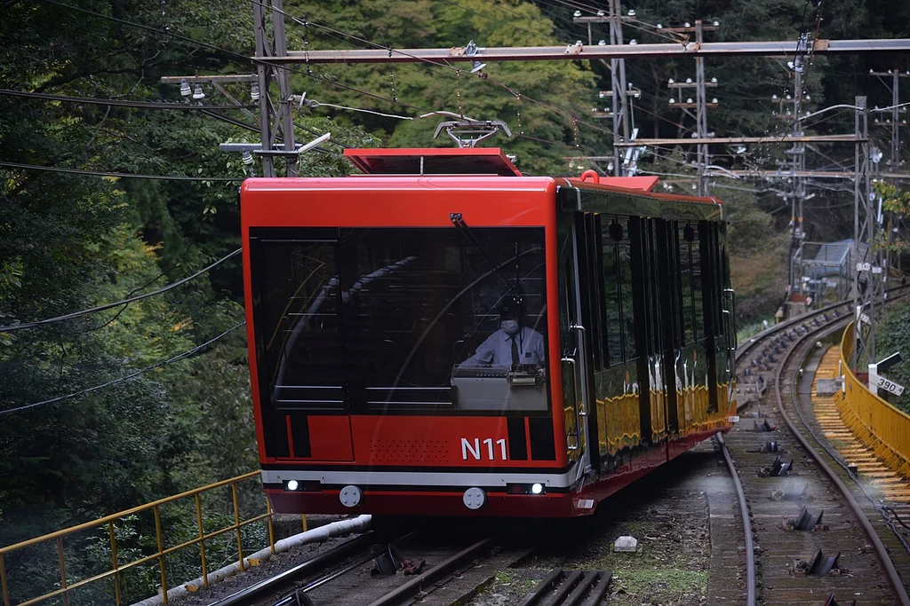
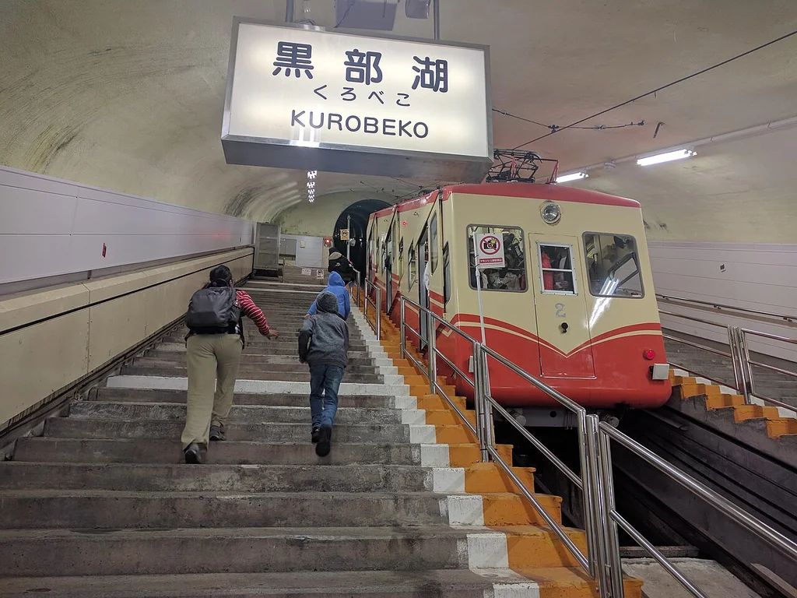
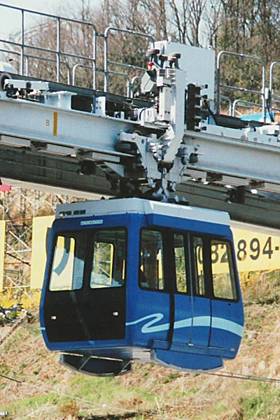
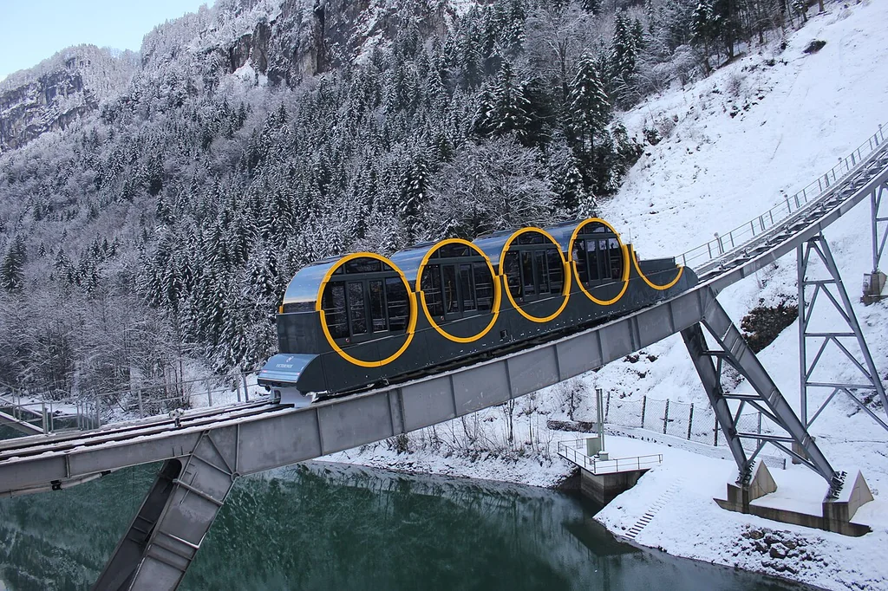

# 第九章：轨道在头顶、脚下和山肚子里

[← 工作火车](08_work_trains.md) · [🏠 全书首页](README.md) · [观察游戏 →](10_spotter_games.md)

火车不一定踩着两根钢轨。有的骑在一根大梁上，有的吊在轨道下面，有的穿着橡胶轮胎，还有的被磁力托起。请在照片里找一找：究竟是什么在托住车？

## 本章小站

- [103｜伍珀塔尔悬挂铁路](#103伍珀塔尔悬挂铁路-wuppertal-schwebebahn-gtw-15)
- [104｜东京单轨电车](#104东京单轨电车-10000-型)
- [105｜迪士尼度假区线](#105迪士尼度假区线-type-c)
- [106｜千叶 Urban Flyer](#106千叶都市单轨-urban-flyer-0-型)
- [107｜湘南单轨](#107湘南单轨-5000-系)
- [108｜Linimo](#108linimo-100-系)
- [109｜上海磁浮](#109上海磁浮-transrapid)
- [110｜L0 超导磁悬浮](#110l0-系超导磁悬浮)
- [111｜百合鸥号](#111百合鸥号-7500-系)
- [112｜神户 Port Liner](#112神户-port-liner-2000-型)
- [113｜札幌地铁 9000 型](#113札幌地铁-9000-型)
- [114｜大阪地铁 80 系](#114大阪地铁-80-系)
- [115｜箱根登山 Allegra](#115箱根登山电车-3000-型-allegra)
- [116｜大井川铁道 ED90](#116大井川铁道-ed90-齿轨机车)
- [117｜高野山缆车](#117高野山缆车-n10n20-型)
- [118｜黑部登山缆车](#118黑部登山缆车)
- [119｜广岛 Skyrail](#119广岛-skyrail-200-型)
- [120｜Stoos 桶形缆车](#120stoos-桶形缆车)

## 103｜伍珀塔尔悬挂铁路 Wuppertal Schwebebahn GTW 15

**出生卡：** 线路 1901 年开放；这代车 2016 年载客｜德国｜悬挂式铁路

轨道和轮子都在车厢上面。车厢吊在下面，像一只结实的篮子。线路有一段沿着河面伸展。今天的新车仍在这条百年老路上行驶。

**找找看：** 车厢和上方轨道之间，有几根“脖子”？

> 给大人：GTW 15 是现役车辆的一代；“悬挂”不等于“磁悬浮”，它仍由轮子在上方钢轨上滚动。

*图 103 · [作者与许可](IMAGE_CREDITS.md#img-t103-wuppertal-gtw15)*

---

## 104｜东京单轨电车 10000 型

**出生卡：** 2014｜日本东京｜跨座式单轨

这列车骑在一根粗粗的梁上。轮胎藏在车身下面和两侧。它会经过城市、运河和机场。坐在窗边，常能看见飞机。

**找找看：** 粗轨道梁的顶面，是不是被车身挡住了？

> 给大人：东京单轨连接市区与羽田机场；10000 型自 2014 年开始营业运行。

*图 104 · [作者与许可](IMAGE_CREDITS.md#img-t104-tokyo-monorail-10000)*

---

## 105｜迪士尼度假区线 Type C

**出生卡：** 2020｜日本千叶｜环形跨座式单轨

它绕着度假区一圈圈行驶。车轮跨坐在高架大梁上。圆圆的窗户和吊环很容易认。不同列车还会穿不同颜色的外衣。

**找找看：** 照片里有几个圆耳朵形状？

> 给大人：Type C 是 2020 年起陆续投入的车辆；主题装饰不改变它作为跨座式单轨的基本结构。

*图 105 · [作者与许可](IMAGE_CREDITS.md#img-t105-disney-resort-type-c)*

---

## 106｜千叶都市单轨 Urban Flyer 0 型

**出生卡：** 2012｜日本千叶｜悬挂式单轨

车轮藏在头顶的箱形轨道里。车厢吊在下方，从街道上空经过。地板附近也有小窗，可以看见脚下。转弯时，车身会轻轻摆动。

**找找看：** 轨道是在车顶上，还是在车底下？

> 给大人：千叶都市单轨采用 SAFEGE 式悬挂结构；0 型又称 Urban Flyer。

*图 106 · [作者与许可](IMAGE_CREDITS.md#img-t106-chiba-urban-flyer)*

---

## 107｜湘南单轨 5000 系

**出生卡：** 2004｜日本神奈川｜悬挂式单轨

它也把轮子藏在上方轨道里。线路有坡、有弯，还有隧道。窗外一下看屋顶，一下看山坡。坐起来很像一趟空中探险。

**找找看：** 车厢上方哪一部分把它接到轨道？

> 给大人：5000 系的走行轮与导向轮在箱形轨道内滚动；它不是磁悬浮，也不是缆车。

*图 107 · [作者与许可](IMAGE_CREDITS.md#img-t107-shonan-monorail-5000)*

---

## 108｜Linimo 100 系

**出生卡：** 2005｜日本爱知｜常导磁悬浮

电磁铁把车身托离导轨一点点。列车不用钢轮一直压着轨道跑。直线电机沿着线路拉它前进。即使慢慢进站，它通常也保持悬浮；只有发生故障时，备用滚轮才会帮忙。

**找找看：** 它的车头很低，和新干线的长鼻子一样吗？

> 给大人：Linimo 是常导、低速城市磁悬浮，悬浮间隙约 8 毫米；不要与超导 L0 系混为一谈。

*图 108 · [作者与许可](IMAGE_CREDITS.md#img-t108-linimo)*

---

## 109｜上海磁浮 Transrapid

**出生卡：** 2004｜中国上海｜高速常导磁悬浮

它用磁力托起、引导并推动列车。专用导轨看起来像一条宽梁。车头圆滑，适合快速穿过空气。它把机场和城市交通连在一起。

**找找看：** 它的导轨像普通两根钢轨吗？

> 给大人：上海磁浮采用德国 Transrapid 技术；商业运行最高速度会随运营安排调整，因此儿童正文不写固定数字。

*图 109 · [作者与许可](IMAGE_CREDITS.md#img-t109-shanghai-maglev)*

---

## 110｜L0 系超导磁悬浮

**出生卡：** 2013 年开始试验｜日本｜超导磁悬浮试验车

它的鼻子又细又长。速度低时，小轮子先托着列车。加快以后，磁力让车身浮起来。它正在为未来的中央新干线试验技术。

**找找看：** 车头从尖端到车窗，有多长一段没有座位？

> 给大人：L0 系以约 500 千米/小时的未来营业速度为设计目标；它使用超导磁体，与 Linimo 的常导系统不同。

*图 110 · [作者与许可](IMAGE_CREDITS.md#img-t110-l0-maglev)*

---

## 111｜百合鸥号 7500 系

**出生卡：** 2018｜日本东京｜自动导向胶轮列车

它在专用高架路上滚着橡胶轮胎。旁边的导向轮帮它沿线路转弯。车上平常没有驾驶员手动开车。坐在最前面，就能看见轨道向远处伸去。

**找找看：** 它只有一根梁吗，还是走在一条平整的路上？

> 给大人：百合鸥号是自动导向交通系统，不是单轨；7500 系是 7300 系家族的后续批次。

*图 111 · [作者与许可](IMAGE_CREDITS.md#img-t111-yurikamome-7500)*

---

## 112｜神户 Port Liner 2000 型

**出生卡：** 2006｜日本神户｜自动导向胶轮列车

这列小车穿梭在城市、港口和人工岛之间。橡胶轮胎在平整走行面上滚动。侧边导向轮让它不会跑偏。列车由系统自动控制。

**找找看：** 一列车有几节短短的车厢？

> 给大人：神户 Port Liner 是日本早期投入营业的无人自动导向交通系统之一；2000 型于 2006 年登场。

*图 112 · [作者与许可](IMAGE_CREDITS.md#img-t112-port-liner-2000)*

---

## 113｜札幌地铁 9000 型

**出生卡：** 2015｜日本札幌｜中央导向胶轮地铁

它穿着橡胶轮胎在走行面上滚。线路中央还有导向轨，帮列车认路。车厢为寒冷多雪的城市服务。大部分旅程都藏在地下。

**找找看：** 车头中央的蓝紫色线条像不像一条领带？

> 给大人：札幌地铁各线采用胶轮与中央导向方式；9000 型服务于东丰线。

*图 113 · [作者与许可](IMAGE_CREDITS.md#img-t113-sapporo-9000)*

---

## 114｜大阪地铁 80 系

**出生卡：** 2006｜日本大阪｜直线电机地铁

它的电动机像被摊开成长长一条。车底和轨道一起产生向前的力量。设备能做得较扁，隧道也可以较小。它仍用钢轮走在钢轨上。

**找找看：** 车身是不是比许多大火车更矮、更窄？

> 给大人：80 系是大阪地铁今里筋线车辆；“直线电机”是牵引方式，不代表磁悬浮。

*图 114 · [作者与许可](IMAGE_CREDITS.md#img-t114-osaka-metro-80)*

---

## 115｜箱根登山电车 3000 型 Allegra

**出生卡：** 2014｜日本神奈川｜陡坡山地电车

它用普通钢轮爬很陡的山。线路用急弯和折返慢慢升高。到了折返处，列车会换个方向继续走。大窗户把山林装进车厢。

**找找看：** 轨道旁边，能找到写着“80”的小牌子吗？

> 给大人：箱根登山铁路最大坡度达 80‰，但不是齿轨铁路；折返式线路与强力制动帮助它翻山。

*图 115 · [作者与许可](IMAGE_CREDITS.md#img-t115-hakone-allegra)*

---

## 116｜大井川铁道 ED90 齿轨机车

**出生卡：** 1990｜日本静冈｜齿轨电力机车

两根普通钢轨中间多了一条“拉链”。机车底下的齿轮咬住它。这样爬陡坡时，不容易打滑。小机车会帮助列车通过最陡的一段。

**找找看：** 车身侧面的“齿条”小图案，像不像一排牙齿？

> 给大人：大井川铁道井川线的陡坡区间采用 Abt 式齿轨；ED90 在 1990 年线路改建后投入使用。

*图 116 · [作者与许可](IMAGE_CREDITS.md#img-t116-oigawa-ed90)*

---

## 117｜高野山缆车 N10/N20 型

**出生卡：** 2019｜日本和歌山｜缆索铁路

车厢沿着陡陡的山坡排成台阶。钢索拉着它上山和下山。常见运行里，两辆车一上一下互相帮忙。乘客坐着，地板不会像山坡一样斜。

**找找看：** 车厢是不是朝山上仰着头？

> 给大人：现行 N10/N20 型为高野山缆车第四代车辆，于 2019 年投入营业。

*图 117 · [作者与许可](IMAGE_CREDITS.md#img-t117-koyasan-cable)*

---

## 118｜黑部登山缆车

**出生卡：** 1969｜日本富山｜全地下缆索铁路

整条线路都藏在山肚子里。缆索拉着车厢走过黑暗坡道。这样可以少让大雪盖住轨道。上下车站连接着壮观的立山黑部路线。

**找找看：** 照片里能看见天空吗？

> 给大人：黑部登山缆车全线位于隧道内，是立山黑部阿尔卑斯路线的一段。

*图 118 · [作者与许可](IMAGE_CREDITS.md#img-t118-kurobe-cable)*

---

## 119｜广岛 Skyrail 200 型

**出生卡：** 1998-2024｜日本广岛｜已停运的悬挂式缆索交通

小车厢像胶囊一样吊在轨道下。站间由缆索拉着它爬陡坡。到车站时，直线电机帮它加速和减速。这个特别系统已经结束营业，但照片留下了它的样子。

**找找看：** 一辆小车里大约能坐多少人？先用车窗猜一猜。

> 给大人：Skyrail Midorizaka Line 于 2024 年 5 月结束营业；它结合悬挂走行、缆索牵引与站内直线电机。

*图 119 · [作者与许可](IMAGE_CREDITS.md#img-t119-hiroshima-skyrail)*

---

## 120｜Stoos 桶形缆车

**出生卡：** 2017｜瑞士｜超陡缆索铁路

一节节车厢像透明圆桶。山坡越来越陡时，圆桶会慢慢转动。车内地板因此仍接近平平的。钢索带着整列车爬上山村。

**找找看：** 每个圆桶的地板，和山坡是不是同一个角度？

> 给大人：新 Stoosbahn 最大坡度为 110%（约 47.7 度）；旋转乘客舱让地板随坡度保持水平。

*图 120 · [作者与许可](IMAGE_CREDITS.md#img-t120-stoosbahn)*

---

[← 工作火车](08_work_trains.md) · [🏠 全书首页](README.md) · [观察游戏 →](10_spotter_games.md)
