# 第十章：火车头和铁路工作队

[← 卧铺、观光与角色列车](09_sleeper_scenic.md) · [🏠 全书首页](README.md) · [特别的导轨列车 →](11_unusual_guideways.md) · [🎲 观察游戏](13_spotter_games.md)

有些列车把动力分在许多节车厢里；有些火车头自己不装乘客，专门拉着客车或货车前进。除雪车和工程车还会照顾铁路。想找跑在高速线上的检测车，可以去[第五章](05_high_speed_specialists.md)看看黄色医生。

**本章路线图：** 今天挑一个小站就好，不用一次看完。

- 🚉 第1站：火车头老前辈（4 辆车）
- 🚉 第2站：世界火车头（4 辆车）
- 🚉 第3站：搬大箱子（2 辆车）
- 🚉 第4站：除雪和修路（2 辆车）

> 🚉 **第1站｜火车头老前辈**

## 018｜瑞士鳄鱼 Ce 6/8 II

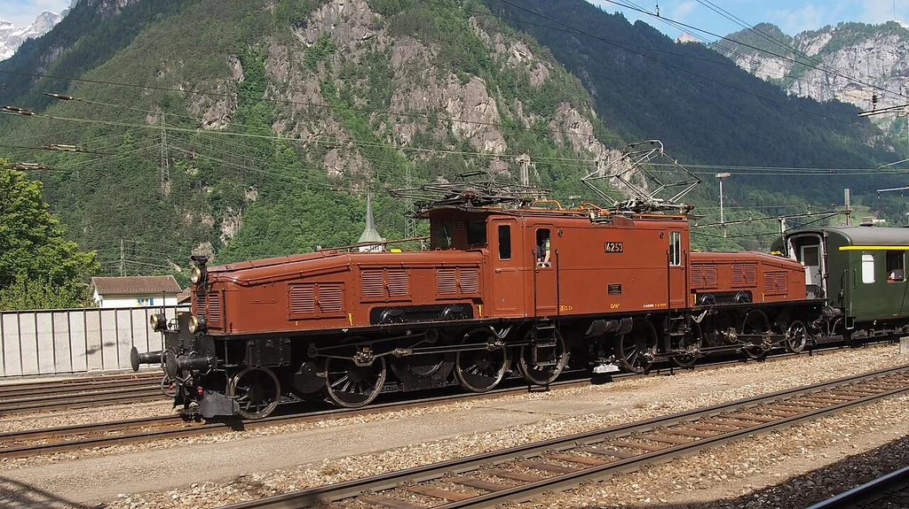

**出生卡：** 1919｜瑞士｜电力机车

它的两头都有长长的“鼻子”，难怪大家叫它“鳄鱼”。中间车身和两端能稍微转动。车轮旁边的长连杆会一起动。受电弓从头顶电线取电。

**找找看：** 两端车轮旁边的连杆像不像一排尺子？

> 给大人：Ce 6/8 II 为电气化的圣哥达山线而造，铰接式三段车体和连杆传动使它得到“鳄鱼”昵称；主图为保存至今的实车。

*图 018 · [作者与许可](IMAGE_CREDITS.md#img-t018-sbb-crocodile)*

---

## 021｜GG1 GG1

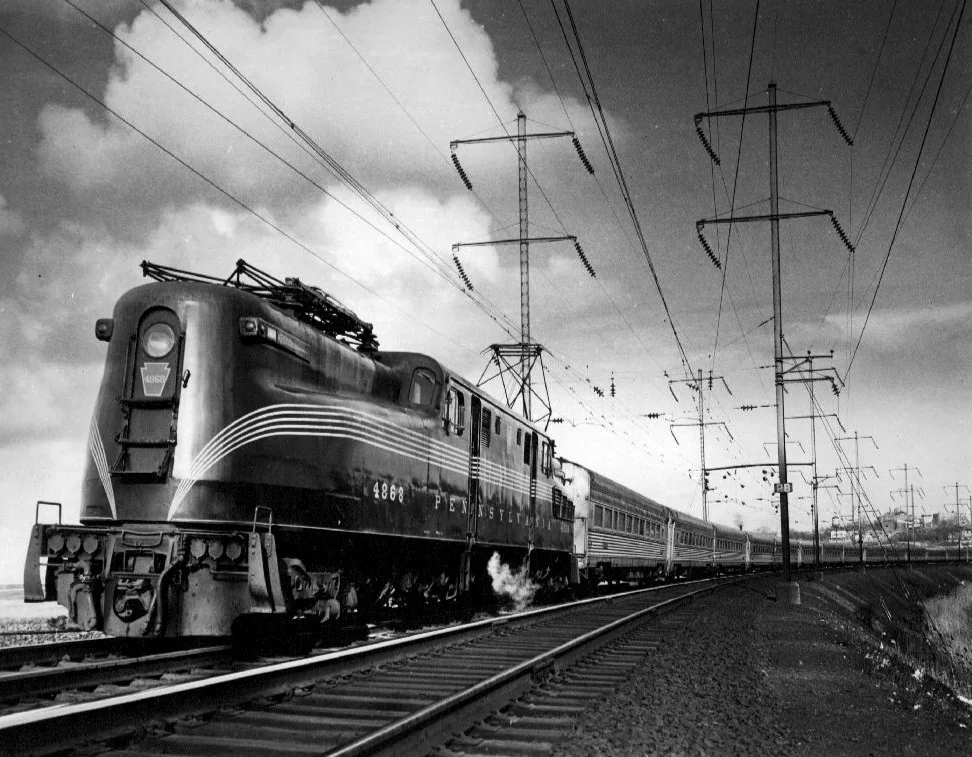

**出生卡：** 1934｜美国｜电力机车

GG1 两头都能当车头。圆润外壳上画着细细的长条纹。车顶受电弓从电线取电。它既拉过快客车，也拉过重货车。

**找找看：** 车顶有几只可以折叠的受电弓？

> 给大人：宾夕法尼亚铁路于 1934—1943 年间购入 139 台 GG1；生产型的焊接流线车壳和条纹方案经工业设计师雷蒙德·洛伊改进。

*图 021 · [作者与许可](IMAGE_CREDITS.md#img-t021-gg1)*

---

## 023｜EMD F7 EMD F7

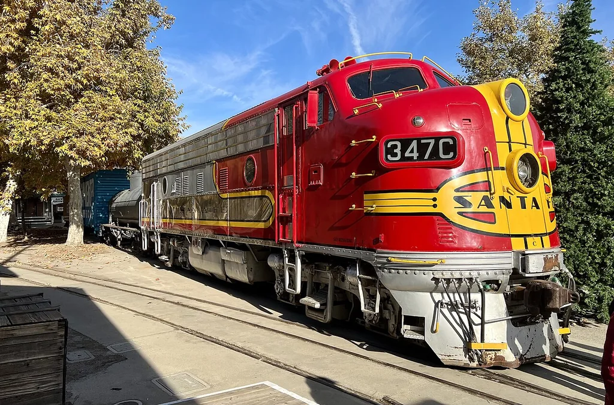

**出生卡：** 1949｜美国｜柴油电力机车

圆圆的高车头看起来很结实。柴油机带动发电机，电动机再转动车轮。几台 F7 可以一前一后连起来工作。它拉过货车，也穿过客运列车的亮丽外衣。

**找找看：** 车头正面有几扇窗、几盏灯？

> 给大人：F7 是通用汽车电气动力分部最畅销的 F 系列“驾驶室单元”，1949 年投产，每个动力单元额定约 1,500 马力。

*图 023 · [作者与许可](IMAGE_CREDITS.md#img-t023-emd-f7)*

---

## 024｜VL80 VL80

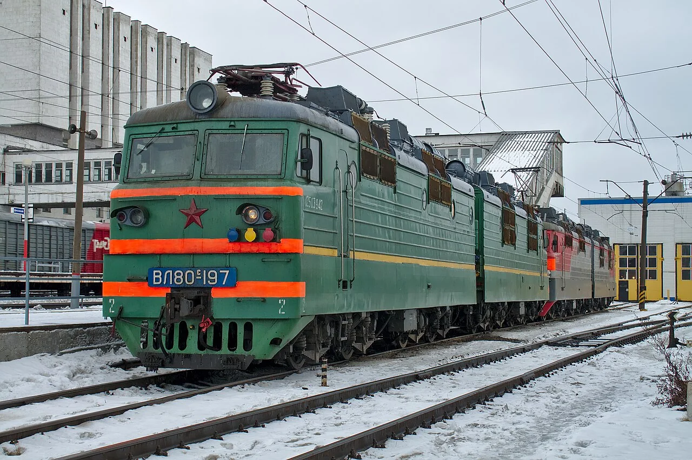

**出生卡：** 1961｜苏联/俄罗斯｜电力货运

VL80 常常由两大节机车连在一起。每一节下面都有许多车轮。它从架空线取得交流电。它常用来牵引长长的重货列车。

**找找看：** 两节机车中间的连接门在哪里？

> 给大人：VL80 是为 25 kV、50 Hz 交流电气化铁路制造的双节八轴货运机车家族，自 1961 年起发展出多个数量庞大的型号。

*图 024 · [作者与许可](IMAGE_CREDITS.md#img-t024-vl80)*

---

> 🚉 **第2站｜世界火车头**

## 026｜WAP-7 WAP-7

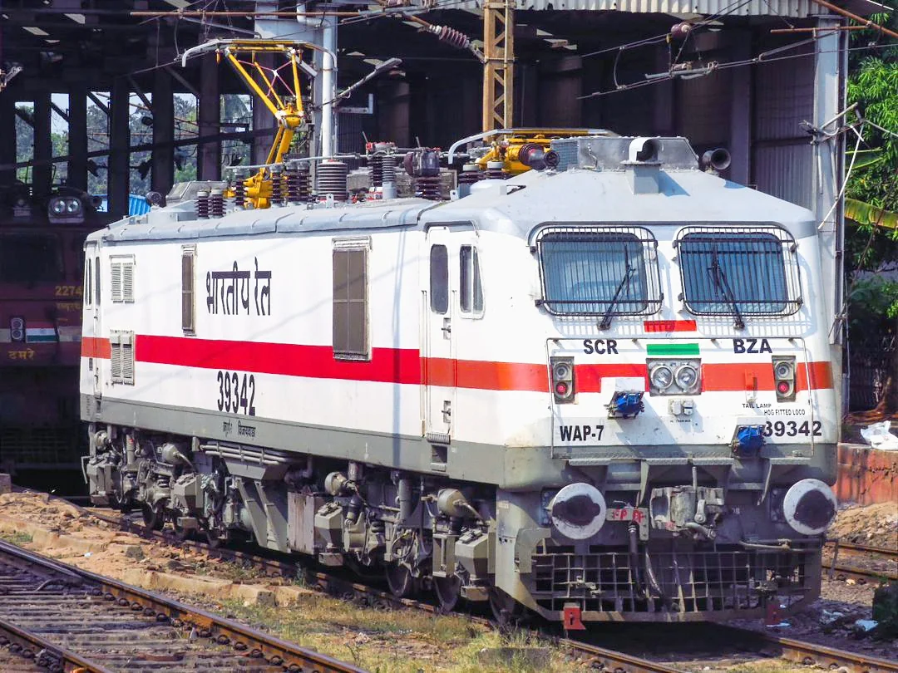

**出生卡：** 2000｜印度｜电力客运

WAP-7 常在印度干线上牵引客车。它举起受电弓，从头顶电线取电。两个转向架各有三根车轴。大功率电动机能拉很长的快速客车。

**找找看：** 白色车身上的红色带子绕到车头了吗？

> 给大人：WAP-7 由印度奇塔兰詹机车厂自 2000 年起制造，是基于 WAG-9 平台发展的六轴交流客运电力机车。

*图 026 · [作者与许可](IMAGE_CREDITS.md#img-t026-wap-7)*

---

## 099｜EF66电力机车 JNR Class EF66

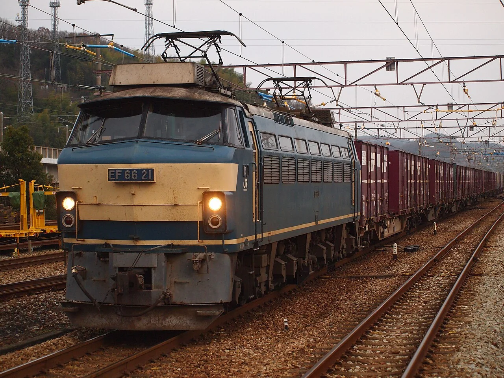

**出生卡：** 1968｜日本｜货运/卧铺牵引

EF66 自己没有乘客座位。它从头顶电线取电，用六根动力车轴拉动长列车。最早，它要把很重的货物快快送到远方。后来，它也拉过蓝色的夜行卧铺客车。

**找找看：** 车顶的两个受电弓，都抬起来了吗？

> 给大人：EF66 为牵引 1,000 吨级高速货物列车而开发，持续功率 3,900 千瓦；国铁后期起，0 番台也担当多趟“蓝色列车”卧铺特急。

*图 099 · [作者与许可](IMAGE_CREDITS.md#img-t099-ef66)*

---

## 154｜东风4B：柴油先发电

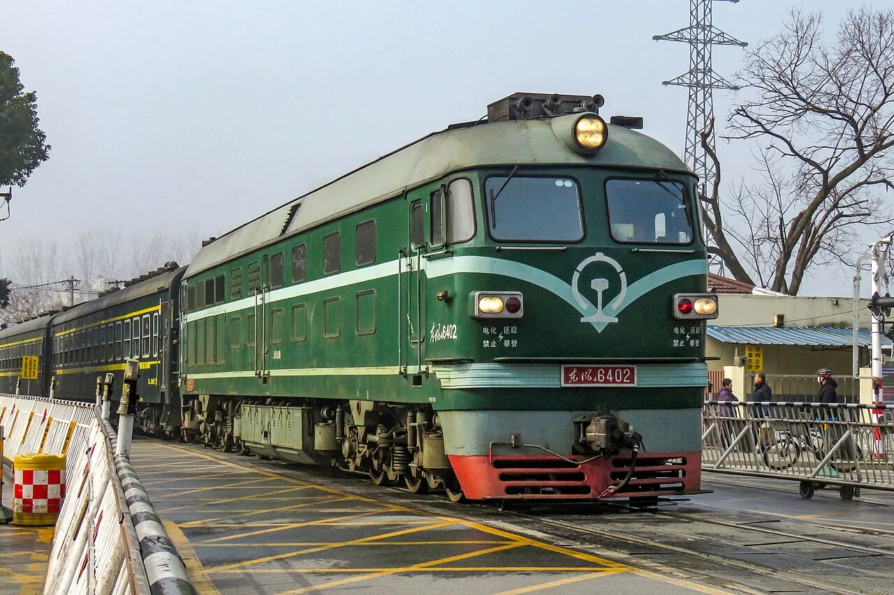

**出生卡：** 1984年｜中国｜柴油电传动机车

它肚子里的柴油机先转动发电机。电再送到牵引电动机，让车轮滚起来。机车后面可以拉着客车或货车出发。

**找找看：** 车身侧面能找到多少扇长长的散热窗？

> 给大人：东风4B型于1984年开始批量制造，是柴油电传动干线机车；柴油机驱动发电机，电流经整流后供给直流牵引电动机。它不需要从架空电线取得牵引电力。

*图 154 · [作者与许可](IMAGE_CREDITS.md#img-t154-df4b)*

---

## 155｜HXD3D：红色电力火车头

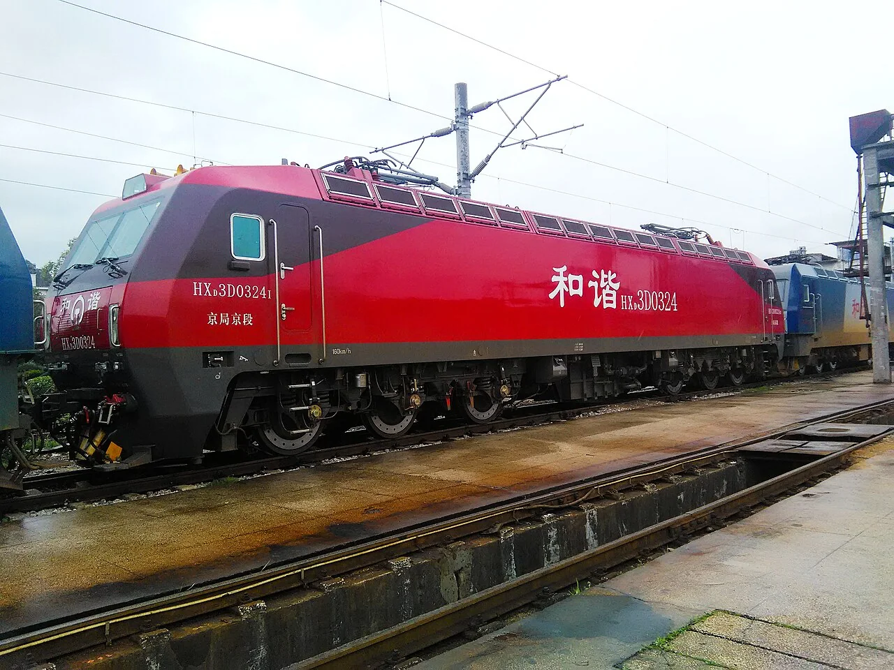

**出生卡：** 2014年｜中国｜客运电力机车

红色火车头举起受电弓，碰到头顶电线。电动机把大力气送给六根轮轴。它在前面牵着许多客车跑。

**找找看：** 车顶能找到像剪刀一样的受电弓吗？

> 给大人：HXD3D于2014年投入运营，是六轴、7200千瓦的交流传动干线客运电力机车，最高运行速度为160公里每小时。它是牵引独立客车的机车，不是动力分散式动车组。

*图 155 · [作者与许可](IMAGE_CREDITS.md#img-t155-hxd3d)*

---

> 🚉 **第3站｜搬大箱子**

## 100｜EH500金太郎 JR Freight Class EH500 Kintaro

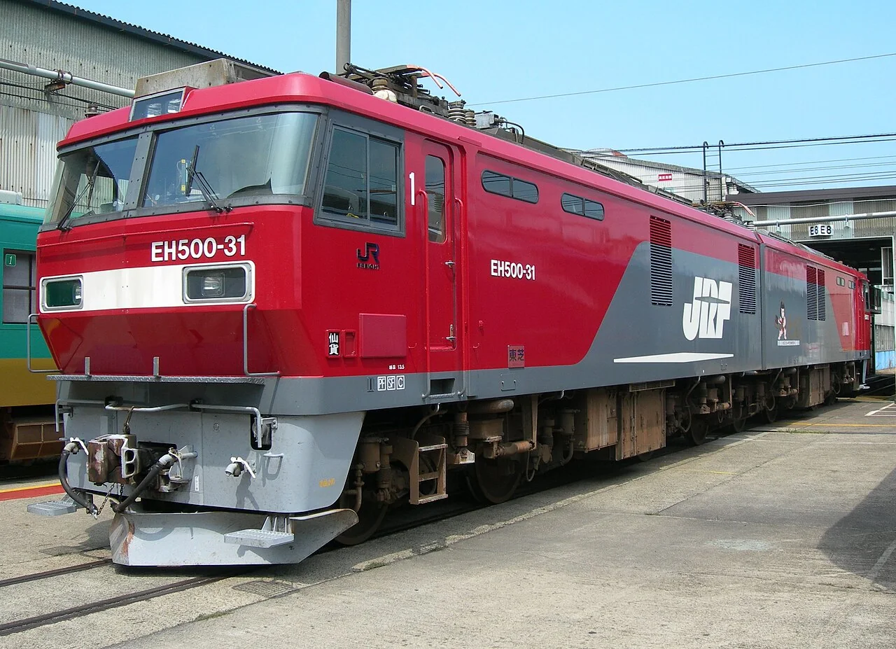

**出生卡：** 1997｜日本｜货运电力

金太郎由两节红色车身牵手组成。八根动力车轴一起出力，能拉动很长的货列。它还能适应几种不同的铁路供电。车身上的金太郎，正是传说中的大力士。

**找找看：** 两节车身的连接处，藏在哪一对转向架之间？

> 给大人：EH500 由 JR 货物开发，是两节永久连接、共 8 根动力车轴的交直流电力机车，可适应直流及 50/60 赫兹交流供电区。

*图 100 · [作者与许可](IMAGE_CREDITS.md#img-t100-eh500)*

---

## 101｜M250 Super Rail Cargo M250 series

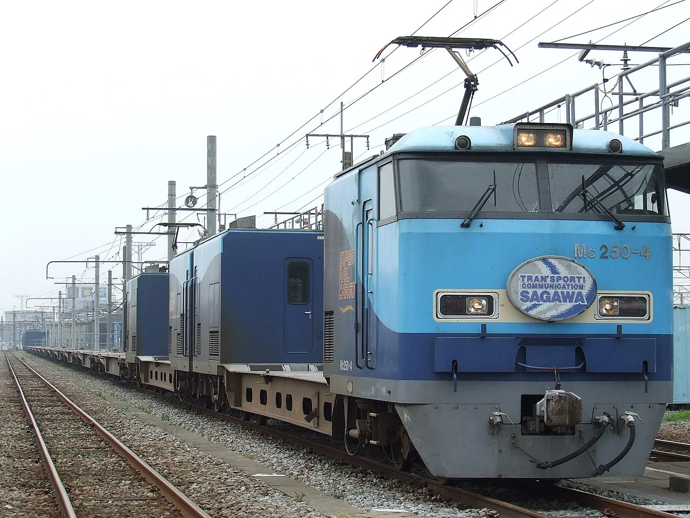

**出生卡：** 2004｜日本｜货运动车组

普通货列常由一台机车在前面拉。M250 却把电动设备装进列车两端的车辆。中间的小平台驮着一只只集装箱。它在夜里快速奔跑，把急件送往东京和大阪方向。

**找找看：** 驾驶车后面，能数出多少只方方的集装箱？

> 给大人：M250 系是 16 节电力货运动车组，2004 年投入东京货物总站至安治川口间的 Super Rail Cargo，最高营业速度为 130 千米/时。

*图 101 · [作者与许可](IMAGE_CREDITS.md#img-t101-m250)*

---

> 🚉 **第4站｜除雪和修路**

## 098｜DE15除雪柴油机车 JNR Class DE15

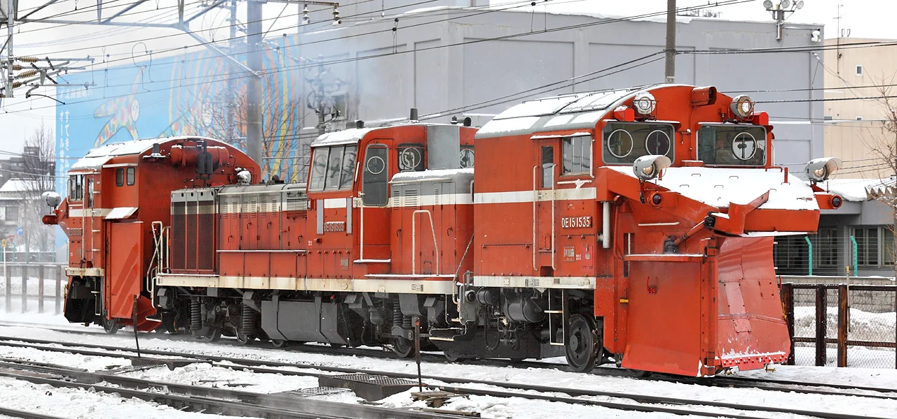

**出生卡：** 1967｜日本｜除雪柴油机车

大雪盖住铁轨时，DE15 会来开路。前方的雪犁像一把又宽又硬的铲子。柴油机让车轮用力向前，雪被推向轨道两边。没有厚雪时，部分车辆还能卸下除雪装置做别的工作。

**找找看：** 大雪犁的左右两边，朝哪个方向张开？

> 给大人：DE15 以 DE10 型柴油机车为基础，配有可拆卸的无动力除雪头；不同亚型可在一端或两端安装除雪装置。

*图 098 · [作者与许可](IMAGE_CREDITS.md#img-t098-de15-snowplow)*

---

## 102｜现代捣固车 Modern tamping machine

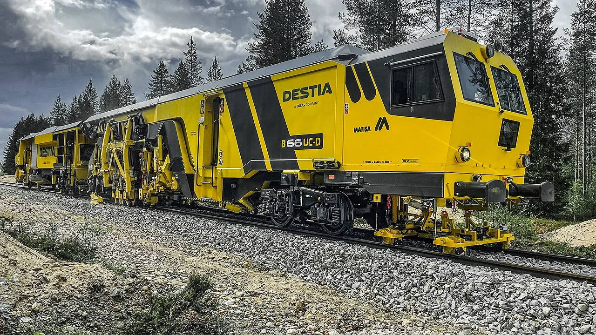

**出生卡：** 2000年代代表｜世界｜线路养护

铁轨下面铺着许多道砟小石子。列车跑久了，有些石子会松动。捣固车轻轻抬正铁轨，再用会振动的捣固镐压紧石子。它走过以后，轨道会更平顺、更稳当。

**找找看：** 车身下面，哪几根工具会伸进石子中间？

> 给大人：现代捣固车通常把测量、起道、拨道和捣固连续完成；捣固镐在轨枕两侧振动并夹实道砟，使轨枕获得均匀支承。

*图 102 · [作者与许可](IMAGE_CREDITS.md#img-t102-tamping-machine)*

---

[← 卧铺、观光与角色列车](09_sleeper_scenic.md) · [🏠 全书首页](README.md) · [特别的导轨列车 →](11_unusual_guideways.md) · [🎲 观察游戏](13_spotter_games.md)
