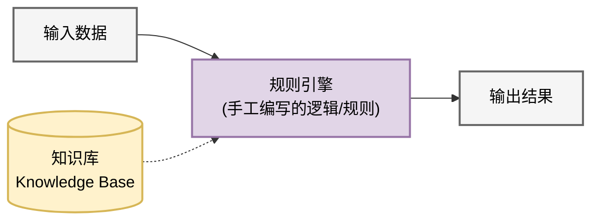
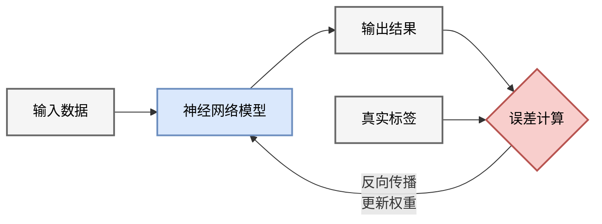
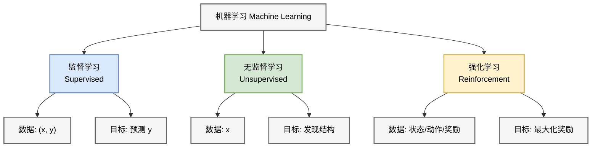

# 1.1 人工智能的两大范式：符号主义与连接主义
## 1.1 The Two Paradigms: Symbolism vs Connectionism

在深入现代深度学习之前，理解人工智能（AI）的历史与哲学根基至关重要。AI 的发展史并非线性上升，而是 **符号主义** 与 **连接主义** 两大流派长达半个世纪的博弈与融合。

### 1.1.1 符号主义 (Symbolism)：逻辑与推理的殿堂

符号主义（又称逻辑主义、GOFAI - Good Old-Fashioned AI）在 20 世纪 50 年代至 80 年代占据统治地位。

*   **直观类比 (Intuition)**：
    符号主义就像**查字典**或**遵循法律条文**。即使你不懂“法外狂徒”是什么意思，只要字典里写着“法外狂徒=张三”，你就能通过逻辑推导出“抓捕法外狂徒”等于“抓捕张三”。所有的规则都是人写好的，机器只是在执行严密的逻辑演绎。

*   **核心假设**：人类智能的本质是对物理符号系统的操作 (Physical Symbol System Hypothesis)。
*   **处理流程示意**：

*   **方法论**：
    1.  将世界知识形式化为显式的 **规则 (Rules)** 和 **符号 (Symbols)**。
    2.  利用形式逻辑（如一阶逻辑）进行推理和搜索。
*   **代表成果**：
    *   **逻辑理论家 (Logic Theorist, 1956)**：证明了罗素《数学原理》中的定理。
    *   **专家系统 (Expert Systems, 1980s)**：如 MYCIN（医疗诊断）和 Deep Blue（国际象棋）。
*   **数学基础**：集合论、图论、数理逻辑。
*   **局限性**：
    *   知识获取瓶颈：难以将隐性知识（如如何识别一张脸、如何骑自行车）形式化为规则。
    *   脆性 (Brittleness)：遇到规则之外的情况系统会直接崩溃，缺乏泛化能力。
    *   符号落地问题 (Symbol Grounding Problem)：符号本身没有内在含义，只能与其他符号相关联，无法与真实物理世界对应。

### 1.1.2 连接主义 (Connectionism)：大脑的模拟

连接主义（即神经网络学派）受神经科学启发，认为智能涌现于大量简单单元的并行连接中。

*   **直观类比 (Intuition)**：
    连接主义就像**教小孩骑自行车**。你没法写一套“如果车身向左倾斜30度，则右手施加5牛顿力”的规则给他。你只能让他不断尝试，摔倒了就调整姿势（更新权重），骑稳了就记住这种感觉（强化连接）。智能不是被灌输的，而是从经验中“生长”出来的。

*   **核心假设**：智能源通过 **调整连接权重 (Weight Adjustment)** 从数据中 **学习 (Learning)** 得到，而非人工预设。
*   **处理流程示意**：

*   **方法论**：
    1.  构建模拟生物神经元的计算模型。
    2.  定义目标函数（Loss Function）。
    3.  通过优化算法（如梯度下降）自动调整权重。
*   **发展历程**：
    *   **起步 (1943-1969)**：McCulloch-Pitts 神经元，Rosenblatt 感知机。
    *   **寒冬 (1969-1986)**：Minsky 指出感知机无法解决异或 (XOR) 问题。
    *   **复兴 (1986-1995)**：Hinton 等人推广反向传播 (Backpropagation)，多层感知机 (MLP) 兴起。
    *   **爆发 (2012-Present)**：深度学习 (Deep Learning) 结合大数据与算力，横扫各个领域。

### 1.1.3 现代视角的融合：神经符号系统 (Neuro-Symbolic AI)

当前的 GPT-4 等大语言模型虽然主要基于连接主义（Transformer），但展现出了惊人的逻辑推理能力。未来的方向可能是两者的结合：
*   **系统 1 (System 1)**：基于直觉、快速、无意识的模式识别（连接主义擅长）。
*   **系统 2 (System 2)**：基于逻辑、慢速、有意识的顺序推理（符号主义擅长）。

### 1.1.4 机器学习分类

在连接主义范式下，我们通常根据**信号反馈**的不同将机器学习分为三类：

1.  **监督学习 (Supervised Learning)**：
    *   数据：$(\mathbf{x}, y)$ 对，有明确标签。
    *   目标：学习映射 $f: \mathbf{x} \to y$。
    *   应用：图像分类、机器翻译。
2.  **无监督学习 (Unsupervised Learning)**：
    *   数据：只有 $\mathbf{x}$，无标签。
    *   目标：发现数据内部结构（聚类、降维、生成）。
    *   应用：用户画像、异常检测、生成式 AI (GenAI)。
3.  **强化学习 (Reinforcement Learning)**：
    *   数据：状态 $\mathbf{s}$、动作 $\mathbf{a}$、奖励 $r$ 的序列。
    *   目标：学习策略 $\pi(\mathbf{a}|\mathbf{s})$ 以最大化长期累积奖励。
    *   应用：AlphaGo、机器人控制、大模型对齐 (RLHF)。

---

本章后续将聚焦于**连接主义**的基础组件，从最简单的神经元开始，一步步构建出深度学习的宏伟大厦。
