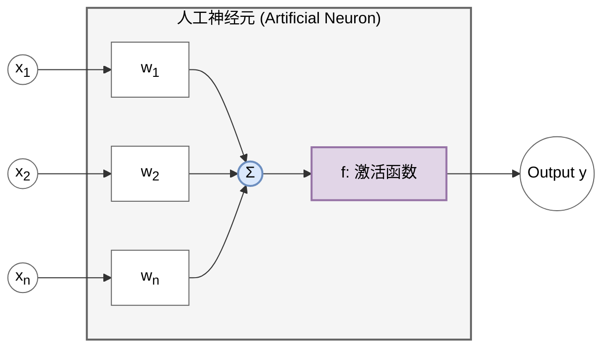
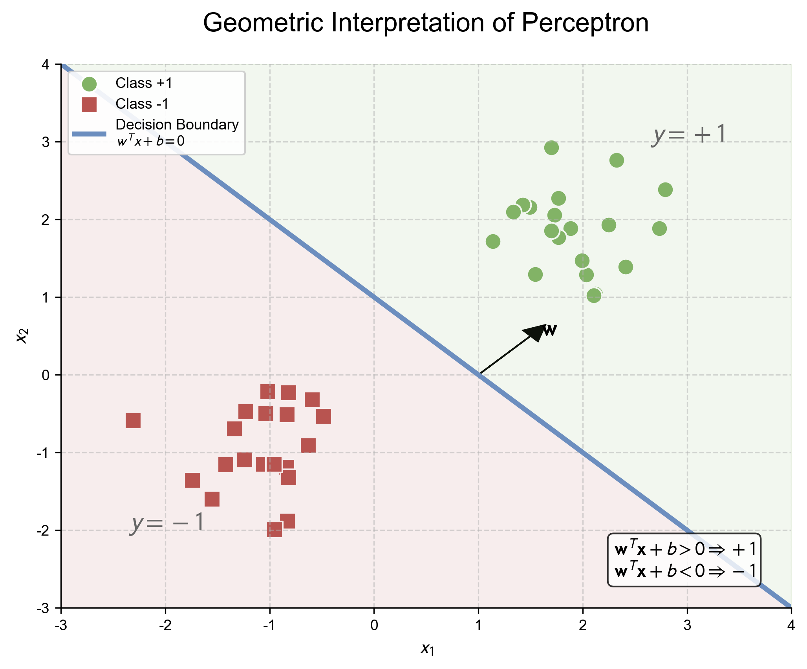
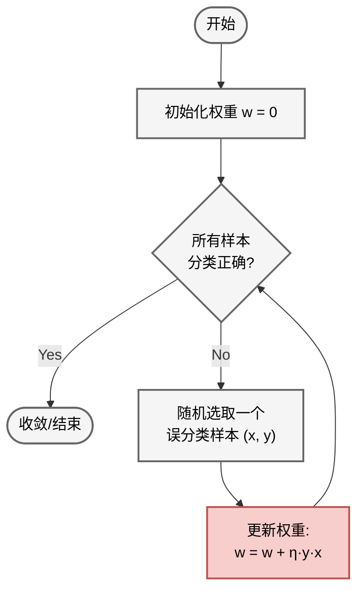
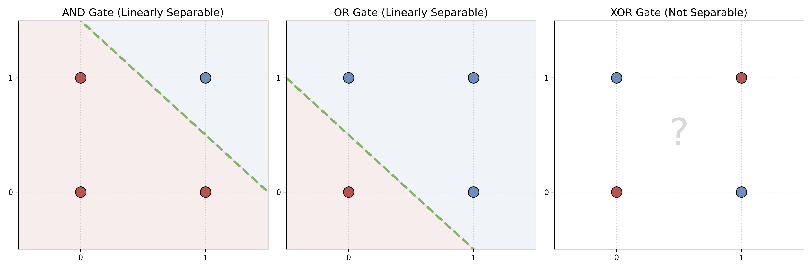
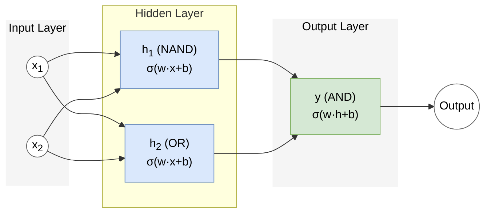

# 1.2 感知机与异或危机：神经网络的黎明
## 1.2 The Perceptron and The XOR Crisis

所有的复杂网络都始于一个简单的单元。本节我们将解剖深度学习的“原子”——神经元模型，并回顾 AI 历史上的第一次重大挫折，理解**线性可分性**这一关键概念。

### 1.2.1 生物神经元与人工神经元 (M-P Neuron)

1943 年，心理学家 McCulloch 和数学家 Pitts 提出了第一个人工神经元模型（M-P 模型）。

*   **生物原型**：
    *   **树突 (Dendrites)**：接收来自其他神经元的电化学信号。
    *   **细胞体 (Soma)**：汇总所有输入信号。
    *   **轴突 (Axon)**：当信号总和超过阈值时，发放脉冲（Action Potential）。
*   **数学抽象**：
    Math $$ y = f(\sum_{i=1}^n w_i x_i - \theta) $$
    *   $x_i$：输入信号。
    *   $w_i$：突触权重（正值为兴奋性，负值为抑制性）。
    *   $\theta$：阈值 (Threshold)。
    *   $f$：激活函数，当时为阶跃函数 (Step Function)。

### 1.2.2 Rosenblatt 感知机 (Perceptron)

1958 年，Frank Rosenblatt 提出了感知机，并设计了首个训练算法，使得机器能够“学习”权重。

*   **直观类比 (Intuition)**：
    想象你在决定**是否去相亲**。你心里有几个衡量标准（输入 $x$）：长相、收入、性格。但每个标准在你心里的分量（权重 $w$）不同。
    *   长相（权重 0.8）：很重要。
    *   收入（权重 0.5）：还行。
    *   性格（权重 0.2）：不太在乎。
    如果 $0.8 \times \text{长相} + 0.5 \times \text{收入} + 0.2 \times \text{性格}$ 超过了你心里的门槛（阈值 $\theta$），你就去（输出 1），否则就不去（输出 0）。感知机的学习过程，就是通过一次次相亲的成败，不断调整这些权重和门槛的过程。

*   **模型定义 (Mathematical Definition)**：
    Math $$ y = \text{sign}(\mathbf{w}^T \mathbf{x} + b) $$
    其中 $b = -\theta$ 为偏置项 (Bias)，$\mathbf{w}$ (Weights) 和 $\mathbf{x}$ (Inputs) 均为向量。

*   **几何意义 (Geometric Interpretation)**：
    在二维空间中，$w_1 x_1 + w_2 x_2 + b = 0$ 定义了一条直线（高维空间中为超平面 Hyperplane）。感知机实际上是一个**线性分类器 (Linear Classifier)**，将空间切分为正类 ($y=1$) 和负类 ($y=-1$)。

    

### 1.2.3 感知机学习算法 (PLA)

Rosenblatt 提出的 PLA (Perceptron Learning Algorithm) 极其直观：**知错能改**。本节我们将通过几何直觉和梯度下降两种视角来推导其更新公式。

#### 1. 几何直觉视角 (Geometric View)

*   **直观类比 (Intuition)**：
    假设你在玩“盲人摸象”的游戏，试图划一条线把苹果和梨分开。
    *   你随便划了一条线（初始化）。
    *   你拿起一个水果，发现它在线的左边，但它其实是应该在右边的梨（预测错误）。
    *   你就把线往梨的方向挪一点点（更新权重）。
    *   重复这个过程，直到所有水果都分对了。

1.  初始化权重 $\mathbf{w}$ 为 0 或随机值。
2.  对每一个训练样本 $(\mathbf{x}, y)$：
    *   如果预测正确 ($\text{sign}(\mathbf{w}^T \mathbf{x}) == y$)，不做改变。
    *   如果预测错误（例如 $y=+1$ 但预测为 $-1$），说明 $\mathbf{w}^T \mathbf{x}$ 太小了，甚至为负数。我们需要调整 $\mathbf{w}$ 使得它更接近 $\mathbf{x}$ 的方向（增大内积）。
        $$ \mathbf{w} \leftarrow \mathbf{w} + \eta y \mathbf{x} $$
        （其中 $\eta$ 为学习率 Learning Rate）
3.  重复直到所有样本都被正确分类。

#### 2. 数学推导视角：随机梯度下降 (SGD)

PLA 本质上是基于特定损失函数的**随机梯度下降 (Stochastic Gradient Descent, SGD)** 算法。

**Step 1: 定义损失函数 (Loss Function)**

我们如何定义“错误”？直接计算误分类点的数量是离散且不可导的。感知机采用的策略是：最小化**误分类点到超平面的总距离**（忽略常数分母 $\|\mathbf{w}\|$）。

对于误分类点集合 $\mathcal{M}$，损失函数定义为：
$$ L(\mathbf{w}, b) = - \sum_{\mathbf{x}_i \in \mathcal{M}} y_i (\mathbf{w}^T \mathbf{x}_i + b) $$
*   **分析**：
    *   对于正确分类点， $y_i (\mathbf{w}^T \mathbf{x}_i + b) > 0$，不计入损失。
    *   对于误分类点， $y_i$ 与预测值 $(\mathbf{w}^T \mathbf{x}_i + b)$ 符号相反，故乘积为负，取负号后 $L$ 为正数。
    *   我们的目标是最小化这个正数。

**Step 2: 计算梯度 (Gradient Calculation)**

我们要通过调整 $\mathbf{w}$ 来最小化 $L$。计算 $L$ 对 $\mathbf{w}$ 的梯度：
$$ \nabla_{\mathbf{w}} L = - \sum_{\mathbf{x}_i \in \mathcal{M}} y_i \mathbf{x}_i $$

**Step 3: 参数更新 (Parameter Update)**

使用 SGD（关于 SGD 的详细数学推导请参阅 [附录 A.1](../appendix/a.1_optimization_basics.md)），每次随机选取一个误分类点 $(\mathbf{x}_i, y_i)$ 进行更新。
按照梯度下降规则 $\mathbf{w} \leftarrow \mathbf{w} - \eta \nabla_{\mathbf{w}} L_{sample}$：
$$ \mathbf{w} \leftarrow \mathbf{w} - \eta (- y_i \mathbf{x}_i) $$
$$ \mathbf{w} \leftarrow \mathbf{w} + \eta y_i \mathbf{x}_i $$

这正是 PLA 的更新公式！它从数学上严谨地证明了算法是在沿着减少误差的方向前进。

**收敛性定理 (Convergence Theorem)**：
如果数据是**线性可分 (Linearly Separable)** 的，PLA 保证在有限步内收敛找到一个解。（详细数学证明请见 **[附录 A.2](../appendix/a.2_perceptron_convergence.md)**）。

### 1.2.4 异或 (XOR) 危机与第一次 AI 寒冬

1969 年，Minsky 和 Papert 出版了《Perceptrons》一书，指出了单层感知机的致命缺陷：**无法处理非线性可分问题**。

最经典的例子就是 **异或 (XOR)** 逻辑。

#### 1. 逻辑门的几何直观 (Geometric Intuition)

让我们将逻辑门的输入 $(x_1, x_2)$ 看作二维平面上的点，输出 $y$ 看作点的颜色（红色为 0，蓝色为 1）。

*   **AND 门**：只有当 $(1,1)$ 时输出 1。可以用一条直线完美分割。
*   **OR 门**：只要有一个 1 就输出 1。同样可以用一条直线分割。
*   **XOR 门**：当输入不同时输出 1。你会发现，无论如何都无法画出**一条直线**将红色点和蓝色点分开。

#### 2. 为什么这是个大问题？

单层感知机本质上是一个**线性分类器**（$w_1 x_1 + w_2 x_2 + b = 0$ 是一条直线）。XOR 问题的不可解，意味着感知机连最简单的逻辑运算都无法完全覆盖。

这个看似简单的结论（实际上 Minsky 同时也证明了当时的简单多层网络也难以训练）直接导致了神经网络研究资金的冻结，AI 陷入了长达十余年的寒冬。

#### 3. 破局：多层感知机 (MLP)

直到 80 年代，人们才意识到：**增加一层隐藏层**，并配合 **非线性激活函数**，就可以解决 XOR 问题。这也标志着深度学习（Deep Learning）雏形的诞生。

> **关键点**：如果仅有隐藏层而没有非线性激活函数，多层网络在数学上等价于单层网络（线性变换的叠加仍是线性变换），依然无法解决问题。正是**非线性**的引入，让神经网络具备了“扭曲”空间的能力。

我们可以用组合逻辑来理解：$ \text{XOR}(x_1, x_2) = \text{OR}(x_1, x_2) \text{ AND } \text{NAND}(x_1, x_2) $。这里逻辑门的**阶跃函数**特性提供了必要的非线性。

通过引入**隐藏层**，我们将原始的线性不可分空间，扭曲/映射到了一个新的高维空间，在那个空间里，数据变得线性可分了。这正是深度学习的核心魅力所在。
