# 1.3 多层感知机与激活函数：弯曲空间的艺术
## 1.3 Multilayer Perceptron (MLP) and Activation Functions

单层感知机的线性局限性将 AI 推入了寒冬。本节我们将展示如何通过引入 **隐藏层** 和 **非线性激活函数**，让神经网络获得“弯曲空间”的能力，从而解决异或（XOR）等复杂非线性问题。

解决 XOR 问题的关键在于**空间变换**。本节我们将探讨如何通过堆叠神经元来构建多层感知机 (MLP)，以及为什么非线性激活函数是深度学习的灵魂。

### 1.3.1 隐藏层的魔力 (The Magic of Hidden Layers)

单层感知机只能画直线。如果我们有两层呢？

*   **直观类比 (Intuition)**：
    想象你在折纸。XOR 问题就像纸上有两类点（比如四个角，对角线是一类），不论怎么画直线都分不开。
    隐藏层的作用就是**把纸折叠起来**。通过折叠，原本相隔很远的点可能叠在了一起，或者原本纠缠的点被分到了不同的平面。在新的立体形状上，你只需要一刀（线性分割）就能把它们切开。

**解决 XOR 的数学构造**：

我们可以显式构造一个包含隐藏层的网络来解决 XOR 问题。假设输入 $\mathbf{x} = [x_1, x_2]^T \in \{0, 1\}^2$。

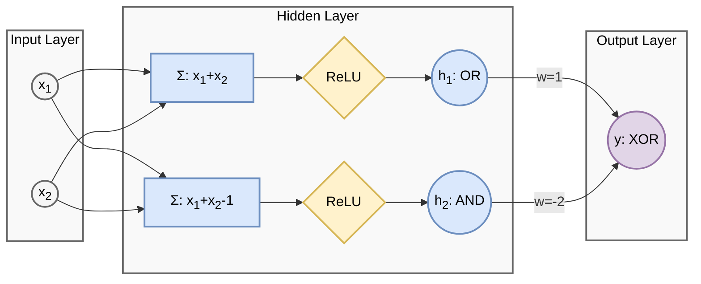

为了引入非线性，我们使用 **ReLU (Rectified Linear Unit)** 激活函数，其定义非常简单：
Math $$ \sigma(x) = \max(0, x) $$
即：正数保持不变，负数置为 0。

我们需要构建逻辑：$x_1 \text{ XOR } x_2 = (x_1 \text{ OR } x_2) \text{ AND } \text{ NOT } (x_1 \text{ AND } x_2)$。

定义隐藏层权重 $\mathbf{W}_1$ 和偏置 $\mathbf{b}_1$（构造两个神经元）：
*   神经元 1（模拟 OR）：$h_1 = \sigma(x_1 + x_2)$。如果 $x$ 有一个为 1，则 $h_1 \ge 1$。
*   神经元 2（模拟 AND）：$h_2 = \sigma(x_1 + x_2 - 1)$。只有 $x$ 全为 1，则 $h_2 \ge 1$。
    $$ \mathbf{W}_1 = \begin{bmatrix} 1 & 1 \\ 1 & 1 \end{bmatrix}, \quad \mathbf{b}_1 = \begin{bmatrix} 0 \\ -1 \end{bmatrix} $$
    $$ \mathbf{h} = \text{ReLU}(\mathbf{W}_1 \mathbf{x} + \mathbf{b}_1) $$

定义输出层权重 $\mathbf{w}_2$ 和偏置 $b_2$（模拟 $h_1 - h_2$）：
    $$ \mathbf{w}_2 = \begin{bmatrix} 1 \\ -2 \end{bmatrix}, \quad b_2 = 0 $$
    $$ y = \mathbf{w}_2^T \mathbf{h} + b_2 $$

**验证**：
1.  **[0, 0]**: $\mathbf{z} = [0, -1]^T \xrightarrow{\text{ReLU}} \mathbf{h} = [0, 0]^T \Rightarrow y = 0$ (正确)
2.  **[0, 1]**: $\mathbf{z} = [1, 0]^T \xrightarrow{\text{ReLU}} \mathbf{h} = [1, 0]^T \Rightarrow y = 1$ (正确)
3.  **[1, 0]**: $\mathbf{z} = [1, 0]^T \xrightarrow{\text{ReLU}} \mathbf{h} = [1, 0]^T \Rightarrow y = 1$ (正确)
4.  **[1, 1]**: $\mathbf{z} = [2, 1]^T \xrightarrow{\text{ReLU}} \mathbf{h} = [2, 1]^T \Rightarrow y = 1(2) - 2(1) = 0$ (正确)

**关键点：非线性的作用**
请注意神经元 2 在输入为 [0, 0] 时的表现：
*   线性组合结果：$0 + 0 - 1 = -1$。
*   ReLU 输出：$\max(0, -1) = 0$。
正是这个截断（非线性变换） 至关重要。
**如果去掉 ReLU（即使用线性网络）**：
$$ y_{linear} = 1 \cdot (x_1+x_2) - 2 \cdot (x_1+x_2-1) = -x_1 - x_2 + 2 $$
代入 [0, 0] 得到 $y=2 \ne 0$。这就是线性模型失败的原因——它无法在保持其他点正确的同时，单独把 [0, 0] 点的输出“压”下去。ReLU 的非线性“折叠”了空间，使得这成为可能。

**几何解释**：
隐藏层的作用是将原始输入空间（XOR 中扭曲在一起的点）映射到一个**新的特征空间** $\mathbf{h}$。

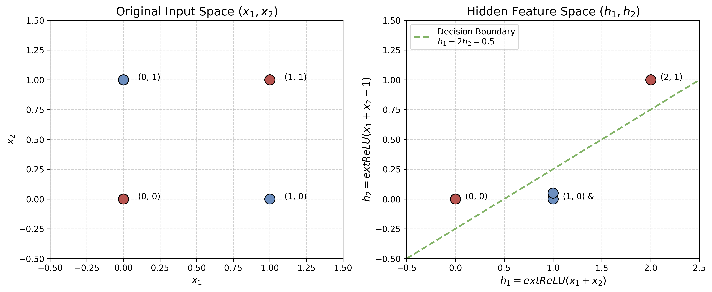

*   **左图（原始空间）**：红蓝点交错，无法用一条直线分开（线性不可分）。
*   **右图（隐藏空间）**：经过 ReLU 变换后，点 $(0,1)$和$(1,0)$ 被合并/映射到了同一个位置。在新的空间里，我们只需要画一条直线（$h_1 - 2h_2 = 0.5$）就能完美分割红蓝两类（线性可分）。

这就像把一张揉皱的纸（原始空间）展开，使得原来纠缠在一起的点可以被一刀（线性超平面）切开。

### 1.3.2 为什么必须要有非线性激活函数？

如果我们简单地堆叠多层线性神经元：
$$ \mathbf{y} = \mathbf{W}_2 (\mathbf{W}_1 \mathbf{x} + \mathbf{b}_1) + \mathbf{b}_2 $$
$$ \mathbf{y} = (\mathbf{W}_2 \mathbf{W}_1) \mathbf{x} + (\mathbf{W}_2 \mathbf{b}_1 + \mathbf{b}_2) $$
$$ \mathbf{y} = \mathbf{W}_{new} \mathbf{x} + \mathbf{b}_{new} $$

**结论**：
**线性变换的组合仍然是线性变换**。无论你堆叠多少层线性层，它本质上等价于一个单层网络。它永远无法解决 XOR 问题。

因此，每一层之后必须引入一个非线性函数 $\sigma(\cdot)$：
Math $$ \mathbf{y} = \mathbf{W}_2 \sigma(\mathbf{W}_1 \mathbf{x} + \mathbf{b}_1) + \mathbf{b}_2 $$
这个 $\sigma$ 就是**激活函数**。它是神经网络能够拟合任意复杂曲线（万能近似）的关键。

### 1.3.3 常见激活函数图鉴

1.  **Sigmoid / Logistic**

    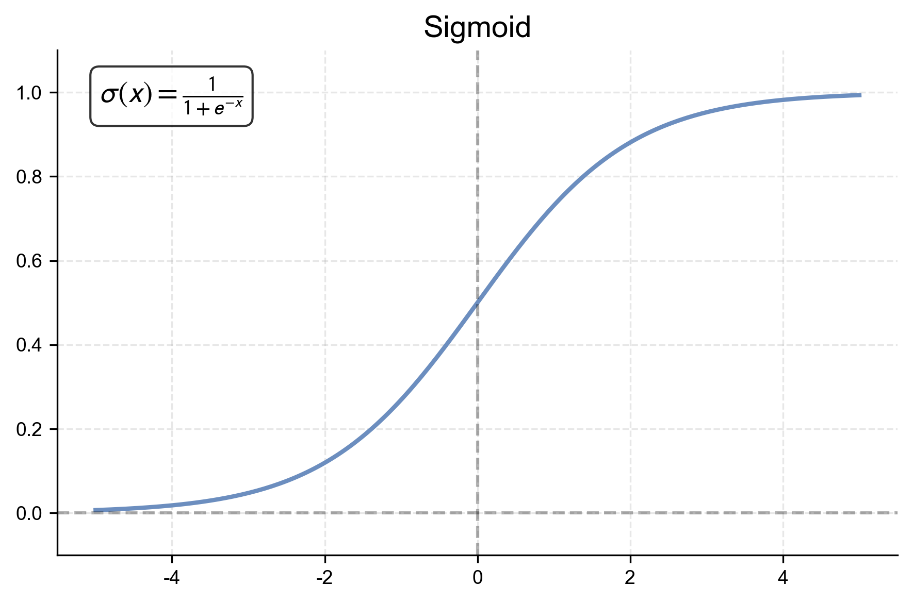

    *   **公式**：$\sigma(x) = \frac{1}{1+e^{-x}}$
    *   **导数性质**：$\sigma'(x) = \sigma(x)(1 - \sigma(x))$。
        *   推导：$\frac{d}{dx}(1+e^{-x})^{-1} = -(1+e^{-x})^{-2}(-e^{-x}) = \frac{1}{1+e^{-x}} \frac{e^{-x}}{1+e^{-x}} = \sigma(1-\sigma)$。
        *   当 $x=0$ 时导数最大为 0.25。这意味着每过一层 Sigmoid，梯度至少衰减 75%。这是梯度消失的数学根源。
    *   **优点**：将输出压缩到 (0,1)，适合做概率解释。
    *   **缺点**：
        *   **梯度消失**：如上所述，深层网络无法训练。
        *   **非零中心 (Non-zero-centered)**：输出恒为正，导致后续神经元的输入恒为正。这会使得反向传播时梯度方向呈现“Zigzag”形状（要么全正要么全负），收敛效率低。
        *   **指数运算昂贵**：在嵌入式设备上计算 $e^x$ 较慢。

2.  **Tanh (双曲正切)**

    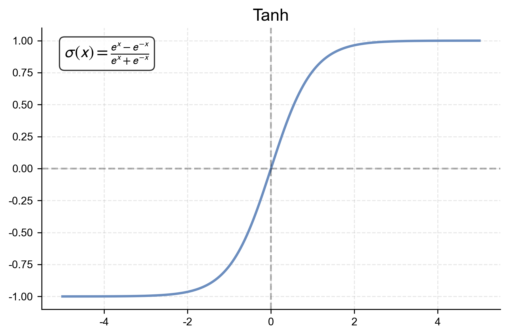

    *   **公式**：$\sigma(x) = \frac{e^x - e^{-x}}{e^x + e^{-x}}$
    *   **导数性质**：$\sigma'(x) = 1 - \sigma(x)^2$。
        *   导数最大值为 1 (在 $x=0$)。相比 Sigmoid 缓解了梯度消失，但深层网络中依然存在。
    *   **优点**：输出范围 (-1, 1)，以 0 为中心，优于 Sigmoid。
    *   **缺点**：
        *   **梯度消失**：当 $|x|$ 很大时（饱和区），导数趋近于 0。例如输入 $x=10$，梯度几乎为 0，网络停止学习。

3.  **ReLU (Rectified Linear Unit)**

    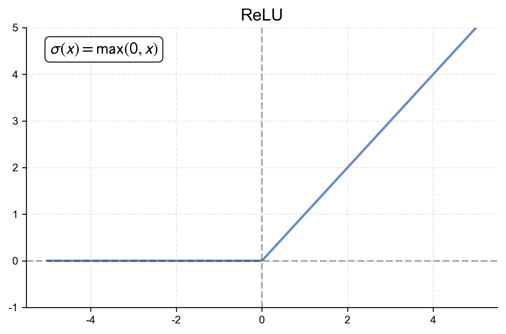

    *   **公式**：$\sigma(x) = \max(0, x)$
    *   **现代标配**。（注：虽然其形式简单，但直到 2011 年左右，随着 Deep Learning 的复兴，它才真正取代 Sigmoid 成为主流。在此之前的寒冬期，学术界普遍认为激活函数必须是光滑且有界的。）
    *   **优点**：
        *   **计算极其简单**：只需判断正负。
        *   **解决梯度消失**：正区间导数恒为 1，梯度可以无损地传到很深。
        *   **稀疏激活**：负区间为 0，模拟了生物神经元的稀疏发放特性。
    *   **缺点**：
        *   **Dead ReLU (神经元死亡)**：如果某个神经元在一次更新后，其权重使得对于所有训练样本的输入都 $<0$，那么该神经元输出永远是 0，梯度也永远是 0。它从此“死”了，再也不会更新。这通常发生在使用大学习率时。

4.  **Leaky ReLU**

    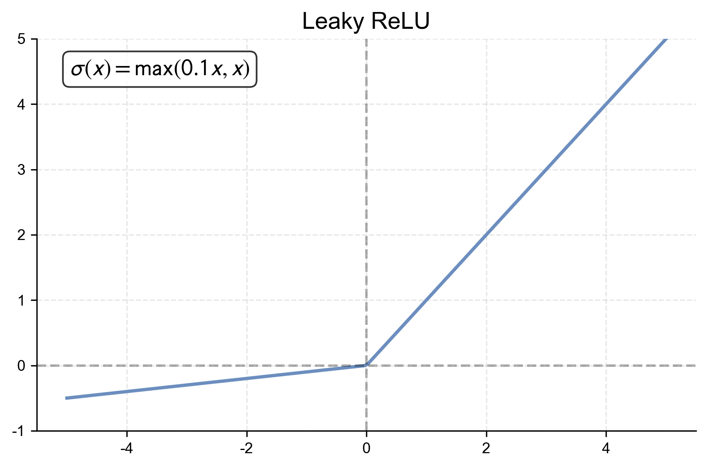

    *   **公式**：$\sigma(x) = \max(\alpha x, x)$，其中 $\alpha$ 是一个小常数（如 0.01）。
    *   **改进点**：
        *   在负区间给予一个很小的梯度（$\alpha$），保证神经元“虽死犹生”，总有机会复活（解决 Dead ReLU）。

5.  **GELU (Gaussian Error Linear Unit)**

    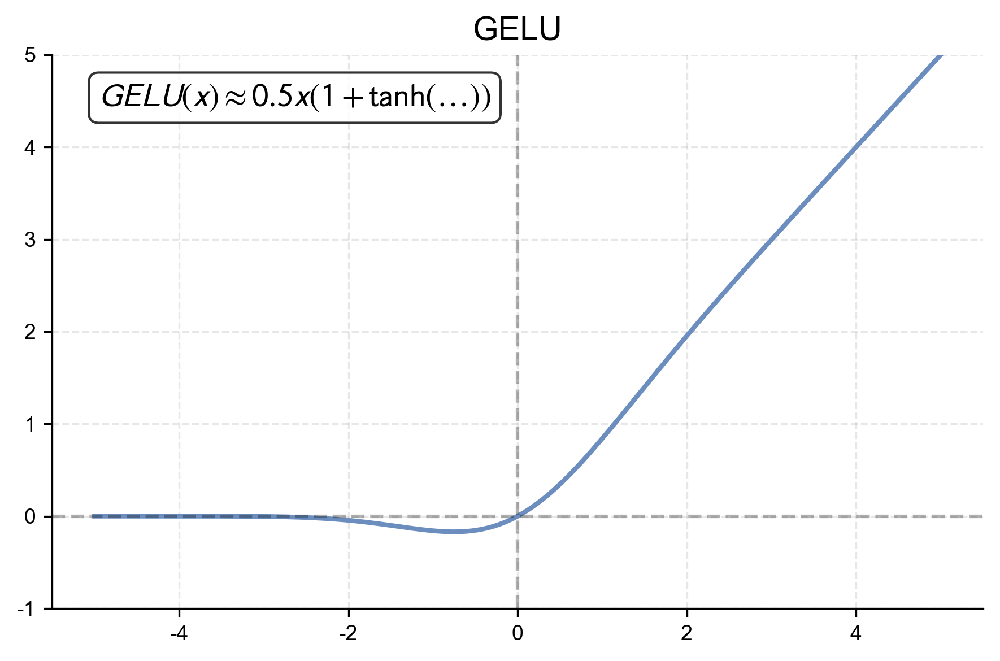

    *   **公式**：$\text{GELU}(x) = x \Phi(x) = x \cdot \frac{1}{2}\left[1 + \text{erf}\left(\frac{x}{\sqrt{2}}\right)\right]$
        其中 $\Phi(x)$ 是标准正态分布的累积分布函数。
    *   **Transformer (BERT/GPT) 的标配**。
    *   **直觉**：它不是像 ReLU 那样硬性截断，而是根据 $x$ 的值以概率 $\Phi(x)$ 保持输入。当 $x$ 很大时，保持原值；当 $x$ 很小时，趋近于 0。
    *   **优势**：在 0 附近比 ReLU 更平滑（处处可导），允许微小的负值，这在训练深层 Transformer 时能提供更稳定的梯度。

6.  **Swish**

    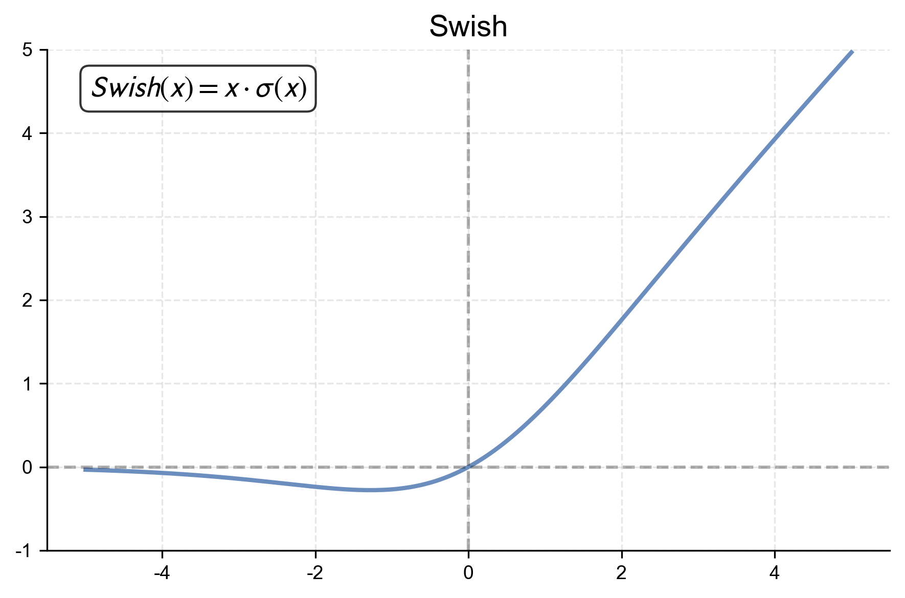

    *   **公式**：$\text{Swish}(x) = x \cdot \sigma(\beta x)$，其中 $\sigma$ 是 Sigmoid 函数。
    *   **背景**：由 Google 团队通过自动搜索技术（AutoML）发现的激活函数。
    *   **特性**：
        *   与 GELU 极其相似，都具备无上界、有下界、平滑、非单调的特性。
        *   在深层网络中通常能取得比 ReLU 更好的效果。

### 1.3.4 通用近似定理：直观理解 (Universal Approximation Theorem)

了解了各种各样的激活函数后，一个自然的问题浮出水面：**如果我们把足够多的非线性神经元堆叠在一起，这个网络到底能表示多么复杂的函数？**

答案令人振奋：它能表示**任何**连续函数。这就是著名的**通用近似定理**。

在此，我们暂且不从数学推导的视角切入（相关数学构造将在 **2.1.3 节** 详细展开），而是诉诸直觉来理解其成立的依据——这本质上呼应了微积分中的“积分逼近”思想：**任何复杂的曲线，都可以看作是无数简单形状的叠加。**

#### 1. 矩形逼近（基于阶跃函数）
为了最直观地理解，我们可以假设激活函数是 **阶跃函数 (Step Function)**。

1.  **构造台阶**：一个神经元 $h = \text{Step}(w x + b)$ 可以产生一个“台阶”。
2.  **构造矩形**：两个相反的台阶相减（$h_1 - h_2$），就可以形成一个“凸起”（矩形）。
3.  **黎曼和逼近**：任意连续曲线都可以看作是无数个这种矩形的叠加（微积分的基本思想）。

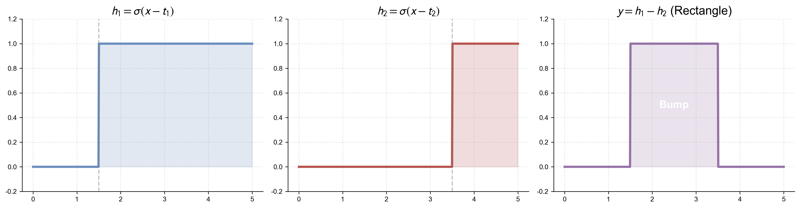

#### 2. 分段线性逼近（基于 ReLU）
在现代深度学习中，我们常用 **ReLU**。原理是类似的，只是 ReLU 产生的是“折线”而非“台阶”。
*   ReLU 的组合会形成**分段线性函数 (Piecewise Linear Function)**。
*   例如，两个 ReLU 相减（$h_1 - h_2$）可以形成一个“软台阶”（先上升后平坦）。
*   只要折线段足够多（神经元足够多），我们就能以任意精度逼近光滑曲线。

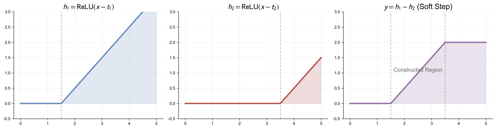

因此，只要有足够多的神经元，我们就可以逼近任何函数。深度（层数）的增加则进一步提高了参数的使用效率（用更少的积木搭出更复杂的形状）。

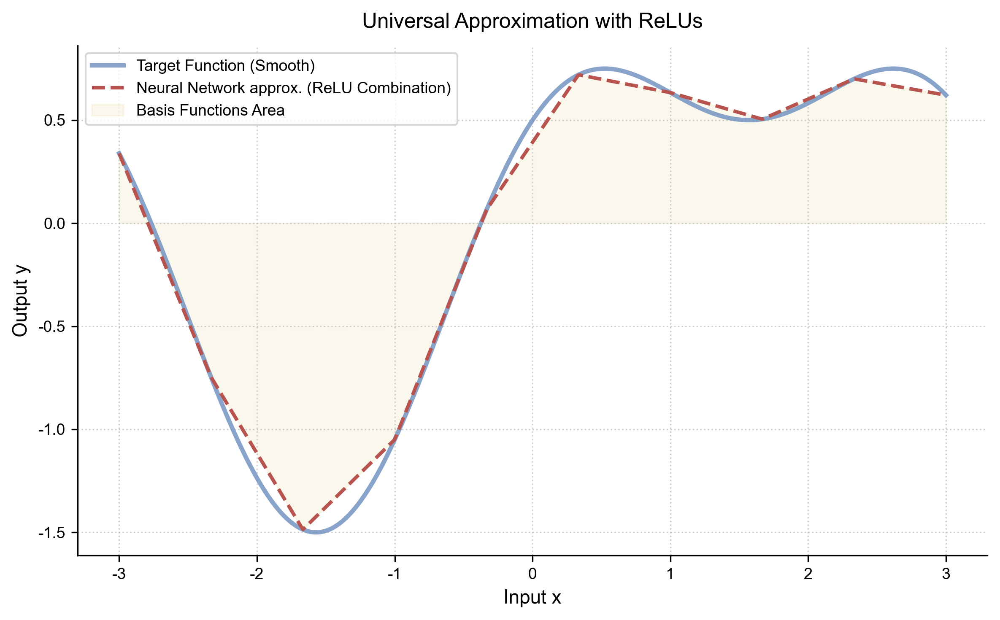

我们也可以用图示来理解这个“组合”的过程：输入 $x$ 并行进入多个神经元（每个神经元代表一个基函数），它们的加权和最终形成了复杂的输出曲线 $y$。

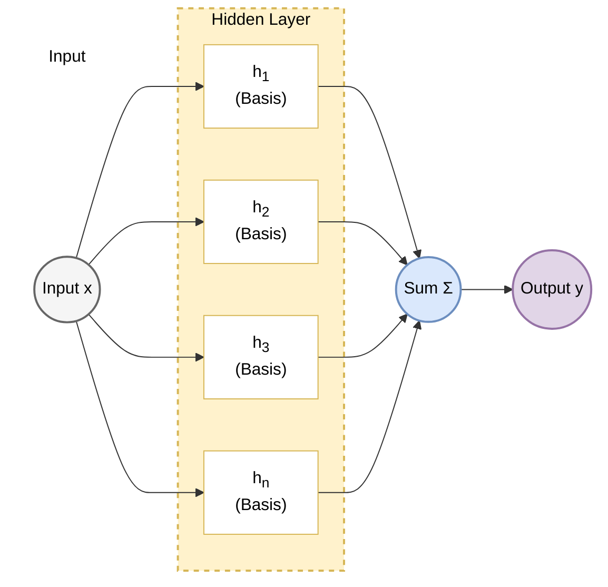

### 1.3.5 从理论到实践：神经网络到底输出什么？ (From Theory to Practice: What Does a Neural Network Actually Output?)

在结束本章之前，我们需要厘清一个经常困扰初学者的问题：**通用近似定理告诉我们要拟合目标函数 $y$，但神经网络的最后一层到底输出了什么？**

#### 1. 理想 vs 现实
*   **理想情况**：在分类问题（如猫 vs 狗）中，我们希望网络直接输出一个概率 $P(\text{Cat}|x) \in [0, 1]$。
*   **工程现实**：强行限制神经网络的输出在 $[0, 1]$ 区间内是一个**带约束的优化问题**，这会极大增加训练的难度。

#### 2. 解决方案：Logits
因此，在深度学习的实际实现中，我们通常**不直接**让神经网络拟合概率，而是让它输出一个无约束的实数值，称为 **Logits** (或者 Scores, Energies)。

*   **Logits ($\mathbf{z}$)**：值域为 $(-\infty, +\infty)$。它代表了模型对某一类别的“原始打分”。分值越高，置信度越高。
*   **Universal Approximation 的真正含义**：神经网络作为一个通用函数拟合器，它实际上拟合的是 **Log-Odds** (对数几率) 或 **Unnormalized Log-Probability**。

#### 3. 最后的转换
为了得到我们需要的结果，我们在网络的**最末端**挂接一个特定的“适配器”函数：

*   **回归问题**：直接输出 Logits（恒等映射）。
*   **二分类问题**：使用 **Sigmoid** 函数将 Logits 映射到 $(0, 1)$。
*   **多分类问题**：使用 **Softmax** 函数将 Logits 映射到概率分布。

$$ \underbrace{\text{Neural Network}}_{\text{Universal Approximator}} \xrightarrow{\text{Logits } z} \underbrace{\text{Activation}}_{\text{Adapter}} \xrightarrow{\text{Prob } p} \text{Target} $$

这种 **“无约束打分 + 归一化映射”** 的范式，是现代深度学习的标准设计。它让神经网络可以专注于它最擅长的事情——在无约束的空间中自由地拟合复杂的函数曲面。

*(关于 Logits 如何转化为概率的详细数学机制，请参阅 **[附录 A.7 Softmax 与 Cross-Entropy](../appendix/a.7_softmax_crossentropy.md)**)*

### 1.3.6 思考：从分类到生成——生成式 AI 的两种形态 (Reflection: From Classification to Generation)

既然你已经理解了 **Logits** 和 **Softmax**，你实际上已经掌握了现代**生成式 AI** 的核心秘密。

但值得注意的是，生成式 AI 并非只有一种形态。我们常说的 ChatGPT (文本生成) 和 Midjourney (图像生成) 走的是两条截然不同的数学路径：**离散分类** vs **连续回归**。

#### 1. 文本生成：离散的接龙游戏 (LLM as Classification)

ChatGPT 等大语言模型 (LLM) 本质上是一个 **超大规模的分类器**。
*   **离散空间**：语言由一个个离散的单词（Token）组成。我们有一个固定的词表（如 50,000 个词）。
*   **任务**：根据上文，从这 50,000 个选项中**分类**出下一个词。
*   **流程**：
    $$ \text{Context} \xrightarrow{\text{LLM}} \text{Logits} \xrightarrow{\text{Softmax}} \text{Probability} \xrightarrow{\text{Sampling}} \text{Next Token} $$
*   **创造力来源**：**采样 (Sampling)**。模型并不总是选概率最大的词（Argmax），而是根据概率“掷骰子”。这种随机性赋予了 AI 写作的多样性。

#### 2. 图像生成：连续的去噪过程 (Diffusion as Regression)

图像生成（如 Stable Diffusion）则完全不同。
*   **连续空间**：图像由像素组成，每个像素的 RGB 值是连续变化的（[0, 255] 或归一化后的实数）。这里不存在一个包含所有可能像素组合的“字典”。
*   **任务**：**去噪 (Denoising)**。模型不再是做分类，而是做 **回归 (Regression)**。
*   **原理**：
    1.  我们在训练时，给清晰图片加噪声（Noise）。
    2.  让模型学习预测**“加了多少噪声”**（这是一个具体的数值）。
    3.  生成时，我们从纯噪声开始，让模型一步步预测并减去噪声，最终还原出清晰的图像。
*   **损失函数**：这里不再用 Cross-Entropy，而是用 **MSE (均方误差)**，因为我们要预测的是准确的像素值（或 Latent 值），而非类别概率。

#### 3. 总结对比

| 特性 | 文本生成 (LLM) | 图像生成 (Diffusion) |
| :--- | :--- | :--- |
| **数学本质** | **分类 (Classification)** | **回归 (Regression)** |
| **数据空间** | **离散 (Discrete)**   (有限的词表) | **连续 (Continuous)**   (无限的像素值) |
| **核心输出** | **概率分布 (Softmax)** | **预测噪声/像素值 (Linear)** |
| **损失函数** | Cross-Entropy | MSE (Mean Squared Error) |
| **生成方式** | 逐词递归 (Autoregressive) | 逐步去噪 (Denoising) |

理解了这一点，你就明白了为什么我们在讲 Softmax 时主要针对文本和分类任务，而未来的章节（如图像生成）将更多地从几何和能量函数的角度切入。

### 1.3.7 黎明前的黑暗：第二次 AI 寒冬 (The Darkness Before Dawn: The Second AI Winter)

**“如果我们已经拥有了如此强大的理论（如通用近似），为什么神经网络在 20 世纪 90 年代没有直接统治世界，反而跌入了谷底？”**

这是每个学习 AI 历史的人都会产生的疑问。如今我们知道神经网络最终胜出了（看看现在的 ChatGPT 和 Stable Diffusion），但在当时，**理论的完备性并不等于工程的可行性**。这就像我们在 20 世纪初就知道核聚变的原理，但直到今天，可控核聚变依然是难以攻克的工程难题。

尽管 MLP 在理论上证明了其潜力，但当时的工程实践却狠狠打了理想主义者的脸。神经网络很快迎来了长达近 20 年的沉寂（约 1995-2010），这被称为“第二次 AI 寒冬”。

主要原因有三点：
1.  **梯度消失与激活函数的误区**：当时的研究者普遍坚持使用 **Sigmoid** 或 **Tanh**（认为模拟生物神经元必须有界且光滑）。如 1.3.3 所述，这些函数容易饱和，导致深层网络梯度消失。虽然 ReLU 能解决这个问题，但当时被认为过于简单粗暴，并未被主流采纳。
2.  **局部最优的恐慌 (Fear of Local Minima)**：当时的理论学家认为非凸优化充满了局部陷阱，难以找到全局最优解。虽然现代研究表明在高维空间中这主要体现为**鞍点 (Saddle Points)** 而非局部极小值，但在当时，这引发了巨大的理论恐慌。
3.  **算力与数据的匮乏**：训练大网络需要海量数据和算力，而当时的 CPU 难以胜任，互联网的大数据时代也尚未到来。

这导致了人们对“黑盒”且难以训练的神经网络失去了耐心。与此同时，基于统计学习理论的模型（如 **SVM**）凭借其 **严谨的数学边界** 和 **稳定的表现** 迅速接管了舞台。

在下一节（1.4），我们将看到统计学习如何在寒冬中通过数学严谨性挽救了 AI 的声誉，直到深度学习的再次觉醒。
