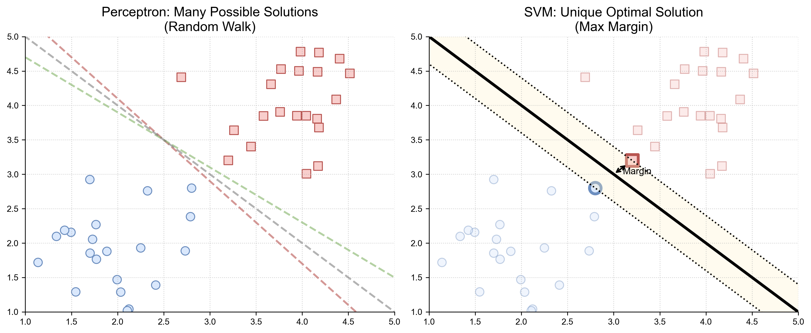
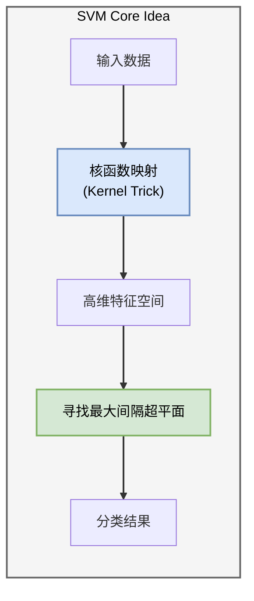
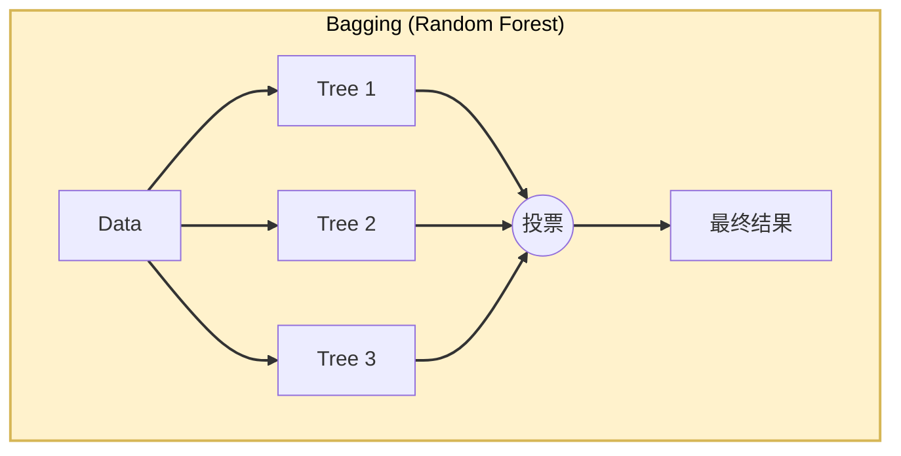
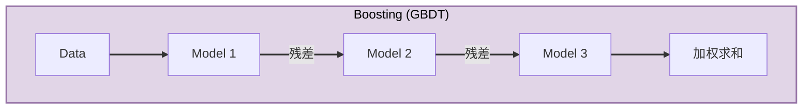

# 1.4 统计学习的黄金时代：SVM 与随机森林
## 1.4 The Golden Age of Statistical Learning: SVM & Random Forests

在神经网络因为“梯度消失”和“算力匮乏”而陷入第二次寒冬（1995-2010）时，AI 领域并没有停滞。相反，这是**统计学习理论 (Statistical Learning Theory)** 的黄金时代。

以 **SVM (支持向量机)** 和 **Random Forest (随机森林)** 为代表的模型，凭借其 **严谨的数学理论**、**高效的训练速度** 和 **优秀的小样本性能**，统治了学术界和工业界长达 15 年。

### 1.4.1 支持向量机 (SVM)：寻找最宽的街道

感知机只要找到一条线把两类分开就行，但 SVM 说：“不，我要找到**最好**的那条线。”

*   **直观理解 (Max Margin)**：
    最好的分界线，应该是离两边最近的数据点（支持向量 Support Vectors）都**最远**的那条线。这就像在两类数据之间修一条马路，我们希望马路越宽越好（Margin 最大化）。
*   **数学本质**：
    感知机是最小化误差，SVM 是最大化几何间隔。这是一个**凸优化问题 (Convex Optimization)**，这意味着它有**唯一全局最优解**（不像神经网络容易陷入局部最优）。

**核技巧 (Kernel Trick)**：
SVM 的另一大杀器。当数据在低维不可分时（如 XOR），SVM 通过核函数 $K(x, y)$ 隐式地将数据映射到高维空间。
*   **神经网络**通过**隐藏层**显式地提取特征。
*   **SVM** 通过**核函数**隐式地计算高维相似度。

### 1.4.2 集成学习 (Ensemble Learning)：三个臭皮匠

如果一个模型不够强，那就用一百个！集成学习的思想直接启发了后来的深度学习（如 Dropout）。

1.  **Bagging (如 Random Forest)**：
    *   **并行**训练很多棵决策树，每棵树看不同的数据子集。
    *   最后**投票**决定结果。
    *   **优点**：极大降低了方差 (Variance)，不易过拟合。

2.  **Boosting (如 XGBoost, GBDT)**：
    *   **串行**训练，后一个模型专门修正前一个模型的错误。
    *   **优点**：极大降低了偏差 (Bias)，精度极高。

### 1.4.3 统计学习的“天花板”与深度学习的破局

尽管 SVM 和随机森林在数学上呈现出一种令人舒适的“洁癖感”——有唯一解、收敛有保证、可解释性强——但它们最终撞上了一道看不见的天花板：**特征表示 (Representation)**。

在统计学习的黄金时代，解决问题的流程通常是割裂的：
1.  **特征工程 (Feature Engineering)**：由人类专家手工设计特征（如提取图像的边缘、纹理，或文本的关键词）。
2.  **分类器学习**：将提取好的特征喂给 SVM 或 RF 进行分类。

这意味着，模型的上限被**人类对数据的理解**锁死了。对于 Excel 表格这类结构化数据，人类还能应付；但面对图像、语音、自然语言等高维感知数据，人类手工设计的特征在无穷的变化面前显得捉襟见肘。

**深度学习的回归，本质上是“端到端 (End-to-End)”哲学的胜利。** 它不再需要人类做保姆，而是直接从原始像素（Raw Pixels）到最终输出，连同“特征提取”这一步也一起学了。

我们可以通过下表，清晰地看到这两种范式在核心理念上的决裂：

| 维度 | 统计学习 (SVM/RF) | 深度学习 (Deep Learning) |
| :--- | :--- | :--- |
| **核心哲学** | **分而治之** (人工特征 + 机器分类) | **端到端** (特征与分类联合学习) |
| **性能曲线** | 数据量大时性能**趋于饱和** | 性能随数据量**指数增长** |
| **最佳战场** | 结构化数据 (金融风控、推荐系统) | 感知数据 (CV, NLP, Speech) |
| **算力依赖** | CPU 即可，训练快 | 极度依赖 GPU，训练昂贵 |

这一范式的转移，在 2012 年 ImageNet 大赛上迎来了决定性的瞬间。当 AlexNet 以巨大的优势碾压了所有基于手工特征的传统方法时，历史的钟摆终于再次摆回了神经网络一侧。

> **本章总结**：
> 至此，我们走过了 AI 的史前时代与黄金时代。从感知机的单层局限，到 MLP 的异或突破，再到 SVM 的数学统领。
>
> 历史告诉我们，没有完美的算法，只有适合时代的算法。当数据与算力就位，深度学习的复兴已不可阻挡。在下一章，我们将正式推开深度学习的大门，去拆解那些改变世界的现代架构。
