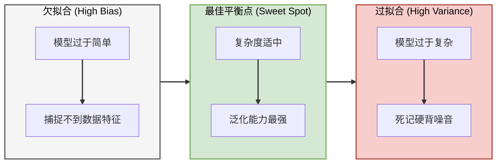
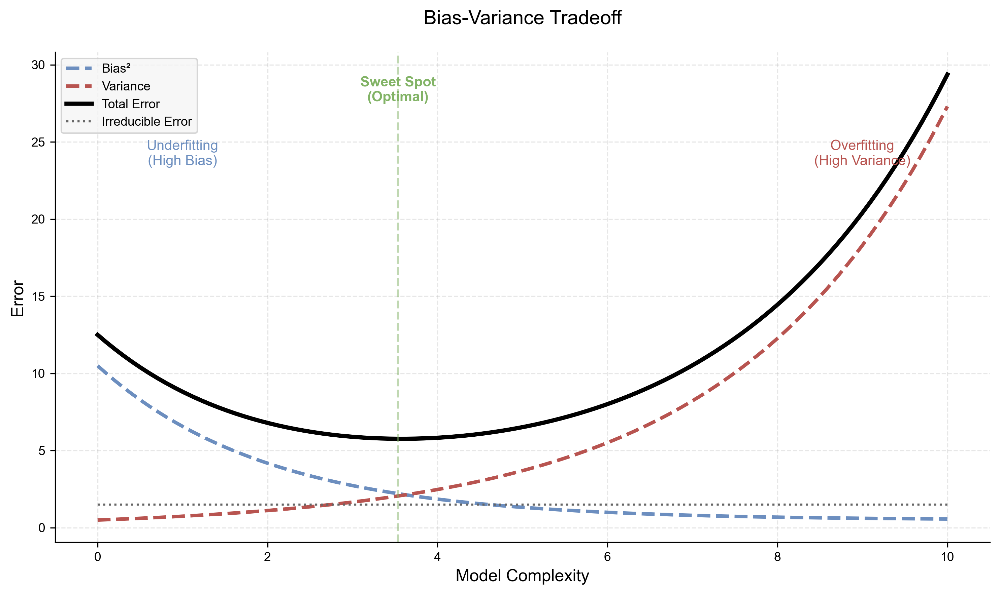
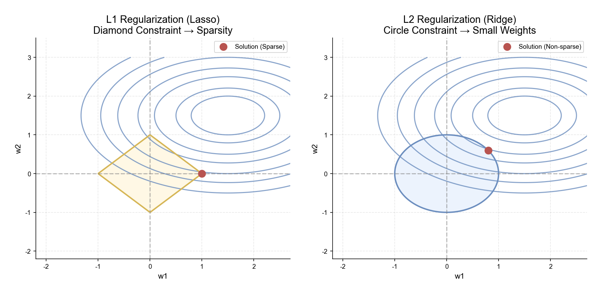
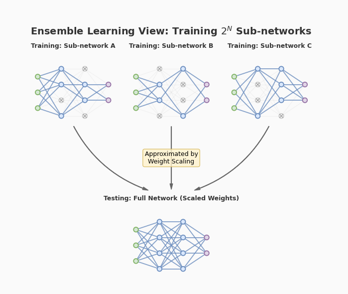
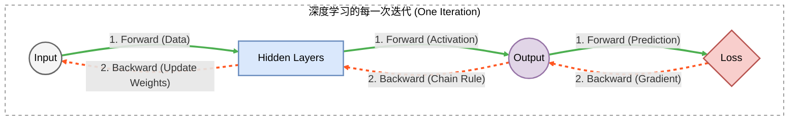
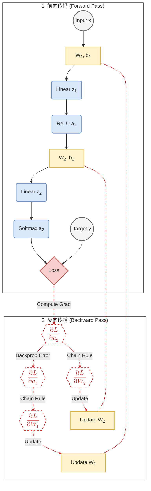
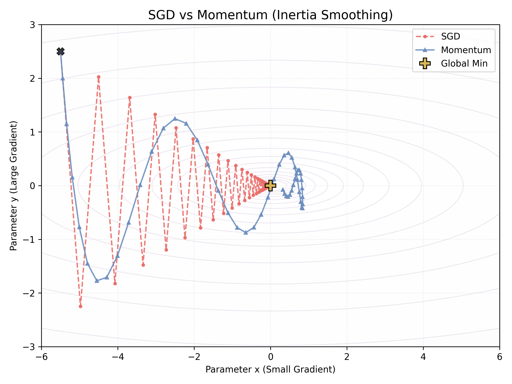
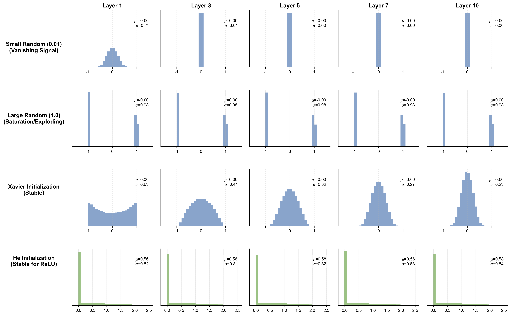

# 2.1 深度学习的理论基石：从泛化到反向传播
## 2.1 Theoretical Foundations: From Generalization to Backpropagation

在第一章的末尾，我们见证了深度学习凭借“端到端”的特征提取能力，终结了统计学习的黄金时代。当大门被推开，摆在我们面前的是一个由数亿参数构成的复杂宇宙。

在这一章，我们将深入探索现代神经网络的核心架构（CNN, RNN, LSTM）。但在拆解这些复杂的精密仪器之前，我们必须先掌握支配它们运作的**“第一性原理”**。

深度学习并非黑魔法，它的本质是 **微积分** (Backpropagation) 在 **统计学** (Generalization) 约束下的 **最优化** (Optimization) 过程。本节将为你构建这套完整的数学心法：从衡量模型好坏的“泛化理论”，到防止其误入歧途的“正则化”，最后是驱动其学习的引擎——“反向传播”与“优化器”。

这些理论如同物理定律一样，并不随架构的更新而过时。无论是 ResNet 还是 Transformer，都运行在这套基石之上。

### 2.1.1 机器学习的铁律：泛化与过拟合 (Generalization & Overfitting)

我们训练模型的终极目标从来不是在 **训练集** 上拿满分，而是在未见过的 **测试集** 上表现良好。这种举一反三的能力被称为 **泛化 (Generalization)**。

#### 1. 经验风险与期望风险
从数学上讲，我们试图最小化所有可能数据的**期望风险 (Expected Risk)** $R(f)$，但上帝视角的真实分布 $P(x,y)$ 是不可知的。因此，我们只能退而求其次，最小化在训练集上的**经验风险 (Empirical Risk)** $\hat{R}(f)$：

$$ \hat{R}(f) = \frac{1}{N} \sum_{i=1}^N L(y_i, f(x_i)) $$

**过拟合 (Overfitting)** 的本质就是：模型过度优化了 $\hat{R}(f)$，导致它开始“死记硬背”训练样本中的噪声，从而使得 $\hat{R}(f)$ 很低，但真实的泛化误差 $R(f)$ 却激增。

#### 2. 偏差-方差分解 (Bias-Variance Decomposition)
泛化误差可以数学分解为三部分（详细推导见 [附录 A.3](../appendix/a.3_statistical_learning_theory.md)）：

Math
$$ \text{Error} = \text{Bias}^2 + \text{Variance} + \text{Noise} $$

*   **偏差 (Bias)**：模型的**拟合能力**。偏差高意味着模型太简单（欠拟合），连训练集都学不会（如用直线拟合正弦曲线）。
*   **方差 (Variance)**：模型的**敏感度**。方差高意味着模型太复杂（过拟合），稍微换一组训练数据，模型就会发生剧烈变化。
*   **不可约误差 (Noise)**：数据本身的固有噪声，这是性能的上限。

我们用下图来直观展示这三者的博弈关系：随着模型变得越来越复杂，偏差逐渐降低，但方差却急剧上升。

#### 3. 复杂度的度量：VC 维 (VC Dimension)
在上图中，横轴代表“Model Complexity”。但如何从数学上定量描述一个模型的复杂度？统计学习理论引入了 **VC 维 (Vapnik-Chervonenkis Dimension)** 的概念。

*   **直观定义**：VC 维衡量了模型能够“打散” (Shatter) 多少个样本。
    *   例如，二维平面上的直线分类器（感知机）可以打散 3 个点（任意红蓝组合都能分开），但无法打散 4 个点（XOR 问题），所以其 VC 维为 3。
*   **泛化界 (Generalization Bound)**：
    VC 维越高，模型越复杂，泛化界就越“松”。这意味着训练误差与测试误差之间的差距可能非常大，极易过拟合。
    
$$ E_{out} \le E_{in} + \Omega(N, d_{VC}) $$

这为“奥卡姆剃刀”原则提供了坚实的数学背书：**在训练误差相近时，应总是选择 VC 维更低（更简单）的模型**。（关于 VC 维的详细定义与泛化误差界公式，详见 **[附录 A.3](../appendix/a.3_statistical_learning_theory.md)**）

### 2.1.2 应对过拟合：正则化 (Regularization)

深度神经网络通常拥有百万级甚至亿级的参数，天然处于高方差（过拟合）的风险区。为什么它们还能工作？因为我们有**正则化**——即在损失函数中引入“约束”或“先验知识”，强迫模型学习更平滑、更简单的解。（关于正则化的贝叶斯解释与详细推导，请见 **[附录 A.4](../appendix/a.4_regularization.md)**）

#### 1. L1 与 L2 正则化 (Mathematical Definition)

最经典的正则化方法是通过修改**损失函数**，在其中加入对参数规模的惩罚项（Penalty Term）。
$$ J(\mathbf{w}) = \text{Loss}(\mathbf{w}) + \lambda \cdot \Omega(\mathbf{w}) $$
其中 $\lambda$ 是控制约束强度的超参数。

*   **L2 正则化 (Ridge)**：
    $$ \Omega(\mathbf{w}) = \frac{1}{2} \|\mathbf{w}\|^2_2 = \frac{1}{2} \sum w_i^2 $$
    它倾向于让参数**整体变小且分布均匀**，防止任何一个权重过大主导决策。
*   **L1 正则化 (Lasso)**：
    $$ \Omega(\mathbf{w}) = \|\mathbf{w}\|_1 = \sum |w_i| $$
    它倾向于让参数**变得稀疏**（许多 $w_i$ 直接变成 0）。

**几何直观 (Geometric Intuition)**：
如下图所示，我们将 Loss 的等高线（同心椭圆）和约束区域（阴影部分）画在同一个平面上。最优解是 Loss 等高线与约束边界的**切点**。
*   **L2 (圆形)**：切点通常在圆周上，$w$ 变小但不为 0。
*   **L1 (菱形)**：切点极大概率落在坐标轴的**尖角 (Corner)** 上，导致某些维度 $w=0$（稀疏解）。

#### 2. 工程视角：权重衰减 (Weight Decay)

在实际的深度学习框架（如 PyTorch）中，我们通常不直接修改 Loss 函数公式，而是设置优化器的 **`weight_decay`** 参数。为什么？

*   **L2 正则化 $\approx$ 权重衰减**
    如果我们对 L2 正则化的 Loss 求导并代入 SGD 更新公式，会发现：
    $$ w_{t+1} = w_t - \eta (\nabla Loss + \lambda w_t) = \underbrace{(1 - \eta\lambda)}_{\text{Decay}}w_t - \eta \nabla Loss $$
    这意味着：**L2 正则化在数学上等价于在每次更新前，先将权重“衰减”一小部分**。这就解释了术语 **Weight Decay** 的由来。

*   **谁更常用？**
    *   **L2 (Weight Decay)** 是**绝对的主流**。它能有效平滑模型，是现代架构（ResNet, Transformer, BERT）的标配。
    *   **L1** 仅用于明确需要进行**特征选择**（剔除无用输入）的特殊场景。

#### 3. Dropout：随机失活
**Dropout** 是深度学习特有的正则化技巧。虽然直观上是“随机让神经元罢工”，但其背后有严谨的数学定义。

**数学定义 (Mathematical Formulation)**：
设 $\mathbf{h}$ 为隐藏层输出，$p$ 为**丢弃概率 (Dropout Rate)**。我们引入一个服从伯努利分布的随机掩码向量 $\mathbf{r}$：
$$ \mathbf{r} \sim \text{Bernoulli}(1-p) $$

*   **训练时**：应用掩码 $\tilde{\mathbf{h}} = \mathbf{r} \odot \mathbf{h}$。
*   **测试时**：为了平衡期望值 ($E_{train}[\tilde{\mathbf{h}}] = (1-p)\mathbf{h}$)，我们需要对权重或输出进行缩放，这就是 **Weight Scaling**。
    $$ \mathbf{h}_{test} = (1-p) \mathbf{h} $$
    *(注：现代框架常采用 **Inverted Dropout**，即在训练时直接除以 $1-p$，从而免去测试时的缩放)*

（关于掩码向量的生成、数值计算示例及反向传播细节，请见 **[附录 A.4.4](../appendix/a.4_regularization.md#a44-dropout-的数学机制详解-mathematics-of-dropout)**）

**集成学习视角 (Ensemble View)**：
*   **训练时 (Ensemble)**：每次 Iteration，我们都在训练一个新的、更稀疏的子网络。由于网络参数是共享的，这相当于我们在同时训练指数级个 ($2^N$) 不同的神经网络。
*   **测试时 (Averaging)**：所有神经元开启。上述的 Weight Scaling 在数学上近似于对那 $2^N$ 个子网络的预测结果取**几何平均 (Geometric Mean)**。

从这个角度看，Dropout 并非简单的“扔掉”信息，而是一种极其高效的**集成学习 (Ensemble Learning)**。

  

### 2.1.3 通用近似定理 (Universal Approximation Theorem)

在 1.3.4 节中，我们从直观的维度介绍了**通用近似定理**，阐述了它如何证明多层感知机（MLP）具备解决非线性问题（如 XOR）的能力。本章我们将转入**数学构造**的严谨视角，深入探讨这一性质背后的机理：神经网络**为什么**能够逼近任意函数？

在通过正则化解决了“不敢学”（过拟合）的问题后，我们需要回到原点，从数学机理上确认神经网络到底“能不能学”（表达能力）。

**定理陈述**：
> 一个包含足够多隐藏神经元且具有非线性激活函数（如 Sigmoid, ReLU）的**单层前馈神经网络**，能够以任意精度逼近任何定义在紧致集合上的连续函数。

**数学表达 (Cybenko, 1989)**：
设 $\sigma(\cdot)$ 为任意非线性激活函数，对于任意连续函数 $f(x)$ 和 误差 $\epsilon > 0$，存在整数 $N$ 和参数 $v_i, w_i, b_i$，使得：
$$ F(x) = \sum_{i=1}^{N} v_i \sigma(w_i x + b_i) $$
$$ |F(x) - f(x)| < \epsilon, \quad \forall x \in [0, 1]^n $$

这表明，单隐层神经网络在连续函数空间中是**稠密 (Dense)** 的。

**直观证明 (Bump Function 构造法)**：

我们可以通过构造“积木”来逼近任意形状。
想象一个 ReLU 对 $\sigma(x)$。通过组合两个偏移的 ReLU，我们可以构造出一个“凸起” (Bump)。无数个不同高度、不同位置的“凸起”通过线性组合，可以拼凑出任意复杂的曲线（这本质上就是黎曼积分的思想）。

这意味着：只要网络够宽或够深，理论上不存在它学不会的函数。这为深度学习提供了最底层的数学存在性证明。（详细数学证明请见 **[附录 A.5](../appendix/a.5_universal_approximation.md)**）

### 2.1.4 训练引擎：反向传播 (Backpropagation)

有了模型和目标，如何求出那几百万个参数的最优解？答案是**梯度下降**。而计算梯度的核心算法，就是 1986 年由 Hinton 等人推广的**反向传播 (Backpropagation)**。

#### 1. 核心思想：计算图与链式法则
反向传播的本质是**链式法则 (Chain Rule)** 在**计算图 (Computational Graph)** 上的高效应用。
想象整个神经网络是一个巨大的管道系统（计算图）。
*   **前向传播 (Forward Pass)**：数据像水流一样，从输入层流向输出层，经过层层加权和激活，最终计算出 Loss。
*   **反向传播 (Backward Pass)**：**误差信号**（梯度）像水流回溯一样，从 Loss 出发，沿着原本的路径逆流而上，计算每个阀门（权重）对总误差的“贡献度”。

我们可以用下图直观对比这两股“水流”：

#### 2. 矩阵版反向传播推导 (The Four Fundamental Equations)
为了高效计算，现代深度学习框架（如 PyTorch）都采用**矩阵运算**。我们定义第 $l$ 层的加权输入为 $\mathbf{z}^{(l)}$，激活输出为 $\mathbf{a}^{(l)}$。
$$ \mathbf{z}^{(l)} = \mathbf{W}^{(l)} \mathbf{a}^{(l-1)} + \mathbf{b}^{(l)}, \quad \mathbf{a}^{(l)} = \sigma(\mathbf{z}^{(l)}) $$

我们需要求 Loss 对权重 $\mathbf{W}^{(l)}$ 和偏置 $\mathbf{b}^{(l)}$ 的梯度。这就引入了一个中间量——**误差项 (Error Term) $\boldsymbol{\delta}^{(l)}$**，它表示“第 $l$ 层神经元的加权输入 $\mathbf{z}^{(l)}$ 对最终 Loss 的敏感程度”：
$$ \boldsymbol{\delta}^{(l)} \equiv \frac{\partial L}{\partial \mathbf{z}^{(l)}} $$

有了这个定义，反向传播可以概括为四个简洁优美的公式（BP 四大公式）：

**(1) 输出层误差 (Output Layer Error)**
计算最后一层 $L$ 的误差。这取决于损失函数的导数 $\nabla_{\mathbf{a}}L$ 和激活函数的导数 $\sigma'$。
$$ \boldsymbol{\delta}^{(L)} = \nabla_{\mathbf{a}}L \odot \sigma'(\mathbf{z}^{(L)}) $$
*   $\odot$ 代表 Hadamard 积（逐元素相乘）。这告诉我们：如果激活函数进入饱和区（$\sigma' \approx 0$），梯度就会在这里消失。

**(2) 误差反向传播 (Error Backpropagation)**
如何从第 $l+1$ 层的误差推导出第 $l$ 层的误差？误差通过权重矩阵的**转置** $(\mathbf{W}^{(l+1)})^T$ 往回传。
$$ \boldsymbol{\delta}^{(l)} = \left[ (\mathbf{W}^{(l+1)})^T \boldsymbol{\delta}^{(l+1)} \right] \odot \sigma'(\mathbf{z}^{(l)}) $$
*   **直观理解**：第 $l+1$ 层的误差 $\boldsymbol{\delta}^{(l+1)}$ 被权重矩阵 $W$ “加权分配”回了第 $l$ 层。

**(3) 权重的梯度 (Gradient w.r.t Weights)**
有了本层的误差 $\boldsymbol{\delta}^{(l)}$，权重的梯度就是“误差”乘以“上一层的输入”。
$$ \frac{\partial L}{\partial \mathbf{W}^{(l)}} = \boldsymbol{\delta}^{(l)} (\mathbf{a}^{(l-1)})^T $$
*   这解释了为什么输入 $\mathbf{a}^{(l-1)}$ 也不能过大或过小，因为它直接充当了梯度的系数。

**(4) 偏置的梯度 (Gradient w.r.t Bias)**
$$ \frac{\partial L}{\partial \mathbf{b}^{(l)}} = \boldsymbol{\delta}^{(l)} $$

（关于这四个公式的详细数学推导、矩阵维度分析及计算图的局部梯度视角，请见 **[附录 A.6 反向传播的数学推导](../appendix/a.6_backpropagation.md)**）

#### 3. 完整的动态流程图
下图展示了一个包含两层网络的完整前向与反向过程。前向传播计算 Loss，反向传播计算梯度并更新参数。

> **核心概念说明：Softmax 函数**
>
> 在上图中，我们看到输出层使用了 `Softmax`。这是多分类任务（如识别 1000 种物体）的标准配置。
> 它将神经网络输出的任意实数（Logits）转换为**概率分布**：
> 1.  所有概率非负 ($p_i \ge 0$)。
> 2.  所有概率之和为 1 ($\sum p_i = 1$)。
>
> **公式**：
> $$ \text{Softmax}(z_i) = \frac{e^{z_i}}{\sum_{j} e^{z_j}} $$
>
> *（关于 Softmax 及其与交叉熵损失函数的完美配合与求导推导，请详见 **[附录 A.7 Softmax 与 Cross-Entropy](../appendix/a.7_softmax_crossentropy.md)**）*

### 2.1.5 优化器：从 SGD 到 Adam

计算出梯度 $g$ 后，如何更新参数 $w$？朴素的 **SGD (Stochastic Gradient Descent)** 遵循最陡下降原则：
$$ w_{t+1} = w_t - \eta g_t $$
但在面对复杂的非凸优化曲面（如狭长的峡谷或鞍点）时，SGD 往往表现不佳：它会在峡谷壁之间剧烈震荡（Zig-Zag），收敛极慢。现代优化器引入了**动量 (Momentum)** 和**自适应 (Adaptivity)** 两个核心概念来解决这一问题。（关于优化器的详细数学推导与进阶分析，请见 **[附录 A.8](../appendix/a.8_advanced_optimization.md)**）

#### 1. Momentum (动量法)
**直观理解**：模拟物理中的小球滚下山坡。小球不会时刻顺着当前的坡度切线方向（梯度）走，而是拥有**惯性**。如果梯度方向改变（震荡），惯性会平滑路径；如果梯度方向一致（下坡），小球会不断加速。

**数学定义**：
我们引入速度变量 $v$，它是梯度的**指数移动平均 (Exponential Moving Average, EMA)**：
$$ v_t = \beta v_{t-1} + (1-\beta) g_t $$
$$ w_{t+1} = w_t - \alpha v_t $$
*   $\beta$ (通常约 0.9) 类似于“摩擦系数”，决定了惯性的大小。
*   **效果**：在峡谷中，垂直于谷底的震荡分量互相抵消，而平行于谷底的加速分量互相叠加，从而加速收敛。

#### 2. Adaptive Learning Rate (自适应学习率)
**直观理解**：不同的参数扮演不同的角色。对于经常更新的参数（如常见词的 Embedding），我们希望步长小一点以微调；对于很少更新的稀疏参数（如生僻词），一旦出现，我们希望步长大一点以抓住机会。
**RMSProp** 通过衡量梯度的“大小”来动态调整每个参数的学习率。

**数学定义**：
我们计算梯度平方的移动平均 $s_t$（即二阶矩估计）：
$$ s_t = \beta s_{t-1} + (1-\beta) g_t^2 $$
$$ w_{t+1} = w_t - \frac{\eta}{\sqrt{s_t + \epsilon}} g_t $$
*   当梯度很大（陡峭）时，$s_t$ 变大，分母变大，有效学习率减小（防止震荡）。
*   当梯度很小（平坦）时，$s_t$ 变小，分母变小，有效学习率增大（加速通过平原）。

#### 3. Adam (Adaptive Moment Estimation)
这是目前的默认选择（Default Go-to Optimizer）。

**为什么需要 Adam？**
*   **动量法的局限**：虽然解决了震荡，但在极度拉伸的峡谷中，单一的全局学习率可能导致在平缓方向上移动极其缓慢。
*   **自适应法的局限**：虽然解决了尺度问题，但 RMSProp 缺乏惯性，在接近收敛时容易受随机噪声影响而在最优点附近抖动。

**Adam 的集大成之道**：
Adam 优雅地结合了二者。它同时维护**一阶矩 $m_t$**（动量，提供惯性）和**二阶矩 $v_t$**（自适应缩放，调整步长）。

**数学定义**：
1.  **一阶矩与二阶矩**：
    $$ m_t = \beta_1 m_{t-1} + (1-\beta_1) g_t \quad \text{(Momentum)} $$
    $$ v_t = \beta_2 v_{t-1} + (1-\beta_2) g_t^2 \quad \text{(RMSProp)} $$
2.  **参数更新**：
    $$ w_{t+1} = w_t - \eta \frac{\hat{m}_t}{\sqrt{\hat{v}_t} + \epsilon} $$
    *(注：$\hat{m}, \hat{v}$ 为偏差修正后的值。典型参数：$\beta_1=0.9, \beta_2=0.999$)*

**优化器轨迹总览 (The Grand Comparison)**：
我们将所有优化器的轨迹绘制在同一张图上，可以清晰地看到进化的脉络：

*   **SGD (红色)**：受困于峡谷的陡峭壁面，剧烈震荡，寸步难行。
*   **Momentum (蓝色)**：引入惯性，冲破了震荡，但步长单一。
*   **RMSProp (紫色)**：自适应调整步长，能够快速穿越平缓区，但路径有抖动。
*   **Adam (绿色)**：集大成者，既有惯性带来的平滑，又有自适应带来的快速，走出了一条直奔终点的完美曲线。

### 2.1.6 权重初始化：打破对称与保持方差

在构建好深度神经网络的架构后，我们需要给每个参数赋一个初始值。这一步看似随意，实则决定了训练的生死。如果不恰当的初始化，反向传播时梯度信号会迅速衰减至死（梯度消失）或无限放大（梯度爆炸）。

#### 1. 直观理解：传声筒游戏 (Telephone Game)
想象深度网络是一个有 100 层接力者的传声筒游戏。
*   **输入信号**（数据）就像初始的悄悄话。
*   **层与层之间**的传递，就是将信号乘以权重 $W$。
*   **如果 $W$ 太小 (比如 0.01)**：声音会越来越小，传到第 10 层时已经听不见了（**梯度消失**）。
*   **如果 $W$ 太大 (比如 1.5)**：声音会越来越大，传到第 10 层时变成了震耳欲聋的噪音（**梯度爆炸**）。
*   **全零初始化**：如果所有人都被告知“保持沉默”（$W=0$），那么无论输入什么，输出都是 0。更糟糕的是，反向传播时所有神经元收到的梯度完全相同，它们将永远同步更新，网络退化为一个单神经元模型（**对称性陷阱**）。

#### 2. 数学原理：方差守恒 (Variance Preservation)
为了让信号在深层网络中健康传播，我们需要保证每一层的**输出方差**与**输入方差**一致。
设 $y = w_1 x_1 + \dots + w_n x_n$，假设 $w$ 和 $x$ 相互独立且均值为 0，根据方差性质：
$$ \text{Var}(y) = \text{Var}\left(\sum w_i x_i\right) = \sum \text{Var}(w_i x_i) = \sum \text{Var}(w_i)\text{Var}(x_i) $$
$$ \text{Var}(y) = n \cdot \text{Var}(w) \cdot \text{Var}(x) $$
为了保持信号不衰减也不爆炸，我们要令 $\text{Var}(y) = \text{Var}(x)$，这导出了初始化的黄金法则：
$$ n \cdot \text{Var}(w) = 1 \implies \text{Var}(w) = \frac{1}{n} $$

#### 3. 初始化的演进
下图展示了一个 10 层网络在不同初始化策略下的激活值分布演变：

*   **Small Random (0.01)**：激活值迅速向 0 坍缩，信号丢失。
*   **Large Random (1.0)**：激活值迅速向 -1 和 1 两端饱和（对于 Tanh），导致梯度为 0。
*   **Xavier Initialization (Glorot Init)**:
    *   **适用**：Sigmoid / Tanh 激活函数。
    *   **公式**：$W \sim U(-\sqrt{6/(n_{in}+n_{out})}, \sqrt{6/(n_{in}+n_{out})})$
    *   **效果**：如上图第三行所示，激活值在所有层都保持了良好的正态分布，信号稳定传播。
*   **He Initialization (Kaiming Init)**:
    *   **适用**：ReLU 及其变种。
    *   **原理**：ReLU 会将负半轴的信号置为 0，相当于砍掉了一半的方差。为了补偿，初始权重的方差需要加倍 ($\times 2$)。
    *   **公式**：$W \sim N(0, \sqrt{2/n_{in}})$。这是训练深层 ResNet 的关键。
    *   **效果**：如上图第四行所示，即使经过 10 层 ReLU，信号强度依然保持稳定。

------------------------------------------------------------------------------------------------

至此，我们已经完成了深度学习“内功心法”的修炼。
*   我们理解了**泛化**是目标，**过拟合**是宿敌，**正则化**是武器；
*   我们证明了神经网络拥有无限潜力的**通用近似**能力；
*   我们掌握了**反向传播**如何计算梯度，**优化器**如何利用梯度穿越险阻，**初始化**如何让网络赢在起跑线上。

这就好比我们已经掌握了物理学中的牛顿定律和微积分。接下来，我们将运用这些基本原理去构建精密的机器，处理真实世界中两类最重要的数据：
1.  **空间数据（图像）**：我们将看到 CNN 如何通过“卷积”捕捉局部特征，解决计算机视觉问题。
2.  **时间数据（序列）**：我们将看到 RNN 及其进化体 LSTM 如何通过“记忆”捕捉时序依赖，解决自然语言处理问题。

让我们翻开下一页，进入架构的魔法世界。