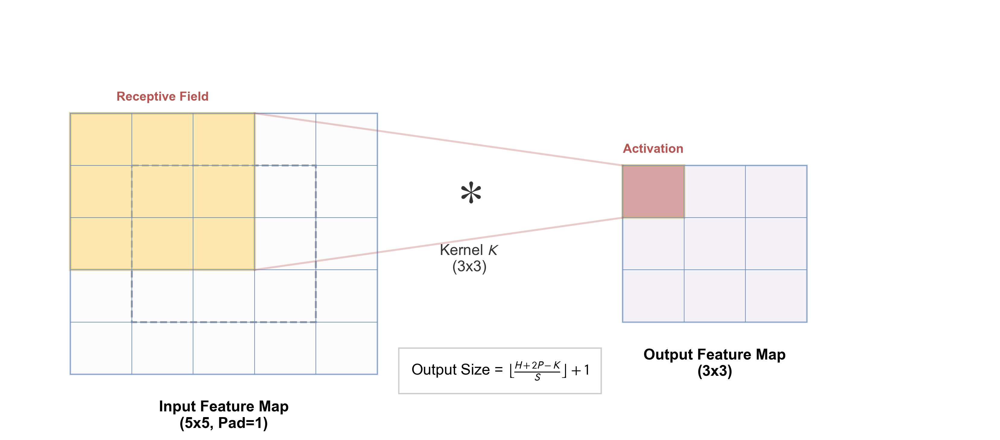
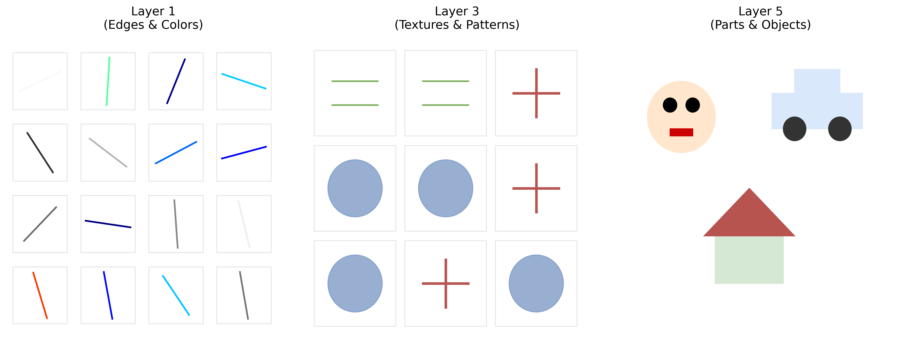
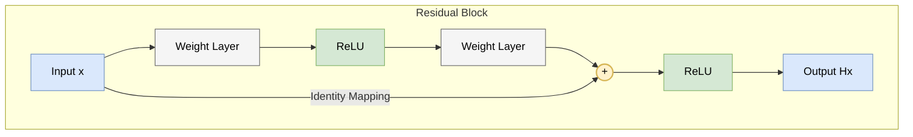

# 2.2 卷积神经网络：视觉皮层的数学抽象
## 2.2 Convolutional Neural Networks (CNN)

人类的视觉系统是一个奇迹。当你看到一只猫时，你不需要逐个像素地扫描，而是瞬间捕捉到边缘、纹理、形状，最终组合成“猫”的概念。这种层级化的特征提取机制，最早由 Hubel 和 Wiesel 在 1959 年对猫的视皮层研究中发现。

卷积神经网络 (CNN) 正是这一生物机制的数学抽象。本节我们将深入这一架构的核心，解析其背后的 **归纳偏置**、**算术原理** 以及 **架构演进** 的哲学。

### 2.2.1 归纳偏置：为什么是卷积？ (The Inductive Bias)

全连接网络 (MLP) 在处理图像时面临两个致命问题：
1.  **参数爆炸**：一张 $1000 \times 1000$ 的图片输入到 1000 个神经元的隐层，参数量高达 $10^{9}$ (10亿)，这几乎不可训练。
2.  **结构丢失**：将图像拉平成向量后，像素间的空间邻域关系被彻底破坏。

CNN 引入了两个强有力的 **归纳偏置 (Inductive Bias)** 来解决这些问题：

*   **局部连接 (Local Connectivity)**：
    图像中的相关性通常是局部的。一个像素与其周围的像素关系最密切，而与远处的像素关系较弱。因此，神经元只需连接输入的一个小局部（感受野）。
*   **平移等变性 (Translation Equivariance)**：
    一只猫在图片左上角还是右下角，它都是一只猫。这意味着特征检测器（卷积核）应该在整个图像上**共享参数**。

这两点使得 CNN 的参数量与图像尺寸无关，而只与卷积核大小相关，从而极大地提升了效率。

### 2.2.2 卷积的算术原理 (The Arithmetic of Convolution)

虽然名为“卷积”，但在深度学习中，我们实际使用的是**互相关 (Cross-Correlation)** 运算（不涉及卷积核的翻转）。

#### 1. 离散卷积公式 (Matrix View)
对于单通道图像 $I$ 和卷积核 $K$，在局部窗口内的运算本质上就是两个矩阵的**点积**（Frobenius Inner Product）。
假设局部输入窗口为 $\mathbf{X}_{local}$，卷积核为 $\mathbf{K}$：
$$
\mathbf{X}_{local} = \begin{bmatrix} x_{11} & x_{12} \\ x_{21} & x_{22} \end{bmatrix}, \quad
\mathbf{K} = \begin{bmatrix} k_{11} & k_{12} \\ k_{21} & k_{22} \end{bmatrix}
$$
则输出值 $y$ 为对应元素相乘求和：
$$
y = \langle \mathbf{X}_{local}, \mathbf{K} \rangle = \sum \sum x_{ij} k_{ij} = x_{11}k_{11} + x_{12}k_{12} + x_{21}k_{21} + x_{22}k_{22}
$$
*   **物理意义**：这衡量了输入局部区域 $\mathbf{X}_{local}$ 与卷积核 $\mathbf{K}$ 的**相似度**。如果输入模式（如垂直边缘）与卷积核（垂直边缘检测器）吻合，结果 $y$ 就会很大（激活）。

#### 2. 核心超参数与几何维度
一个卷积层由四个关键维度定义：
*   **$C_{in} / C_{out}$**：输入与输出通道数。
*   **$K$ (Kernel Size)**：卷积核大小（通常为 $3 \times 3$ 或 $5 \times 5$）。
*   **$P$ (Padding)**：填充大小，用于保持尺寸。
*   **$S$ (Stride)**：步长，控制滑动窗口的跳跃幅度。

下图直观展示了卷积、填充和步长的几何关系：

#### 3. 输出尺寸公式 (The Magic Formula)
给定输入尺寸 $H_{in} \times W_{in}$，输出特征图的尺寸可以通过以下公式计算：

$$ H_{out} = \left\lfloor \frac{H_{in} + 2P - K}{S} \right\rfloor + 1 $$
$$ W_{out} = \left\lfloor \frac{W_{in} + 2P - K}{S} \right\rfloor + 1 $$

*   **Same Padding**：若希望输出尺寸不变 ($H_{out} = H_{in}$)，且 $S=1$，需设置 $P = \frac{K-1}{2}$（要求 $K$ 为奇数）。
*   **Valid Padding**：$P=0$，不填充，尺寸会逐层减小。
*   **下采样 (Downsampling)**：当 $S=2$ 时，特征图尺寸减半 ($H_{out} \approx H_{in}/2$)，常用于替代池化层。

#### 4. 通道视角的卷积 (Channel View: The 3D Nature)
初学者常误以为卷积是 2D 运算，实际上它是 **3D 运算**。
假设输入是 RGB 图像 ($C_{in}=3$)，卷积核的形状实际上是 $K \times K \times C_{in}$（如 $3 \times 3 \times 3$）。

$$ \text{Output}(x,y) = \sum_{c=1}^{C_{in}} \sum_{i,j} \text{Input}(x+i, y+j, c) \cdot \text{Kernel}(i, j, c) + \text{Bias} $$

**关键性质**：
*   **聚合通道**：一个卷积核会“看遍”所有输入通道，将它们的信息加权求和，坍缩为一个**单通道**的特征图 (2D Feature Map)。
*   **扩展通道**：为了得到 $C_{out}$ 个输出通道，我们需要 $C_{out}$ 个独立的卷积核（Filters）。
*   **总参数量**：$\text{Params} = (K \times K \times C_{in} + 1) \times C_{out}$。注意参数量与输入图片大小 $H \times W$ 无关！

### 2.2.3 池化层：信息的压缩与筛选 (Pooling Layers)

卷积层负责提取特征，而池化层负责**压缩特征**。它通常跟在卷积层之后。

#### 1. 为什么需要池化？
*   **降低计算量**：通过减小特征图尺寸，显著减少后续层的计算开销。
*   **平移不变性 (Translation Invariance)**：这是池化最重要的数学性质。如果输入图像向右移动一个像素，最大池化（Max Pooling）的输出可能保持不变。这意味着网络对物体微小的位置变化不敏感。
*   **扩大感受野**：通过下采样，后续卷积核能“看到”更大的原图区域。

#### 2. 常见操作
*   **最大池化 (Max Pooling)**：选出局部窗口内的最大值。
    *   *直觉*：只保留最显著的特征（如最亮的边缘），丢弃背景噪声。
*   **平均池化 (Average Pooling)**：计算局部窗口的平均值。
    *   *直觉*：平滑特征，保留背景信息。

$$
\text{Input: } \begin{bmatrix} 1 & 3 \\ 2 & 9 \end{bmatrix} \quad \xrightarrow{\text{Max}} 9, \quad \xrightarrow{\text{Avg}} 3.75
$$

*   **全局平均池化 (Global Average Pooling, GAP)**：将整个 $H \times W$ 的特征图取平均，得到一个数值。这在现代网络（如 ResNet）中常用于替代全连接层。

### 2.2.4 训练与学习动力学 (Training and Learning Dynamics)

很多初学者容易误解一点：以为卷积核（Kernel）是像 Photoshop 滤镜一样，由工程师预先定义好的（如 Sobel 算子）。

**事实并非如此。** 在 CNN 中，卷积核 $\mathbf{K}$ 就是神经网络的**权重 (Weights)**。它们初始化时是随机噪声，通过**端到端 (End-to-End)** 的训练，网络自动“学会”了应该长成什么样来提取有用的特征。

#### 1. 架构全景图：从像素到决策 (The Architecture Panorama)

从宏观视角看，标准的 CNN 分类器在结构上正是由 **前端的“卷积特征提取器”** 和 **后端的“传统 MLP 分类器”** 串联而成的。

这一架构完美融合了 **前端感知 (Perception)** 与 **后端决策 (Decision)** 的双重结构，并通过 **特征提取 (Feature Extraction)**、**空间压缩 (Spatial Compression)** 与 **逻辑决策 (Logical Decision)** 这三个功能阶段层层递进：

我们以经典的 ResNet-50 为例，追踪张量 (Tensor) 在这三个阶段中的形态演变：

```mermaid
graph LR
    %% 样式定义
    classDef tensor fill:#F5F5F5,stroke:#666666,color:#000000,shape:rect;
    classDef op fill:#DAE8FC,stroke:#6C8EBF,color:#000000,shape:rounded;
    classDef vector fill:#FFF2CC,stroke:#D6B656,color:#000000,shape:rect;
    
    subgraph FrontEnd ["Part 1: 卷积前端 (The Convolutional Eye)"]
        style FrontEnd fill:#FFFFFF,stroke:#6C8EBF,stroke-width:2px,stroke-dasharray: 5 5
        direction TB
        
        subgraph Stage1 ["Stage 1: 特征提取 (Body)"]
            direction TB
            Input["Raw Image<br/>(H, W, 3)"]:::tensor --> Conv1["Conv Layers"]:::op
            Conv1 --> Feats["Feature Maps<br/>(H/32, W/32, 2048)"]:::tensor
        end
        
        subgraph Stage2 ["Stage 2: 空间压缩 (Neck)"]
            direction TB
            Feats --> GAP["Global Avg Pool"]:::op
            GAP --> Vector["Feature Vector<br/>(1, 2048)"]:::vector
        end
    end
    
    subgraph BackEnd ["Part 2: MLP 后端 (The MLP Brain)"]
        style BackEnd fill:#FFFFFF,stroke:#D6B656,stroke-width:2px,stroke-dasharray: 5 5
        direction TB
        
        subgraph Stage3 ["Stage 3: 逻辑决策 (Head)"]
            direction TB
            Vector --> FC["Linear Classifier"]:::op
            FC --> Probs["Class Probabilities<br/>(1, 1000)"]:::vector
        end
    end
    
    style Stage1 fill:#F9F9F9,stroke:#D6D6D6,stroke-dasharray: 0
    style Stage2 fill:#F9F9F9,stroke:#D6D6D6,stroke-dasharray: 0
    style Stage3 fill:#F9F9F9,stroke:#D6D6D6,stroke-dasharray: 0
```

**张量演变视图 (Tensor Evolution View)**：

$$ 
\underbrace{\begin{bmatrix} H \\ W \\ 3 \end{bmatrix}}_{\text{Image}} 
\xrightarrow{\text{Conv}} 
\underbrace{\begin{bmatrix} \downarrow \\ \downarrow \\ \uparrow \end{bmatrix}}_{\text{Spatial } \downarrow, \text{ Channel } \uparrow} 
\xrightarrow{\text{GAP}} 
\underbrace{\begin{bmatrix} 1 \\ 1 \\ C \end{bmatrix}}_{\text{Vector}} 
\xrightarrow{\text{FC}} 
\underbrace{\begin{bmatrix} N_{class} \end{bmatrix}}_{\text{Logits}}
$$

我们将整个流水线的功能模块（三段式）与其宏观结构（两段式）对应起来：

**Part 1: 卷积前端 (The Convolutional Front-End)**
负责“看懂”图像，承担了前两个功能阶段：
*   **Stage 1: 特征提取 (Feature Extraction)**
    *   **动作**：堆叠卷积层 (Conv) 和下采样 (Pooling/Stride)。
    *   **目的**：**"空间换语义"**。
    *   **形态变化**：空间维度 ($H, W$) 不断缩小，通道维度 ($C$) 不断增加。
*   **Stage 2: 空间压缩 (Spatial Compression / Neck)**
    *   **动作**：全局平均池化 (Global Average Pooling, GAP) 或 Flatten。
    *   **目的**：**"三维转一维"**。
    *   **直观理解**：GAP 将每个通道的特征图（如猫耳特征）坍缩为一个标量，最终形成一个语义向量。这标志着从“图像处理”到“向量处理”的质变。

**Part 2: MLP 后端 (The MLP Back-End)**
负责基于特征进行“决策”，承担了最后一个功能阶段：
*   **Stage 3: 逻辑决策 (Logical Decision / Head)**
    *   **动作**：全连接层 (Linear Layer) + Softmax。
    *   **目的**：**"特征映射到类别"**。
    *   **直观理解**：这本质上是一个简单的逻辑回归或 MLP。它基于前端提供的“体检报告”（特征向量），计算分类概率。

#### 2. 训练循环 (The Training Loop)
这是一个**监督学习 (Supervised Learning)** 过程。

1.  **初始化**：卷积核 $\mathbf{K}$ 初始化为高斯噪声。此时网络输出也是噪声。
2.  **前向传播**：图片输入，经过层层随机卷积，输出预测结果。
3.  **计算损失**：对比预测与真实标签，计算 Loss。
4.  **反向传播**：计算 Loss 对卷积核的梯度。
5.  **参数更新**：使用梯度下降更新卷积核。

#### 3. 数学推导：卷积层的反向传播 (Mathematical Derivation)

为了避开繁琐的求和符号下标 ($\sum_{i,j}$)，最直观的方法是利用 **im2col (image-to-column)** 技术，将卷积运算转换为我们熟悉的**矩阵乘法**。这也是 Caffe、PyTorch 等框架底层的加速实现方式。

**(1) 前向传播的矩阵化 (im2col)**

假设我们把输入 $X$ 中的每一个 $k \times k$ 局部感受野窗口拉平成一个 **列向量**，并将它们按顺序排列成一个大矩阵 $X_{col}$。

**直观示例 (Matrix Expansion Example)**：
假设输入 $X$ 为 $3 \times 3$，卷积核 $K$ 为 $2 \times 2$，步长 $S=1$（无填充）。

$$ X = \begin{bmatrix} x_{11} & x_{12} & x_{13} \\ x_{21} & x_{22} & x_{23} \\ x_{31} & x_{32} & x_{33} \end{bmatrix} $$

我们按行滑动提取 4 个局部窗口，并将其拉平为列向量：
1.  **左上窗口** $\to [x_{11}, x_{12}, x_{21}, x_{22}]^T$
2.  **右上窗口** $\to [x_{12}, x_{13}, x_{22}, x_{23}]^T$
3.  **左下窗口** $\to [x_{21}, x_{22}, x_{31}, x_{32}]^T$
4.  **右下窗口** $\to [x_{22}, x_{23}, x_{32}, x_{33}]^T$

拼接成 $X_{col}$ 矩阵（形状 $[k^2, N] = [4, 4]$）：

$$
X_{col} = 
\begin{bmatrix} 
x_{11} & x_{12} & x_{21} & x_{22} \\
x_{12} & x_{13} & x_{22} & x_{23} \\
x_{21} & x_{22} & x_{31} & x_{32} \\
x_{22} & x_{23} & x_{32} & x_{33} 
\end{bmatrix}
$$
*(注：矩阵的每一列代表一个滑动窗口，每一行对应卷积核的一个权重位置)*

此时，卷积计算 $Y = X * K$ 就变成了简单的矩阵乘法：
$$ Y_{vec} = W_{row} \cdot X_{col} $$

*   $W_{row}$: 卷积核拉平后的行向量，形状 $[1, k^2]$。
*   $X_{col}$: 展开后的输入矩阵，形状 $[k^2, N]$，其中 $N$ 是输出像素的总数。
*   $Y_{vec}$: 输出特征图拉平后的向量，形状 $[1, N]$。

**(2) 反向传播 (Backward)**
现在，问题变成了对标准矩阵乘法 $Y = WX$ 求导。假设我们已知从 **后端 MLP** 或后续层回传来的误差梯度 $\delta_{vec}$，我们可以直接复用全连接层的结论（完整推导见 [附录 A.6](../appendix/a.6_backpropagation.md)）：

*   **对权重的梯度 $\nabla_W \mathcal{L}$**：
    已知全连接层规则 $\frac{\partial L}{\partial W} = \delta \cdot X^T$，直接代入得：
    $$ \nabla_{W_{row}} \mathcal{L} = \delta_{vec} \cdot X_{col}^T $$
    直观含义 $\delta_{vec}$ 是误差， $X_{col}^T$ 包含了所有局部输入块。这个矩阵乘法本质上就是将**误差**与**对应的局部输入**相乘并求和。这正是**互相关**的定义。

*   **对输入的梯度 $\nabla_X \mathcal{L}$**：
    已知全连接层规则 $\frac{\partial L}{\partial X} = W^T \cdot \delta$，直接代入得：
    $$ \nabla_{X_{col}} \mathcal{L} = W_{row}^T \cdot \delta_{vec} $$
    这里求出的是“展开后矩阵 $X_{col}$”的梯度。为了得到原始图像 $X$ 的梯度，我们需要执行 **col2im** 操作（im2col 的逆过程）。
    关键点 由于输入图像中的一个像素 $x_{i,j}$ 会出现在多个滑动窗口中（即在 $X_{col}$ 中出现了多次），col2im 操作会将这些位置的梯度**累加**起来。
    *   **权重转置** ($W^T$)：意味着梯度的反向传播使用了权重的转置。
    *   **梯度累加** (col2im)：意味着误差被分摊回所有感受野。
    
    这个“权重翻转 + 滑动累加”的过程，在数学上严格等价于 **$\delta$ 与翻转后的卷积核 $K$ 进行互相关**（即数学上的卷积，详细证明见 **[附录 A.9](../appendix/a.9_cnn_backpropagation.md)**）。

**结论总结**：
1.  $\nabla_K \mathcal{L} = X * \delta$ （输入与误差的互相关）
2.  $\nabla_X \mathcal{L} = \delta * \text{rot180}(K)$ （误差与翻转核的互相关）

通过矩阵视角，我们不需要纠结下标索引，就能清晰地看到：卷积层的反向传播，本质上就是全连接层反向传播在**权值共享**约束下的特殊形式。

#### 4. 学习动力学：从边缘到语义 (Learning Dynamics)

理解了数学机制，我们来看看通过这种机制，CNN 到底学到了什么。
我们可以把 CNN 想象成一个**搭积木**的过程。每一层都在利用上一层提供的简单积木，搭建出更复杂的积木。

*   **浅层 (Layer 1-2)：视觉原语**
    *   网络的最底层（靠近输入）通常学习到了类似于 **Gabor 滤波器** 的特征。
    *   **功能**：检测各个方向的**边缘**（横线、竖线）、**颜色斑点**、**纹理**。
    *   **直观类比**：这就像我们在画画前，先准备好各种线条和颜料。

*   **中层 (Layer 3-4)：部件组合**
    *   网络的中层开始将边缘和纹理组合成有意义的**局部部件**。
    *   **功能**：检测眼睛、耳朵、车轮、窗户等。
    *   **直观类比**：用线条画出了“圆形”、“三角形”等几何形状。

*   **深层 (Layer 5+)：语义实体**
    *   网络的深层（靠近输出）将部件组合成完整的**物体概念**。
    *   **功能**：检测人脸、猫、汽车等完整对象，甚至包括场景（卧室、海滩）。
    *   **直观类比**：将几何形状组合成了一幅完整的画作。

**特征可视化 (Feature Visualization)**：
下图展示了在 ImageNet 上训练好的 CNN，不同层级神经元被激活得最强烈的输入模式：

*(图注：左侧浅层关注纹理，右侧深层关注物体部件。)*

### 2.2.5 感受野：管中窥豹 (Receptive Field)

**感受野 (Receptive Field, RF)** 是指输出特征图上的一个像素点，在原始输入图像上“看到”的区域大小。
*   **意义**：RF 决定了神经元能利用多大范围的上下文信息。如果 RF 小于目标物体（如只能看到大象的一条腿），网络就无法识别出整体。

#### 1. 感受野的逐层累积
感受野并非一成不变，而是随着网络加深而扩大。
*   **Layer 1**：$3 \times 3$ 卷积的 RF 是 $3 \times 3$。
*   **Layer 2**：在 Layer 1 的基础上再叠一个 $3 \times 3$ 卷积。Layer 2 的一个点看 Layer 1 的 $3 \times 3$，而 Layer 1 的每个点又看输入的 $3 \times 3$。最终 Layer 2 在输入上的 RF 是 $5 \times 5$。

**通项公式 (Recursive Formula)**：
令 $R_l$ 为第 $l$ 层特征图对应的输入感受野大小，$S_l, K_l$ 分别为第 $l$ 层的步长和核大小。
$$ R_l = R_{l-1} + (K_l - 1) \times \prod_{i=1}^{l-1} S_i $$
*(注：$R_0 = 1$)*

*   **直观解读**：
    *   **线性增长**：如果所有 stride $S=1$，感受野随层数线性增加 ($R_L \approx L \times K$)。
    *   **指数增长**：如果存在 stride $S=2$（下采样），累积步长 $\prod S_i$ 会迅速变大，感受野将呈指数级爆发。这就是为什么深层 CNN (如 ResNet) 能够捕捉全局语义。

#### 2. 有效感受野 (Effective Receptive Field)
理论 RF 往往非常大（甚至超过图片尺寸），但研究（Luo et al., 2016）发现，像素对输出的实际贡献并非均匀分布，而是服从**高斯分布**。
*   **中心强化**：RF 中心的像素影响最大。
*   **边缘衰减**：RF 边缘的像素影响微乎其微。
这意味着，虽然理论上神经元“看”到了全图，但它真正聚焦的还是中心区域。这解释了为什么我们需要 Attention 机制来打破这种局部聚焦的限制。

### 2.2.6 经典架构演进：从 AlexNet 到 ResNet

卷积神经网络的发展史，就是一部不断堆叠深度、优化计算效率的历史。我们将通过几个里程碑式的模型，来看看工程师们是如何一步步突破算力和梯度的限制，将网络做深、做强的。

#### 1. AlexNet (2012)：深度的黎明
*   **深度**：8层 (5个卷积层 + 3个全连接层)。
*   **贡献**：
    *   **深度证明**：第一次证明了“多层”非线性网络在大规模图像数据集 (ImageNet) 上能碾压传统手工特征 (SIFT/HOG)。
    *   **工程突破**：引入了 **ReLU** (解决梯度消失)、**Dropout** (防止过拟合) 和 **GPU 并行训练**。
*   **局限**：卷积核很大 ($11 \times 11, 5 \times 5$)，参数量巨大（大部分集中在最后的全连接层）。

#### 2. VGGNet (2014)：暴力美学的极致
*   **深度**：19层。
*   **核心思想：模块化 (Modularity)**。
    *   它抛弃了 AlexNet 中杂乱的大卷积核，全网统一使用 **$3 \times 3$** 的微小卷积核。
    *   **为什么是 $3 \times 3$？**
        *   堆叠两个 $3 \times 3$ 卷积层，感受野等于一个 $5 \times 5$。
        *   但参数量更少 ($2 \times 3^2 = 18 < 5^2 = 25$)。
        *   且多了层非线性激活，表达能力更强。
*   **局限**：全连接层依然导致参数量惊人 (138M)，且层数达到 20 层左右时，训练开始变得极其困难（梯度消失）。

#### 3. GoogLeNet (Inception) (2014)：多尺度融合
*   **深度**：22层。
*   **核心思想：宽度代替深度**。
    *   **Inception Block**：在同一层并行使用 $1 \times 1, 3 \times 3, 5 \times 5$ 卷积核，让网络自己决定该用大视野还是小视野。
    *   **$1 \times 1$ 卷积**：这是一个天才的设计。它被用来压缩通道数（降维），极大地减少了计算量，被称为“瓶颈层 (Bottleneck)”。

#### 4. ResNet (2015)：打破深度的天花板
*   **深度**：152层（甚至可达 1000 层）。
*   **背景：退化问题 (Degradation Problem)**
    当 VGG 的作者试图将网络加深到 30 层以上时，发现一个反直觉的现象：**更深的网络在训练集上的误差反而更高了**。这显然不是过拟合（过拟合是训练好、测试差），而是网络**学不动了**（优化困难）。
*   **核心创新：残差学习 (Residual Learning)**
    ResNet 引入了 **Skip Connection (跨层连接)**，将输入 $x$ 直接加到输出上，即 $H(x) = F(x) + x$。
    *   **为什么叫“残差”？**
        假设这一层的目标是拟合最优映射 $H(x)$。
        *   **传统网络**：让非线性层 $F(x)$ 直接去拟合 $H(x)$。
        *   **ResNet**：让 $F(x)$ 去拟合 $H(x) - x$。这里的 $H(x) - x$（目标值减去输入值）在数学上就叫做**残差 (Residual)**。
    *   **直观理解（微调策略）**：
        想象你要把一张模糊图片($x$)修复为清晰图片($H(x)$)。
        *   **不带残差**：你需要从白纸开始，完整地画出清晰图片。
        *   **带残差**：你直接保留模糊图片，只需要画出“丢失的细节”（即残差 $F(x)$），然后把它叠加上去。显然，学习“差值”比学习“全量”容易得多。
    *   **恒等映射 (Identity Mapping)**：
        如果某一层其实什么都不需要做（特征已经很完美了），网络只需将 $F(x)$ 的权重推向 0，就能轻松实现 $H(x) = x$。而在传统网络中，要拟合 $F(x) = x$ 这种恒等变换是非常困难的。
    *   **梯度高速公路**：在反向传播时，梯度可以通过 Skip Connection 无损地传回浅层，彻底解决了梯度消失问题。

### 2.2.7 现代设计原语 (Modern Primitives)

在 ResNet 之后，CNN 的设计转向了更高效的算子，旨在移动端部署和极大规模扩展。我们从数学角度来看这些优化是如何实现的。

#### 1. 深度可分离卷积 (Depthwise Separable Convolution) - MobileNet
标准卷积同时处理**空间信息**（$H \times W$）和**通道信息**（$C_{in} \to C_{out}$）。MobileNet 将其拆解为两步：
1.  **Depthwise Conv (DW)**：每个输入通道只由一个卷积核处理（不跨通道）。
2.  **Pointwise Conv (PW)**：用 $1 \times 1$ 卷积在通道间混合信息。

**计算量对比**：
假设输入 $H \times W \times C_{in}$，输出 $C_{out}$，核大小 $K \times K$。
*   **标准卷积**：$H \cdot W \cdot C_{in} \cdot C_{out} \cdot K^2$
*   **DW + PW**：$\underbrace{H \cdot W \cdot C_{in} \cdot K^2}_{\text{Depthwise}} + \underbrace{H \cdot W \cdot C_{in} \cdot C_{out} \cdot 1^2}_{\text{Pointwise}}$
*   **压缩比**：
    $$ \frac{\text{DW+PW}}{\text{Standard}} = \frac{K^2 C_{in} + C_{in} C_{out}}{K^2 C_{in} C_{out}} = \frac{1}{C_{out}} + \frac{1}{K^2} $$
    若 $K=3$，计算量通常能减少到原来的 **1/8** 到 **1/9**，是移动端模型的基石。

#### 2. 分组卷积 (Group Convolution) - ResNeXt
将输入通道 $C_{in}$ 分成 $g$ 组，每组独立进行卷积，最后再拼接。
*   **数学意义**：标准卷积的权重矩阵是全满的，而分组卷积强制权重矩阵为**块对角矩阵 (Block-diagonal Matrix)**。
*   **稀疏连接**：这是一种结构化的稀疏性。它不仅减少了参数量（减少 $g$ 倍），更重要的是被证明能起到类似正则化的作用，防止过拟合。这也是 Transformer 中 **Multi-head Attention** 的卷积对应物。

#### 3. 挤压与激励 (Squeeze-and-Excitation, SE) - SENet
这是**通道注意力 (Channel Attention)** 的鼻祖，旨在让网络自动学习“哪些通道更重要”。
过程分为三步：
1.  **Squeeze (全局池化)**：将空间信息 $H \times W$ 压缩为一个实数，得到通道描述符 $z \in \mathbb{R}^C$。
    $$ z_c = \frac{1}{H \times W} \sum_{i=1}^H \sum_{j=1}^W u_c(i,j) $$
2.  **Excitation (自适应权重)**：通过两个全连接层（降维再升维）学习通道间的非线性关系，生成权重向量 $s$。
    $$ s = \sigma(W_2 \cdot \text{ReLU}(W_1 z)) $$
3.  **Scale (加权)**：将权重 $s_c$ 乘回原特征图的对应通道。
    $$ \tilde{u}_c = s_c \cdot u_c $$
**效果**：几乎不增加计算量，却能显著提升模型对关键特征的敏感度。

---

CNN 曾统治计算机视觉十年。虽然 Vision Transformer (ViT) 如今风头正劲，但 CNN 的归纳偏置（局部性、平移等变性）在小数据集和底层特征提取上依然具有不可替代的优势。实际上，最先进的模型（如 ConvNeXt）正在重新引入 CNN 的设计哲学来优化 Transformer。
