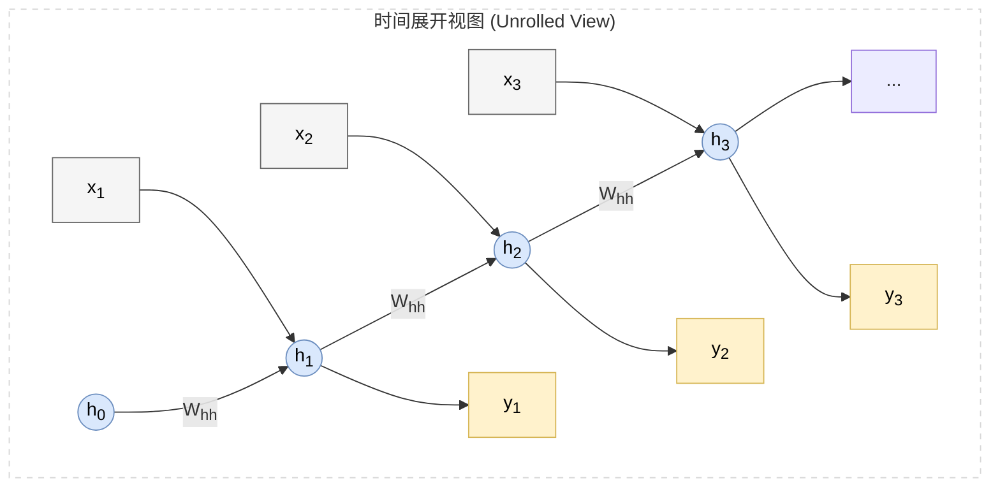
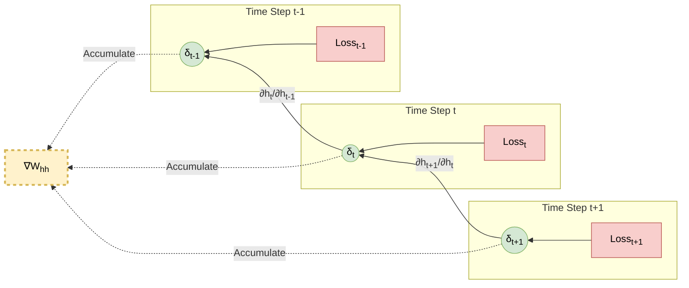
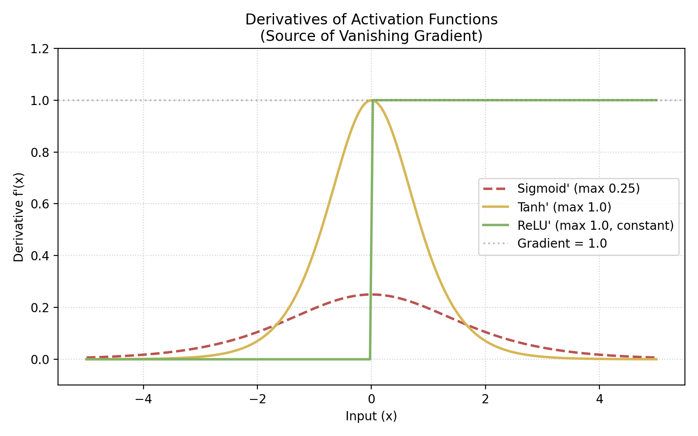
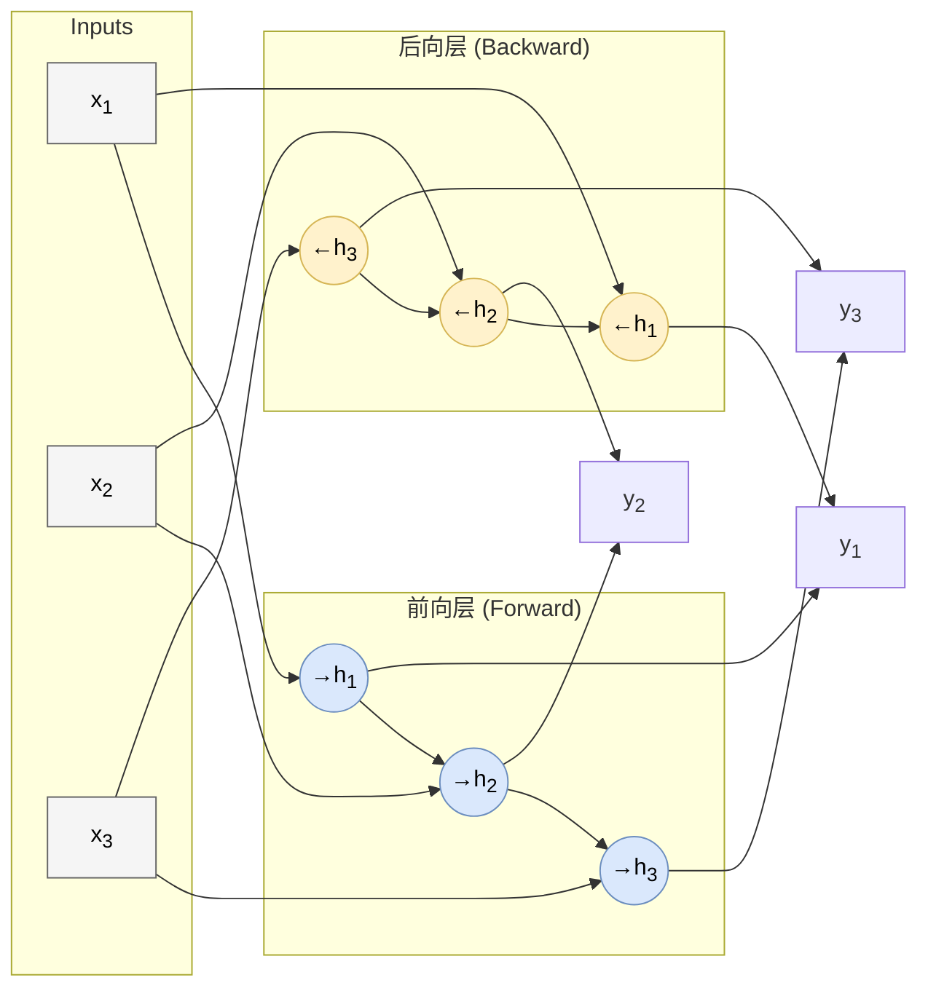

# 2.3 循环神经网络：序列动力学
## 2.3 Recurrent Neural Networks (RNN)

卷积神经网络 (CNN) 解决了图像中的空间相关性问题，而**循环神经网络 (RNN)** 则是为了解决**时间序列 (Time Series)** 和**序列数据 (Sequential Data)** 而生的。

从自然语言处理 (NLP) 到语音识别，再到股票预测，这些任务的核心特点是：**当前的输出不仅取决于当前的输入，还取决于“过去”的历史信息。**

### 2.3.1 序列建模与参数共享 (Sequence Modeling & Parameter Sharing)

在前馈网络 (MLP/CNN) 中，我们假设样本 $x_i$ 之间是独立同分布 (i.i.d.) 的。但在序列问题中，输入是 $x^{(1)}, x^{(2)}, \dots, x^{(T)}$，它们之间存在强依赖。

RNN 的核心思想是**参数共享 (Parameter Sharing)**：我们在所有时间步 (Time Steps) 上使用**同一个**权重矩阵。这不仅大幅减少了参数量，更重要的是，它赋予了模型处理**任意长度**序列的能力。

#### 1. 计算图展开 (Unrolling the Graph)
我们可以将 RNN 视为一个在时间上无限复制自身的层。为了理解这个结构，我们先明确图中的关键符号：

*   **$\mathbf{x}_t$ (Input)**：$t$ 时刻的输入向量（例如句子中第 $t$ 个单词的词向量）。
*   **$\mathbf{h}_t$ (Hidden State)**：$t$ 时刻的隐状态向量，代表系统的**记忆**。
*   **$\mathbf{y}_t$ (Output)**：$t$ 时刻的输出向量（例如预测的下一个单词）。
*   **$\mathbf{W}_{hh}$ (Recurrent Weight)**：连接上一时刻状态与当前状态的权重矩阵。**关键点**：该矩阵在所有时间步是**共享**的（同一个 $\mathbf{W}_{hh}$）。

### 2.3.2 动力学状态方程 (State Equations)

RNN 可以被看作是一个离散时间的**动力系统 (Dynamical System)**。它的核心是**隐状态 (Hidden State)** $\mathbf{h}_t$，充当系统的“记忆”。

#### 1. 状态更新方程 (State Update)
在时刻 $t$，隐状态 $\mathbf{h}_t$ 由当前的输入 $\mathbf{x}_t$ 和上一时刻的状态 $\mathbf{h}_{t-1}$ 共同决定：

$$ \mathbf{h}_t = \tanh(\mathbf{W}_{hh} \mathbf{h}_{t-1} + \mathbf{W}_{xh} \mathbf{x}_t + \mathbf{b}_h) $$

*   $\mathbf{W}_{hh} \in \mathbb{R}^{d_h \times d_h}$：**状态-状态权重** (State-to-State weights)，控制记忆如何随时间演化。
*   $\mathbf{W}_{xh} \in \mathbb{R}^{d_h \times d_x}$：**输入-状态权重** (Input-to-State weights)，将新输入写入记忆。
*   $\tanh$：**非线性激活**。选用 $\tanh$ 是因为它将值压缩在 $(-1, 1)$ 之间，能一定程度上防止状态值在多次迭代后爆炸（相比于 ReLU）。

#### 2. 输出方程 (Output Equation)
输出通常基于当前的隐状态：

$$ \mathbf{y}_t = \text{softmax}(\mathbf{W}_{hy} \mathbf{h}_t + \mathbf{b}_y) $$

#### 3. 动力学解释
如果我们将输入 $\mathbf{x}_t$ 视为外部驱动力，RNN 就是一个**非线性受迫振动系统**。
*   如果 $\mathbf{x}_t = 0$（无输入），系统行为完全由 Jacobian 矩阵 $\mathbf{W}_{hh}$ 的特征值决定。
    *   若特征值 $|\lambda| < 1$，状态 $\mathbf{h}_t$ 会逐渐衰减至 0（遗忘）。
    *   若特征值 $|\lambda| > 1$，状态可能发散（混沌）。
    *   若 $|\lambda| \approx 1$，系统处于临界状态 (Critical State)，最适合保持长期记忆。

---

### 2.3.3 随时间反向传播 (BPTT - Backpropagation Through Time)

训练 RNN 的算法叫 BPTT。本质上，它就是将 RNN 展开成一个深层网络，然后应用标准的反向传播。但不同的是，所有层**共享**同一组权重 $\mathbf{W}_{hh}$。

#### 1. 误差项的递归推导 (Derivation of Error Term)
我们定义 $t$ 时刻隐状态的梯度为 $\delta_t = \frac{\partial \mathcal{L}}{\partial \mathbf{h}_t}$。
隐状态 $\mathbf{h}_t$ 在计算图中流向了两个分支：
1.  **当前输出**：参与计算 $\mathbf{y}_t$，产生当前时刻的损失 $\mathcal{L}_t$。
2.  **未来状态**：传递给 $\mathbf{h}_{t+1}$，影响未来所有时刻的损失。

根据多元微积分的链式法则，总梯度 $\delta_t$ 是这两部分梯度之和：

$$ \delta_t = \underbrace{\frac{\partial \mathcal{L}_t}{\partial \mathbf{h}_t}}_{\text{直接梯度}} + \underbrace{\left(\frac{\partial \mathbf{h}_{t+1}}{\partial \mathbf{h}_t}\right)^T \delta_{t+1}}_{\text{传递梯度}} $$

这是一个**时间逆序的递归公式**。这意味着我们可以从最后时刻 $T$ 开始（此时没有未来项），反向一步步算出所有时刻的 $\delta_t$。

#### 2. 参数梯度的具体计算 (Gradient Calculation)
一旦计算出 $\delta_t$，我们就可以算出各个参数在 $t$ 时刻的梯度贡献。
回顾状态方程 $\mathbf{h}_t = \tanh(\mathbf{z}_t)$，其中 $\mathbf{z}_t = \mathbf{W}_{hh} \mathbf{h}_{t-1} + \mathbf{W}_{xh} \mathbf{x}_t + \mathbf{b}_h$。
根据链式法则，先计算激活函数前的梯度 $\mathbf{d}_t$：
$$ \mathbf{d}_t = \frac{\partial \mathcal{L}}{\partial \mathbf{z}_t} = \delta_t \circ \tanh'(\mathbf{z}_t) $$
*注：$\circ$ 表示逐元素乘积 (Hadamard product)。*

由于所有时间步共享参数，总梯度是所有时刻贡献的累加：

$$ \begin{aligned} \frac{\partial \mathcal{L}}{\partial \mathbf{W}_{hh}} &= \sum_{t=1}^T \mathbf{d}_t \mathbf{h}_{t-1}^T \\ \frac{\partial \mathcal{L}}{\partial \mathbf{W}_{xh}} &= \sum_{t=1}^T \mathbf{d}_t \mathbf{x}_t^T \\ \frac{\partial \mathcal{L}}{\partial \mathbf{b}_h} &= \sum_{t=1}^T \mathbf{d}_t \end{aligned} $$

这些公式展示了 BPTT 的可计算性：通过一次反向遍历，我们收集了更新所有参数所需的信息。

#### 3. 梯度流图解 (Gradient Flow)

---

### 2.3.4 数学困境：梯度消失与爆炸 (The Vanishing/Exploding Gradient Problem)

BPTT 算法虽然理论完备，但在实际应用中，处理长序列时往往力不从心。问题的根源直接隐藏在上一节的**传递梯度**中。

#### 1. 逐步推导 Jacobian 矩阵
让我们仔细审视反向传播中的核心项：$\frac{\partial \mathbf{h}_t}{\partial \mathbf{h}_{t-1}}$。
考虑状态更新公式 $\mathbf{h}_t = \tanh(\mathbf{z}_t)$，其中 $\mathbf{z}_t = \mathbf{W}_{hh} \mathbf{h}_{t-1} + \dots$。

根据链式法则，单步反向传播的 Jacobian 矩阵为：
$$ \frac{\partial \mathbf{h}_t}{\partial \mathbf{h}_{t-1}} = \underbrace{\text{diag}(\tanh'(\mathbf{z}_t))}_{\text{激活函数的导数}} \cdot \underbrace{\mathbf{W}_{hh}}_{\text{权重矩阵}} $$

#### 2. 时间轴上的连乘效应
当梯度需要从 $t$ 时刻传回遥远的 $k$ 时刻（$t \gg k$）时，我们需要将中间所有的单步 Jacobian 矩阵相乘：

$$ \frac{\partial \mathbf{h}_t}{\partial \mathbf{h}_k} = \prod_{j=k+1}^t \frac{\partial \mathbf{h}_j}{\partial \mathbf{h}_{j-1}} = \prod_{j=k+1}^t \left( \text{diag}(\tanh'(\mathbf{z}_j)) \cdot \mathbf{W}_{hh} \right) $$

这里出现了矩阵 $\mathbf{W}_{hh}$ 的 **$t-k$ 次连乘**。就像 $0.9^{100} \approx 0$ 和 $1.1^{100} \approx 13780$ 一样，这种深层连乘会导致梯度的模呈现指数级变化。

#### 3. 特征值分析
假设激活函数是线性的（忽略 $\tanh'$ 的影响），梯度的模主要由 $\mathbf{W}_{hh}$ 的**特征值**决定。令 $\lambda_{max}$ 为 $\mathbf{W}_{hh}$ 的最大特征值（谱半径）：

*   **梯度消失 ($\lambda_{max} < 1$)**：
    *   梯度按指数级衰减：$\lim_{n \to \infty} \lambda_{max}^n = 0$。
    *   **后果**：模型“遗忘”了长距离的历史信息。例如在处理长句时，句首的主语无法影响句尾的动词形式。
*   **梯度爆炸 ($\lambda_{max} > 1$)**：
    *   梯度按指数级增长：$\lim_{n \to \infty} \lambda_{max}^n = \infty$。
    *   **后果**：权重更新过大，导致 Loss 震荡甚至溢出 (NaN)。

#### 4. 解决方案
*   **梯度裁剪 (Gradient Clipping)**：
    *   解决爆炸。如果 $\|\mathbf{g}\| > \text{threshold}$，则 $\mathbf{g} \leftarrow \mathbf{g} \cdot \frac{\text{threshold}}{\|\mathbf{g}\|}$。这是一种工程上的暴力截断。
*   **合理的初始化策略 (Initialization Strategy)**：
    *   **$\mathbf{W}_{hh}$ (Recurrent Weights)**：推荐使用**正交初始化 (Orthogonal Initialization)**。将矩阵初始化为正交矩阵（特征值模为 1），使开始训练时 $\lambda \approx 1$，让梯度流能跑得更远。
    *   **$\mathbf{W}_{xh}$ (Input Weights)**：推荐使用 **Xavier/Glorot** 初始化（配合 $\tanh$）或 **Kaiming/He** 初始化（配合 ReLU），确保输入信号的方差在传播过程中保持稳定。
    *   **$\mathbf{b}_h$ (Bias)**：通常初始化为 **0**。但在使用 LSTM 的遗忘门时，有时会初始化为正数（如 1.0）以鼓励模型在训练初期“记住”信息。
*   **ReLU 激活函数**：
    *   $\text{ReLU}'(x)$ 要么是 0 要么是 1，不会像 $\tanh'$ 那样总是小于 1，有助于缓解消失。
    
    

*   **门控机制 (LSTM/GRU)**：
    *   终极方案。通过加法更新 $\mathbf{C}_t = \mathbf{C}_{t-1} + \dots$ 创造“梯度高速公路”，将在 **2.4** 节详细讨论。

---

### 2.3.5 经典变体：双向 RNN 与 深层 RNN

#### 1. 双向 RNN (Bi-directional RNN)
在很多任务中，上下文不仅来自“过去”，也来自“未来”。
例如填空题："The ___ sat on the mat."
为了填出 "cat"，我们需要看前面的 "The"，也要看后面的 "sat"。

Bi-RNN 包含两个独立的层：
*   **前向层 (Forward Layer)**：$\vec{\mathbf{h}}_t$ 从 $t=1$ 读到 $T$。
*   **后向层 (Backward Layer)**：$\overleftarrow{\mathbf{h}}_t$ 从 $t=T$ 读到 $1$。
*   **输出**：通常将两者拼接 $\mathbf{y}_t = [\vec{\mathbf{h}}_t; \overleftarrow{\mathbf{h}}_t]$。

#### 2. 深层 RNN (Stacked/Deep RNN)
类似于 CNN，我们可以堆叠多个 RNN 层来提取更高层级的特征。
第 $l$ 层的输入是第 $l-1$ 层的隐状态：
$$ \mathbf{h}_t^{(l)} = \sigma(\mathbf{W}_{hh}^{(l)} \mathbf{h}_{t-1}^{(l)} + \mathbf{W}_{xh}^{(l)} \mathbf{h}_t^{(l-1)} + \mathbf{b}^{(l)}) $$

### 2.3.6 总结与展望：RNN 在 Transformer 时代的地位

RNN 的设计初衷非常优雅（像人类一样按顺序阅读），但在工程实践中确实面临巨大的挑战。

#### 1. RNN 的两大“阿喀琉斯之踵”
*   **计算效率低（串行依赖）**：
    *   这是最致命的问题。由于 $h_t$ 必须等待 $h_{t-1}$ 计算完成，RNN **无法利用 GPU 的并行能力**进行高效训练。这使得它在处理海量数据时效率极低。
*   **信息压缩瓶颈（Memory Bottleneck）**：
    *   RNN 试图将整段历史信息“压缩”进一个固定大小的向量 $h_t$ 中。当序列非常长时，早期信息的细节不可避免地会丢失（即便使用了 LSTM）。

#### 2. Transformer 的降维打击
2017 年 Transformer 的出现基本终结了 RNN 在 NLP 主流任务中的统治地位：
*   **并行训练**：Self-Attention 机制允许同时计算序列中所有位置的关系，彻底打破了时间步的串行限制。
*   **全局视野**：Transformer 可以直接“看到”历史所有的词，而不需要通过隐状态来传递记忆，解决了长距离依赖问题。

#### 3. RNN 还有用武之地吗？
答案是肯定的。虽然在通用大模型（LLM）领域 Transformer 是绝对霸主，但 RNN 在特定场景仍具有**不可替代的优势**，甚至正在迎来**复兴**：

*   **极低资源推理 (Edge AI)**：
    *   Transformer 在推理时需要缓存历史信息 (KV Cache)，显存占用随序列长度线性增长 $O(L)$。
    *   RNN 在推理时只需要维护一个状态 $h_t$，内存占用是恒定的 $O(1)$。这使得 RNN 极适合**嵌入式设备、实时语音处理**等对延迟和内存极其敏感的场景。
*   **处理无限长序列**：
    *   RNN 天生适合处理流式数据（Streaming Data），理论上可以处理无限长的输入，而 Transformer 受限于上下文窗口长度。
*   **线性 RNN 的进化 (RWKV / Mamba)**：
    *   近年来，以 **RWKV** 和 **Mamba (State Space Models)** 为代表的新型架构引起了巨大关注。它们巧妙地结合了两者：**“像 Transformer 一样并行训练，像 RNN 一样恒定显存推理”**。
    *   这证明了 RNN 的核心思想——**“循环状态记忆”**——并没有过时，它只是换了一种更现代的数学形式继续存在。
