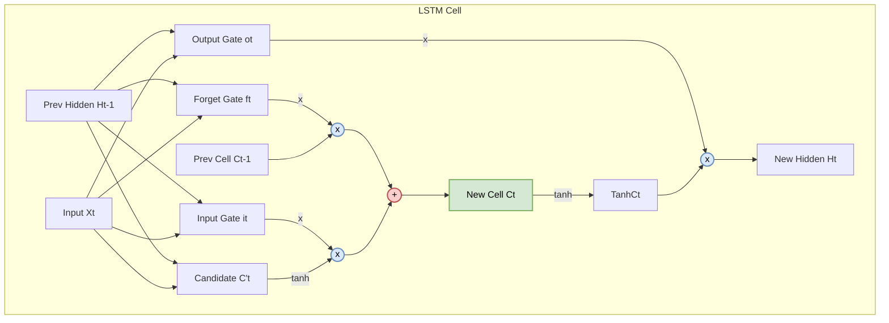
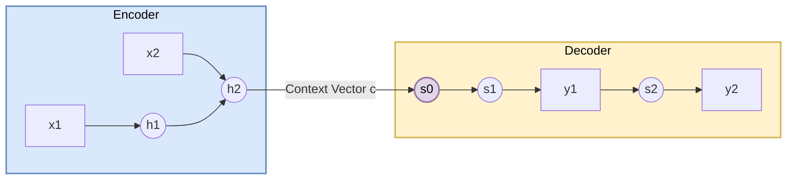

# 2.4 LSTM与门控机制：驯服梯度
## 2.4 Long Short-Term Memory (LSTM)

RNN 的梯度消失问题限制了其处理长序列的能力。本节将解析 LSTM 的复杂的门控动力学，解释“恒等映射”如何使误差在时间维度上无损传输，并简述 Seq2Seq 架构的数学形式。

### 2.4.1 核心思想：恒定误差旋转木马 (Constant Error Carousel, CEC)

标准 RNN 的梯度流经 $\tanh'$，每次迭代都会衰减。
Hochreiter & Schmidhuber (1997) 的洞察是：为了通过时间反向传播误差，我们需要一个导数为 1 的单元。
$$ \frac{\partial \mathbf{C}_t}{\partial \mathbf{C}_{t-1}} \approx \mathbf{I} $$
这就是细胞状态 $\mathbf{C}_t$ 的设计初衷。如果不受干扰，误差将像旋转木马一样在 $\mathbf{C}_t$ 中无限循环，直到需要它的时候。

### 2.4.2 LSTM 单元的详细解剖

**关键区别：双轨道记忆 (Dual State)**
LSTM 与标准 RNN 最大的不同在于它将状态分为了两条轨道：
1.  **细胞状态 (Cell State, $\mathbf{C}_t$)**：这是图中最上方贯穿的一条线，也是 LSTM 区别于标准 RNN 的新增核心变量。它充当长时记忆的“硬盘”，信息在这里主要进行**线性传输**（加法运算），极少受到非线性干扰，从而保证梯度能长距离无损流动，是 LSTM 能够“驯服梯度”的关键所在。
2.  **隐状态 (Hidden State, $\mathbf{h}_t$)**：这是 $\mathbf{C}_t$ 的“显示器”。它由 $\mathbf{C}_t$ 经过 $\tanh$ 激活和输出门过滤后得到，用于当前时刻的预测和下一时刻的计算。

LSTM 引入了三个门（Sigmoid层，输出 0~1）来保护和控制 $\mathbf{C}_t$。

**架构图解**：

### 2.4.3 前向传播方程组

设 $\mathbf{x}_t$ 为输入，$\mathbf{h}_{t-1}$ 为上一隐状态。所有 $\mathbf{W} \in \mathbb{R}^{d_h \times (d_x + d_h)}$。

1.  **遗忘门 (Forget Gate)**：决定 $\mathbf{C}_{t-1}$ 中多少信息被保留。
    $$ \mathbf{f}_t = \sigma(\mathbf{W}_f [\mathbf{h}_{t-1}, \mathbf{x}_t] + \mathbf{b}_f) $$
    *(矩阵展开形式)*：
    $$ \mathbf{f}_t = \sigma \left( \begin{bmatrix} \mathbf{W}_{fh} & \mathbf{W}_{fx} \end{bmatrix} \begin{bmatrix} \mathbf{h}_{t-1} \\ \mathbf{x}_t \end{bmatrix} + \mathbf{b}_f \right) $$
2.  **输入门 (Input Gate)**：决定多少新信息 $\tilde{\mathbf{C}}_t$ 被写入。
    $$ \mathbf{i}_t = \sigma(\mathbf{W}_i \cdot [\mathbf{h}_{t-1}, \mathbf{x}_t] + \mathbf{b}_i) $$
    $$ \tilde{\mathbf{C}}_t = \tanh(\mathbf{W}_C \cdot [\mathbf{h}_{t-1}, \mathbf{x}_t] + \mathbf{b}_C) $$
3.  **细胞状态更新 (Cell Update) —— 核心公式**：
    Math $$ \mathbf{C}_t = \mathbf{f}_t \odot \mathbf{C}_{t-1} + \mathbf{i}_t \odot \tilde{\mathbf{C}}_t $$
    *   **加法更新**：这是 LSTM 避免梯度消失的关键。相比于 RNN 的矩阵乘法更新，加法运算的导数性质更优。
4.  **输出门 (Output Gate)**：
    $$ \mathbf{o}_t = \sigma(\mathbf{W}_o \cdot [\mathbf{h}_{t-1}, \mathbf{x}_t] + \mathbf{b}_o) $$
    $$ \mathbf{h}_t = \mathbf{o}_t \odot \tanh(\mathbf{C}_t) $$

### 2.4.4 梯度流分析 (Gradient Flow Analysis)

考虑 $\mathbf{C}_t$ 对 $\mathbf{C}_{t-1}$ 的偏导数：
$$ \frac{\partial \mathbf{C}_t}{\partial \mathbf{C}_{t-1}} = \frac{\partial}{\partial \mathbf{C}_{t-1}} (\mathbf{f}_t \odot \mathbf{C}_{t-1} + \mathbf{i}_t \odot \tilde{\mathbf{C}}_t) $$
$$ = \text{diag}(\mathbf{f}_t) + \underbrace{\mathbf{C}_{t-1} \odot \sigma'(...) \mathbf{W}_f \dots}_{term_1} + \underbrace{\mathbf{i}_t \odot \tanh'(...) \mathbf{W}_C \dots}_{term_2} + \dots $$

通常，$term_1, term_2$ 等间接项较小，主导项是 **$\mathbf{f}_t$**。
$$ \frac{\partial \mathbf{C}_T}{\partial \mathbf{C}_k} \approx \prod_{t=k+1}^T \text{diag}(\mathbf{f}_t) $$
*   只要遗忘门 $\mathbf{f}_t \approx \mathbf{1}$（开启），梯度就可以无损地传递无限远。
*   网络可以学习在特定时刻将 $\mathbf{f}_t$ 设为 0（重置记忆），或设为 1（保持记忆）。

---

### 2.4.5 GRU (Gated Recurrent Unit)

GRU (Cho et al., 2014) 是 LSTM 的简化版，合并了 $\mathbf{C}_t$ 和 $\mathbf{h}_t$，并将遗忘门和输入门合并为更新门 $\mathbf{z}_t$。

$$ \mathbf{z}_t = \sigma(\mathbf{W}_z \cdot [\mathbf{h}_{t-1}, \mathbf{x}_t]) $$
$$ \mathbf{r}_t = \sigma(\mathbf{W}_r \cdot [\mathbf{h}_{t-1}, \mathbf{x}_t]) $$
$$ \tilde{\mathbf{h}}_t = \tanh(\mathbf{W} \cdot [\mathbf{r}_t \odot \mathbf{h}_{t-1}, \mathbf{x}_t]) $$
$$ \mathbf{h}_t = (\mathbf{1} - \mathbf{z}_t) \odot \mathbf{h}_{t-1} + \mathbf{z}_t \odot \tilde{\mathbf{h}}_t $$

*   **优点**：参数少，训练快，在小数据集上效果相当。
*   **数学直觉**：$\mathbf{z}_t$ 在 0 和 1 之间插值，显式地建模了“保持旧状态”vs“写入新状态”的权衡。

---

### 2.4.6 Sequence-to-Sequence (Seq2Seq) 与注意力前奏

Seq2Seq 模型是 LSTM 应用的巅峰。
目标：建模条件概率 $P(\mathbf{Y}|\mathbf{X})$，其中 $\mathbf{X}=(\mathbf{x}_1, \dots, \mathbf{x}_N), \mathbf{Y}=(\mathbf{y}_1, \dots, \mathbf{y}_M)$。

1.  **Encoder**：
    Encoder 读取输入序列 $\mathbf{X}$，并生成隐状态序列：
    $$ \mathbf{h}_t = \text{LSTM}_{enc}(\mathbf{x}_t, \mathbf{h}_{t-1}) $$
    最终的上下文向量由最后一个隐状态得到：
    $$ \mathbf{c} = \mathbf{h}_N \quad (\text{Context Vector}) $$
2.  **Decoder**：
    Decoder 根据上下文向量 $\mathbf{c}$ 和上一步输出 $\mathbf{y}_{t-1}$ 更新自身状态 $\mathbf{s}_t$：
    $$ \mathbf{s}_t = \text{LSTM}_{dec}(\mathbf{y}_{t-1}, \mathbf{s}_{t-1}, \mathbf{c}) $$
    计算当前时刻输出词的概率分布：
    $$ P(\mathbf{y}_t | \mathbf{y}_{<t}, \mathbf{X}) = \text{softmax}(\mathbf{W}_{out} \mathbf{s}_t) $$
