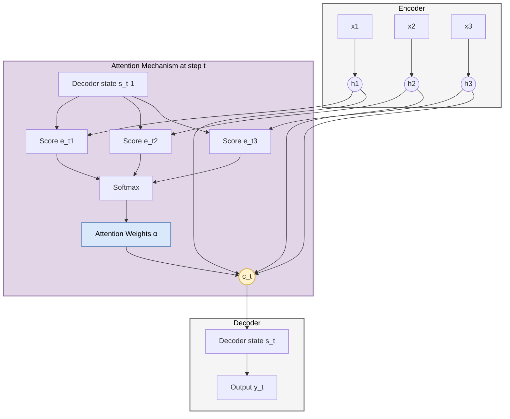
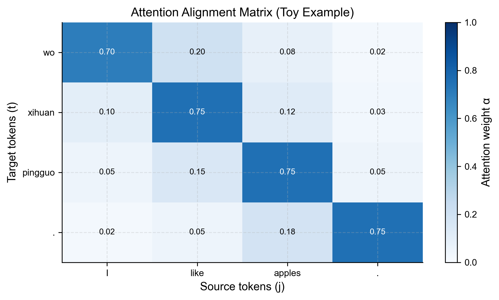

# 3.1 注意力机制：从瓶颈到聚焦
## 3.1 Attention Mechanisms: From Bottleneck to Focus

在第 2 章中，我们探讨了 Seq2Seq 模型。虽然它是一个强大的框架，但它存在一个致命的缺陷：**信息瓶颈 (Information Bottleneck)**。无论输入句子有多长，Encoder 都必须将其压缩成一个固定长度的向量 $\mathbf{c}$。这就像要求你读完一本《红楼梦》，然后把所有细节都浓缩在这一张便利贴上，这显然是不可能的。

本节我们将介绍 **注意力机制 (Attention Mechanism)**，它允许 Decoder 在生成的每一步都“回头看”源句子的不同部分，从而打破了这一瓶颈。

### 3.1.1 瓶颈问题 (The Bottleneck Problem)

在传统的 Encoder-Decoder 架构中：
$$ \mathbf{c} = \text{Encoder}(\mathbf{x}_1, \dots, \mathbf{x}_T) $$
$$ \mathbf{y}_t = \text{Decoder}(\mathbf{y}_{t-1}, \mathbf{s}_{t-1}, \mathbf{c}) $$

当 $T$ 很大时（例如长文本翻译），$\mathbf{c}$ 无法承载所有信息，导致性能急剧下降。这在数学上表现为长距离梯度流的衰减，在语义上表现为细节丢失。

### 3.1.2 Bahdanau 注意力 (Additive Attention)

Bahdanau 等人 (2014) 提出的核心思想是：**上下文向量 $\mathbf{c}$ 不应该是静态的，而应该是动态变化的 $\mathbf{c}_t$**。

在 Decoder 生成第 $t$ 个词时，它应该根据当前的隐状态 $\mathbf{s}_{t-1}$，去计算与 Encoder 所有隐状态 $\mathbf{h}_j$ 的相关性。

**数学构造**：

1.  **对齐分数 (Alignment Score)**：计算 Decoder 状态 $\mathbf{s}_{t-1}$ 与 Encoder 状态 $\mathbf{h}_j$ 的匹配度。Bahdanau 使用一个小型的神经网络（MLP）来计算：
    $$ e_{tj} = \mathbf{v}_a^T \tanh(\mathbf{W}_a \mathbf{s}_{t-1} + \mathbf{U}_a \mathbf{h}_j) $$
    这被称为 **加性注意力 (Additive Attention)**。

2.  **注意力权重 (Attention Weights)**：使用 Softmax 将分数归一化为概率分布：
    Math $$ \alpha_{tj} = \frac{\exp(e_{tj})}{\sum_{k=1}^T \exp(e_{tk})} $$

3.  **动态上下文向量 (Dynamic Context Vector)**：加权求和：
    $$ \mathbf{c}_t = \sum_{j=1}^T \alpha_{tj} \mathbf{h}_j $$

**直观解释**：
$\alpha_{tj}$ 就像是“目光的焦点”。如果翻译到 "apple"，模型可能会发现源句子中 "苹果" 对应的 $\mathbf{h}_j$ 的权重 $\alpha_{tj}$ 为 0.9，而其他词的权重很小。

### 3.1.3 Luong 注意力 (Multiplicative Attention)

Luong 等人 (2015) 提出了更简单的计算对齐分数的方法，利用点积：

1.  **点积 (Dot)**: $e_{tj} = \mathbf{s}_{t-1}^T \mathbf{h}_j$
2.  **通用 (General)**: $e_{tj} = \mathbf{s}_{t-1}^T \mathbf{W}_a \mathbf{h}_j$

这种方法计算更快（矩阵乘法优化），被称为 **乘性注意力 (Multiplicative Attention)**。这正是后来 Transformer 中 Scaled Dot-Product Attention 的雏形。（关于 Transformer 中 Scaled Dot-Product Attention 的详细数学推导，请见 **[附录 A.10](../appendix/a.10_transformer_math.md)**）

### 3.1.4 架构可视化

下面的图展示了引入注意力机制后的数据流。请注意 Context Vector $\mathbf{c}_t$ 是如何随时间步 $t$ 变化的。

### 3.1.5 注意力的本质：可微的键值查询

我们可以将注意力机制抽象为一种 **查询 (Query)** 过程。

更重要的是，这个“查询”是 **可微分的 (Differentiable)**：注意力权重 $\alpha_{tj}$ 由 Softmax 产生，整个链路可以通过反向传播学习“如何对齐”。
*   **查询 (Query, $\mathbf{q}$)**: Decoder 当前状态 $\mathbf{s}_{t-1}$（我想要什么？）
*   **键 (Key, $\mathbf{k}$)**: Encoder 隐状态 $\mathbf{h}_j$ 的特征（你有什么特征？）
*   **值 (Value, $\mathbf{v}$)**: Encoder 隐状态 $\mathbf{h}_j$ 的内容（你的内容是什么？）

在 RNN Attention 中，Key 和 Value 通常是同一个东西（即 $\mathbf{h}_j$）。但在 Transformer 中，我们将看到这三者被显式地分离开来。

**技术本质（统一形式）**：无论是加性还是乘性注意力，最终都会得到一个归一化的权重向量，并对 Value 做加权平均。

设打分函数为 $e_{tj} = \text{score}(\mathbf{s}_{t-1}, \mathbf{h}_j)$，则
Math
$$ \alpha_{tj} = \text{softmax}_j(e_{tj}), \quad \mathbf{c}_t = \sum_{j=1}^{T} \alpha_{tj} \mathbf{h}_j $$

这也是后续 Transformer 把它“矩阵化”的原因：只要把 $\text{score}(\cdot)$ 写成矩阵乘法，就能充分利用 GPU 的并行算力。

Key Concept **软寻址 (Soft Addressing)**：
传统的数据库查询是硬寻址（要么匹配，要么不匹配）。注意力机制是软寻址，它返回所有 Value 的加权平均。因为所有操作都是可微的，我们可以通过反向传播来学习“如何查询”。

### 3.1.6 对齐矩阵可视化：注意力到底在“看哪里”？

为了把 $\alpha_{tj}$ 变成可以“肉眼检查”的对象，我们通常把它画成一个 **对齐矩阵 (Alignment Matrix)**：
*   **横轴**：源序列位置 $j$（Encoder 的 token）。
*   **纵轴**：目标序列位置 $t$（Decoder 正在生成的 token）。
*   **像素值**：$\alpha_{tj}$，越亮表示注意力越集中。

这种可视化在早期机器翻译中非常常用：如果模型把英文单词 "apple" 对齐到中文 "苹果" 上，热力图会出现一条接近对角线的高亮带。
