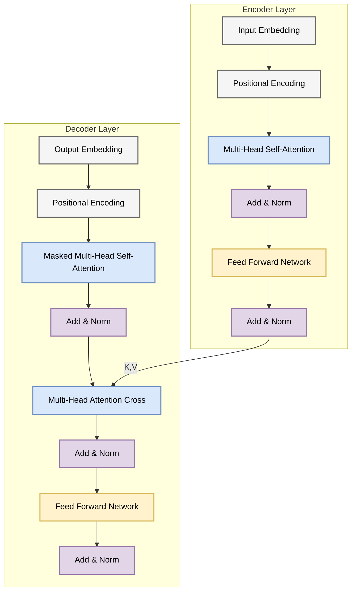

# 3.2 Transformer 架构解剖：以一当百
## 3.2 The Transformer Architecture

2017 年，Google 团队发表了 *Attention Is All You Need*，彻底改变了 NLP 的格局。Transformer 抛弃了循环（RNN）和卷积（CNN），完全依赖注意力机制来捕捉输入和输出之间的全局依赖关系。

本节我们将深入解剖 Transformer 的内部构造，重点关注自注意力机制和多头注意力。

### 3.2.1 整体架构概览 (Architecture Overview)

Transformer 依然遵循 Encoder-Decoder 结构，但每一层都焕然一新。

### 3.2.2 缩放点积注意力 (Scaled Dot-Product Attention)

这是 Transformer 的核心算子。

**输入**：
*   **查询 (Query, Q)**: $\in \mathbb{R}^{n \times d_k}$
*   **键 (Key, K)**: $\in \mathbb{R}^{m \times d_k}$
*   **值 (Value, V)**: $\in \mathbb{R}^{m \times d_v}$

**计算公式**：
Math
$$ \text{Attention}(Q, K, V) = \text{softmax}\left(\frac{QK^T}{\sqrt{d_k}}\right)V $$

1.  **$QK^T$**: 计算 Query 和 Key 的相似度矩阵（Gram Matrix）。
2.  **Scale ($\frac{1}{\sqrt{d_k}}$)**: 
    *   **为什么要缩放？** 假设 $q, k$ 的分量独立且服从 $\mathcal{N}(0, 1)$，则 $q \cdot k = \sum_{i=1}^{d_k} q_i k_i$ 的方差为 $d_k$。当 $d_k$ 很大时，点积结果会很大，导致 Softmax 进入饱和区（梯度趋近于 0）。
    *   除以 $\sqrt{d_k}$ 将方差归一化为 1，保证梯度的稳定性。
3.  **Softmax**: 将相似度转换为概率分布。
4.  **MatMul V**: 根据概率分布加权求和 Value。

### 3.2.3 多头注意力 (Multi-Head Attention)

如果只用一个注意力头，模型可能只能关注到一个方面（例如语法结构）。我们希望模型能同时关注多个方面（语法、语义、指代等）。

**机制**：
将 $Q, K, V$ 投影到 $h$ 个不同的子空间，分别计算注意力，最后拼接起来。

$$ \text{head}_i = \text{Attention}(QW_i^Q, KW_i^K, VW_i^V) $$
$$ \text{MultiHead}(Q, K, V) = \text{Concat}(\text{head}_1, \dots, \text{head}_h)W^O $$

*   **直观类比**：就像你读一篇文章，用红笔划重点（关注语法），用蓝笔划重点（关注情节），用绿笔划重点（关注人物关系）。最后把所有笔记汇总。

### 3.2.4 前馈网络 (Position-wise Feed-Forward Networks)

在 Attention 层之后，是一个全连接网络，对 **每个位置** 独立同分布地进行处理。

$$ \text{FFN}(x) = \max(0, xW_1 + b_1)W_2 + b_2 $$

这相当于两个线性变换中间夹一个 ReLU。
虽然是线性变换，但因为有 ReLU，它提供了 **非线性** 能力，增加了模型的表达力。它通常会将维度放大（例如从 512 到 2048），然后再缩放回来，这被称为 **倒瓶颈结构 (Inverted Bottleneck)**。

### 3.2.5 为什么 Transformer 优于 RNN？

| 特性 | RNN | Transformer |
| :--- | :--- | :--- |
| **计算并行性** | 差 ($O(N)$ 串行) | 极好 ($O(1)$ 并行) |
| **长距离依赖** | 弱 (路径长度 $O(N)$) | 强 (路径长度 $O(1)$) |
| **计算复杂度** | $O(N \cdot d^2)$ | $O(N^2 \cdot d)$ |

Key Concept **全局视野**：
RNN 看句子像管中窥豹，一次看一个词；Transformer 是一目十行，一次性把所有词之间的关系（$N^2$ 个连接）都算出来了。这也是为什么它对算力（显存）要求更高的原因。

### 3.2.6 残差连接与归一化：深层可训练的关键 (Residual & Normalization)

如果只堆叠注意力和前馈网络，深层网络会很难训练。Transformer 之所以能“越堆越深”，依赖两个工程-数学都很重要的结构：**残差连接 (Residual Connection)** 与 **层归一化 (Layer Normalization, LN)**。

在原始 Transformer（Post-Norm）里，一个子层的标准写法是：
Math
$$ x_{out} = \text{LN}(x + \text{Sublayer}(x)) $$

而现代大模型更常见的是 Pre-Norm（更稳定）：
Math
$$ x_{out} = x + \text{Sublayer}(\text{LN}(x)) $$

这两种写法的差别，以及正弦位置编码为何能表达相对位移，我们会在 3.3 节进一步展开。
