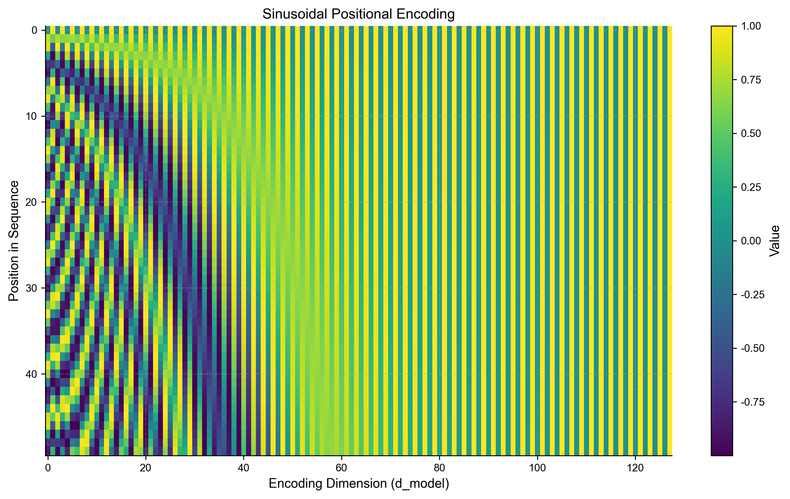

# 3.3 位置编码与层归一化
## 3.3 Positional Encoding and Layer Normalization

Transformer 的 Self-Attention 机制具有 **排列不变性 (Permutation Invariance)**。如果你打乱输入句子的顺序，Attention 的输出仅仅是顺序被打乱，但每个词的表示不会变。这对于自然语言来说是灾难性的（“我爱你” vs “你爱我”）。

为了弥补这一点，我们需要显式地注入位置信息。此外，为了训练深层 Transformer，归一化技术至关重要。

### 3.3.1 正弦位置编码 (Sinusoidal Positional Encoding)

Google 团队选择了一种基于三角函数的编码方式，而不是学习 **位置嵌入 (Position Embedding)**。

**公式**：
Math
$$
\begin{aligned}
PE_{(pos, 2i)} &= \sin(pos / 10000^{2i/d_{model}}) \\
PE_{(pos, 2i+1)} &= \cos(pos / 10000^{2i/d_{model}})
\end{aligned}
$$

*   $pos$: 单词在句子中的位置。
*   $i$: 维度索引。

**可视化**：
下图展示了 $d_{model}=128$ 时的前 50 个位置的编码。可以看到，每一个维度对应一个波长不同的正弦波。波长从 $2\pi$ 到 $10000 \cdot 2\pi$ 几何级数变化。

**数学性质**：
这种编码方式允许模型轻松学习到 **相对位置**。
对于任意固定偏移 $k$，$\mathbf{PE}_{pos+k}$ 可以表示为 $\mathbf{PE}_{pos}$ 的线性函数（旋转矩阵）：
$$
\begin{bmatrix} \sin(pos+k) \\ \cos(pos+k) \end{bmatrix} =
\begin{bmatrix} \cos k & \sin k \\ -\sin k & \cos k \end{bmatrix}
\begin{bmatrix} \sin(pos) \\ \cos(pos) \end{bmatrix}
$$
这意味着 Attention 机制可以通过简单的线性投影来关注“相对位置”信息（例如：关注前一个词）。

### 3.3.2 层归一化 (Layer Normalization)

**批归一化 (Batch Normalization, BN)** 在 CNN 中很常用，但在 RNN/Transformer 中表现不佳（因为序列长度可变，Batch 统计量不稳定）。
Transformer 使用 **层归一化 (Layer Normalization, LN)**。

**公式**：
对于一个样本的一个层输入向量 $\mathbf{x} \in \mathbb{R}^{d}$，计算其自身的均值和方差：
$$ \mu = \frac{1}{d} \sum_{j=1}^d x_j, \quad \sigma^2 = \frac{1}{d} \sum_{j=1}^d (x_j - \mu)^2 $$
$$ \text{LN}(\mathbf{x}) = \frac{\mathbf{x} - \mu}{\sqrt{\sigma^2 + \epsilon}} \cdot \gamma + \beta $$
其中 $\gamma, \beta$ 是可学习的仿射变换参数。

*   **BN vs LN**:
    *   **BN**: 对 Batch 维度归一化（纵向切）。不同样本之间相互依赖。
    *   **LN**: 对 Feature 维度归一化（横向切）。每个样本独立计算。

### 3.3.3 残差连接与 Pre-Norm vs Post-Norm

Transformer 广泛使用了残差连接：$x + \text{Sublayer}(x)$。关于 LN 的位置，有两种变体：

1.  **Post-Norm (原始论文)**：
    $$ x_{out} = \text{LN}(x + \text{Sublayer}(x)) $$
    *   问题：梯度在反向传播时可能会在输出层附近激增，导致深层网络难以训练（需要 Warmup）。

2.  **Pre-Norm (现代 LLM 标配，如 GPT-2/3, LLaMA)**：
    $$ x_{out} = x + \text{Sublayer}(\text{LN}(x)) $$
    *   优势：梯度直接流过恒等路径，训练极其稳定，甚至不需要 Warmup。

Key Takeaway
Pre-Norm 结构是现代大模型能够轻松堆叠到上百层的关键工程细节之一。
