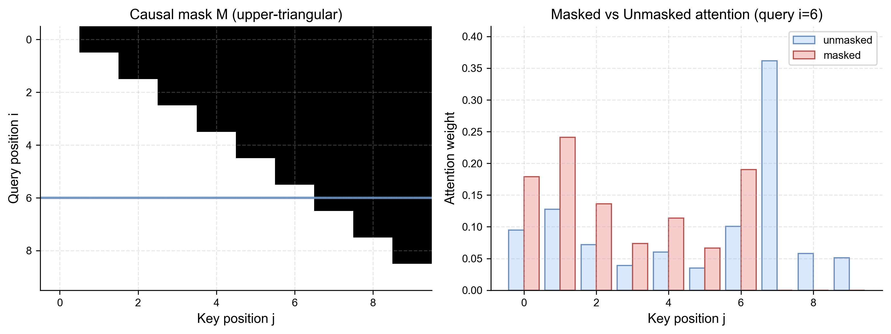
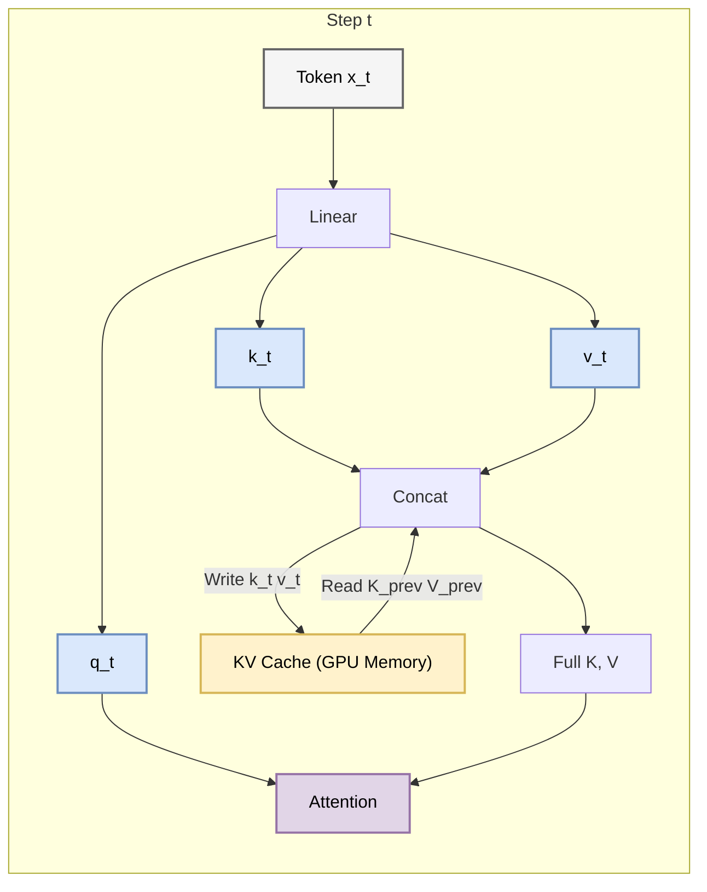
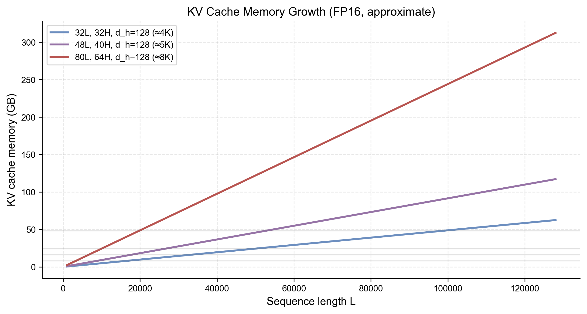

# 3.4 训练与推理：掩码与缓存
## 3.4 Training and Inference Techniques

Transformer 的训练和推理过程有着显著的差异，特别是在 Decoder 部分。理解这些差异对于掌握大模型的高效部署至关重要。

### 3.4.1 训练时的 Teacher Forcing 与 Masked Attention

在训练阶段，我们拥有完整的标准答案（Ground Truth）。为了加速训练，我们使用 **教师强制 (Teacher Forcing)**：一次性把整个正确句子的 Embedding 喂给 Decoder。

从损失函数角度看，这对应于“并行地”计算每个位置的负对数似然（以 Decoder-only 为例）：

Math
$$ \mathcal{L}_{\text{CLM}} = -\sum_{t=1}^{T} \log P(x_t \mid x_{<t}) $$

**问题**：Decoder 是自回归的。如果在预测第 $t$ 个词时，它能“偷看”到第 $t+1$ 个词，那它就不用学了，直接照抄就行。这会导致测试时（没有答案可抄）性能崩塌。

**解决方案：掩码自注意力 (Masked Self-Attention)**
我们需要一个 **因果掩码 (Causal Mask)**。它是一个上三角矩阵（对应未来的位置），值为 $-\infty$。

$$ \text{Mask}(i, j) = \begin{cases} 0 & \text{if } i \ge j \\ -\infty & \text{if } i < j \end{cases} $$

在 Softmax 之前加上 Mask：
Math $$ \text{Attention}(Q, K, V) = \text{softmax}\left(\frac{QK^T}{\sqrt{d_k}} + M \right)V $$

这样，位置 $i$ 的 Query 就只能关注到位置 $j \le i$ 的 Key，无法关注未来的信息。

**可视化直觉**：下图展示了一个小尺寸的因果掩码矩阵（上三角为屏蔽区域）以及它对注意力权重的影响。

### 3.4.2 推理时的自回归 (Autoregressive Generation)

在推理（Inference）阶段，模型必须一个词一个词地生成。
Step 1: 输入 `<SOS>`, 输出 `The`
Step 2: 输入 `<SOS> The`, 输出 `cat`
Step 3: 输入 `<SOS> The cat`, 输出 `sat`
...

### 3.4.3 KV Cache：推理加速的关键

你发现了吗？在 Step 3 时，我们重新计算了 `<SOS>` 和 `The` 的 Key 和 Value。这在 Step 2 已经算过一次了！
对于 GPT 这样的大模型，重复计算是非常昂贵的。

**KV Cache 原理**：
我们将之前步骤计算好的 Key 和 Value 矩阵 **缓存** 在显存中。
在生成第 $t$ 个 token 时：
1.  只计算当前 token $\mathbf{x}_t$ 的 $q_t, k_t, v_t$。
2.  从 Cache 取出之前的 $K_{<t}, V_{<t}$。
3.  拼接得到完整的 $K_{\le t} = [K_{<t}; k_t]$。
4.  计算 Attention。
5.  将 $k_t, v_t$ 存入 Cache。

**图解**：

Tradeoff
KV Cache 是典型的 **空间换时间**。
*   **优点**：大幅减少 FLOPs，推理速度提升。
*   **缺点**：显存占用随序列长度线性增加。对于长文本（如 128k context），KV Cache 可能会撑爆显存，这催生了 **MQA (Multi-Query Attention)** 和 **GQA (Grouped-Query Attention)** 等变体（减少 K, V 的头数）。

为了建立更直观的工程感知，下图给出了一个简化的“KV Cache 显存随序列长度增长”的示意曲线：

---

本章我们彻底解构了 Transformer。它是现代 AI 的“内燃机”。无论是 ChatGPT、Claude 还是 Stable Diffusion，其核心动力都源于此。
在下一章，我们将探讨如何利用海量数据训练这些庞然大物——**预训练与微调 (Pre-training and Fine-tuning)**。
