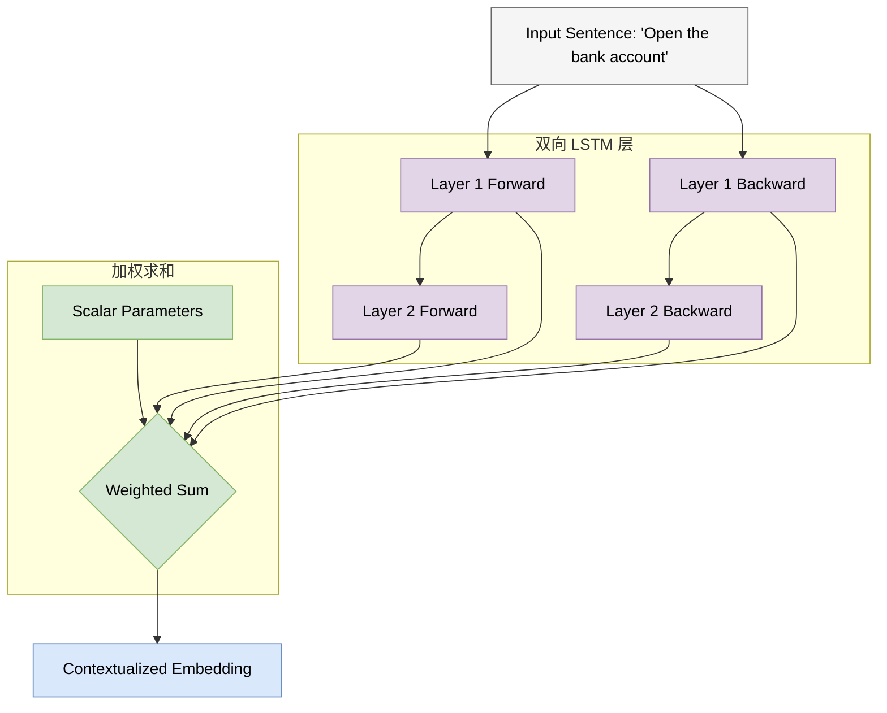

# 4.1 预训练时代与 ELMo (The Pre-training Era & ELMo)

## 1. 从静态到动态：词嵌入的演进 (Evolution of Word Embeddings)

在第 2 章中，我们介绍了 RNN 如何处理序列数据；在第 3 章中，我们深入探讨了 Transformer 架构及其强大的注意力机制。然而，在 Transformer 统治 NLP 之前，领域内面临着一个关键痛点：**如何有效地表示词义的复杂性（Polysemy）？**

早期的词向量模型（如 Word2Vec, GloVe）是 **静态的 (Static)**。一旦训练完成，单词 "bank" 的向量就是固定的，无论它出现在 "bank account"（银行账户）还是 "river bank"（河岸）中，其表示完全相同。这显然无法捕捉人类语言的丰富语境。

<span style="background-color: #DAE8FC; color: black; padding: 2px 4px; border-radius: 4px;">核心问题</span>：我们需要一种能够根据上下文动态调整的词表示方法。

### 1.1 静态与动态嵌入对比 (Static vs. Dynamic Embeddings)

```mermaid
graph LR
    %% 样式定义
    classDef static fill:#F5F5F5,stroke:#666666,color:#000000;
    classDef dynamic fill:#DAE8FC,stroke:#6C8EBF,color:#000000;
    classDef vector fill:#FFF2CC,stroke:#D6B656,color:#000000;

    subgraph Static [静态嵌入 (Word2Vec/GloVe)]
        W1("Word: Apple"):::static --> V1["Vector: [0.3, -0.1, ...]"]:::vector
        W2("Context: Apple pie"):::static -.-> V1
        W3("Context: Apple Inc."):::static -.-> V1
    end

    subgraph Dynamic [动态嵌入 (ELMo/BERT)]
        D1("Word: Apple"):::static --> C1{Context Encoder}:::dynamic
        C2("Context: Apple pie"):::dynamic --> C1
        C1 --> V2["Vector A: Fruit features"]:::vector
        
        D3("Word: Apple"):::static --> C3{Context Encoder}:::dynamic
        C4("Context: Apple Inc."):::dynamic --> C3
        C3 --> V3["Vector B: Tech features"]:::vector
    end
```

## 2. ELMo: 语言模型嵌入 (Embeddings from Language Models)

**ELMo (Embeddings from Language Models)** 是连接主义向预训练大模型过渡的重要桥梁。它并没有使用 Transformer，而是基于 **双向 LSTM (Bi-LSTM)** 构建。

### 2.1 核心思想 (Core Idea)

ELMo 的核心洞察是：**词向量不应该是一个查表操作（Lookup Table），而应该是一个函数（Function）。** 这个函数的输入是整个句子，输出是针对该语境下每个词的向量表示。

<span style="background-color: #FFF2CC; color: black; padding: 2px 4px; border-radius: 4px;">公式定义</span>
给定一个序列 \( t_1, t_2, \dots, t_N \)，ELMo 通过最大化双向对数似然来训练：

\[
\sum_{k=1}^{N} \left( \log P(t_k | t_1, \dots, t_{k-1}) + \log P(t_k | t_{k+1}, \dots, t_N) \right)
\]

*   前向 LSTM 预测下一个词。
*   后向 LSTM 预测上一个词。

### 2.2 ELMo 架构可视化 (ELMo Architecture)

ELMo 通过组合不同层级的 LSTM 隐藏状态来生成最终的词向量。

*   **Layer 0 (Char CNN)**: 处理字符级输入，解决 OOV (Out-of-Vocabulary) 问题。
*   **Layer 1 (LSTM)**: 捕捉句法 (Syntax) 信息。
*   **Layer 2 (LSTM)**: 捕捉语义 (Semantics) 信息。



### 2.3 特征融合 (Feature Fusion)

ELMo 的最终表示 \( \mathbf{ELMo}_k \) 是各层表示的线性组合：

\[
\mathbf{ELMo}_k^{task} = \gamma^{task} \sum_{j=0}^{L} s_j^{task} \mathbf{h}_{k,j}^{LM}
\]

*   \( \mathbf{h}_{k,j}^{LM} \): 第 \( j \) 层的隐藏状态。
*   \( s_j^{task} \): Softmax 归一化的权重，让模型根据特定任务（如阅读理解或词性标注）自动决定更关注低层语法还是高层语义。
*   \( \gamma^{task} \): 缩放因子。

## 3. 预训练-微调范式的雏形 (Prototype of Pre-training & Fine-tuning)

ELMo 引入了一个关键范式：**基于特征的迁移 (Feature-based Transfer)**。
1.  **预训练 (Pre-training)**: 在大规模无标注文本上训练 Bi-LSTM 语言模型。
2.  **特征提取 (Feature Extraction)**: 将训练好的 ELMo 作为一个“特征提取器”，将其输出的动态向量作为下游任务模型的输入。
3.  **任务训练**: 下游模型（如分类器）只需要学习如何利用这些丰富的特征。

虽然 ELMo 依然是基于 RNN 的架构，受限于长距离依赖处理能力（见 2.3 节），但它证明了 **利用大规模无监督数据预训练上下文表示** 的巨大潜力。这为随后 BERT 和 GPT 的爆发奠定了基础。

<span style="background-color: #F8CECC; color: black; padding: 2px 4px; border-radius: 4px;">局限性</span>：ELMo 的双向性是“浅层”的（Shallow Bidirectionality），因为它只是简单拼接了前向和后向的独立 LSTM。真正的双向融合需要更强大的架构——Transformer。
