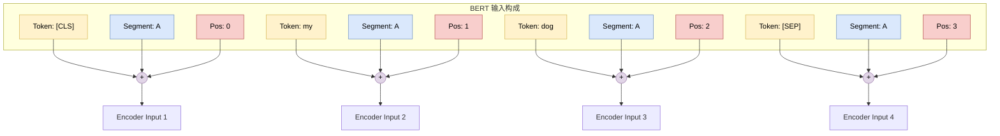
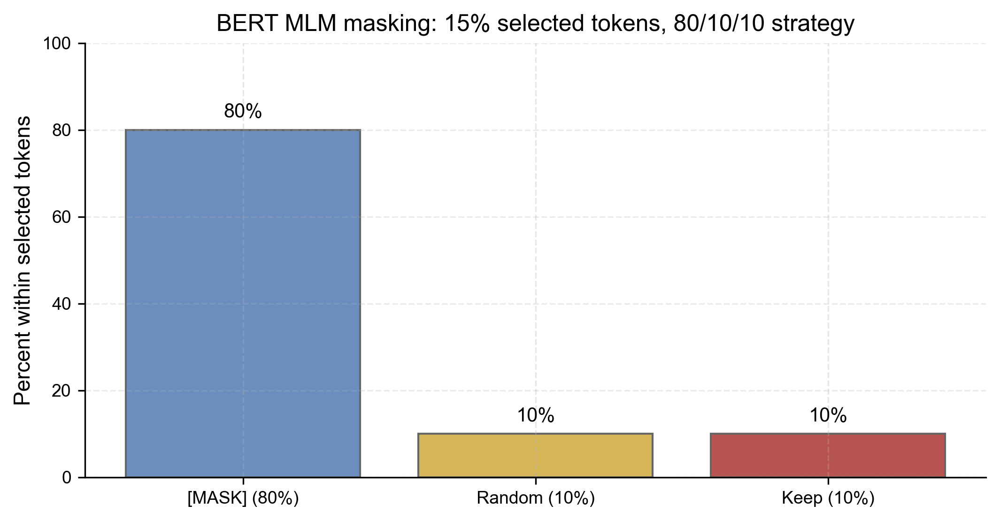
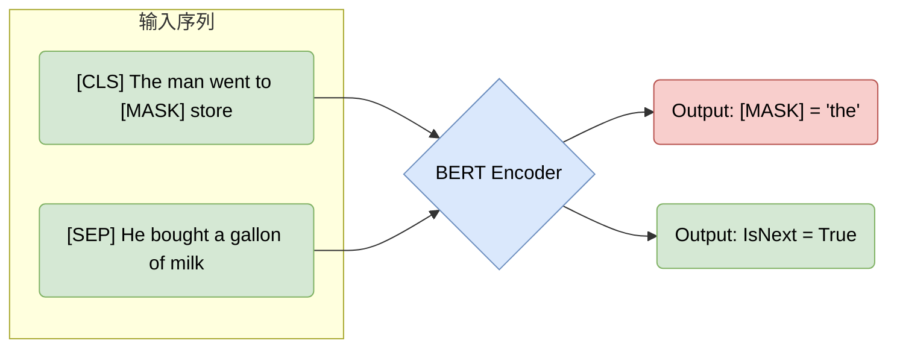

# 4.2 BERT：双向编码器表示 (BERT: Bidirectional Encoder Representations)

## 1. 从 Feature-based 到 Fine-tuning (From Feature-based to Fine-tuning)

在 4.1 节中，我们看到 ELMo 通过“冻结”预训练网络并提取特征来提升下游任务性能。然而，OpenAI GPT (基于 Decoder) 和 Google BERT (基于 Encoder) 引入了更激进的策略：**微调 (Fine-tuning)**。

微调范式：不仅是输出层，**整个预训练模型** 的参数都会在下游任务中进行更新。这意味着模型可以针对特定任务进行端到端的适配。

BERT (**B**idirectional **E**ncoder **R**epresentations from **T**ransformers) 的出现是 NLP 历史上的“ImageNet 时刻”，它证明了 **深度双向架构** 配合大规模预训练可以横扫所有 NLP 榜单。

## 2. BERT 架构概览 (BERT Architecture Overview)

BERT 仅使用了 Transformer 的 **Encoder** 部分（详见 3.2 节）。与 GPT 的单向（从左到右）不同，BERT 的 Encoder 允许每个 token 同时“看到”其左边和右边的所有 token。

### 2.1 输入表示 (Input Representations)

BERT 的输入设计非常精巧，由三部分相加而成：
1.  **Token Embeddings**: WordPiece 词向量。
2.  **Segment Embeddings**: 区分句子对（句子 A vs 句子 B）。
3.  **Position Embeddings**: 学习到的位置编码（非正弦）。

## 3. 预训练任务 (Pre-training Tasks)

BERT 的成功归功于两个精心设计的自监督任务：**掩码语言模型 (Masked Language Model, MLM)** 和 **下一句预测 (Next Sentence Prediction, NSP)**。

### 3.1 掩码语言模型 (Masked Language Model, MLM)

传统的语言模型是单向的（预测下一个词），这限制了对上下文的理解。BERT 采用“完形填空”的方式：
*   随机 Mask 掉输入中 15% 的 Token。
*   模型需要利用 **双向上下文** 来预测被 Mask 掉的词。

掩码策略细节
在被选中的 15% Token 中：
*   80% 替换为 `[MASK]` 符号。
*   10% 替换为随机词（迫使模型关注语义而非仅依赖 `[MASK]` 标记）。
*   10% 保持不变（缩小预训练与微调阶段的分布差异）。

**训练目标（最小数学形式）**：令 $\mathcal{M}$ 为被选中 mask 的位置集合，MLM 的损失可以写为：

Math
$$ \mathcal{L}_{\text{MLM}} = - \sum_{i \in \mathcal{M}} \log P(x_i \mid x_{\setminus \mathcal{M}}) $$

其中 $x_{\setminus \mathcal{M}}$ 表示把被 mask 的位置替换为 `[MASK]` / 随机词 / 原词后的输入序列。

### 3.2 下一句预测 (Next Sentence Prediction, NSP)

为了让模型理解句子间的逻辑关系（对问答、推理任务至关重要），NSP 任务要求模型判断句子 B 是否紧接在句子 A 之后。
*   **正例 (Positive)**: 50% 概率选择真实的下一句。
*   **负例 (Negative)**: 50% 概率从语料库中随机选择一句。

**训练目标（最小数学形式）**：令标签 $y\in\{0,1\}$ 表示 IsNext（1 为真），模型给出 $P_\theta(y=1\mid A,B)$，则二分类交叉熵为

Math
$$ \mathcal{L}_{\text{NSP}} = -\left[y\log P_\theta + (1-y)\log(1-P_\theta)\right] $$

（实践中，后续工作如 RoBERTa 发现 NSP 并非必需；但把它作为一个“句子级别”的对齐信号来理解，仍然很有帮助。）

## 4. 总结 (Summary)

BERT 重新定义了 NLP 的游戏规则。
*   **架构**: 纯 Encoder，深度双向。
*   **数据**: 大规模无标注文本（BooksCorpus + Wikipedia）。
*   **影响**: 提出了通用的预训练-微调工作流，使得少量标注数据也能达到 State-of-the-art (SOTA) 的效果。

然而，BERT 作为一个**自编码 (Auto-Encoding)** 模型，主要用于理解任务。在**生成 (Generation)** 任务上，它先天不足（无法像自回归模型那样流畅生成文本）。这便是 GPT 系列登场的舞台。
