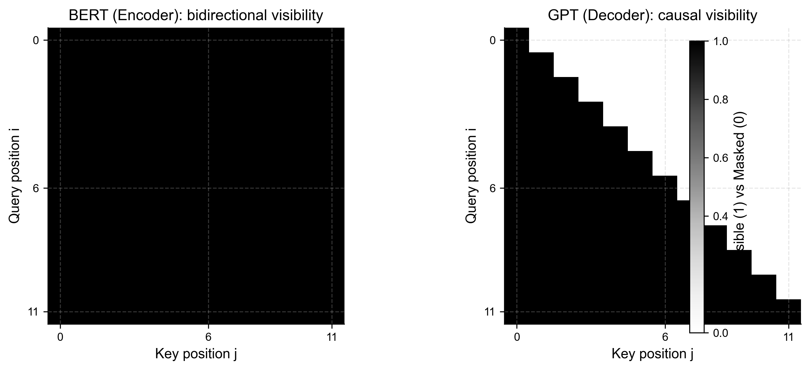
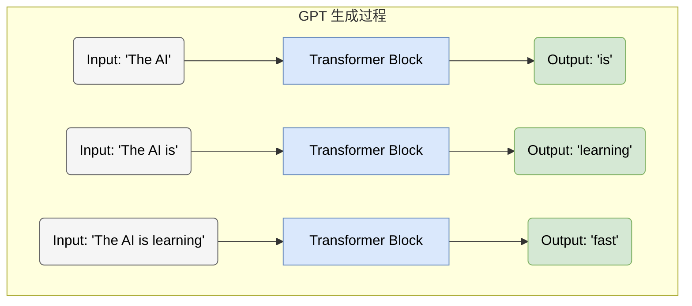
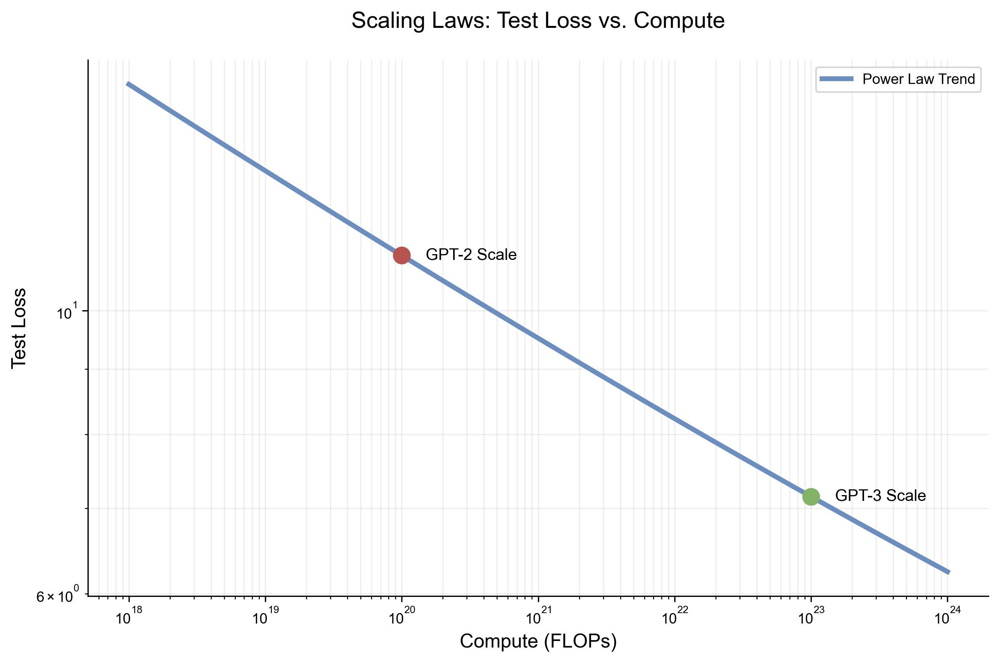

# 4.3 GPT 系列：生成式预训练变换器 (GPT Series: Generative Pre-trained Transformers)

## 1. 另一条道路：生成式模型 (The Generative Path)

在 BERT 专注于“完形填空”以此理解语言结构的同时，OpenAI 选择了一条更接近人类自然语言产出方式的道路：**自回归生成 (Autoregressive Generation)**。

**GPT (Generative Pre-trained Transformer)** 系列的核心信仰是：如果一个模型能够极好地预测下一个词（Predict the Next Token），那么它必然隐含地理解了语言的语法、语义甚至逻辑推理规则。

**训练目标（最小数学形式）**：GPT 采用 **自回归语言建模 (Causal Language Modeling, CLM)**。给定序列 $x_{1:T}$，最大化似然等价于最小化负对数似然：

<span style="background-color: #FFF2CC; color: black; padding: 2px 4px; border-radius: 4px;">Math</span>
$$ \mathcal{L}_{\text{CLM}} = -\sum_{t=1}^{T} \log P(x_t \mid x_{<t}) $$

它之所以能被并行训练，是因为训练时我们一次性喂入整段文本，并用 **因果掩码 (Causal Mask)** 在注意力层里严格禁止“偷看未来”。

### 1.1 架构对比：Decoder-only (Architecture Comparison)

GPT 采用了 Transformer 的 **Decoder** 部分（去掉了 Encoder-Decoder Attention 层）。

<span style="background-color: #DAE8FC; color: black; padding: 2px 4px; border-radius: 4px;">关键区别</span>：**因果掩码 (Causal Mask)**。
*   **BERT (Encoder)**: 能够看到未来的 Token（双向）。适合判别式任务。
*   **GPT (Decoder)**: 严格只能看到当前及过去的 Token（单向）。适合生成式任务。

为了把“能看见哪些 token”变成可视化对象，下图对比了两者的注意力可见性矩阵：





## 2. GPT 的演进之路 (Evolution of GPT)

GPT 系列的发展史，本质上是模型规模（Scale）与能力（Capability）的 **涌现 (Emergence)** 史。

### 2.1 GPT-1: 预训练 + 微调 (Pre-training + Fine-tuning)
*   **规模**: 1.17亿参数。
*   **贡献**: 验证了在无标注数据上预训练 Decoder 模型，再在下游任务上有监督微调（SFT）的有效性。此时它和 BERT 的思路类似。

### 2.2 GPT-2: 零样本学习者 (Zero-shot Learner)
*   **规模**: 15亿参数。
*   **洞察**: "Language Models are Unsupervised Multitask Learners"。
*   OpenAI 发现，当模型足够大、数据足够多时，它不需要显式的微调，通过给出一个合适的 **提示 (Prompt)**，就能完成翻译、摘要等任务。
    *   *Prompt*: "English: Hello. French: " -> 模型自动补全 "Bonjour"。

### 2.3 GPT-3: 上下文学习 (In-context Learning)
*   **规模**: 1750亿参数。
*   **核心突破**: 即使不进行任何梯度更新（No Gradient Updates），模型也能通过在 Input 中给出的几个示例（Few-shot），学会新任务。

<span style="background-color: #FFF2CC; color: black; padding: 2px 4px; border-radius: 4px;">In-context Learning 示例</span>

```text
Input to GPT-3:
Task: Translate English to Spanish.
apple -> manzana
car -> coche
book -> ???

GPT-3 Output:
libro
```

## 3. 缩放定律 (Scaling Laws)

GPT 系列的成功不仅是工程上的胜利，更是科学上的发现。Kaplan 等人（2020）提出了著名的 **Scaling Laws**：
模型性能（Loss）与计算量（Compute）、数据集大小（Data Size）、参数量（Parameters）之间存在 **幂律关系 (Power Law)**。

这意味着：**只要增加算力和数据，模型就会变强，而且这种变强是可以预测的。**



## 4. 总结 (Summary)

GPT 系列通过坚持简单的“预测下一个词”目标和不断扩大的规模，最终触发了智能的涌现。它将 NLP 的范式从“特定任务微调”推向了“通用任务提示”。

然而，早期的 GPT（如 GPT-3）虽然博学，但并不一定听话或安全。如何让这些庞然大物与人类意图对齐（Alignment），成为了后续 InstructGPT 和 ChatGPT 的核心课题。
