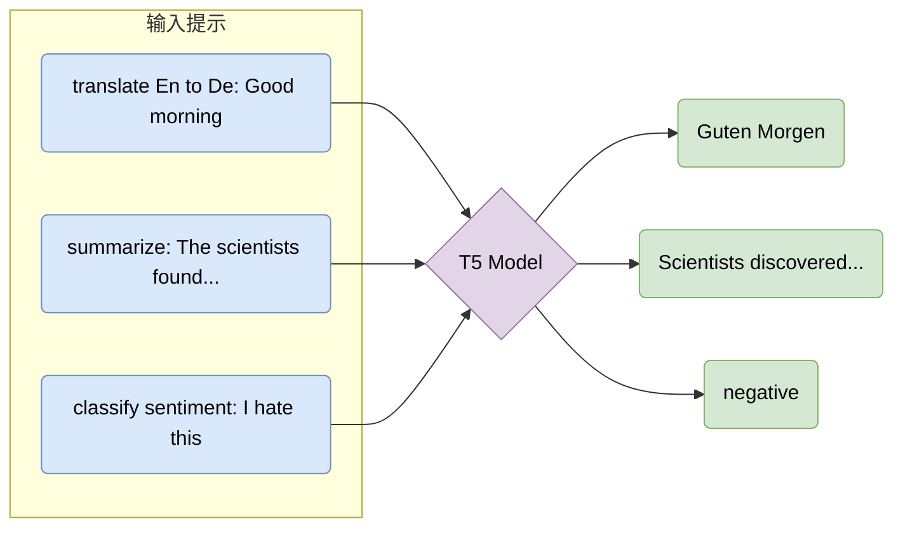
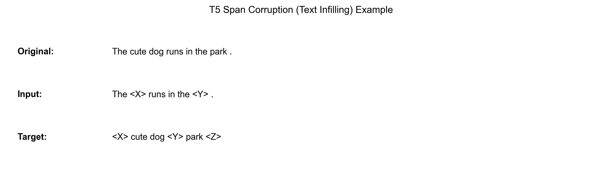

# 4.4 统一框架：T5 与 BART (Unified Frameworks: T5 & BART)

## 1. 编码器与解码器的再融合 (Reuniting Encoder & Decoder)

BERT（仅编码器）擅长理解，GPT（仅解码器）擅长生成。那么，是否存在一种架构能够通吃这两类任务？
答案是回归本源：使用完整的 **编码器-解码器 (Encoder-Decoder)** 架构（即原始 Transformer 架构）。

这一领域的代表作是 Google 的 **T5** 和 Facebook (Meta) 的 **BART**。

## 2. T5: 文本到文本转换器 (Text-to-Text Transfer Transformer)

T5 提出了一个极具统一性的视角：**所有 NLP 任务都可以被视为“文本到文本” (Text-to-Text) 的转换问题。**

### 2.1 统一接口 (Unified Interface)

在 T5 之前，不同的任务需要不同的模型头部（Head）：
*   分类任务需要全连接层输出类别概率。
*   回归任务需要输出实数。
*   生成任务需要解码文本。

T5 将一切统一为文本生成：
*   **翻译**: Input: "translate English to German: That is good." $\rightarrow$ Output: "Das ist gut."
*   **分类**: Input: "cola sentence: The course is jumping well." $\rightarrow$ Output: "not acceptable."
*   **回归**: Input: "stsb sentence1: ... sentence2: ..." $\rightarrow$ Output: "3.8" (以字符串形式输出数字)。

### 2.2 预训练目标：Span Corruption

T5 使用了一种类似 BERT MLM 但更适合生成任务的目标：**Span Corruption (片段破坏)**。
它不是 Mask 单个词，而是 Mask 掉一段连续的文本，并用唯一的哨兵符（Sentinel Token, 如 `<X>`, `<Y>`）代替。模型需要生成被 Mask 掉的内容。

*   **Original**: "The cute dog runs in the park."
*   **Input**: "The `<X>` runs in the `<Y>`."
*   **Target**: "`<X>` cute dog `<Y>` park `<Z>`"

**训练目标（最小数学形式）**：把被破坏后的输入记为 $\tilde{x}$，目标序列（需要模型生成出来的 spans）记为 $y_{1:T}$，则 T5 的生成式去噪目标就是标准序列到序列的负对数似然：

Math
$$ \mathcal{L}_{\text{span}} = -\sum_{t=1}^{T} \log P(y_t \mid y_{<t}, \tilde{x}) $$

它与 BERT-MLM 的差别在于：BERT 预测的是“被 mask 的离散位置上的 token”，而 T5 预测的是“一个连续的文本片段”，因此更自然地对齐生成任务。

## 3. BART: 去噪自编码器 (Denoising Autoencoder)

BART (Bidirectional and Auto-Regressive Transformers) 同样采用了 Encoder-Decoder 架构。它的预训练任务更加多样化，旨在恢复被破坏的文档。

噪声策略
1.  **Token Masking**: 类似 BERT。
2.  **Token Deletion**: 删除 Token。
3.  **Text Infilling**: 类似 T5 Span Corruption。
4.  **Sentence Permutation**: 随机打乱句序。
5.  **Document Rotation**: 随机选择一个 Token 作为开头，旋转文档。

BART 在 **文本摘要 (Summarization)** 等生成任务上表现尤为出色。

## 4. 本章总结 (Chapter Summary)

至此，我们已经集齐了 Transformer 家族的三大流派：

|流派 (Paradigm)|代表模型 (Model)|架构 (Arch)|优势 (Pros)|劣势 (Cons)|
|:---|:---|:---|:---|:---|
|**Encoder-only**|BERT, RoBERTa|Bi-directional|理解能力强，适合分类/抽取|无法进行流畅的文本生成|
|**Decoder-only**|GPT-2, GPT-3|Auto-regressive|生成能力强，零样本泛化好|对上下文的双向理解较弱（训练时）|
|**Encoder-Decoder**|T5, BART|Full Transformer|通用性最强，兼顾理解与生成|训练和推理开销通常略大|

在接下来的章节中，我们将进入 **大模型时代 (The Era of LLMs)**，探讨如何通过指令微调 (Instruction Tuning) 和人类反馈强化学习 (RLHF) 将这些基座模型转化为真正的智能助手。
