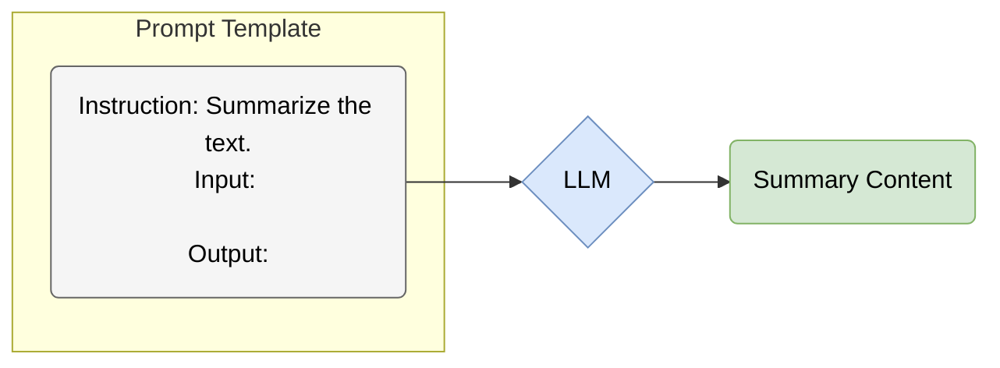

# 5.1 指令微调：从续写到对话 (Instruction Tuning: From Completion to Conversation)

## 1. 核心矛盾：能力与意图的错位 (The Misalignment of Capability and Intent)

在第 4 章中，我们看到 GPT-3 展现出了惊人的“上下文学习”能力。然而，原始的预训练模型（Base Model）本质上只是一个 **高阶的文本续写机**。

如果你问 GPT-3：
> "Explain gravity to a six-year-old." (给六岁孩子解释重力)

它可能会根据训练数据的统计规律续写成：
> "Explain gravity to a physics student." (给物理系学生解释重力)
> "Explain gravity to a teacher." (给老师解释重力)

它并不知道这是一个“指令”需要去执行，而认为这是一个“列表”需要去补全。
<span style="background-color: #DAE8FC; color: black; padding: 2px 4px; border-radius: 4px;">核心问题</span>：模型拥有 **能力 (Capability)**，但缺乏对用户 **意图 (Intent)** 的理解。

## 2. 指令微调 (Instruction Tuning)

**指令微调 (Instruction Tuning)** 是将预训练模型转化为智能助手的关键一步。它的核心思想是：利用大量以“指令-输入-输出”格式组织的语料库，对模型进行有监督微调 (SFT)。

### 2.1 数据格式范式 (Data Format Paradigm)

传统的微调通常针对单一任务（如只做翻译）。而指令微调是 **多任务 (Multi-task)** 的，且每个任务都由自然语言指令定义。



### 2.2 训练目标：条件语言建模 (Conditional Language Modeling)

指令微调在训练形式上仍然是“预测下一个 token”，只是我们把输入组织成了更接近人类指令的格式。把指令与输入拼接为 $\mathbf{x}$，把模型回答拼接为 $\mathbf{y} = (y_1, \dots, y_T)$，SFT 的目标函数就是标准的负对数似然：

<span style="background-color: #FFF2CC; color: black; padding: 2px 4px; border-radius: 4px;">Math</span>
$$ \mathcal{L}_{\text{SFT}} = - \sum_{t=1}^{T} \log P(y_t \mid \mathbf{x}, y_{<t}) $$

这一点解释了为什么“模板/格式”会显著影响结果：它直接改变了条件分布 $P(\mathbf{y}\mid\mathbf{x})$ 的建模方式。

### 2.3 FLAN: 规模化的指令微调 (Finetuned Language Models are Zero-shot Learners)

Google 的 **FLAN** (Finetuned Language Net) 系列研究表明，通过将数十个 NLP 数据集转化为指令格式进行微调，模型在 **未见过的任务 (Unseen Tasks)** 上表现出了强大的零样本泛化能力。

*   **Prompt 模板化**: 将情感分类数据集 IMDB 转化为：
    *   模板 A: "Is this movie review positive or negative? {text}"
    *   模板 B: "Review: {text}. What is the sentiment?"

## 3. 对话微调 (Chat Tuning)

在指令微调的基础上，OpenAI 进一步针对 **多轮对话 (Multi-turn Chat)** 进行了优化。这要求模型不仅能理解当前指令，还能维护对话历史 (Context Window)。

### 3.1 格式 (Format)

通常使用特殊的 Token 来标记对话角色：

```text
<|system|>
You are a helpful assistant.
<|user|>
How do I make a cake?
<|assistant|>
First, preheat your oven to...
<|user|>
What if I don't have eggs?
```

## 4. 总结 (Summary)

指令微调（SFT）成功地“唤醒”了模型的知识，使其学会了遵循人类的命令。
然而，SFT 依然存在局限：
1.  **数据的昂贵性**: 高质量的指令数据通常需要专家撰写（如 OpenAI 雇佣了大量标注员）。
2.  **目标不一致**: 仅模仿人类的回答（交叉熵损失最小化）并不等于生成“好”的回答。有时候模型会学会一本正经地胡说八道（Hallucination），因为它在训练数据中见过类似模式。

为了解决“好坏”的价值判断问题，我们需要引入更高级的对齐技术—— **RLHF**。
