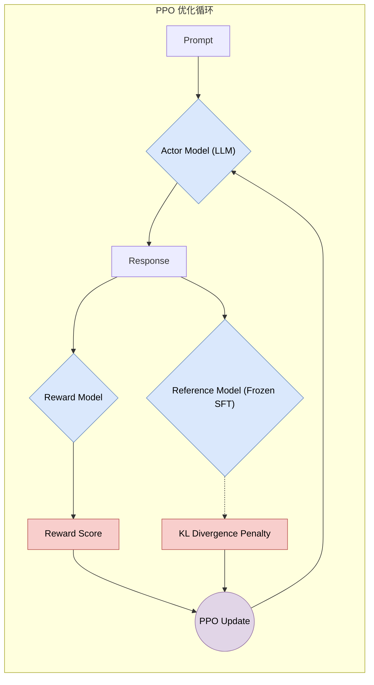
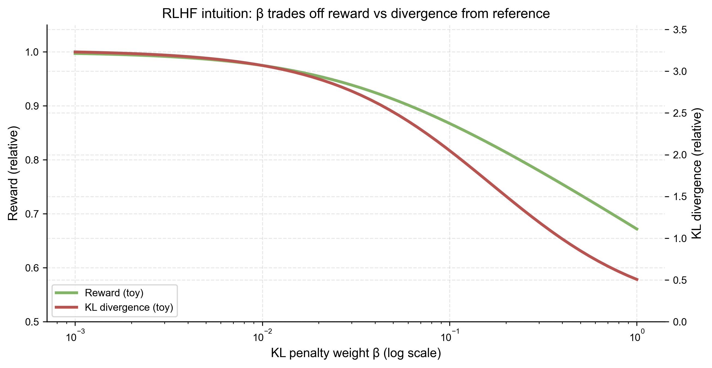

# 5.2 RLHF 与价值对齐 (RLHF & Value Alignment)

## 1. 为什么需要 RLHF? (Why RLHF?)

有监督微调 (SFT) 教会了模型“如何说话”，但没有教会它“什么是好的回答”。
人类的偏好是主观且难以定义的：
*   **Helpful (有帮助)**: 准确回答问题。
*   **Harmless (无害)**: 不生成偏见、暴力或非法内容。
*   **Honest (诚实)**: 不编造事实（尽量）。

由于很难写出一个完美的损失函数来数学化定义这些目标，OpenAI 在 InstructGPT 中引入了 **RLHF (Reinforcement Learning from Human Feedback)**：让模型直接从人类的反馈（点赞/排序）中学习。

## 2. RLHF 的三阶段 (The 3 Stages of RLHF)

这是现代大模型（如 ChatGPT, Claude, Llama 2-Chat）的标准训练流水线。

### 2.1 步骤 1: 有监督微调 (SFT)
收集人类撰写的高质量指令-回复对，训练一个基座模型（Base Model）到 SFT Model。这一步与 5.1 节描述的一致。

### 2.2 步骤 2: 奖励模型训练 (Reward Model Training)
这是关键一步。模型不再生成文本，而是**学会打分**。
*   **数据收集**: 给定一个 Prompt 和模型的多个输出（Output A, Output B, ...），让人类标注员进行排序（Ranking）：\( A > B > C \)。
*   **训练目标**: 训练一个 Reward Model (RM)，使得 \( R(A) > R(B) \)。

成对排序损失 (Pairwise Ranking Loss)
\[
\mathcal{L}(\theta) = - \mathbb{E}_{(x, y_w, y_l) \sim D} \left[ \log(\sigma(r_\theta(x, y_w) - r_\theta(x, y_l))) \right]
\]
其中 \( y_w \) 是胜出的回答，\( y_l \) 是失败的回答。

### 2.3 步骤 3: 强化学习微调 (PPO)
利用奖励模型作为“裁判”，使用 **PPO (Proximal Policy Optimization)** 算法优化语言模型。（关于 PPO 的详细数学推导与策略梯度原理，请见 **[附录 A.11](../appendix/a.11_rl_and_ppo.md)**）

## 3. KL 散度：防止模型“作弊” (KL Divergence: The Safety Anchor)

在 PPO 过程中，一个常见的问题是 **Reward Hacking**：模型可能会发现某种特定的怪异模式能骗取高分（例如一直重复“谢谢”）。
为了防止 RL 模型偏离原本的语言能力太远，我们在奖励函数中加入了一个 **KL 惩罚项 (KL Penalty)**：

\[
R_{total} = R_{model}(x, y) - \beta \log \left( \frac{\pi_{RL}(y|x)}{\pi_{SFT}(y|x)} \right)
\]

*   \(\pi_{RL}\): 当前正在训练的模型。
*   \(\pi_{SFT}\): 冻结的初始 SFT 模型。
*   **作用**: 强迫 RL 模型的分布不要偏离 SFT 模型太远，保持语言的流畅性。

## 4. 直接偏好优化 (DPO: Direct Preference Optimization)

RLHF 虽然强大，但 PPO 训练极其不稳定且消耗显存。
2023 年提出的 **DPO (Direct Preference Optimization)** 证明了：我们可以绕过显式的 Reward Model 和 PPO 步骤，直接在偏好数据上优化语言模型。

**训练目标（最小数学形式）**：给定偏好三元组 $(x, y_w, y_l)$（同一 Prompt 下胜者/败者），DPO 直接让“胜者相对败者”的对数概率优势变大，同时用参考策略 $\pi_{ref}$ 做锚定：

Math
$$ \mathcal{L}_{\text{DPO}} = -\log \sigma\Big(\beta\big[(\log \pi_\theta(y_w|x) - \log \pi_\theta(y_l|x)) - (\log \pi_{ref}(y_w|x) - \log \pi_{ref}(y_l|x))\big]\Big) $$

其中 $\beta$ 控制“偏好强度”（可视作温度/权衡系数）。它的直觉和 RLHF 一致：**既要贴近人类偏好，又不能偏离原本的语言能力太远**。（更完整的推导与它与 KL 约束的关系，请见 **[附录 A.11](../appendix/a.11_rl_and_ppo.md)**）

DPO 正在逐渐成为 RLHF 的高效替代方案，被广泛应用于开源模型（如 Mistral, Qwen, Llama 3）的微调中。

## 5. 总结 (Summary)

RLHF 是让 AI 从“像机器一样思考”转变为“像人类一样交流”的关键技术。它不仅提升了可用性，更是 AI 安全（Safety）的第一道防线。
