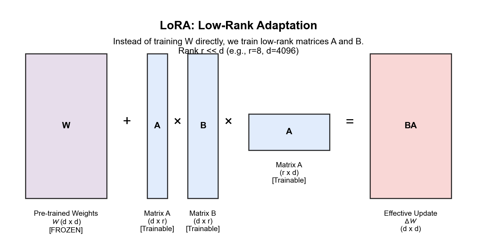
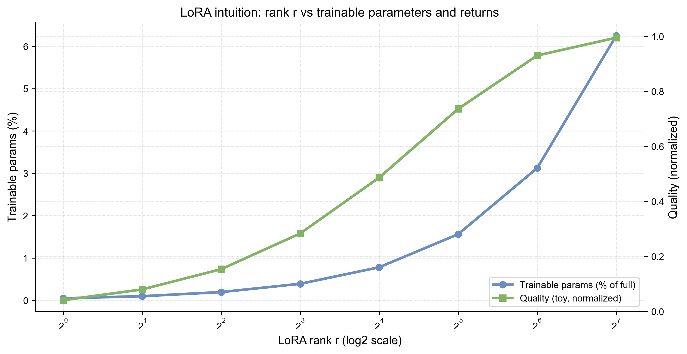

# 5.3 PEFT：参数高效微调 (PEFT: Parameter-Efficient Fine-Tuning)

## 1. 全量微调的负担 (The Burden of Full Fine-Tuning)

随着模型规模突破千亿参数（175B+），传统的全量微调（Full Fine-Tuning）变得不再可行。
*   **显存噩梦**: 微调 175B 模型需要存储梯度和优化器状态，这通常需要 1TB+ 的显存（相当于几十张 A100 GPU）。
*   **存储灾难**: 每次微调一个下游任务，都需要保存一份完整的模型副本（700GB+）。

解决方案：PEFT (Parameter-Efficient Fine-Tuning)。即 **冻结** 大部分模型参数，只训练极少量的额外参数。

## 2. LoRA: 低秩自适应 (Low-Rank Adaptation)

LoRA 是目前最流行、最高效的 PEFT 方法。它的数学直觉非常优雅：**模型权重的更新量是低秩的 (The change in weights is low-rank)。**

### 2.1 核心公式 (Core Formulation)

对于一个预训练权重矩阵 \( W_0 \in \mathbb{R}^{d \times d} \)，我们不直接更新它，而是学习一个增量矩阵 \( \Delta W \)。
LoRA 将这个增量分解为两个低秩矩阵的乘积：

\[
W = W_0 + \Delta W, \quad \Delta W = \frac{\alpha}{r} B A
\]

其中 $\alpha$ 是 LoRA 的缩放超参数（常见设定如 $\alpha=r$），用于控制增量更新的幅度。

*   \( W_0 \): 冻结的预训练权重。
*   \( B \in \mathbb{R}^{d \times r} \): 初始化为 0。
*   \( A \in \mathbb{R}^{r \times d} \): 高斯随机初始化。
*   \( r \): 秩（Rank），通常设得很小（如 8, 16, 64）。

### 2.2 LoRA 结构可视化 (Structure Visualization)

为了把“为什么 rank 设小也有效”变成更工程化的决策，下图给出一个简化的权衡示意：rank 越大，可训练参数增长越快，但收益通常是递减的。

### 2.3 优势 (Advantages)
1.  **极度节省参数**: 对于 GPT-3，\( r=4 \) 时，LoRA 只需要训练 0.01% 的参数。
2.  **无推理延迟**: 在推理时，可以将 \( BA \) 直接加回 \( W_0 \) 中（\( W' = W_0 + BA \)），不增加额外的计算层。
3.  **多任务切换**: 不同的任务只需要切换不同的 \( A, B \) 矩阵，基础模型 \( W_0 \) 共享。

## 3. 其他 PEFT 方法 (Other PEFT Methods)

虽然 LoRA 占据主导地位，但了解其前身有助于理解 PEFT 的演进。

### 3.1 Adapter Tuning
*   在 Transformer 的每一层（Attention 和 FFN 层之间）插入小型的“适配器”神经网络（Bottleneck Layers）。
*   **缺点**: 增加了网络深度，导致推理延迟（Inference Latency）。

### 3.2 Prefix Tuning / P-Tuning
*   在 Input Embeddings 之前拼接一组可学习的“虚拟 Token”（Virtual Tokens/Prefix）。
*   **直觉**: 相当于通过梯度下降自动寻找一个“完美的 Prompt”。
*   **缺点**: 占用了宝贵的上下文窗口长度。

## 4. QLoRA: 量化 LoRA (Quantized LoRA)

如果 LoRA 解决了训练参数量的问题，那么 QLoRA 则进一步解决了 **基座模型显存占用** 的问题。
*   **4-bit NormalFloat (NF4)**: 将冻结的基座模型 \( W_0 \) 压缩到 4-bit 加载。
*   **Double Quantization**: 对量化常数再进行一次量化。
*   **Paged Optimizers**: 利用 CPU 内存来处理 GPU 显存峰值。

成果：QLoRA 使得在单张 48GB GPU 上微调 65B 模型成为可能，极大地民主化了 LLM 的微调。
