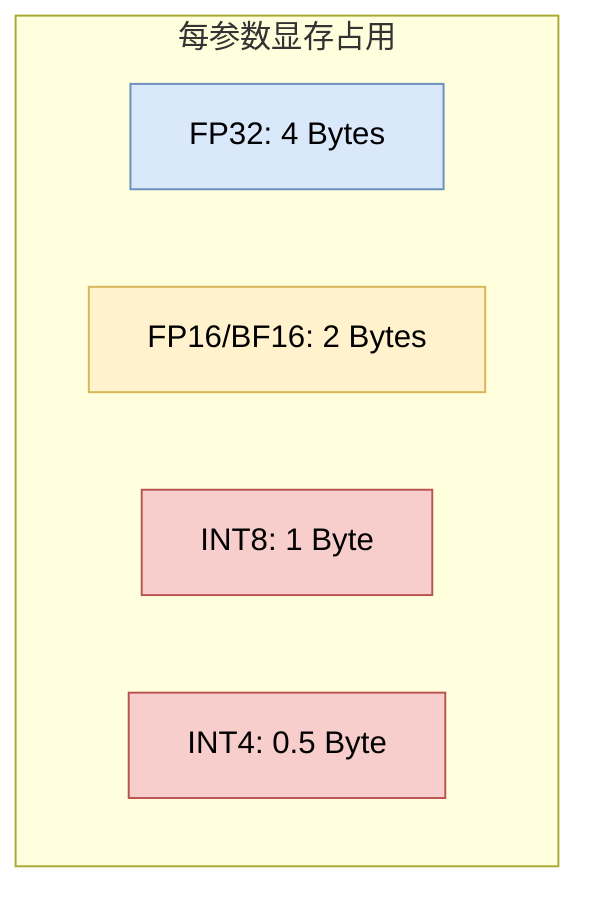

# 5.4 模型量化与优化 (Model Quantization & Optimization)

## 1. 为什么需要量化？(Why Quantization?)

大模型的参数量巨大，导致其部署面临两大瓶颈：
1.  **显存带宽 (Memory Bandwidth)**: 模型生成速度（Tokens/sec）主要受限于从显存读取权重的速度，而非计算速度（Memory-bound）。
2.  **显存容量 (Memory Capacity)**: 运行一个 70B 的模型（FP16）需要 140GB+ 显存，这远超消费级显卡的能力。

**量化 (Quantization)** 通过降低数值精度来减少显存占用和带宽需求。

## 2. 数值精度概览 (Numerical Precision Overview)

*   **FP32 (Full Precision)**: 32-bit，标准的深度学习训练格式。
*   **FP16 / BF16 (Half Precision)**: 16-bit，现代 GPU 训练和推理的主流格式。BF16 拥有与 FP32 相同的指数位范围，训练更稳定。
*   **INT8**: 8-bit 整数。
*   **FP4 / NF4**: 4-bit 浮点数（QLoRA 引入）。

为了建立直觉，下图展示了一个“权重显存 vs 精度”的典型权衡（示意，并非某个特定模型的实测曲线）：

## 3. 常见量化技术 (Common Quantization Techniques)

### 3.1 Post-Training Quantization (PTQ)
训练后量化。直接将训练好的 FP16 模型转换为 INT8/INT4。

**技术本质（最小数学形式）**：最常见的是仿射量化 (Affine Quantization)。对某个权重（或一组权重）$w$，选择缩放 $s$ 与零点 $z$，把浮点映射到整数区间：

Math
$$ q = \text{clip}\big(\text{round}(w/s) + z\big), \quad \hat{w} = s\,(q-z) $$

其中 $q$ 是 INT8/INT4 的离散值，$\hat{w}$ 是反量化后的近似权重。工程上常用 **按通道量化 (Per-channel Quantization)** 来降低误差（不同输出通道用不同的 $s,z$）。

*   **GPTQ**: 一种基于二阶信息（Hessian Matrix）的逐层量化方法，能将模型压缩到 3-bit 或 4-bit 而几乎不损失精度。
*   **AWQ (Activation-aware Weight Quantization)**: 核心发现是——并不是所有权重都同等重要。AWQ 保护那些对应 **较大激活值** 的权重（Salient Weights），对其他权重进行激进量化。

### 3.2 Quantization-Aware Training (QAT)
感知量化训练。在训练过程中模拟量化误差，通常效果优于 PTQ，但训练成本高。

## 4. 高效推理与显存管理 (Efficient Inference & Memory Management)

除了量化，显存管理也是优化的关键。

### 4.1 KV Cache
在 Transformer 推理中，我们需要缓存之前 Token 的 Key 和 Value 向量，以避免重复计算。但这会消耗大量显存。

### 4.2 PagedAttention (vLLM)
传统的 KV Cache 预分配显存会导致严重的内存碎片化和浪费。
受操作系统**虚拟内存 (Virtual Memory)** 分页机制的启发，**vLLM** 提出了 **PagedAttention**：
*   将 KV Cache 分块（Blocks）存储在非连续的物理显存中。
*   通过块表（Block Table）进行逻辑地址到物理地址的映射。

效果：PagedAttention 使得显存利用率接近 100%，将吞吐量（Throughput）提升了 2-4 倍。

## 5. 本章总结 (Chapter Summary)

从指令微调（让模型听话），到 RLHF（让模型向善），再到 PEFT 和量化（让模型更亲民），我们已经涵盖了现代大模型从“预训练基座”变为“可用产品”的全过程。

这一系列技术不仅提升了模型的智能水平，也极大地降低了落地的门槛，引发了开源大模型（如 Llama, Mistral）的寒武纪大爆发。
