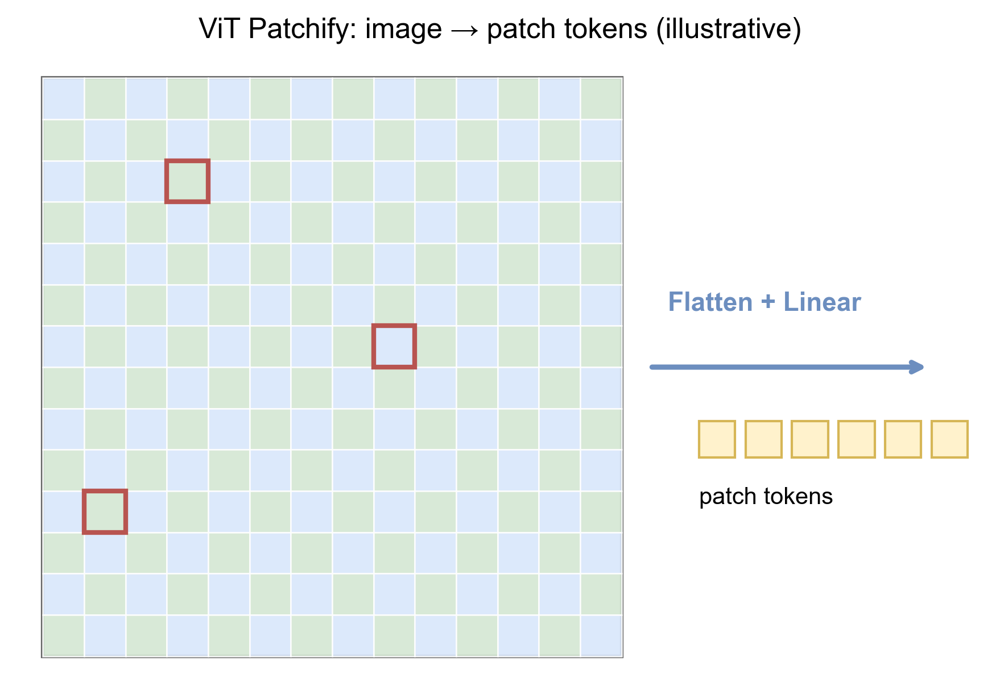
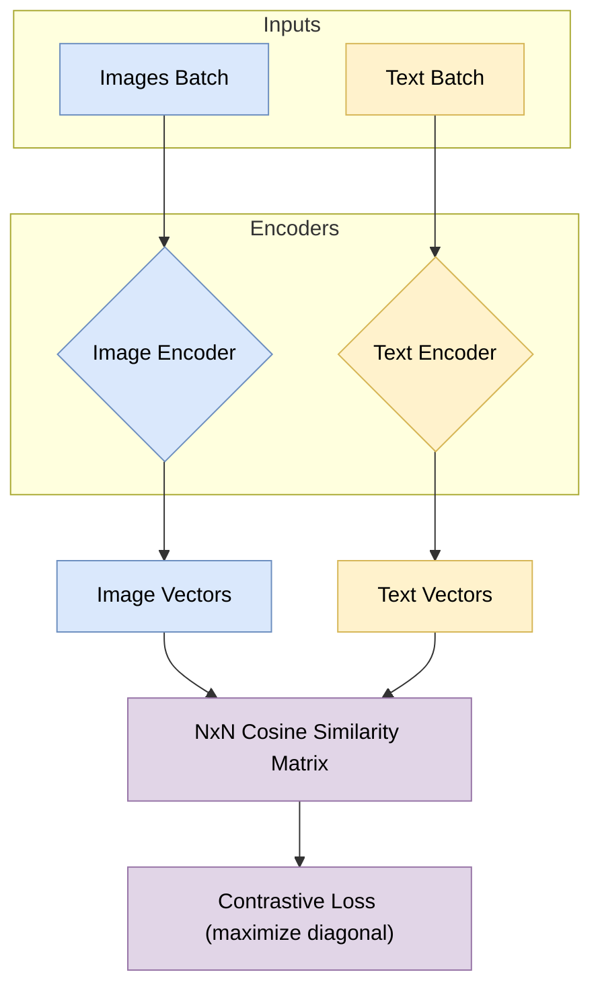

# 6.1 多模态 AI：打破感官壁垒 (Multimodal AI: Breaking Sensory Barriers)

## 1. 文本之外的世界 (The World Beyond Text)

直到 2020 年，NLP（自然语言处理）和 CV（计算机视觉）还是两个平行发展的领域。
*   NLP 模型（如 BERT）生活在离散的符号世界里。
*   CV 模型（如 ResNet）生活在连续的像素世界里。

然而，人类的智能是多模态的：我们看到“苹果”的图像，就能联想到单词 "Apple"，尝到它的味道，想起牛顿的故事。
**多模态 AI (Multimodal AI)** 的目标就是打通这些感官，建立图像、文本、音频之间的统一表示。

## 2. ViT: 视觉变换器 (Vision Transformer)

在 Transformer 统治 NLP 后，Google 团队思考：Transformer 能否直接处理图像？
答案是肯定的，只要把图像变成“序列”。

### 2.1 图像分块 (Patchify)

ViT (Vision Transformer) 将一张图片 \( H \times W \) 切分成一系列固定大小的小块（Patches），例如 \( 16 \times 16 \)。
每个 Patch 被展平并线性映射为一个向量，这些向量就相当于 NLP 中的“单词 embeddings”。



<span style="background-color: #DAE8FC; color: black; padding: 2px 4px; border-radius: 4px;">核心洞察</span>：卷积（CNN）具有很强的归纳偏置（局部性、平移不变性），而 Transformer 只有注意力。只要数据量足够大（如 JFT-300M 数据集），Transformer 就能学会比 CNN 更强的特征表示。

## 3. CLIP: 连接文本与图像 (Contrastive Language-Image Pre-training)

OpenAI 的 **CLIP** 是多模态领域的里程碑。它不是通过分类任务训练（如 ImageNet 的 1000 类），而是通过**对比学习 (Contrastive Learning)**。

### 3.1 训练机制 (Training Mechanism)

CLIP 同时训练一个 Image Encoder（ViT）和一个 Text Encoder（Transformer）。
*   **输入**: \( N \) 个图像-文本对（从互联网爬取）。
*   **目标**: 预测哪个文本描述与哪个图像匹配。
*   **矩阵**: 计算 \( N \times N \) 的相似度矩阵。最大化对角线元素（正样本），最小化非对角线元素（负样本）。



<span style="background-color: #D5E8D4; color: black; padding: 2px 4px; border-radius: 4px;">Zero-shot 能力</span>：训练好的 CLIP 可以识别任何它没见过的物体，只要你提供一个描述（如 "a photo of a pokemon"）。

**最小数学形式（对比学习 / InfoNCE）**：在一个 batch 内，令图像向量为 $\{\mathbf{u}_i\}_{i=1}^N$，文本向量为 $\{\mathbf{v}_i\}_{i=1}^N$，相似度为 $s_{ij} = \frac{\mathbf{u}_i^T \mathbf{v}_j}{\tau}$（$\tau$ 为温度系数），则 CLIP 的对比损失可写为双向交叉熵：

<span style="background-color: #FFF2CC; color: black; padding: 2px 4px; border-radius: 4px;">Math</span>
$$ \mathcal{L}_{\text{CLIP}} = \frac{1}{2}\left( -\frac{1}{N}\sum_{i=1}^N \log \frac{\exp(s_{ii})}{\sum_{j=1}^N \exp(s_{ij})} - \frac{1}{N}\sum_{i=1}^N \log \frac{\exp(s_{ii})}{\sum_{j=1}^N \exp(s_{ji})} \right) $$

直觉上，它强迫“正确配对”的相似度 $s_{ii}$ 在每行/每列都是最大的。（更完整的 InfoNCE/对比学习推导，请见 **[附录 A.12](../appendix/a.12_contrastive_learning.md)**）

## 4. LLaVA: 大语言模型看世界 (Large Language-and-Vision Assistant)

CLIP 只能做匹配，不能“说话”。如果我们想让 ChatGPT 能看图说话，该怎么办？
**LLaVA** 给出了一种简单粗暴但极其有效的方案：**视觉投影 (Visual Projection)**。

### 4.1 架构 (Architecture)
1.  **Vision Encoder**: 使用训练好的 CLIP (ViT-L/14) 提取图像特征。
2.  **Projection Layer**: 一个简单的线性层（Linear Layer），将图像特征映射到 LLM 的词向量空间（Word Embedding Space）。
3.  **LLM**: 也就是 Llama 2 / Vicuna。

对于 LLM 来说，映射后的图像特征仅仅是一堆它看不懂的“外语 Token”，但通过微调，它学会了将这些 Token 理解为视觉信息。

```mermaid
graph LR
    %% 样式定义
    classDef vision fill:#DAE8FC,stroke:#6C8EBF,color:#000000;
    classDef proj fill:#F8CECC,stroke:#B85450,color:#000000;
    classDef llm fill:#D5E8D4,stroke:#82B366,color:#000000;

    Img(Image):::vision --> Enc{CLIP Vision Encoder}:::vision
    Enc --> Feat[Visual Features Zv]:::vision
    Feat --> Proj{Projection W}:::proj
    Proj --> Emb[Visual Embeddings Hv]:::proj
    
    Txt(User: Describe this image):::llm --> Tok[Text Embeddings Hq]:::llm
    
    Emb --> Concat((Concat)):::llm
    Tok --> Concat
    Concat --> LLM{LLM (Llama/Vicuna)}:::llm
    LLM --> Ans("Response: A dog playing...")
```

## 5. 总结 (Summary)

多模态技术让 AI 拥有了“眼睛”和“耳朵”。
*   **ViT**: 证明了 Transformer 可以处理图像。
*   **CLIP**: 建立了两者的通用语言。
*   **LLaVA/GPT-4V**: 将视觉能力赋予了强大的推理大脑。

未来，视频（Sora）、音频（GPT-4o）与文本的融合将产生更具物理世界常识的通用智能。
