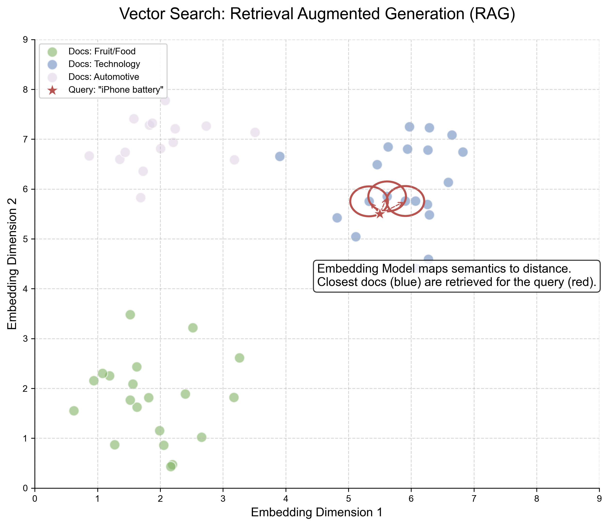

# 6.3 记忆与上下文：突破有限窗口 (Memory & Context: Breaking the Window Limit)

## 1. 上下文窗口的诅咒 (The Curse of Context Window)

Transformer 的核心机制是 Self-Attention，其计算复杂度是 \( O(N^2) \)。这意味着，如果我们想让模型记住一整本书（比如 100k tokens），计算成本是难以承受的。
这就导致了 LLM 的**健忘**：一旦对话超过窗口限制，之前的关键信息就会被截断。

如何解决这个问题？目前有两条主要路线：
1.  **RAG (Retrieval-Augmented Generation)**: 外挂知识库（类似开卷考试）。
2.  **Long Context Models**: 原生支持超长上下文（类似过目不忘）。

## 2. RAG：检索增强生成 (Retrieval-Augmented Generation)

RAG 是一种将**检索系统**与**生成模型**结合的混合架构。它允许模型访问其训练数据之外的私有或实时数据。

### 2.1 向量数据库 (Vector Database)

RAG 的核心是 **嵌入 (Embedding)**。我们将文档切块（Chunks），并将每一块转化为高维向量存储在向量数据库（如 Chroma, Pinecone, Milvus）中。

**技术本质（最小数学形式）**：令查询向量 $\mathbf{q}=f(q)$，第 $i$ 个文档块向量 $\mathbf{d}_i=f(d_i)$，相似度（常用余弦/点积）为

<span style="background-color: #FFF2CC; color: black; padding: 2px 4px; border-radius: 4px;">Math</span>
$$ s_i = \text{sim}(\mathbf{q},\mathbf{d}_i) $$

检索就是取 Top-$k$：
$$ \text{TopK}(q) = \operatorname{arg\,topk}_i\; s_i $$

Reranker（可选）可以再对 Top-$k$ 做一轮更昂贵但更准的打分排序。



### 2.2 RAG 工作流 (RAG Workflow)

1.  **Query**: 用户提问 "What is our Q3 revenue?"
2.  **Retrieve**: 将问题转化为向量，在数据库中搜索最相似的前 \( k \) 个文档块。
3.  **Augment**: 将检索到的文档块拼接到 Prompt 中。
4.  **Generate**: LLM 根据提供的上下文回答问题。

```mermaid
graph LR
    %% 样式定义
    classDef user fill:#F5F5F5,stroke:#666666,color:#000000;
    classDef db fill:#DAE8FC,stroke:#6C8EBF,color:#000000;
    classDef llm fill:#D5E8D4,stroke:#82B366,color:#000000;
    classDef process fill:#E1D5E7,stroke:#9673A6,color:#000000;

    U(User Query):::user --> Emb{Embedding Model}:::process
    Emb --> V[Query Vector]:::process
    
    subgraph Knowledge_Base
        DB[(Vector DB)]:::db
    end
    
    V --> DB
    DB --> Docs[Retrieved Context]:::db
    Docs --> Rerank{Reranker (optional)}:::process
    Rerank --> Docs2[Top-k Context]:::db
    
    U --> Prompt{Augmented Prompt}:::process
    Docs2 --> Prompt
    Prompt --> LLM{LLM}:::llm
    LLM --> Ans(Answer with Citations):::llm
```

**生成建模视角（最小数学形式）**：把检索到的证据块记为 $d$，RAG 可以被理解为对“先检索、后生成”的分解：

<span style="background-color: #FFF2CC; color: black; padding: 2px 4px; border-radius: 4px;">Math</span>
$$ P(y\mid x) \approx \sum_{d\in \text{TopK}(x)} P(y\mid x, d)\,P(d\mid x) $$

工程实现里通常用 Top-$k$ 的拼接近似这个求和：把 $d$ 直接塞进 Prompt，再让 LLM 生成 $y$。

<span style="background-color: #FFF2CC; color: black; padding: 2px 4px; border-radius: 4px;">优势</span>：
*   **幻觉减少**: 强迫模型基于事实回答。
*   **数据更新**: 无需重新训练模型即可更新知识库。
*   **隐私安全**: 私有数据保留在本地数据库中，仅在推理时注入。

## 3. 长上下文模型 (Long Context Models)

虽然 RAG 很有效，但它有损耗（检索不准、上下文碎片化）。如果模型能直接读完 100 万字的小说呢？
这就是 Gemini 1.5 Pro (1M-10M Context) 和 Claude 3 (200k Context) 的方向。

### 3.1 技术突破 (Technical Breakthroughs)
*   **RoPE (Rotary Positional Embedding)**: 旋转位置编码的外推性使得位置信息可以扩展到训练长度之外。
*   **Ring Attention**: 将 Attention 计算分布在多个 GPU 上，打破单卡显存限制。
*   **Needle In A Haystack (大海捞针测试)**: 评估模型能否在长达 10 万字的文档中，准确找到并回忆起随机插入的一句话。

## 4. RAG vs Long Context

| 特性 | RAG | Long Context |
|:---|:---|:---|
| **成本** | 低（仅检索部分） | 高（每次都要处理全部 Token） |
| **准确性** | 受限于检索算法 (Recall) | 理论上更高 (Global Awareness) |
| **适用场景** | 海量知识库 (TB级) | 单次任务需要大量信息 (如整本书分析) |

未来，两者将融合：**Long Context RAG**。即先检索出较多（如 100 个）相关文档，利用长窗口一次性全部读入，进行综合推理。
