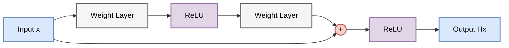
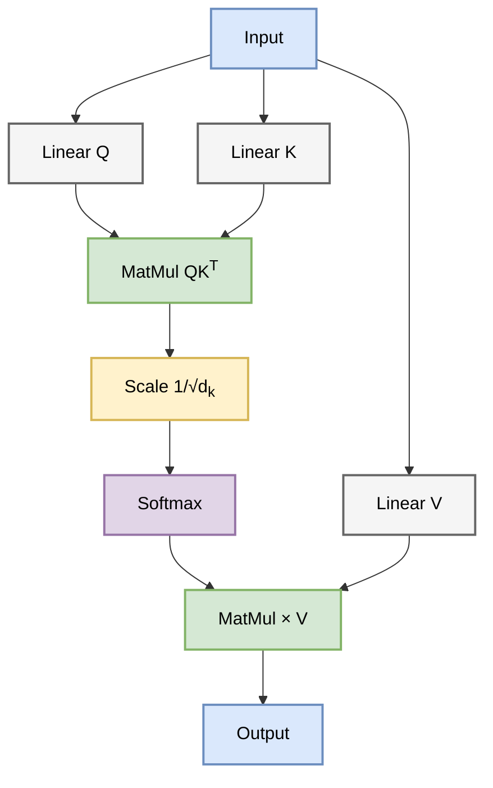
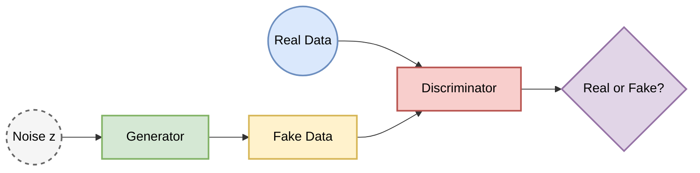
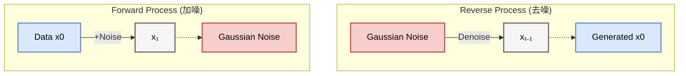

# 导论：人工智能演进史 (Introduction: The Evolution of AI)
**From Mathematical Logic to AGI (1943-2024)**

> 本章作为全书导论，旨在从技术和数学角度综述人工智能发展的核心阶段。我们将追溯至计算智能的起源，并重点关注近十年深度学习模型的范式转移、优化目标的演变以及生成式建模的理论基础。

人工智能的发展史，本质上是人类试图用**数学语言描述智能**的探索史。从早期的符号逻辑推演，到统计学习的函数拟合，再到如今大模型的概率生成，这一过程经历了数次范式革命。

---

## 0. 史前纪元与逻辑的黎明 (1943-2012)

为了更直观地理解 AI 的发展脉络，我们首先看一张涵盖 80 年历程的时间轴：

```mermaid
graph LR
    %% 时间节点定义
    T1943[1943<br/>M-P 模型]
    T1958[1958<br/>感知机]
    T1986[1986<br/>BP 算法]
    T2012[2012<br/>AlexNet]
    T2017[2017<br/>Transformer]
    T2020[2020<br/>GPT-3]
    T2022[2022<br/>ChatGPT]

    %% 连接
    T1943 --> T1958
    T1958 --> T1986
    T1986 --> T2012
    T2012 --> T2017
    T2017 --> T2020
    T2020 --> T2022

    %% 样式
    classDef blue fill:#DAE8FC,stroke:#6C8EBF,stroke-width:2px,color:#000000;
    classDef green fill:#D5E8D4,stroke:#82B366,stroke-width:2px,color:#000000;
    classDef yellow fill:#FFF2CC,stroke:#D6B656,stroke-width:2px,color:#000000;
    classDef red fill:#F8CECC,stroke:#B85450,stroke-width:2px,color:#000000;
    classDef purple fill:#E1D5E7,stroke:#9673A6,stroke-width:2px,color:#000000;

    class T1943,T1958 blue;
    class T1986,T2012 green;
    class T2017 yellow;
    class T2020 red;
    class T2022 purple;
```

在深度学习爆发之前，AI 经历了两大流派的漫长博弈：符号主义 (Symbolism) 与 连接主义 (Connectionism)。关于连接主义的核心数学基础，详见 **[Chapter 1.1](chapter_01/1.1_ai_paradigms.md)**。

### 0.1 逻辑微积分与图灵的追问 (The Genesis)
*   **1943 (M-P 模型)**: 神经生理学家 McCulloch 和数学家 Pitts 发表了《神经活动中内在思想的逻辑演算》。他们证明了简化的神经元模型（M-P 神经元）可以计算任何可计算函数（如果网络足够大）。这是**生物学与数理逻辑的初次联姻**。这一模型奠定了感知机的基础（详见 **[Chapter 1.2](chapter_01/1.2_perceptron_and_limits.md)**）。
*   **1950 (Turing Test)**: 图灵在《计算机器与智能》中提出了著名的图灵测试，给出了智能的**操作性定义**：如果机器的行为无法与人类区分，则称其具有智能。
*   **1956 (Dartmouth Workshop)**: 麦卡锡、明斯基、香农等人正式提出了"人工智能"这一术语，标志着 AI 学科的诞生。

### 0.2 符号主义的兴衰：推理即计算
早期的 AI（GOFAI）坚信 **"物理符号系统假设"**：智能的本质是对符号的操作。
*   **方法论**：人工编写规则 (Rule-based) 和逻辑推理 (Logic Inference)。
*   **成就**：专家系统（如 MYCIN）、国际象棋程序（Deep Blue）。
*   **困境**：莫拉维克悖论 (Moravec's Paradox) —— 只有高阶推理对计算机很容易（如下棋），而低阶感知对计算机极难（如识别猫）。符号系统无法处理现实世界的模糊性和不确定性。

### 0.3 连接主义的蛰伏与统计学习的统治
*   **感知机 (Perceptron, 1958)**: Rosenblatt 提出的单层网络因无法解决 XOR 问题（Minsky & Papert, 1969）而导致 AI 进入第一次寒冬。
*   **反向传播 (Backpropagation, 1986)**: Hinton 等人复兴了 BP 算法，使得多层网络训练成为可能（详见 **[Chapter 2.1](chapter_02/2.1_foundations_and_math.md)**）。
*   **统计学习 (1995-2010)**: 在神经网络受限于算力和数据时，SVM (支持向量机) 和 **Random Forest** 等基于统计理论的模型统治了这一时期（详见 **[Chapter 1.4](chapter_01/1.4_statistical_learning_era.md)**）。它们拥有严谨的凸优化边界（Convex Optimization）和核技巧（Kernel Tricks）。

---

## 1. 第一阶段：深度架构的成熟与序列建模的困境 (2012-2017)

随着算力的提升和大数据时代的到来，神经网络迎来了复兴。

2012 年 AlexNet 的出现标志着连接主义的全面复兴（详见 **[Chapter 2.2](chapter_02/2.2_cnn_architectures.md)**）。核心数学突破在于解决了深层网络的梯度传播问题。

### 1.1 残差学习 (Residual Learning)

ResNet (2015) 的提出打破了深度网络的深度限制。简单来说，它给网络加了"短路"机制，让信息有了一条高速公路。

*   **直观解释**：
    以前的网络像"传话游戏"，传了100层后信息早就失真了。ResNet 允许信息直接跳过某些层（Skip Connection），就像在传话的同时，还保留了一份原始小纸条。这样即使中间层学废了，至少还能保留上一层的结果。

*   **数学形式**：
    假设目标映射为 $H(x)$，网络不再直接拟合 $H(x)$，而是拟合残差映射 $F(x) := H(x) - x$。
    $$y_l = h(x_l) + F(x_l, W_l)$$
    $$x_{l+1} = f(y_l)$$

*   **架构示意图**：

*   **技术分析**：
    在反向传播中，公式中的常数项 $1$ 确保了梯度可以无损地传回浅层，从根本上解决了 梯度消失 (Vanishing Gradient) 问题。

### 1.2 序列建模的瓶颈

当时的 NLP 依赖 LSTM/GRU，它们像阅读一样逐字处理（详见 **[Chapter 2.4](chapter_02/2.4_lstm_and_seq2seq.md)**）。

*   **局限性**：
    RNN 必须读完第一个字才能读第二个字（串行计算，无法并行），速度慢。而且读到第100个字时，可能已经忘了第1个字是什么了（长距离依赖问题），虽然 LSTM 用"遗忘门"缓解了这个问题，但本质瓶颈依然存在。

---

## 2. 第二阶段：Transformer 范式与自注意力机制 (2017-2020)

RNN 的串行瓶颈促使研究者寻找并行化的解决方案。

*Attention Is All You Need (2017)* 的发表标志着现代 LLM 时代的开端（详见 **[Chapter 3](chapter_03/3.1_attention_mechanisms.md)**）。核心思想从"逐个看"变成了"一眼看全貌"。

### 2.1 自注意力机制 (Self-Attention) 的几何意义

Transformer 抛弃了递归，完全基于注意力（详见 **[Chapter 3.2](chapter_03/3.2_transformer_architecture.md)**）。

*   **直观解释**：
    在翻译"苹果"这个词时，模型会同时关注句子里的其他词。如果是"吃了一个苹果"，它会关注"吃"；如果是"苹果电脑"，它会关注"电脑"。这种"关注"是通过计算词与词之间的相似度（内积）来实现的。

*   **核心算子**：
    Math $$\text{Attention}(Q, K, V) = \text{softmax}\left(\frac{QK^T}{\sqrt{d_k}}\right)V$$

*   **流程示意图**：

*   **技术细节**：
    *   **$QK^T$**: 计算相关性，就像在查数据库，Query（查询）和 Key（索引）匹配程度越高，Value（内容）的权重就越大。
    *   **$\frac{1}{\sqrt{d_k}}$**: 这是一个缩放因子。如果不除以它，内积结果会很大，导致 Softmax 输出非0即1，梯度消失，模型就学不动了。

### 2.2 位置编码 (Positional Encoding)

因为 Self-Attention 是"一锅烩"（并行处理），它不知道"我爱你"和"你爱我"的区别。所以必须人为给每个词打上位置标签（Positional Encoding），告诉模型哪个词在前面，哪个在后面（详见 **[Chapter 3.3](chapter_03/3.3_positional_encoding_and_norm.md)**）。

### 2.3 预训练目标：BERT vs GPT

*   **BERT (填空题)**: 把句子中间挖掉一个词让模型填（详见 **[Chapter 4.2](chapter_04/4.2_bert_architecture.md)**）。它能看到上下文，适合做阅读理解。
*   **GPT (接龙题)**: 只给上文，让模型猜下一个词（详见 **[Chapter 4.3](chapter_04/4.3_gpt_generative_models.md)**）。这种单向性虽然限制了理解能力，但更符合人类产生语言的过程，最终被证明是通往通用的正确道路。

---

## 3. 第三阶段：生成式模型的爆发——从 GAN 到 Diffusion (2014-2022)

生成模型的目标从简单的分类预测转向了对数据分布的直接建模。

在图像生成领域，技术路径经历了从"左右互搏"到"热力学扩散"的转变（详见 **[Chapter 6.1](chapter_06/6.1_multimodal_ai.md)**）。

### 3.1 生成对抗网络 (GAN)

*   **直观解释**：
    GAN 就像**假钞制造者 (Generator)** 和 **警察 (Discriminator)** 的博弈。
    *   制造者努力画出逼真的假图骗过警察。
    *   警察努力分辨真图和假图。
    *   两者在竞争中共同进化，最后制造者的画技达到炉火纯青。

*   **架构示意图**：

### 3.2 扩散模型 (Diffusion Models) 的统治

Diffusion Model (DDPM) 利用物理热力学原理，打败了 GAN。

*   **直观解释**：
    *   **前向过程 (加噪)**：把一滴墨汁滴入清水（清晰图片），随着时间推移，最后变成一杯浑浊的墨水（高斯噪声）。
    *   **反向过程 (去噪)**：让时光倒流，从一杯浑浊的墨水中，一点点推断出墨汁最初扩散的轨迹，还原出清水（清晰图片）。

*   **过程示意图**：

*   **数学本质**：
    扩散模型不再像 GAN 那样直接生成图片，而是学习分数函数 (Score Function)，也就是学习"如何把噪声变小一点点"的梯度方向。这使得训练过程极其稳定。

---

## 4. 第四阶段：大模型时代——Scaling Law, Alignment & Reasoning (2020-Present)

当数据和算力达到一定规模时，量变引起了质变。

这一阶段的核心在于模型参数量突破临界点（>10B/100B）后，量变引起了质变（详见 **[Chapter 5](chapter_05/5.1_instruction_tuning.md)**）。

### 4.1 缩放定律 (Scaling Laws)
Kaplan 发现了一个惊人的规律：模型的智能（Loss）与计算量、数据量、参数量呈现严格的**幂律关系**（详见 **[Chapter 4.3](chapter_04/4.3_gpt_generative_models.md)**）。这意味着，只要我们堆更多的算力、更多的数据，模型就会无限变强。这给了大家"大力出奇迹"的信心。

### 4.2 对齐技术 (Alignment) 与 RLHF
模型不仅要聪明，还要听话。RLHF (Reinforcement Learning from Human Feedback) 就是教模型"讲人话"（详见 **[Chapter 5.2](chapter_05/5.2_rlhf_and_alignment.md)**）。

*   **流程**：
    1.  **SFT**: 先让模型看大量人类高质量对话（老师教）。
    2.  **Reward Model**: 让模型生成多个回答，人类打分（考试评分）。
    3.  **PPO**: 用强化学习优化模型，让它尽可能得高分（针对性补习）。

### 4.3 思维链 (Chain of Thought, CoT)
这是大模型涌现出的最神奇的能力（详见 **[Chapter 6.2](chapter_06/6.2_agents_and_reasoning.md)**）。
*   **现象**：如果你直接问大模型复杂数学题，它可能做错。但如果你对它说"请一步步思考 (Let's think step by step)"，它的准确率会飙升。
*   **本质**：CoT 把一个复杂的推理问题分解成了多个简单的步骤，就像把一次跳高变成了登楼梯，大大降低了难度。

---

## 5. 第五阶段：System 2 推理与架构进化 (2023-2025)

随着 GPT-4 的发布，大模型进入了多模态与强推理的新纪元。2024-2025 年，业界探索的重点从单纯的"堆算力"转向了"堆推理"与"架构效率"。

### 5.1 推理模型 (Reasoning Models / System 2)
Scaling Law 在训练端遭遇边际效应递减的挑战，促使研究转向测试时计算 (Test-time Compute)。
*   **OpenAI o1 / o3 & DeepSeek-R1**: 这些模型引入了类似人类 System 2 的慢思考能力。模型在输出最终答案前，会进行隐式的思维链推理（Internal CoT），通过强化学习（RL）在巨大的搜索空间中探索最优解题路径。这标志着 AI 从"概率预测"向"逻辑推理"的质变。

### 5.2 架构效率与长窗口 (Efficiency & Long Context)
在模型参数量不断膨胀的背景下，高效架构成为核心竞争力。
*   **DeepSeek V3 (MLA & MoE)**: 为了突破显存墙，DeepSeek 提出了 **MLA (Multi-head Latent Attention)**，大幅压缩了 KV Cache 占用；同时利用细粒度的 **DeepSeekMoE** 路由策略，实现了"大参数量知识，小计算量推理"的极致效率。
*   **Gemini 1.5/2.0**: Google 通过 Ring Attention 等技术将上下文窗口推向了 1M-10M token 级别，实现了原生多模态（Native Multimodal）处理，使模型能直接"阅读"长视频和整个代码库。

### 5.3 物理世界模拟与非 Transformer 架构
*   **Sora (DiT)**: 将 Transformer 与 Diffusion 结合（DiT 架构），证明了生成模型可以学习物理世界的时空规律（如重力、碰撞）。
*   **Linear Attention / SSM**: Mamba 和 RWKV 等架构继续探索打破 $O(N^2)$ 复杂度限制，试图在长序列任务中替代 Transformer。

### 总结

近十年的发展是从**人工设计特征**到**人工设计架构**，再到**自动学习通用表征**的过程。而现在，我们正处于**从 System 1 (快思考) 向 System 2 (慢思考)** 跨越的关键节点。未来，神经符号系统（Neuro-symbolic）与强化推理能力的结合将是通往 AGI 的必经之路。
